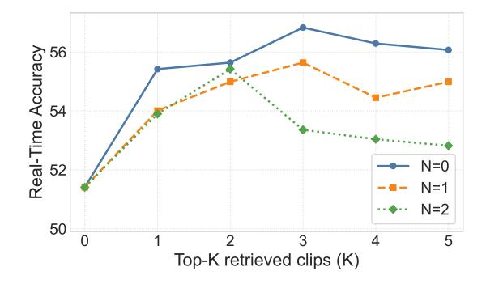

# F.1 Hyperparameter Analysis for Real-Time QA

As discussed in the main text, Real-Time QA can be accurately addressed without relying heavily on historical clips, making it inherently less sensitive to the parameters K and N. We present the corresponding experimental results in Fig. [9.](#page-28-0) We observe two key findings: (1) Overall, the impact of K and N on the results is not significant, with accuracy fluctuations remaining within a tight 5% range. (2) Compared to the baseline of K = 0 (where no historical clips are retrieved), retrieving a small amount of historical clips generally yields slightly better performance. This suggests that historical clips related to the query can provide supplementary context that modestly improves Real-Time QA accuracy. However, as K and N increase further (introducing more historical clips), the accuracy exhibits a downward trend. This decline indicates that an excessive amount of historical information introduces irrelevant noise, which ultimately interferes with the model's judgment on real-time queries.

#### F.2 Effect of Model Scales

We investigate the performance of PEARL-Bench across different model scales to reveal how parameter size influences personalized streaming video understanding capabilities. Specifically, we evaluate the Qwen2-VL series (2B and 7B) [\[46\]](#page-17-4) and Qwen3-VL series (4B and 8B) [\[2\]](#page-14-9) with and without our PEARL framework on the frame-level split. We do not conduct experiments on models with larger scales, as

**Fig. 9:** Real-Time accuracy under different top-K(K) and expansion sizes (N).

**Table 7:** Performance comparison across different model scales on the frame-level split of PEARL-Bench. **Bold** and <u>underline</u> denote the best and second-best results within each model family (Qwen2-VL and Qwen3-VL), respectively.

| Model                                           | Real-Time                           | Past-Time                            | Avg                      |
|-------------------------------------------------|-------------------------------------|--------------------------------------|--------------------------|
| Qwen2-VL-2B [46]                                | 31.24                               | 22.84                                | 27.04                    |
| Qwen2-VL-7B [46]                                | 23.21                               | 35.79                                | 29.50                    |
| ${\bf Qwen2\text{-}VL\text{-}2B\text{+}PEARL}$  | $29.93_{\ \downarrow 1.31}$         | $32.49_{\uparrow 9.65}$              | $31.21_{\uparrow 4.17}$  |
| ${\bf Qwen2\text{-}VL\text{-}7B\text{+}PEARL}$  | $33.30 \uparrow 10.09$              | $44.42 {\scriptstyle~\uparrow 8.63}$ | $38.86_{\uparrow 9.36}$  |
| Qwen3-VL-4B [2]                                 | 24.08                               | 30.96                                | 27.52                    |
| Qwen3-VL-8B [2]                                 | 27.33                               | 30.20                                | 28.77                    |
| ${\bf Qwen 3-VL-4B+PEARL}$                      | $40.78 \uparrow 16.70$              | $50.25_{\uparrow19.29}$              | $45.52 \uparrow 18.00$   |
| ${\bf Qwen 3\text{-}VL\text{-}8B\text{+}PEARL}$ | $\overline{54.99}_{\uparrow 27.66}$ | $49.49{\scriptstyle~\uparrow 19.29}$ | $52.24_{\uparrow 23.47}$ |

the PSVU task requires real-time responsiveness in practical applications. The experimental results are summarized in Table 7.

Based on the results, we draw two key conclusions:

- 1. Robustness across model scales. Our method consistently yields substantial performance improvements across all sizes and architectures. For instance, the average accuracy of the Qwen3-VL 4B and 8B models is boosted by 18.00% and 23.47%, respectively, with similar trends observed in the Qwen2-VL series (e.g., boosting the 2B and 7B models by 4.17% and 9.36%, respectively). This demonstrates the robustness of the PEARL design, proving its effectiveness regardless of the underlying model capacity or architecture.
- 2. Paradigm mismatch for offline models. When evaluating the standard offline baselines, increasing the model scale (which generally correlates with stronger comprehension capabilities) does not lead to significant performance gains. This highlights that the traditional offline paradigm is fundamentally ill-suited for the PSVU task, as a model's inherent reasoning capability cannot compensate for the lack of visual context. It is only when integrated with a framework specifically designed for PSVU, like PEARL, that the benefits of scaling up the model size are successfully unleashed, with the larger models ultimately outperforming the smaller models by a significant margin.