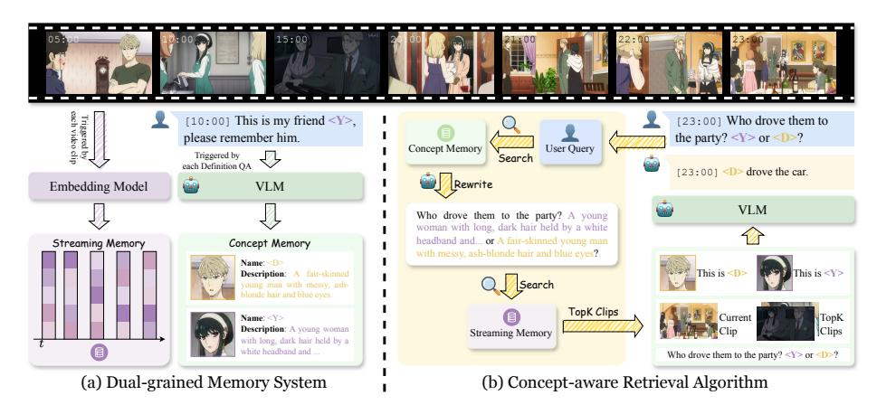

# 4.2 Dual-grained Memory System

To support PSVU, the model must (i) retain user-defined concepts introduced at arbitrary timestamps and (ii) maintain access to long-range visual evidence from the evolving video stream for real-time retrieval and response. We therefore design a Dual-grained Memory System that explicitly decouples conceptcentric knowledge from stream-centric observations. Concretely, it consists of a Streaming Memory that incrementally archives segmented clips with compact multimodal embeddings for efficient retrieval, and a Concept Memory that stores structured representations of user-defined concepts. We next describe these two memory components in detail.

Streaming Memory Streaming Memory maintains a set of entries, each consisting of a video clip Xi and its corresponding embedding ei . Given a continuously arriving video stream, we first detect scene boundaries and segment the stream into an ordered sequence of clips V = [X1, X2, . . . ]. For each newly detected clip Xi , we employ a multimodal embedding model femb(·) to compute

Fig. 3: PEARL framework. (a) Dual-grained Memory System: Concept Memory stores user-defined concepts with visual evidence and textual descriptions; Streaming Memory archives segmented clips with multimodal embeddings. (b) Conceptaware Retrieval Algorithm: Upon a user query, PEARL retrieves relevant concepts and top-K historical clips via concept-rewritten query embeddings, then feeds them together with the current clip into a VLM for real-time personalized response.

an embedding ei = femb(Xi), and store the pair (Xi , ei) in Streaming Memory. Each clip embedding ei captures rich semantic information about the scene and is used for subsequent retrieval. Detailed settings are provided in the appendix.

Concept Memory When a Concept-Definition query Qdef is issued at timestamp tc, the model creates a new entry with three components: (i) a concept name, (ii) associated visual evidence, and (iii) a textual description. The model first invokes an external tool to extract the visual evidence from the current clip Xtc : for video-level concepts, the evidence is the clip Xtc itself, whereas for frame-level concepts the model stores the last frame of Xtc . Conditioned on this extracted visual evidence, the model then generates a compact description that summarizes the concept's salient characteristics, using a standardized prompting template provided in the appendix. The resulting entry is finally inserted into the Concept Memory for subsequent retrieval and querying.

