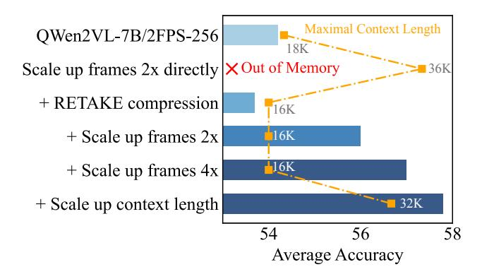
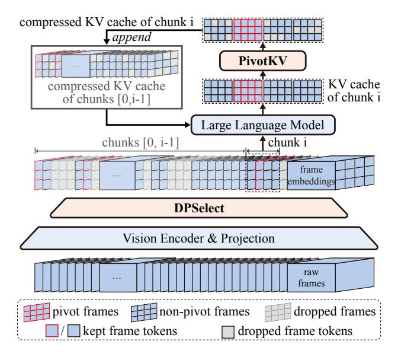
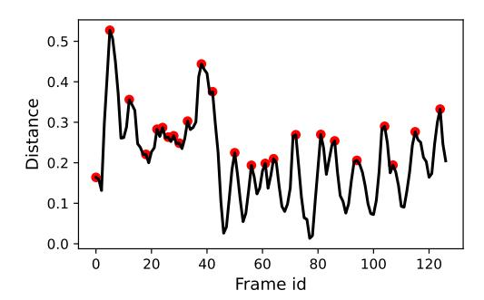
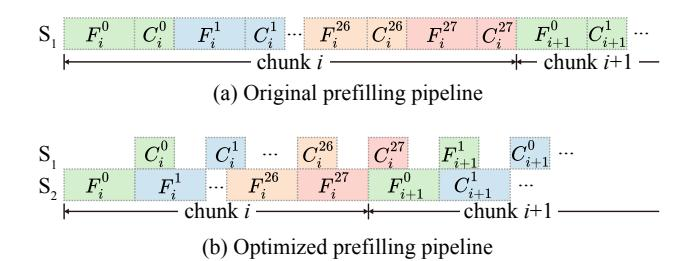
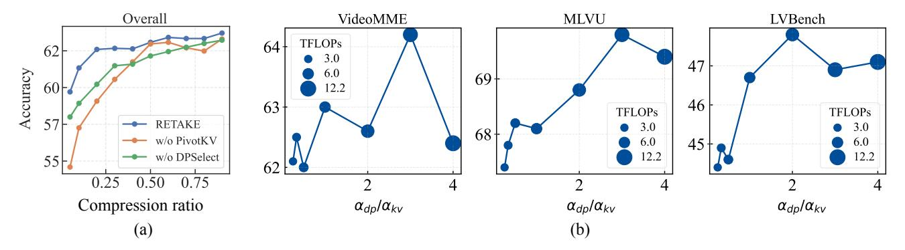
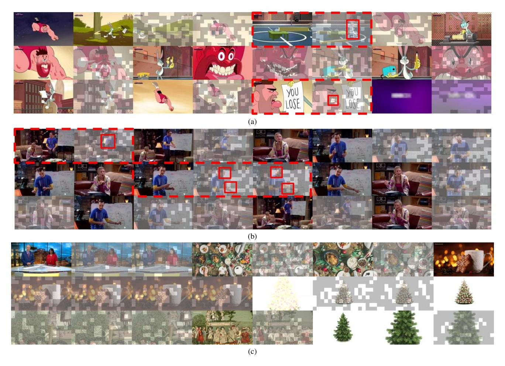

# <span id="page-0-1"></span>RETAKE: Reducing Temporal and Knowledge Redundancy for Long Video Understanding

Xiao Wang1\* † Qingyi Si2\* Jianlong Wu1‡ Shiyu Zhu<sup>3</sup> Li Cao<sup>2</sup> Liqiang Nie1‡ <sup>1</sup>Harbin Institute of Technology, Shenzhen <sup>2</sup>Huawei Technologies Co., Ltd. <sup>3</sup>Shandong University

scz.wangxiao@gmail.com, siqingyi@huawei.com, wujianlong@hit.edu.cn xyzcaoli@outlook.com, nieliqiang@gmail.com

## Abstract

*Video Large Language Models (VideoLLMs) have made significant strides in video understanding but struggle with long videos due to the limitations of their backbone LLMs. Existing solutions rely on length extrapolation, which is memory-constrained, or visual token compression, which primarily leverages low-level temporal redundancy while overlooking the more effective high-level knowledge redundancy. To address this, we propose RETAKE, a trainingfree method with two novel modules DPSelect and PivotKV, to jointly reduce both temporal visual redundancy and knowledge redundancy for video compression. To align with the way of human temporal perception, DPSelect identifies keyframes based on inter-frame distance peaks. To leverage LLMs' learned prior knowledge, PivotKV marks the keyframes as pivots and compresses nonpivot frames by pruning low-attention tokens in their KV cache. RETAKE can be plug-and-play adapted to the existing VideoLLMs and enables them to process 8× longer frames (up to 2048), outperforming similar-sized models by 3–5% and even rivaling much larger ones on VideoMME, MLVU, LongVideoBench, and LVBench. Moreover, by overlapping compression operations with prefilling, RETAKE introduces only 10% prefilling latency overhead while reducing decoding latency by 20%. Our code is available at* [https://github.com/SCZwangxiao/video-](https://github.com/SCZwangxiao/video-ReTaKe)[ReTaKe](https://github.com/SCZwangxiao/video-ReTaKe)*.*

## 1. Introduction

In pursuit of general intelligence, Video Large Language Models (VideoLLMs) [\[16,](#page-8-0) [20,](#page-8-1) [24,](#page-8-2) [45\]](#page-9-0) have revolutionized video understanding. However, as a nature exten-

<span id="page-0-0"></span>

Figure 1. RETAKE effectively compresses video sequence in VideoLLMs, allowing longer perception and improved performance within a fixed memory budget (measured by context length).

sion of Multimodal Large Language Models (MLLMs), they require hundreds of tokens to represent a single image [\[14,](#page-8-3) [34\]](#page-9-1), making it impractical to process videos longer than several minutes. Specifically, the context length of common MLLMs [\[14,](#page-8-3) [34\]](#page-9-1) limits their ability to handle only short videos of around 4 minutes at 240 frames.

To empower VideoLLMs for longer videos, [Lin](#page-8-1) [et al.](#page-8-1) [\[20\]](#page-8-1) and [Li et al.](#page-8-4) [\[17\]](#page-8-4) simply adopt sparse sampling. This approach overlooks the intra-frame spatial details and the inter-frame temporal structure [\[37\]](#page-9-2). To enable dense frame sampling, some methods [\[29,](#page-9-3) [46\]](#page-9-4) extend the context length of MLLMs through long context post-training. Although they increase performance under long frames, the maximal number of frames is still limited by GPU memory. Therefore, recent methods [\[10,](#page-8-5) [13,](#page-8-6) [30,](#page-9-5) [37\]](#page-9-2) compress visual tokens to fit more frames into VideoLLM within existing GPU memory limits, including token sparsification both between and within frames [\[13\]](#page-8-6) or using visual token compressors like Q-Former [\[16\]](#page-8-0). However, these methods mainly focus on spatial and temporal visual redundancies [\[36,](#page-9-6) [52\]](#page-10-0), which are low-level with high information loss.

<sup>\*</sup>Equal contribution.

<sup>†</sup>Work done during an internship at Huawei.

<sup>‡</sup>Corresponding author.

<span id="page-1-1"></span>A promising solution to these limitations is REducing TemporAl and Knowledge rEdundancy (RETAKE) for compression. Contrary to low-level temporal redundancy, knowledge redundancy captures high-level abstract patterns or structures that can be inferred from human prior knowledge [\[8\]](#page-8-7), allowing for better compression ratios with smaller loss. The biggest knowledge base in VideoLLMs is the LLM. The attention patterns across LLM layers inherently capture token redundancy, allowing lower-scoring tokens to be dropped without significantly impacting performance [\[49\]](#page-10-1). In VideoLLMs, the biggest knowledge base is the LLM itself. The attention patterns across its layers naturally capture token redundancy, allowing lower-scoring tokens to be dropped without significant performance impact [\[49\]](#page-10-1). However, compression based on knowledge redundancy introduces more computational overhead. To mitigate this, RETAKE integrates both knowledge and lowlevel temporal redundancy, allowing VideoLLMs to process significantly more frames within fixed GPU memory constraints and litter computational overhead, thereby enhancing long-video understanding, as illustrated in [Figure 1](#page-0-0)[\\*](#page-1-0).

RETAKE framework comprises two training-free components: DPSelect and PivotKV. To reduce low-level temporal redundancy, DPSelect extracts keyframes before feeding into LLM. Based on methods [\[7,](#page-8-8) [10\]](#page-8-5) that select keyframes using top-N inter-frame distance, DPSelect identifies additional frames with peak distance as pivot frames, hence the name "Dist Peak Select". This strategy is more closely aligned with human temporal perception which tracks the peak stimulus to detect motion [\[23\]](#page-8-9). Building on DPSelect, to reduce high-level knowledge redundancy, we develop PivotKV to compress KV cache of video sequences in VideoLLMs. Unlike existing LLM compression techniques that treat all tokens equally [\[18,](#page-8-10) [49\]](#page-10-1), PivotKV preserves pivot frames selected by DPSelect, ensuring critical low-level details remain intact. It then compresses nonpivot visual tokens based on their attention scores, which implicitly capture token redundancy identified by the VideoLLM's high-level multimodal knowledge.

We conduct extensive experiments on various long-video understanding benchmarks, including VideoMME [\[5\]](#page-8-11), MLVU [\[51\]](#page-10-2), LongVideoBench [\[38\]](#page-9-7), and LVBench [\[35\]](#page-9-8). Results show that RETAKE enables VideoLLMs to process 8× more frames (up to 2048), allowing them to achieve a 3%–5% performance gain over models of similar size.. It even surpasses much larger models, such as VideoLLaMA2-72B [\[12\]](#page-8-12), LLaVA-OneVision-72B [\[3\]](#page-8-13), and Oryx-1.5-34B [\[22\]](#page-8-14), on VideoMME, MLVU, and LVBench, respectively. Additionally, RETAKE introduces only 10% prefilling latency overhead while reducing decoding latency by 20%. Ablation study further validates the complementarity of DPSelect and PivotKV, and RETAKE's superiority against other video compression methods.1 In summary, our contributions are threefold:

- To our best knowledge, the training-free RETAKE is the first to jointly model temporal and knowledge redundancy for long video compression, enabling VideoLLMs to process 8× longer frames (up 2048).
- We propose a novel keyframe selection method DPSelect to reduce low-level temporal redundancy, and a novel token compression method PivotKV to reduce high-level knowledge redundancy in long videos.
- RETAKE introduces only 10% prefilling latency overhead while reducing decoding latency by 20%. It helps existing VideoLLMs outperform similar-sized VideoLLMs by 3%-5%, setting new state-of-the-art benchmarks.

## 2. Related Work

#### 2.1. Video Large Language Models

Most VideoLLMs build on image MLLMs and are further trained on video-text pairs to capture temporal relationships. A VideoLLM typically comprises a vision foundational model (VFM) [\[26\]](#page-9-9), an LLM [\[4\]](#page-8-15), and a connector linking them. The VFM extracts visual features, while the connector maps them into a format the LLM can process for video understanding. VideoLLMs fall into two main types based on the connector: concatenation-based and Q-Former-based. Concatenation-based models [\[20,](#page-8-1) [21,](#page-8-16) [24\]](#page-8-2) are simple and effective but suffer from exponentially increasing computational costs, limiting their scalability for long videos. Q-Former-based models [\[16,](#page-8-0) [17\]](#page-8-4) use a transformer decoder with learnable tokens to compress VFM embeddings, reducing computation but losing information, which impacts performance.

#### 2.2. Long Video Understanding

The VideoLLM community has explored three main approaches for long video understanding: (1) *Sparse Sampling*: Early VideoLLMs [\[5,](#page-8-11) [38,](#page-9-7) [51\]](#page-10-2) handle long videos by uniformly sampling frames. For instance, Video-LLaVA [\[20\]](#page-8-1) and VideoChat2 [\[17\]](#page-8-4) sample 8 and 16 frames, respectively. However, as video length increases, more frames are discarded, disrupting temporal structures [\[46\]](#page-9-4). (2) *Length Extrapolation*: Recent works [\[29,](#page-9-3) [41,](#page-9-10) [46\]](#page-9-4) extend VideoLLMs' context length by post-training on longsequence data, improving performance when more frames are sampled. However, this approach cannot overcome the increasing memory cost brought by longer video sequences beyond 512 frames [\[46\]](#page-9-4). (3) *Multimodal Token Compression*: To fit more frames within memory limits, [Weng et al.](#page-9-2) and [Li et al.](#page-8-17) [\[19,](#page-8-17) [37\]](#page-9-2) reduce token counts by averaging adjacent temporal tokens. [Jin et al.](#page-8-6) and [Ren et al.](#page-9-11) [\[13,](#page-8-6) [28\]](#page-9-11) further refine video representations by merging non-essential

<span id="page-1-0"></span><sup>\*</sup>2FPS-256 means uniform frame sampling at 2FPS, with a limit 256 frames. For longer videos, FPS is reduced to maintain this limit.

<span id="page-2-4"></span><span id="page-2-0"></span>

Figure 2. Illustration of ReTaKe. DPSelect select keyframes. Video sequence is then processed chunk by chunk, during which PivotKV compresses the KV cache of video tokens.

visual tokens within and across frames. Song et al. and He et al. [10, 30] use a memory bank to iteratively merge and store tokens. These methods mainly leverage low-level temporal redundancy between frames, or train a Q-Former with a fixed compression ratio, ignoring the high-level world knowledge within LLM that can be used for compression.

In summary, to perceive more frames given a fixed memory budget, token compression is an effective method. However, existing methods overlook knowledge redundancy, limiting their compression ability. We addresses this by managing both low- and high-level redundancies.

#### 3. Method

#### 3.1. Overview

The overall architecture of RETAKE is shown in Figure 2. To reduce temporal redundancy before feeding video into LLM, DPSelect extracts keyframes by preserving frames with high inter-frame distances, and marking peak points as pivot frames. To reduce memory cost, we then divide the video into smaller chunks of equal length, which are then sequentially prefilled and compressed. Specifically, after prefill a chunk, PivotKV compresses its KV cache to reduce knowledge redundancy: pivot frames remain uncompressed, while non-pivot frames are compressed.

Algorithm 1 outlines the detailed pipeline with four steps: (1) DPSelect frame compression. Raw frames are encoded by a visual encoder, and keyframes (with a pivot mask) are selected using DPSelect (Section 3.3). (2) Chunked prefilling. The video sequence is divided into fixed-size chunks, which are processed sequentially (Section 3.2).

#### <span id="page-2-1"></span>Algorithm 1 RETAKE Algorithm

```
\mathbf{P} \in \mathbb{R}^{L \times d}, chunk size \tau, DPSelect compression ratio
       \alpha_{dp} \in (0,1], and PivotKV compression ratio \alpha_{kv} \in
       (0, 1]. Visual encoder with projection VE, visual-text
       concatenator VTC, and large language model LLM.
  2: Output: Generated output O.
  3: // Step 1: DPSelect frame compression
  4: \mathbf{M} \in \mathbb{R}^{T \times N \times d} \leftarrow \text{VE}(\mathbf{F})
 5: \hat{\mathbf{M}} \in \mathbb{R}^{\alpha_{\mathsf{dp}}TN \times d}, \mathbf{S} \in \{0,1\}^{\alpha_{\mathsf{dp}}TN} \leftarrow \mathsf{DPSelect}\left(\mathbf{M}\right)
 6: \mathbf{H} \in \mathbb{R}^{(\alpha_{\mathsf{dp}}TN + L) \times d} \leftarrow \mathsf{VTC}\left(\mathbf{P}, \hat{\mathbf{M}}\right)
  7: // Step 2: Chunked prefilling
  8: \mathcal{H} = \left[\mathbf{H}_1, \mathbf{H}_2, ..., \mathbf{H}_{\alpha_{\mathsf{dp}}T/\tau+1}\right] \leftarrow \mathbf{H}
  9: Initialize KVCache \mathbf{K}\mathbf{V} \in \mathbb{R}^{2 \times h \times l \times d_h}, length l \leftarrow 0.
      for \mathbf{H}_i in \mathcal{H} do
           \mathbf{KV}_i \leftarrow \mathrm{LLM}\left(\mathbf{H}_i, \mathbf{KV}\right)
11:
           if H_i is video chunk then
12:
13:
               // Step 3: PivotKV token compression
14:
               \mathbf{KV} \leftarrow \text{PivotKV}\left(\mathbf{KV}, \mathbf{KV}_i, \mathbf{S}\right)
               l \leftarrow l + \alpha_{kv} \tau N
15:
16:
                \mathbf{KV} \leftarrow \operatorname{Concat}\left(\mathbf{KV}, \mathbf{KV}_i\right)
17:
               l \leftarrow l + L
18:
19.
           end if
20: end for
21: // Step 4: Decoding
22: O \leftarrow \text{LLM}(\mathbf{K})
23: return O
```

1: **Input:** Video frames  $\mathbf{F} \in \mathbb{R}^{T \times 3}$ , prompt embeddings

(3) PivotKV token compression. During chunked prefilling, PivotKV (Section 3.4) compresses tokens in the video KV-Cache. (4) Decoding. Same as general VideoLLMs.

#### <span id="page-2-3"></span>3.2. Preliminaries: Chunked Prefill

Similar to LLMs, VideoLLMs compute self-attention autoregressively during the prefill stage, with each token's representation depending only on preceding tokens. Thus, applying **chunked prefill** [44], which processes input tokens in sequential chunks, remains mathematically equivalent.

#### <span id="page-2-2"></span>3.3. DPSelect

To reduce temporal redundancy, DPSelect extracts keyframes from video features, as shown in Figure 3. Given compression ratio  $\alpha_{dp} \in (0,1]$  and an input video feature sequence  $\mathbf{M} \in \mathbb{R}^{T \times N \times d}$ , where T is the number of frames, N is the number of tokens per frame, and d is the hidden state dimension, DPSelect compresses it into a shorter sequence  $\hat{\mathbf{M}} \in \mathbb{R}^{\alpha_{dp}TN \times d}$  and a binary mask indicating pivot tokens  $\mathbf{S} \in \{0,1\}^{\alpha_{dp}TN}$ .

First, we compute the token-averaged cosine distance be-

<span id="page-3-1"></span>

Figure 3. An example of DPSelect. Distance represents cosine dissimilarity between the i-th and i+1-th frames.

tween adjacent frames  $\mathbf{d} \in \mathbb{R}^{T-1}$ :

$$\mathbf{d} = \frac{1}{N} \sum_{j=1}^{N} (1 - \cos(\mathbf{M}[:-1, j], \mathbf{M}[1:, j])), \qquad (1)$$

where [:,:] denote matrix indexing operations. Next, max pooling identifies local maxima in the distance sequence **d** as pivot frames  $\mathcal{P}$ , which is closely aligned with human video perception:

$$\begin{cases}
\mathcal{P} = \arg \max_{w_i} (\mathbf{d}[w_i]), \\
w_i = [i - \lfloor w/2 \rfloor, i + \lfloor w/2 \rfloor],
\end{cases}$$
(2)

where w=3 is the window size of max pooling. Finally, we determine keyframes timestamps  $\mathcal K$  by selecting local maxima  $\mathcal P$  and top frames based on cosine distance:

$$\mathcal{K} = \mathcal{P} \cup \text{ArgTop-k} \left( \mathbf{d}[\neg \mathcal{P}], k = \alpha_{\text{dp}} T - |\mathcal{P}| \right).$$
 (3)

The compressed video features  $\hat{\mathbf{M}} \in \mathbb{R}^{\alpha_{dp}TN \times d}$  are extracted from  $\mathbf{M}$  based on  $\mathcal{K}$  and flattened:

$$\hat{\mathbf{M}} = \text{Flatten} \left( \mathbf{M}[\mathcal{K},:,:] \right). \tag{4}$$

A binary mask  $\mathbf{S} \in \{0, 1\}^{\alpha_{dp}TN}$  is also generated to indicate whether a token in  $\hat{\mathbf{M}}$  originates from pivot frames  $\mathcal{P}$ .

#### <span id="page-3-0"></span>3.4. PivotKV

After pre-filling the input video features for the i-th chunk,  $\mathbf{H}_i \in \mathbb{R}^{\tau N \times d}$ , we compute its KV cache for each layer:  $\mathbf{K}_i, \mathbf{V}_i \in \mathbb{R}^{\tau N \times d}$ , where  $\tau$  is the number of frames per chunk. By setting a compression ratio  $\alpha_{\mathrm{kv}} \in (0,1]$ , PivotKV compresses the sequence into a shorter form,  $\hat{\mathbf{K}}_i, \hat{\mathbf{V}}_i \in \mathbb{R}^{\alpha_{\mathrm{kv}} \tau N \times d}$ , while preserving pivot tokens and selecting important tokens based on the attention matrix, which captures redundancy through the MLLM's high-level multimodal knowledge. We omit the layer index since the operations are identical across all layers.

Let  $\mathbf{Q}_i \in \mathbb{R}^{h \times l_q \times d_h}$  represent the query states and  $\mathbf{K}, \mathbf{V} \in \mathbb{R}^{h \times l_{i-1} \times d_h}$  be the historical KV cache, where h is

<span id="page-3-2"></span>

Figure 4. Efficiency optimization through overlapping compression operations with prefilling.  $S_1, S_2$  represent different CUDA streams.  $F_i^l, C_i^l$  denote prefilling and compression operations, respectively, for chunk i in the l-th layer.

the number of attention heads,  $d_h = d/h$ ,  $l_q = \tau N$  is the chunk length, and  $l_{i-1}$  is the length of the historical cache.

First, we compute the attention weights within the current chunk,  $\mathbf{A}_i \in \mathbb{R}^{h \times l_q \times l_q}$ :

$$\mathbf{A} = \operatorname{Softmax}\left(\frac{\mathbf{Q}\mathbf{K}_{i}^{\top}}{\sqrt{d_{h}}}\right). \tag{5}$$

Next, we compute the importance scores of each token,  $\bar{\mathbf{a}} \in \mathbb{R}^{l_q}$ , by summing the head-mean attention weights across all keys:

$$\bar{\mathbf{a}} = \sum_{j=1}^{l_q} \frac{1}{h} \sum_{k=1}^{h} \mathbf{A}_{k,:,j}.$$
 (6)

To mark the pivot tokens, we add the pivot mask  $s \in \{0, 1\}^{l_q = \tau N}$  (sliced and flattened from S) for current chunk:

<span id="page-3-3"></span>
$$\begin{cases} \mathbf{s} = \mathbf{S}[i\tau N : (i+1)\tau N], \\ \bar{\mathbf{a}} = \bar{\mathbf{a}} + \mathbf{s} \cdot \infty. \end{cases}$$
 (7)

Finally, we select the top  $\alpha_{kv}l_q$  importance scores to form the new KV cache by selecting indices  $\mathcal{I} \in \mathbb{Z}^K$ :

$$\begin{cases} \mathcal{I} = \operatorname{ArgTop-k}(\bar{\mathbf{a}}, k = \alpha_{kv} l_q), \\ \hat{\mathbf{K}}_i = \mathbf{K}_i[:, \mathcal{I}, :], \\ \hat{\mathbf{V}}_i = \mathbf{V}_i[:, \mathcal{I}, :]. \end{cases}$$
(8)

These are then used to update the historical KV cache:

$$\begin{cases} \mathbf{K} \leftarrow \text{Concatenate}(\mathbf{K}||\hat{\mathbf{K}}_i), \\ \mathbf{V} \leftarrow \text{Concatenate}(\mathbf{V}||\hat{\mathbf{V}}_i). \end{cases}$$
(9)

## 3.5. Efficiency Optimization

RETAKE introduces additional computational overhead to VideoLLM, primarily within the PivotKV module of the LLM. To optimize this, we incorporate an extra CUDA stream to overlap compression operations, as shown in Figure 4. Specifically, since PivotKV compression occurs after prefilling in each layer and its cost is lower than prefilling, the compression of layer l can run simultaneously with the prefilling of layer l+1.

<span id="page-4-2"></span><span id="page-4-0"></span>

| Methods                    | VideoMME |         | MLVU | LongVideoBench | LVBench |
|----------------------------|----------|---------|------|----------------|---------|
|                            |          | Overall | Dev  | Val            | Val     |
| GPT-4o [25]                | 65.3     | 71.9    | 64.6 | 66.7           | 30.8    |
| Gemini 1.5 Pro [27]        | 67.4     | 75.0    | -    | 64.0           | 33.1    |
| MovieChat-7B [30]          | -        | -       | 25.8 | -              | 22.5    |
| LLaMA-VID-7B [19]          | -        | -       | 33.2 | -              | 23.9    |
| MA-LMM-7B [10]             | -        | -       | 36.4 | -              | -       |
| VideoChat2-7B [17]         | 33.2     | 39.5    | 44.5 | 39.3           | -       |
| Video-LLaVA-7B [20]        | 36.2     | 39.9    | 47.3 | -              | -       |
| InternVL-1.5-20B [2]       | 45.6     | 50.7    | 50.4 |                | 39.6    |
| LongVILA-8B [41]           | 39.7     | 50.5    | 56.7 | 57.7           | -       |
| LongVA-7B [46]             | 46.2     | 52.6    | 63.5 | -              | -       |
| mPLUG-Owl3-8B [42]         | -        | 53.5    | 63.7 | 52.1           | -       |
| LLaVA-Octopus-7B [50]      | -        | 54.7    | 57.5 | -              | -       |
| VITA-1.5-7B [6]            | -        | 56.1    | -    | -              | -       |
| LongViTU-7B [39]           | 48.4     | 56.3    | -    | -              | -       |
| TimeMarker-8B [31]         | -        | 57.3    | 63.9 | 56.3           | 41.3    |
| Video-XL-7B [29]           | 49.2     | 55.5    | 64.9 | -              | -       |
| Video-LLaMA2-72B [3]       | 57.6     | 62.4    | 61.2 | -              | -       |
| Qwen2-VL-7B [34]           | 53.8     | 63.3    | 64.8 | 55.6           | 42.4    |
| QWen2VL-7B+ReTaKe          | 56.2     | 63.9    | 69.8 | 57.7           | 47.8    |
| LLaVA-Video-7B [48]        | 52.3     | 62.2    | 64.9 | 58.2           | 43.3    |
| LLaVA-Video-7B+ReTaKe      | 55.4     | 64.0    | 67.8 | 59.7           | 48.5    |
| LLaVA-Onevision-72B [14]   | 60.0     | 66.3    | 66.4 | 61.3           | -       |
| Aria-25B [15]              | 59.3     | 67.6    | 70.6 | 64.2           | -       |
| Oryx-1.5-34B [ <b>22</b> ] | 58.8     | 67.3    | 72.3 |                | 30.4    |
| LLaVA-Video-72B [48]       | 61.5     | 70.5    | 74.4 | 61.9           | -       |

Table 1. Performance comparison. RETAKE consistently enhances performance on long video understanding benchmarks, with greater gains for longer videos in LVBench.

#### 4. Experiments

#### 4.1. Benchmarks and Implementations

**Video-MME** [5] contains 900 videos and 2,700 Multiple-Choice Question-Answer (MCQA) pairs, categorized into short (<2 min), medium, and long (30–60 min) subsets. **MLVU** [51] includes videos ranging from 3 minutes to 2 hours and spans 9 tasks. **LongVideoBench** [38] comprises 3,763 videos (up to 1 hour) and 6,678 MCQA pairs. **LVBench** [35] averages 4,101 seconds per video—4 times longer than Video-MME and 5 times longer than MLVU. It includes 1,549 MCQA pairs across 6 tasks. All datasets are human annotated.

**Implementation Details.** Our experiments are based on QWen2VL-7B [34] and LLaVA-Video-7B [48], extended with RETAKE. Following the original model settings, we resized the longer side of input frames to 448 pixels for QWen2VL and the shorter side to 336 pixels for LLaVA-

<span id="page-4-1"></span>

| Methods        | FLOPs (T)      | TTFT (s)  | TPOT (ms)             |
|----------------|----------------|-----------|-----------------------|
| QWen2VL-7B     | 3.0            | 5.7       | 116.7                 |
| +RETAKE        | 2.7 <b>-9%</b> | 7.4 + 28% | 93.9 - <del>20%</del> |
| +RETAKE-OPT    | 2.7 -9%        | 6.2 +8%   | 94.2 -19%             |
| LLaVA-Video-7B | 10.4           | 4.4       | 58.5                  |
| +RETAKE        | 8.6 -18%       | 7.2 + 62% | 42.7 - <del>27%</del> |
| +RETAKE-OPT    | 8.6 -18%       | 4.9 +11%  | 42.3 -28%             |

Table 2. Efficiency analysis. TTFT and TPOT denote Time To First Token and Time Per Output Token. With overlapping compression optimization, RETAKE significantly reduces decoding latency (TPOT) with slight increase in prefilling latency (TTFT).

Video. For the default sampling strategy, videos were densely sampled at 2 frames per second (FPS), with a maximum of 2048 frames for QWen2VL and 1024 frames for LLaVA-Video (i.e., for longer videos, FPS was reduced to maintain the number of frames to these limits). For maximal context length in default, we adjusted the compression ratio for each video to make sure its context length does not exceed 32,000. For certain ablation studies, we reduced the maximal sampled frames to 256, as the upper limit for processing frames without compression is approximately 300.

#### 4.2. Main Results

Comparison with SoTAs. We conducted experiments on VideoMME [5], MLVU [51], LongVideoBench [38], and LVBench [35], as shown in Table 1. For base VideoLLMs with different architectures, RETAKE consistently improves performance on long video understanding, achieving an average gain of 3.1% and 2.9% for QWen2VL-7B [34] and LLaVA-Video-7B [48], respectively. Notably, for LVBench, which features the longest average video length, the performance gain reaches a remarkable 5.3%. Additionally, RETAKE outperforms existing models of similar size, including LongVA [46], LongVILA-7B [41], and LLaVA-OneVision-7B [14], with improvements ranging from 1.6% to 4.9%. It even surpasses much larger models, such as VideoLLaMA2-72B [3] on VideoMME, LLaVA-OneVision-72B [14] on MLVU, and Oryx-1.5-34B [22] on LVBench. Furthermore, RETAKE significantly outperforms GPT-40 [25] on both MLVU and LVBench. These benchmarks cover diverse video durations and question types, demonstrating the robustness and generality of RETAKE.

**Efficiency Analysis.** To evaluate the efficiency of RETAKE, we measured its FLOPs and TTFT for prefilling and TPOT for decoding with 256 max frames and 0.5 compression ratio, shown in Table 2. RETAKE significantly reduces both FLOPs and TPOT, achieving a 19% TPOT and 8% FLOPs reduction for QWen2VL-7B, and a 26% TPOT and 17% FLOPs reduction for LLaVA-Video-7B. These improvements stem from RETAKE's ability to compress the

<span id="page-5-2"></span><span id="page-5-0"></span>

| Model                       | Max Frames | Max Context Length | VideoMME-L | MLVU | LongVideoBench | LVBench | ∆avg |
|-----------------------------|------------|--------------------|------------|------|----------------|---------|------|
| 0 QWen2VL-7B                | 256        | 18K                | 53.8       | 64.8 | 55.6           | 42.6    | -    |
| 1 +scale up frames directly | 512        | 36K                |            |      | Out of Memory  |         | -    |
| 2 +RETAKE compression       | 256        | 16K                | 52.7       | 64.7 | 55.1           | 42.3    | -0.5 |
| 3 +scale up frames 2x       | 512        | 16K                | 53.6       | 68.6 | 56.8           | 44.8    | +2.3 |
| 4 +scale up frames 4x       | 2048       | 16K                | 56.2       | 69.0 | 56.3           | 46.3    | +1.0 |
| 5 +scale up context length  | 2048       | 32K                | 55.7       | 69.8 | 57.7           | 47.8    | +0.8 |

Table 3. In-depth analysis for more insights. By compressing the videos of varying length into a fixed context length, RETAKE allows the model to process more frames under fixed memory budget, thereby achieving significant gains.

<span id="page-5-1"></span>

Figure 5. (a) Ablation study on DPSelect and PivotKV under different compression ratios. (b) Trade-off between knowledge and temporal redundancy—RETAKE favors leveraging knowledge redundancy.

video sequence length, lowering both prefilling computational cost (FLOPs) and decoding latency (TPOT). However, without optimization, RETAKE incurs notable overhead (+28% TTFTs for QWen2VL and +62% for LLaVA-Video), which the optimized version (RETAKE-OPT) significantly reduces to just 8% and 11%, demonstrating the efficiency of our implementation.

#### 4.3. In-depth Analysis

Insights on how RETAKE Improves Performance. To investigate the sources of performance gains, we conducted ablation studies summarized in [Table 3.](#page-5-0) #0 serves as the baseline model without modifications. In #1, directly increasing the number of frames exceeded the A100 GPU's memory limit. For long-context inference, memory consumption is primarily determined by the KVCache context length [\[11\]](#page-8-21). Thus, in #2, we compressed videos to a maximum context length of 16K tokens—compressing longer videos while leaving shorter ones unchanged—resulting in a 0.5% average accuracy drop. With this fixed budget, RETAKE compression enables scaling up the number of frames in #3 and #4, improving accuracy by 2.3% and 1.0% on average. Notably, for MLVU and LongVideoBench, increasing frames from 512 to 2048 leads to fluctuations, likely due to saturation: these datasets contain relatively short videos (e.g., MLVU averages 10 minutes), meaning that under a fixed FPS, the sampled frames rarely reach the upper limit. In contrast, for longer videos like VideoMME- L and LVBench, performance improvements remained significant. Finally, expanding the maximum context length to 32K further enhanced performance in #5.

### 4.4. Ablation Studies

Ablation of DPSelect and PivotKV. We evaluated two variants in QWen2VL: w/o DPSelect, where PivotKV ignores pivot tokens in [Equation 7,](#page-3-3) and w/o PivotKV, where only DPSelect remains active. To study their behavior under different compression ratios, we set DPSelect compression ratio αdp = 1 (only provide pivots tokens), and adjusted the PivotKV compression ratio αkv for each video, results are shown in [Figure 5](#page-5-1) (a).

The following observations can be made: (1) RETAKE outperforms both "w/o PivotKV" and "w/o DPSelect," particularly at lower compression ratios where videos are compressed into short sequences. (2) "w/o PivotKV" experiences a significantly steeper performance drop than "w/o DPSelect" and RETAKE, indicating that solely reducing temporal redundancy leads to substantial information loss. This highlights the necessity of also minimizing knowledge redundancy to maintain performance under the same compression ratio. Consequently, we further explore the tradeoff between these two redundancies below.

Trade-off between Knowledge and Temporal Redundancy. We analyzed this trade-off based on QWen2VL in

<span id="page-6-1"></span><span id="page-6-0"></span>

| Methods               |            | MLVU               |      |      | LVBench |      |
|-----------------------|------------|--------------------|------|------|---------|------|
|                       | Max Frames | Max Context Length | NQA  | AO   | KIR     | TG   |
| LLaVA-Video-7B [48]   | 128        | 25K                | 74.2 | 55.6 | 37.5    | 36.8 |
| LLaVA-Video-7B+ReTaKe | 1024       | 16K                | 74.2 | 60.6 | 51.2    | 43.2 |
| Qwen2-VL-7B [34]      | 256        | 18K                | 81.9 | 49.0 | 44.3    | 40.5 |
| QWen2VL-7B+ReTaKe     | 256        | 16K                | 81.0 | 49.4 | 44.7    | 41.4 |
| QWen2VL-7B+ReTaKe     | 512        | 16K                | 81.3 | 59.5 | 47.7    | 42.3 |
| QWen2VL-7B+ReTaKe     | 1024       | 16K                | 82.7 | 59.5 | 49.5    | 44.1 |

Table 4. Investigation of RETAKE's fine-grained temporal perception capabilities across related task types in MLVU and LVBench datasets: Needle QA (NQA), Action Order (AO), Action Count (AC), Key Information Retrieval (KIR), and Temporal Grounding (TG). While RETAKE compression harms needle test performance, it slightly improves other tasks. Moreover, with frame scaling enabled by RETAKE, the model not only compensates for this loss but even surpasses its original performance in fine-grained temporal perception tasks.

[Figure 5](#page-5-1) (b) by fixing the total compression rate at αdpαkv = 0.25 and varying αdp/αkv to control the balance. Since the compression ratio represents the ratio of context length after to before compression, a higher αdp/αkv suggests a greater reliance on knowledge redundancy for compression. Optimal performance is achieved when αdp/αkv is between 2 and 3, suggesting a preference for leveraging knowledge redundancy. However, increasing αdp/αkv also raises FLOPs, as DPSelect reduces the number of visual tokens processed by the LLM, leading to a larger FLOPs reduction at the same compression ratio. This reveals an additional tradeoff between performance and efficiency.

Investigation on Fine-grained Temporal Perception Abilities. To evaluate the impact of token compression algorithms on critical temporal details, we conducted ablation studies on the MLVU and LVBench datasets. We compared the baseline models LLaVA-Video-7B [\[48\]](#page-10-4) and QWen2VL-7B [\[34\]](#page-9-1). The results are presented in [Table 4.](#page-6-0)

Our analysis yields several key findings: (1) Comparing two QWen2VL experiments with 256 frames, token compression in RETAKE slightly reduced Needle QA performance from 81.9 to 81.0, which aligns with expectations, as compression inevitably leads to some information loss. (2) For other tasks, RETAKE compression resulted in slight performance gains. This is reasonable, as eliminating redundant visual information can enhance performance in relatively coarse-grained tasks [\[1,](#page-8-22) [36\]](#page-9-6). (3) Since RETAKE enables the model to process more frames, we observed that such frame scaling compensates for the loss in Needle QA for both LLaVA-Video and QWen2VL. Moreover, it significantly improves performance in fine-grained temporal perception tasks, including Action Order (+7.8%), Key Information Retrieval (+9.5%), and Temporal Grounding (+5.0%). (4) The improvement in MLVU's Action Order category was notably higher than in Needle QA (7.8% vs. 0.4% on average). We attribute this to RETAKE's ability to sample more frames through token compression, effectively achieving denser frame sampling, which is known to greatly

|                  | VideoMME |         | MLVU | LVBench |
|------------------|----------|---------|------|---------|
| Method           | Long     | Overall | Val  | Val     |
| M2SM [7]         | 49.1     | 58.0    | 61.6 | 39.7    |
| A2Summ [9]       | 48.2     | 57.6    | 60.9 | 39.8    |
| MA-LLM [10]      | 50.7     | 59.2    | 62.8 | 40.8    |
| DPSelect         | 51.0     | 59.5    | 63.2 | 41.4    |
| FastV [1]        | 53.5     | 61.2    | 63.2 | 42.3    |
| FitPrune [43]    | 53.6     | 61.2    | 63.6 | 42.0    |
| LOOK-M [33]      | 53.6     | 61.0    | 63.8 | 42.6    |
| SparseVLM [47]   | 54.4     | 60.7    | 63.0 | 43.9    |
| PyramidDrop [40] | 53.1     | 60.5    | 63.7 | 41.6    |
| VL-Cache [32]    | 53.2     | 61.3    | 64.5 | 42.4    |
| RETAKE           | 55.6     | 64.1    | 69.4 | 45.7    |

Table 5. Performance comparison with existing keyframe selection and token compression methods.

enhance action understanding [\[16,](#page-8-0) [34\]](#page-9-1). (5) In LVBench, Key Information Retrieval exhibited a significantly higher improvement than Temporal Grounding, with average gains of 9.5% versus 5.0%. We hypothesize that token compression increases information density, facilitating a more comprehensive understanding. Therefore, Key Information Retrieval, a task requiring deeper comprehension, benefits more than perceptual tasks like Temporal Grounding.

Performance Comparison of Different Compression Methods. We evaluated RETAKE against other video compression methods on QWen2VL [\[34\]](#page-9-1). For keyframe selection, we set the maximal number of frames to 256 (the common limit of all these models) and compression ratio to 0.5. Our DPSelect consistently outperforms existing baselines. Regarding token compression, we set the maximal context length to 16K. RETAKE significantly surpasses previous methods. The reason is that, unlike existing approaches, which primarily compress visual tokens based on prompt tokens—requiring the VideoLLM to process the entire video and prompt sequence—RETAKE exploits inter-

<span id="page-7-0"></span>

Figure 6. Visualization of how RETAKE reduce redundancies in video.

visual redundancy to compress tokens in smaller chunks. This strategy substantially increases the maximum number of frames the model can handle from 256 to 2048, enhancing efficiency in long video processing.

#### 4.5. Visualization

To qualitatively evaluate the effectiveness of RETAKE, we present some visualization cases in [Figure 6.](#page-7-0) The keyframes selected by DPSelect remain unchanged, while non-keyframes are painted white, and patches filtered by PivotKV are painted dark. From all cases in [Figure 6,](#page-7-0) we can find that DPSelect can always effectively select important frames that differ from adjacent frames, filtering out redundant frames in static scenes. Besides, red boxes show that PivotKV can always filter the patches similar to the keyframes and remains the patches with subtle semantic changes between non-keyframes and keyframes, such as body movement and facial expressions. For example, the region where a small animal appears (refer to the first red box of [Figure 6a\)](#page-7-0), and the area where the man's mouth changes (refer to the second red box of [Figure 6a\)](#page-7-0), are identified and left uncompressed, while in red boxes of [Figure 6b,](#page-7-0) the frequently changing facial and arm regions of the character are selected and preserved. This validates our initial motivation that DPSelect reduces low-level temporal redundancy and PivotKV reduces high-level knowledge redundancy. However, there are no significant motions in [Figure 6c,](#page-7-0) and as a result, the filtered token distribution is relatively sparse.

## 5. Conclusion

This paper introduces RETAKE, a training-free approach to understanding long videos by jointly reducing temporal and knowledge redundancy with two novel modules: DPSelect and PivotKV. DPSelect, inspired by human perception, identifies keyframes with significant motion peaks, while PivotKV compresses the KV cache of non-keyframes using knowledge-relevant attention scores. Experiments demonstrate that RETAKE, with little computational overhead, can handle video sequences up to 8 times longer and thereby achieve state-of-the-art performance.

## References

- <span id="page-8-22"></span>[1] Liang Chen, Haozhe Zhao, Tianyu Liu, Shuai Bai, Junyang Lin, Chang Zhou, and Baobao Chang. An Image is Worth 1/2 Tokens After Layer 2: Plug-and-Play Inference Acceleration for Large Vision-Language Models. In *European Conference on Computer Vision*, pages 19–35. Springer, 2024. [7](#page-6-1)
- <span id="page-8-18"></span>[2] Zhe Chen, Weiyun Wang, Hao Tian, Shenglong Ye, Zhangwei Gao, Erfei Cui, Wenwen Tong, Kongzhi Hu, Jiapeng Luo, Zheng Ma, Ji Ma, Jiaqi Wang, Xiaoyi Dong, Hang Yan, Hewei Guo, Conghui He, Botian Shi, Zhenjiang Jin, Chao Xu, Bin Wang, Xingjian Wei, Wei Li, Wenjian Zhang, Bo Zhang, Pinlong Cai, Licheng Wen, Xiangchao Yan, Min Dou, Lewei Lu, Xizhou Zhu, Tong Lu, Dahua Lin, Yu Qiao, Jifeng Dai, and Wenhai Wang. How Far Are We to GPT-4V? Closing the Gap to Commercial Multimodal Models with Open-Source Suites, 2024. arXiv:2404.16821. [5](#page-4-2)
- <span id="page-8-13"></span>[3] Zesen Cheng, Sicong Leng, Hang Zhang, et al. VideoL-LaMA 2: Advancing Spatial-Temporal Modeling and Audio Understanding in Video-LLMs, 2024. arXiv:2406.07476. [2,](#page-1-1) [5](#page-4-2)
- <span id="page-8-15"></span>[4] Wei-Lin Chiang, Zhuohan Li, Zi Lin, Ying Sheng, Zhanghao Wu, Hao Zhang, Lianmin Zheng, Siyuan Zhuang, Yonghao Zhuang, Joseph E Gonzalez, et al. Vicuna: An Open-Source Chatbot Impressing GPT-4 with 90%\* Chatgpt Quality. *See https://vicuna. lmsys. org*, 2:6, 2023. [2](#page-1-1)
- <span id="page-8-11"></span>[5] Chaoyou Fu, Yuhan Dai, Yondong Luo, Lei Li, Shuhuai Ren, Renrui Zhang, Zihan Wang, Chenyu Zhou, Yunhang Shen, Mengdan Zhang, Peixian Chen, Yanwei Li, Shaohui Lin, Sirui Zhao, Ke Li, Tong Xu, Xiawu Zheng, Enhong Chen, Rongrong Ji, and Xing Sun. Video-MME: The First-Ever Comprehensive Evaluation Benchmark of Multi-Modal LLMs in Video Analysis, 2024. arXiv:2405.21075. [2,](#page-1-1) [5](#page-4-2)
- <span id="page-8-19"></span>[6] Chaoyou Fu, Haojia Lin, Xiong Wang, Yi-Fan Zhang, Yunhang Shen, Xiaoyu Liu, Haoyu Cao, Zuwei Long, Heting Gao, Ke Li, Long Ma, Xiawu Zheng, Rongrong Ji, Xing Sun, Caifeng Shan, and Ran He. VITA-1.5: Towards GPT-4o Level Real-Time Vision and Speech Interaction, 2025. arXiv:2501.01957. [5](#page-4-2)
- <span id="page-8-8"></span>[7] Xiyan Fu, Jun Wang, and Zhenglu Yang. MM-AVS: A Full-Scale Dataset for Multi-Modal Summarization. In *NAACL*, pages 5922–5926. ACL, 2021. [2,](#page-1-1) [7](#page-6-1)
- <span id="page-8-7"></span>[8] Rafael C Gonzales and Paul Wintz. *Digital Image Processing*. Addison-Wesley Longman Publishing Co., Inc., 1987. [2](#page-1-1)
- <span id="page-8-23"></span>[9] Bo He, Jun Wang, Jielin Qiu, Trung Bui, Abhinav Shrivastava, and Zhaowen Wang. Align and attend: Multimodal summarization with dual contrastive losses. In *CVPR*, pages 14867–14878. IEEE, 2023. [7](#page-6-1)
- <span id="page-8-5"></span>[10] Bo He, Hengduo Li, Young Kyun Jang, Menglin Jia, Xuefei Cao, Ashish Shah, Abhinav Shrivastava, and Ser-Nam Lim. MA-LMM: Memory-Augmented Large Multimodal Model for Long-Term Video Understanding. In *CVPR*, pages 13504–13514. IEEE, 2024. [1,](#page-0-1) [2,](#page-1-1) [3,](#page-2-4) [5,](#page-4-2) [7](#page-6-1)
- <span id="page-8-21"></span>[11] Coleman Hooper, Sehoon Kim, Hiva Mohammadzadeh, Michael W. Mahoney, Yakun Sophia Shao, Kurt Keutzer, and Amir Gholami. Kvquant: Towards 10 million context length

- LLM inference with KV cache quantization. In *Advances in Neural Information Processing Systems*, 2024. [6](#page-5-2)
- <span id="page-8-12"></span>[12] Internvl2. Internvl2: Better Than the Best—Expanding Performance Boundaries of Open-Source Multimodal Models with the Progressive Scaling Strategy, 2024. Accessed: 2024-11-13. [2](#page-1-1)
- <span id="page-8-6"></span>[13] Peng Jin, Ryuichi Takanobu, Wancai Zhang, Xiaochun Cao, and Li Yuan. Chat-UniVi: Unified Visual Representation Empowers Large Language Models with Image and Video Understanding. In *Proceedings of the Conference on Computer Vision and Pattern Recognition*, pages 13700–13710. IEEE, 2024. [1,](#page-0-1) [2](#page-1-1)
- <span id="page-8-3"></span>[14] Bo Li, Yuanhan Zhang, Dong Guo, Renrui Zhang, Feng Li, Hao Zhang, Kaichen Zhang, Yanwei Li, Ziwei Liu, and Chunyuan Li. LLaVA-OneVision: Easy Visual Task Transfer, 2024. arXiv:2408.03326. [1,](#page-0-1) [5](#page-4-2)
- <span id="page-8-20"></span>[15] Dongxu Li, Yudong Liu, Haoning Wu, Yue Wang, Zhiqi Shen, Bowen Qu, Xinyao Niu, Guoyin Wang, Bei Chen, and Junnan Li. Aria: An Open Multimodal Native Mixture-of-Experts Model, 2024. arXiv:2410.05993. [5](#page-4-2)
- <span id="page-8-0"></span>[16] KunChang Li, Yinan He, Yi Wang, Yizhuo Li, Wenhai Wang, Ping Luo, Yali Wang, Limin Wang, and Yu Qiao. VideoChat: Chat-Centric Video Understanding, 2024. arXiv:2305.06355. [1,](#page-0-1) [2,](#page-1-1) [7](#page-6-1)
- <span id="page-8-4"></span>[17] Kunchang Li, Yali Wang, Yinan He, Yizhuo Li, Yi Wang, Yi Liu, Zun Wang, Jilan Xu, Guo Chen, Ping Lou, Limin Wang, and Yu Qiao. MVBench: A comprehensive multi-modal video understanding benchmark. In *CVPR*, pages 22195– 22206. IEEE, 2024. [1,](#page-0-1) [2,](#page-1-1) [5](#page-4-2)
- <span id="page-8-10"></span>[18] Yuhong Li, Yingbing Huang, Bowen Yang, Bharat Venkitesh, Acyr Locatelli, Hanchen Ye, Tianle Cai, Patrick Lewis, and Deming Chen. SnapKV: LLM Knows What You are Looking for Before Generation, 2024. arXiv:2404.14469. [2](#page-1-1)
- <span id="page-8-17"></span>[19] Yanwei Li, Chengyao Wang, and Jiaya Jia. LLaMA-VID: An Image is Worth 2 Tokens in Large Language Models. In *European Conference on Computer Vision (ECCV)*, pages 323–340. Springer, 2024. [2,](#page-1-1) [5](#page-4-2)
- <span id="page-8-1"></span>[20] Bin Lin, Yang Ye, Bin Zhu, Jiaxi Cui, Munan Ning, Peng Jin, and Li Yuan. Video-LLaVA: Learning United Visual Representation by Alignment Before Projection, 2023. arXiv:2311.10122. [1,](#page-0-1) [2,](#page-1-1) [5](#page-4-2)
- <span id="page-8-16"></span>[21] Haotian Liu, Chunyuan Li, Yuheng Li, Bo Li, Yuanhan Zhang, Sheng Shen, and Yong Jae Lee. LLaVA-NeXT: Improved Reasoning, OCR, and World Knowledge, 2024. [2](#page-1-1)
- <span id="page-8-14"></span>[22] Zuyan Liu, Yuhao Dong, Ziwei Liu, Winston Hu, Jiwen Lu, and Yongming Rao. Oryx mllm: On-demand spatial-temporal understanding at arbitrary resolution, 2024. arXiv:2409.12961. [2,](#page-1-1) [5](#page-4-2)
- <span id="page-8-9"></span>[23] Zhong-Lin Lu and George Sperling. The functional architecture of human visual motion perception. *Vision research*, 35: 2697–2722, 1995. [2](#page-1-1)
- <span id="page-8-2"></span>[24] Muhammad Maaz, Hanoona Abdul Rasheed, Salman Khan, and Fahad Khan. Video-ChatGPT: Towards Detailed Video Understanding via Large Vision and Language Models. In *ACL*, pages 12585–12602. Association for Computational Linguistics, 2024. [1,](#page-0-1) [2](#page-1-1)

- <span id="page-9-13"></span>[25] OpenAI. Gpt-4o. [https://openai.com/index/](https://openai.com/index/hello-gpt-4o/) [hello-gpt-4o/](https://openai.com/index/hello-gpt-4o/), 2024. [5](#page-4-2)
- <span id="page-9-9"></span>[26] Alec Radford, Jong Wook Kim, Chris Hallacy, Aditya Ramesh, Gabriel Goh, Sandhini Agarwal, Girish Sastry, Amanda Askell, Pamela Mishkin, Jack Clark, Gretchen Krueger, and Ilya Sutskever. Learning Transferable Visual Models From Natural Language Supervision. In *ICML*, pages 8748–8763. PMLR, 2021. [2](#page-1-1)
- <span id="page-9-14"></span>[27] Machel Reid, Nikolay Savinov, Denis Teplyashin, Dmitry Lepikhin, Timothy P. Lillicrap, Jean-Baptiste Alayrac, Radu Soricut, Angeliki Lazaridou, Orhan Firat, Julian Schrittwieser, Ioannis Antonoglou, Rohan Anil, Sebastian Borgeaud, Andrew M. Dai, Katie Millican, Ethan Dyer, Mia Glaese, Thibault Sottiaux, Benjamin Lee, Fabio Viola, Malcolm Reynolds, Yuanzhong Xu, James Molloy, Jilin Chen, Michael Isard, Paul Barham, Tom Hennigan, Ross McIlroy, Melvin Johnson, Johan Schalkwyk, Eli Collins, Eliza Rutherford, Erica Moreira, Kareem Ayoub, Megha Goel, Clemens Meyer, Gregory Thornton, Zhen Yang, Henryk Michalewski, Zaheer Abbas, Nathan Schucher, Ankesh Anand, Richard Ives, James Keeling, Karel Lenc, Salem Haykal, Siamak Shakeri, Pranav Shyam, Aakanksha Chowdhery, Roman Ring, Stephen Spencer, Eren Sezener, and et al. Gemini 1.5: Unlocking Multimodal Understanding Across Millions of Tokens of Context, 2024. arXiv:2403.05530. [5](#page-4-2)
- <span id="page-9-11"></span>[28] Shuhuai Ren, Sishuo Chen, Shicheng Li, Xu Sun, and Lu Hou. TESTA: Temporal-Spatial Token Aggregation for Long-Form Video-Language Understanding. In *EMNLP (Findings)*, pages 932–947. Association for Computational Linguistics, 2023. [2](#page-1-1)
- <span id="page-9-3"></span>[29] Yan Shu, Peitian Zhang, Zheng Liu, Minghao Qin, Junjie Zhou, Tiejun Huang, and Bo Zhao. Video-XL: Extra-Long Vision Language Model for Hour-Scale Video Understanding, 2024. arXiv:2409.14485. [1,](#page-0-1) [2,](#page-1-1) [5](#page-4-2)
- <span id="page-9-5"></span>[30] Enxin Song, Wenhao Chai, Guanhong Wang, Yucheng Zhang, Haoyang Zhou, Feiyang Wu, Haozhe Chi, Xun Guo, Tian Ye, Yanting Zhang, Yan Lu, Jenq-Neng Hwang, and Gaoang Wang. MovieChat: From Dense Token to Sparse Memory for Long Video Understanding. In *CVPR*, pages 18221–18232. IEEE, 2024. [1,](#page-0-1) [3,](#page-2-4) [5](#page-4-2)
- <span id="page-9-17"></span>[31] TimeMarker-LLM. TimeMarker: A Versatile Video-LLM for Long and Short Video Understanding with Superior Temporal Localization Ability, 2024. Accessed: 2024-11-13. [5](#page-4-2)
- <span id="page-9-21"></span>[32] Dezhan Tu, Danylo Vashchilenko, Yuzhe Lu, and Panpan Xu. VL-Cache: Sparsity and Modality-Aware KV Cache Compression for Vision-Language Model Inference Acceleration, 2024. arXiv:2410.23317. [7](#page-6-1)
- <span id="page-9-19"></span>[33] Zhongwei Wan, Ziang Wu, Che Liu, Jinfa Huang, Zhihong Zhu, Peng Jin, Longyue Wang, and Li Yuan. LOOK-M: Look-Once Optimization in KV Cache for Efficient Multimodal Long-Context Inference. 2024. arXiv: 2406.18139. [7](#page-6-1)
- <span id="page-9-1"></span>[34] Peng Wang, Shuai Bai, Sinan Tan, Shijie Wang, Zhihao Fan, Jinze Bai, Keqin Chen, Xuejing Liu, Jialin Wang, Wenbin Ge, Yang Fan, Kai Dang, Mengfei Du, Xuancheng Ren, Rui Men, Dayiheng Liu, Chang Zhou, Jingren Zhou, and Junyang Lin. Qwen2-VL: Enhancing Vision-Language

- Model's Perception of the World at Any Resolution, 2024. arXiv:2409.12191. [1,](#page-0-1) [5,](#page-4-2) [7](#page-6-1)
- <span id="page-9-8"></span>[35] Weihan Wang, Zehai He, Wenyi Hong, Yean Cheng, Xiaohan Zhang, Ji Qi, Shiyu Huang, Bin Xu, Yuxiao Dong, Ming Ding, and Jie Tang. LVBench: An Extreme Long Video Understanding Benchmark, 2024. arXiv:2406.08035. [2,](#page-1-1) [5](#page-4-2)
- <span id="page-9-6"></span>[36] Xiao Wang, Yaoyu Li, Tian Gan, Zheng Zhang, Jingjing Lv, and Liqiang Nie. RTQ: Rethinking Video-language Understanding Based on Image-text Model. In *International Conference on Multimedia*, pages 557–566. ACM, 2023. [1,](#page-0-1) [7](#page-6-1)
- <span id="page-9-2"></span>[37] Yuetian Weng, Mingfei Han, Haoyu He, Xiaojun Chang, and Bohan Zhuang. LongVLM: Efficient Long Video Understanding via Large Language Models. In *European Conference of Computer Vision*, pages 453–470. Springer, 2024. [1,](#page-0-1) [2](#page-1-1)
- <span id="page-9-7"></span>[38] Haoning Wu, Dongxu Li, Bei Chen, and Junnan Li. LongVideoBench: A Benchmark for Longcontext Interleaved Video-Language Understanding, 2024. arXiv:2407.15754. [2,](#page-1-1) [5](#page-4-2)
- <span id="page-9-16"></span>[39] Rujie Wu, Xiaojian Ma, Hai Ci, Yue Fan, Yuxuan Wang, Haozhe Zhao, Qing Li, and Yizhou Wang. LongViTU: Instruction Tuning for Long-Form Video Understanding, 2025. arXiv:2501.05037. [5](#page-4-2)
- <span id="page-9-20"></span>[40] Long Xing, Qidong Huang, Xiaoyi Dong, Jiajie Lu, Pan Zhang, Yuhang Zang, Yuhang Cao, Conghui He, Jiaqi Wang, Feng Wu, and Dahua Lin. PyramidDrop: Accelerating Your Large Vision-Language Models via Pyramid Visual Redundancy Reduction, 2024. arXiv:2410.17247. [7](#page-6-1)
- <span id="page-9-10"></span>[41] Fuzhao Xue, Yukang Chen, Dacheng Li, Qinghao Hu, Ligeng Zhu, Xiuyu Li, Yunhao Fang, Haotian Tang, Shang Yang, Zhijian Liu, Ethan He, Hongxu Yin, Pavlo Molchanov, Jan Kautz, Linxi Fan, Yuke Zhu, Yao Lu, and Song Han. LongVILA: Scaling Long-Context Visual Language Models for Long Videos, 2024. arXiv:2408.10188. [2,](#page-1-1) [5](#page-4-2)
- <span id="page-9-15"></span>[42] Jiabo Ye, Haiyang Xu, Haowei Liu, Anwen Hu, Ming Yan, Qi Qian, Ji Zhang, Fei Huang, and Jingren Zhou. mplugowl3: Towards long image-sequence understanding in multimodal large language models. In *International Conference on Learning Representations*. openreview.net, 2025. [5](#page-4-2)
- <span id="page-9-18"></span>[43] Weihao Ye, Qiong Wu, Wenhao Lin, and Yiyi Zhou. Fit and Prune: Fast and Training-free Visual Token Pruning for Multi-modal Large Language Models, 2024. arXiv:2409.10197. [7](#page-6-1)
- <span id="page-9-12"></span>[44] Zhiyuan Zeng, Qipeng Guo, Xiaoran Liu, Zhangyue Yin, Wentao Shu, Mianqiu Huang, Bo Wang, Yunhua Zhou, Linlin Li, Qun Liu, et al. Memorize step by step: Efficient longcontext prefilling with incremental memory and decremental chunk. In *Proceedings of the Conference on Empirical Methods in Natural Language Processing*, pages 21021–21034. ACL, 2024. [3](#page-2-4)
- <span id="page-9-0"></span>[45] Hang Zhang, Xin Li, and Lidong Bing. Video-LLaMA: An Instruction-Tuned Audio-Visual Language Model for Video Understanding. In *EMNLP*, pages 543–553. Association for Computational Linguistics, 2023. [1](#page-0-1)
- <span id="page-9-4"></span>[46] Peiyuan Zhang, Kaichen Zhang, Bo Li, Guangtao Zeng, Jingkang Yang, Yuanhan Zhang, Ziyue Wang, Haoran Tan, Chunyuan Li, and Ziwei Liu. Long Context Transfer from Language to Vision, 2024. arXiv:2406.16852. [1,](#page-0-1) [2,](#page-1-1) [5](#page-4-2)

- <span id="page-10-5"></span>[47] Yuan Zhang, Chun-Kai Fan, Junpeng Ma, Wenzhao Zheng, Tao Huang, Kuan Cheng, Denis Gudovskiy, Tomoyuki Okuno, Yohei Nakata, Kurt Keutzer, and Shanghang Zhang. SparseVLM: Visual Token Sparsification for Efficient Vision-Language Model Inference, 2024. arXiv:2410.04417. [7](#page-6-1)
- <span id="page-10-4"></span>[48] Yuanhan Zhang, Jinming Wu, Wei Li, Bo Li, Zejun Ma, Ziwei Liu, and Chunyuan Li. Video Instruction Tuning With Synthetic Data, 2024. arXiv:2410.02713. [5,](#page-4-2) [7](#page-6-1)
- <span id="page-10-1"></span>[49] Zhenyu Zhang, Ying Sheng, Tianyi Zhou, Tianlong Chen, Lianmin Zheng, Ruisi Cai, Zhao Song, Yuandong Tian, Christopher Re, Clark W. Barrett, Zhangyang Wang, and ´ Beidi Chen. H2O: Heavy-Hitter Oracle for Efficient Generative Inference of Large Language Models. In *Advances in Neural Information Processing Systems*, 2023. [2](#page-1-1)
- <span id="page-10-3"></span>[50] Jiaxing Zhao, Boyuan Sun, Xiang Chen, Xihan Wei, and Qibin Hou. LLaVA-Octopus: Unlocking Instruction-Driven Adaptive Projector Fusion for Video Understanding, 2025. arXiv:2501.05067. [5](#page-4-2)
- <span id="page-10-2"></span>[51] Junjie Zhou, Yan Shu, Bo Zhao, Boya Wu, Shitao Xiao, Xi Yang, Yongping Xiong, Bo Zhang, Tiejun Huang, and Zheng Liu. MLVU: A Comprehensive Benchmark for Multi-Task Long Video Understanding, 2024. arXiv:2406.04264. [2,](#page-1-1) [5](#page-4-2)
- <span id="page-10-0"></span>[52] Heqing Zou, Tianze Luo, Guiyang Xie, Victor, Zhang, Fengmao Lv, Guangcong Wang, Juanyang Chen, Zhuochen Wang, Hansheng Zhang, and Huaijian Zhang. From Seconds to Hours: Reviewing MultiModal Large Language Models on Comprehensive Long Video Understanding, 2024. arXiv:2409.18938. [1](#page-0-1)