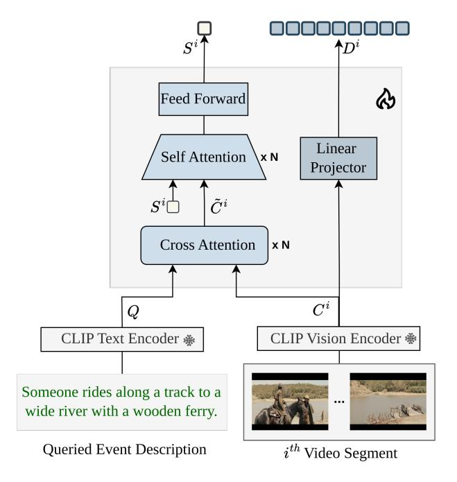

# Supplementary Material

Our supplementary materials contain Section [S1:](#page-0-1) Additional Implementation Details, Section [S2:](#page-1-1) Calibration Confidence, Section [S3:](#page-2-2) Generalization: Text-to-Video Retrieval, and Section [S4:](#page-4-1) Aditional Qualitative Results.

## S1. Additional Implementation Details

Multimodal Encoder. To handle multimodal inputs (refer to Fig. [S1\)](#page-11-0), we utilize the Frozen CLIP L/14 model [\[60\]](#page-10-15), a 24-layer transformer pretrained on extensive image-text pairs using a contrastive learning objective [\[70\]](#page-10-4). The vision encoder processes inputs of size 224 × 224, producing both spatial tokens and a global CLS token. For computational efficiency, we use only the CLS token to represent each frame in long videos. Similarly, the CLIP text encoder, a 12-layer transformer, extracts feature representations for the queried event from the input text.

Hierarchical Adapter. As illustrated in Fig. [S1,](#page-11-0) the Hierarchical Adapter processes the i th video segment C i to generate both sparse (S i ) and dense (Di ) features. For the MAD dataset, video features are divided into sliding windows of Lw = 125 seconds, while for the VidChapters-7M dataset, the window length is Lw = 500 seconds. From each segment, 250 frames are uniformly sampled and used as input to the hierarchical adapter.

Sparse features S i are computed using a combination of cross-attention and self-attention mechanisms, each implemented with two layers (N = 2). This lightweight design ensures minimal computational overhead compared to the 24 transformer layers of the original CLIP Vision Encoder. Dense features Di are derived by projecting the CLIP-encoded frame features (dimension 768) into the embedding space of the Large Language Model (dimension 4096) [\[9\]](#page-8-17) using a linear transformation.

Large Language Model. We utilize a pre-trained Vicuna-7B [\[9\]](#page-8-17) model to ground queried events using the adapted visual features. Built upon LLaMA [\[51\]](#page-10-18), this model consists of 32 transformer layers and has been fine-tuned on 70K user-shared conversations from ShareGPT [\[3\]](#page-8-23).

To enhance training efficiency, we adopt Low-Rank Adaptation (LoRA) [\[17\]](#page-8-13), a method commonly used in recent works [\[18,](#page-8-6) [46\]](#page-9-4). LoRA allows us to fine-tune the model without modifying its core weights by introducing lightweight, trainable modules. This significantly reduces computational overhead while retaining the model's flexibility. For our setup, we configure LoRA with a rank of r = 64 and a scaling factor of \alpha = 128 .

Training on ReVisionLLM Model We begin by pretrain-

Figure S1. Hierarchical Adapter processes the features extracted by the multimodal encoder, using both the video segments and the textual description of the queried event as inputs. It generates two types of temporal features: sparse and dense. Sparse features are computed through a combination of cross-attention, self-attention, and a feed-forward network, while dense features are generated using a linear projection layer.

ing the Linear Projector (Fig. [S1\)](#page-11-0) using the LCS-558K dataset from LLaVA [\[32\]](#page-9-15). This step aligns the CLS token from the CLIP Vision Encoder with the LLM's embedding space. The projector is trained for 1 epoch with a batch size of 128 and a learning rate of 1 × 10−3 .

Following pretraining, we implement a two-stage training pipeline for ReVisionLLM, maintaining a consistent learning rate of 1 × 10−4 . We use the AdamW optimizer [\[36\]](#page-9-23) with a warmup ratio 0.03 and a cosine scheduling strategy.

In the first stage, the Linear Projector is frozen, and the LLM is fine-tuned using LoRA on dense features, focusing on the lowest hierarchy level. This stage employs a batch size of 128, spanning 5 epochs for the MAD dataset and 1 epoch for the VidChapters-7M dataset. Sparse temporal features are introduced for upper hierarchies to reduce the LLM's visual input size. To enable sparse feature generation, we freeze the LoRA module and fine-tune the Cross-Attention, Self-Attention, and Feed-Forward layers of the Hierarchical Adapter, using a batch size of 32 for 1 epoch.

The training in this stage incorporates contrastive video segments where the queried event is absent. These segments are randomly sampled from hour-long videos and do not overlap with the temporal boundaries of the ground truth event. By selecting contrastive segments from the same video, the model is trained to handle challenging inference scenarios, where it must distinguish the queried event from visually and contextually similar scenes within the video.

In the second stage, all components of the Hierarchical Adapter are frozen, and a new LoRA module is finetuned for long-video processing on the Stage 2 objective. This stage employs a batch size of 8 and runs for 2 epochs. Two separate LoRA modules are utilized: one optimized for short video training and another adapted for long video processing.

Training on ReVisionLLM-U Model The unified model variant differs from our default model only in its training methodology. Training a unified model with shared parameters across all hierarchical levels poses notable challenges. To address this, we adopt an enhanced two-stage strategy. The first stage, including pretraining, is similar to the procedure used in the ReVisionLLM framework. In the second stage, however, we introduce a dual-training approach, where the ReVisionLLM-U framework is simultaneously trained on both short video clips and hour-long videos. This approach reduces the risk of catastrophic forgetting, ensuring the retention of short-segment representations.

A key challenge arises from the significant differences between short-segment and long-video data. Short segments utilize dense temporal features, while long videos rely on sparse temporal representations, such as CLS features. Additionally, short-segment training involves only video features, whereas long-video descriptions require both video and text features as inputs. To reconcile these differences, we implement an alternating batching strategy. During training, batches of short segments and long videos are alternately sampled, enabling the model to learn effectively from both data types.

This alternating training strategy not only mitigates catastrophic forgetting but also facilitates the successful training of the ReVisionLLM-U framework, which maintains shared parameters across all hierarchical levels. For ReVisionLLM-U, we employ the same hyperparameters as those used in ReVisionLLM , including learning rate, batch size, training epochs, optimizer, and scheduler (as detailed in the previous section).

Inference for ReVisionLLM. During inference, video segments are created using a sliding window approach. For the MAD dataset, each segment spans 125 seconds with a stride of 25 seconds, while for the VidChapters-7M dataset, segments are 500 seconds long with a stride of 100 seconds. From each segment, 250 frames are uniformly sampled. Sparse temporal features are then extracted using the Hierarchical Adapter and provided as input to the LLM to identify relevant video segments.

In our implementation, we employ two hierarchies with long videos. However, it can be extended to more levels based on video length. At the top level, 100 video segments (approx. 150 minutes) are processed simultaneously, while the second level processes 33 segments (approx. 50 minutes) simultaneously. Both hierarchies identify regions of interest, refined at the lowest hierarchical level. In this final hierarchy, all 250 dense temporal features from the selected segments are processed to pinpoint the precise event boundaries.

Inference for ReVisionLLM-I. The inverse model variant differs from our default model only in the inference method. In this variant, the inference begins at the lowest hierarchical level. All video segments are processed together in a single input batch, with their dense temporal features fed into the LLM. The LLM predicts temporal boundaries for multiple segments, often resulting in a high number of false positives. To mitigate this, the false positives are recursively passed through the second and third hierarchical levels, where they are filtered out. These upper levels retain only the most confident predictions, reducing errors. Finally, the confidence scores from the higher hierarchies are used to adjust and normalize the scores of the initial predictions, improving the overall accuracy of the model. We will release the code and pre-trained models for further use.

