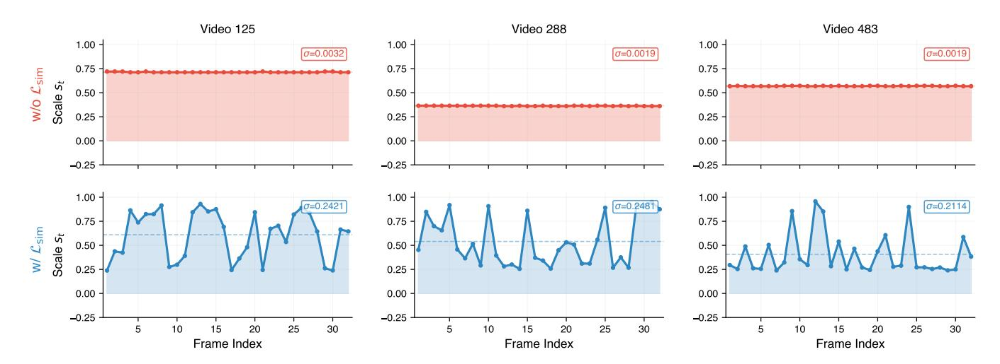

# **5. Related Work**

**Input-side adaptation before visual encoding.** A growing body of work reduces visual cost *before* or *during* input construction. Early approaches primarily perform temporal downsampling through keyframe selection or clip condensation [\(Liang et al.,](#page-19-5) [2024,](#page-19-5) [Zhu et al.,](#page-23-7) [2025,](#page-23-7) [Sun et al.,](#page-21-5) [2025,](#page-21-5) [Tang et al.,](#page-21-6) [2025\)](#page-21-6). More recent methods incorporate query awareness and iterative search, tailoring frame selection to question types or intermediate evidence [\(Zou et al.,](#page-23-8) [2025,](#page-23-8) [Li et al.,](#page-19-6) [2025a,](#page-19-6) [Guo et al.,](#page-19-7) [2025b,](#page-19-7) [He et al.,](#page-19-8) [2025\)](#page-19-8). Beyond selecting *which* frames to process, several works allocate perceptual budgets via multi-resolution encoding. Slow–fast pipelines [\(Yang et al.,](#page-22-3) [2025a,](#page-22-3) [Zhang et al.,](#page-22-0) [2026\)](#page-22-0) use inter-frame similarity to route frames to highor low-resolution paths, but their binary, query-agnostic routing cannot adapt to the downstream question; we omit direct experimental comparisons because these systems target different backbone families and evaluation protocols. Query-aware multi-resolution strategies [\(Zhang et al.,](#page-23-9) [2025d\)](#page-23-9) and early truncation of less informative visual tokens [\(Chen et al.,](#page-18-7) [2026\)](#page-18-7) go further by conditioning on the query, yet still rely on handcrafted rules or fixed resolution bins. We note that QFrame [\(Zhang et al.,](#page-23-9) [2025d\)](#page-23-9) operates with

Figure 7:  $\mathcal{L}_{sim}$  ablation: per-frame scale profiles. Without temporal-similarity regularization, the Allocator approaches near-uniform scaling; with it, the policy concentrates resolution on selected frames and suppresses redundant neighbors.

predefined resolution tiers and rule-based selection, whereas ResAdapt learns continuous allocations end-toend from task reward; a controlled comparison would require re-implementing QFrame's proprietary routing logic on our backbone, which we leave for future work. In contrast, ResAdapt is an Input-side adaptation framework: it learns input-side allocations from task reward via RL and can realize them through different pre-encoding operators, including resizing and frame selection; the experiments in this paper study the continuous resize instantiation.

Model-side token economy after encoding. Post-encoding methods prune, merge, or redistribute visual tokens in embedding space. For images, representative approaches include token merging (Bolya et al., 2022), attention- or saliency-guided pruning (Chen et al., 2024, Yang et al., 2025c, Shang et al., 2025, Zhang et al., 2025c), progressive dropping (Xing et al., 2024, Zhang et al., 2024b), context compression (Liao et al., 2025a), KV cache sparsity (Liao et al., 2025b), and diversity-based budget allocation (Alvar et al., 2025, Yang et al., 2025b, Zhang et al., 2025a). Video-specific extensions exploit spatiotemporal redundancy via static/dynamic token separation (Huang et al., 2025, Shen et al., 2025a), hierarchical merging (Hyun et al., 2025), and segment-level fusion or budget allocation (Tao et al., 2025, Fu et al., 2024, Shao et al., 2025a). These methods are complementary to ResAdapt: they operate *after* visual encoding and cannot recover high-frequency details lost to undersampling before encoding. Our focus is earlier in the pipeline, deciding how many pixels to encode in the first place.

**Output-side agentic reasoning.** Another strategy leaves the input fixed and recovers efficiency through iterative reasoning: retrieve candidate frames, zoom into regions, then re-query the model. Approaches range from static toolsets with predefined cropping or clipping operators (Zheng et al., 2025b, Wang et al., 2025a, Song et al., 2026) to dynamic tooling via code-generation primitives (Zhang et al., 2025e, Zhao et al., 2025a, Hong et al., 2025), often exposed through executable interfaces (Wang et al., 2024). While these methods can target hard evidence precisely, they are multi-pass by construction and rely on an initial coarse view to trigger subsequent refinement. ResAdapt instead studies whether a *single-pass* pre-encoding allocation policy can recover much of this benefit without the latency and control overhead of iterative interaction.

**RL for multimodal reasoning and perception control.** Recent work has extended RL post-training from language models [\(Shao et al.,](#page-21-11) [2024,](#page-21-11) [Guo et al.,](#page-19-0) [2025a,](#page-19-0) [Tan et al.,](#page-21-12) [2025\)](#page-21-12) to multimodal reasoning and video understanding. Algorithmic refinements include improved advantage estimation and PPO-style stabilization [\(Liu et al.,](#page-20-11) [2025c,](#page-20-11) [Yu et al.,](#page-22-4) [2025,](#page-22-4) [Zheng et al.,](#page-23-3) [2025a\)](#page-23-3), while video-domain extensions strengthen reasoning through iterative frame selection and evidence refinement [\(Feng et al.,](#page-18-10) [2025,](#page-18-10) [Li et al.,](#page-19-13) [2025b,](#page-19-13) [Liu et al.,](#page-20-3) [2026,](#page-20-3) [Yang et al.,](#page-22-2) [2025d,](#page-22-2) [Chen et al.,](#page-18-11) [2025,](#page-18-11) [Wang et al.,](#page-22-12) [2025c,](#page-22-12) [Fu et al.,](#page-18-12) [2025b\)](#page-18-12). Our use of RL is orthogonal: we apply it to *input-side perception control*—learning frame-level visual allocations under an explicit accuracy–cost trade-off—rather than output-side reasoning policies. CAPO is designed for this setting, where naive cost penalties drive the policy to a degenerate low-budget solution.

