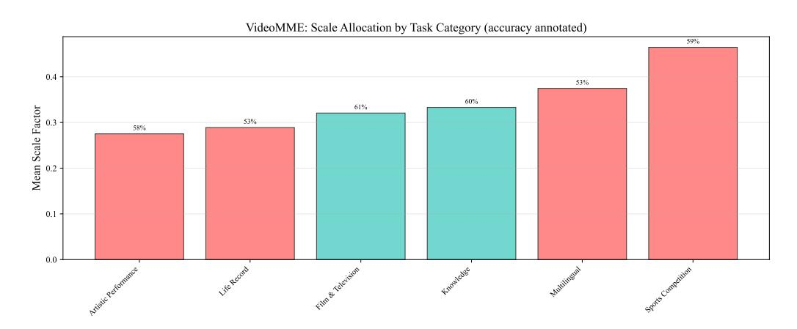
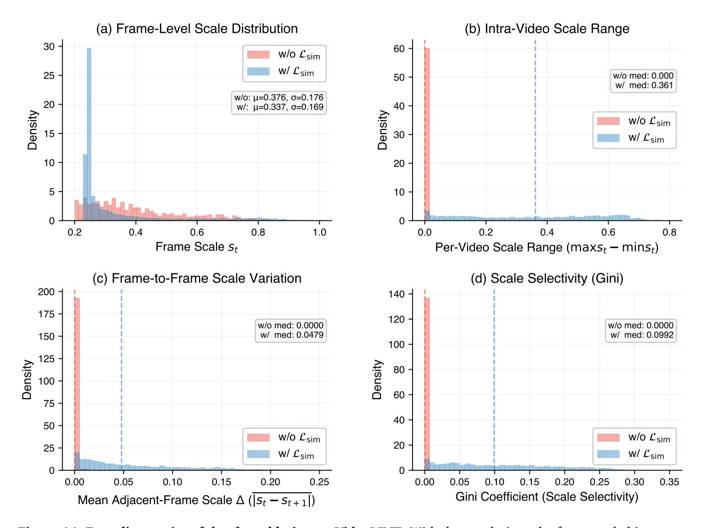
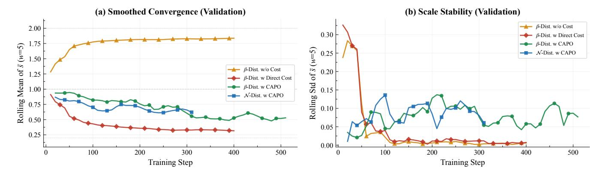
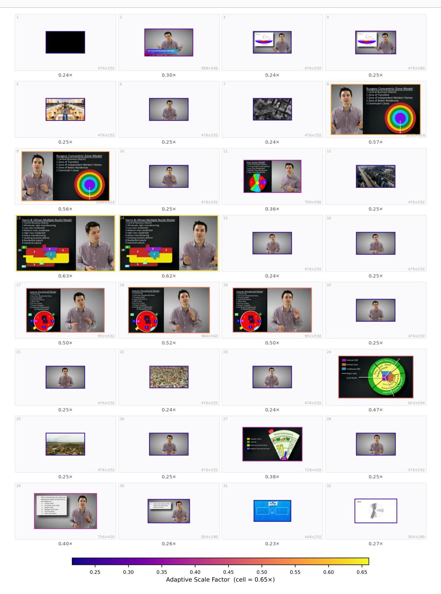

# **Prompt Template for Training with Thinking**

### **System Prompt:**

You are a helpful assistant.

You FIRST think about the reasoning process as an internal monologue and then provide the final answer.

The reasoning process MUST BE enclosed within <think> </think> tags and the answer MUST BE enclosed within <answer> </answer> tags.

The final answer MUST BE put in \boxed{} and the \boxed{} expression MUST BE contained entirely within the <answer> </answer> tags.

Do not include any reasoning or explanations outside these tags.

apply a fixed compression ratio; it calibrates its operating point to the anticipated visual complexity of each task.

**Long-context behavior.** Figure [9](#page-32-1) clarifies how the policy handles increasing clip length. As duration grows, the mean scale decreases (0.342→0.336→0.332) while within-video diversity simultaneously increases (0.085→∼0.095). The policy compresses longer videos more aggressively overall, but with far greater selectivity—precisely the regime where uniform resizing fails.

Figure [10](#page-32-2) provides a category-level view within VideoMME. The policy assigns maximum budget to *Sports Competition* (dense, high-motion) and minimum budget to *Artistic Performance* (visually sparse). Allocation tracks spatial complexity rather than task difficulty.

**Selectivity and success.** We measure frame-level selectivity via the Gini coefficient of predicted scales: a high Gini indicates concentrated budget on a sparse subset of frames. Figure [11](#page-33-0) shows that correct predictions consistently map to higher selectivity, peaking on MMMU-P. Success correlates not with larger average budgets, but with sharper concentration of resolution onto the decisive frames.

**Robustness and failure modes.** Figure [12](#page-33-1) examines whether adaptive compression preserves correct reasoning paths or merely reshuffles errors. Prediction stability is robust: 89% of originally correct samples survive compression. However, error correction and error induction rates remain comparable. The policy executes *selective redistribution*—rescuing certain failures by magnifying critical details, while occasionally destroying fine-grained evidence when the decisive cue is transient or visually inconspicuous.

### **C.2. Extended Ablation Studies**

**Temporal similarity: cross-benchmark view.** Figure [13](#page-34-1) isolates the impact of Lsim. Without it, scale diversity collapses to near-zero across all benchmarks (*σ* < 0.003). Activating Lsim restores within-video variation by 4×–693×. CAPO controls the global budget level; Lsim breaks the uniform-scale equilibrium.

**Temporal similarity: structural diagnostics.** Figure [14](#page-35-0) provides four complementary views. With the

**Figure 8: Per-video mean scale across benchmarks.** Kernel density estimates of the per-video mean scale  $\bar{s}$ . Reasoning-heavy benchmarks shift toward larger  $\bar{s}$  than perception-heavy ones, indicating that the learned policy spends more fidelity where fine-grained evidence is more likely to matter.

regularizer active, the frame-scale histogram becomes bimodal, the per-video range expands, adjacent-frame variation increases, and the Gini coefficient rises. The policy transitions from a degenerate uniform allocator to a genuinely selective one.

**Reward design:** adaptivity. Figure 15 tracks the per-sample scale range  $s_{\text{max}} - s_{\text{min}}$  across training. CAPO maintains robust adaptivity on the validation split. Direct cost penalties collapse the range to zero, while cost-free training saturates at a uniform high-scale plateau.

**Reward design: convergence.** Figure 16 identifies the failure modes. Accuracy-only training saturates near  $s_{\text{max}}$ , abandoning compression. Direct cost optimization collapses to  $s_{\text{min}}$ , abandoning task quality. CAPO converges to a stable intermediate operating point that preserves content-adaptive allocation. The critical difference is not stability alone—both degenerate baselines are stable—but *where* the policy stabilizes.

### C.3. Qualitative Case Studies

We provide four qualitative analyses mapping allocation behavior to reasoning outcomes (Figures 17–20). We render 32 uniformly sampled frames at their predicted scales; warmer borders denote aggressive upscaling.

Task-Dependent Operating Regimes. Figures 17 and 18 contrast two Video-MMMU tasks drawn from identical educational domains that trigger markedly different allocation strategies. In the comprehension task, evidence localizes strictly within diagram-heavy slides. The policy executes a sparse regime, aggressively compressing lecturer frames and suppressing an irrelevant quiz slide. Conversely, the adaptation task requires parsing a dense numeric table to compute a  $\chi^2$  statistic. The policy instantly shifts to a high-budget regime, broadly preserving fidelity and strongly upscaling the table frames. The policy reacts dynamically to downstream reasoning requirements, not merely superficial visual clutter.

Evidence Localization and Failure. Figure 19 (VideoMME) demonstrates precision localization. The policy

**Figure 9: VideoMME broken down by video duration.** As clip duration grows, the policy lowers the average scale, increases within-video scale diversity, and faces lower task accuracy. Longer clips are therefore processed more aggressively and more selectively.

**Figure 10: Scale allocation by VideoMME task category.** Mean  $\bar{s}$  varies substantially across categories, with larger budgets assigned to categories that contain crowded motion or finer local evidence. Accuracy annotations show that allocation is not a trivial proxy for which category is easiest.

isolates and magnifies brief frames containing critical date overlays, aggressively downscaling repetitive sky footage. Figure 20 exposes the prevailing failure mode. A decisive visual cue (a fork) appears briefly against a simple background. The policy mistakenly upscales an adjacent frame while compressing the critical frame, destroying the fine-grained evidence at the exact moment of relevance. This aligns with our robustness analysis: ResAdapt excels at broad concentration but remains brittle against highly transient, low-contrast cues.

### C.4. Boundary-Case Transfer Beyond Video

While ResAdapt targets video QA and temporal grounding, we probe image transfer to identify operational boundaries. Table 7 shows that the video-trained policy occasionally identifies images requiring high fidelity (e.g., ChartQA), but does not deliver consistent efficiency-preserving gains on dense static-image benchmarks. The boundary is clear: input-side allocation generalizes across video tasks and operators, but a strictly video-trained policy requires explicit joint training to handle static image distributions reliably.

Scale Selectivity (Gini Coefficient): Correct vs. Incorrect Predictions

**Figure 11: Selectivity versus prediction correctness on three representative benchmarks.** Per-video Gini coefficients of the frame-level scales. Correct predictions tend to have higher Gini than incorrect ones, linking success to sharper concentration of resolution rather than merely larger average budgets.

**Figure 12: Sample-level robustness at 25% retention.** Most originally correct predictions remain correct, but corrected and newly introduced errors are of comparable magnitude. Adaptive allocation is therefore selective rather than lossless.

Figure 13: Cross-benchmark scale diversity with and without  $\mathcal{L}_{sim}$ . Per-video scale standard deviation  $\sigma$  across five benchmarks. Without the regularizer, diversity collapses toward zero; adding  $\mathcal{L}_{sim}$  restores broad within-video variation on every benchmark.

**Table 7: Exploratory zero-shot transfer to image benchmarks.** Parenthetical values denote per-task retention ratio *R*, and ResAdapt-RL additionally fine-tunes the MLLM via RL.

| Model                          | <b>MathVista</b> testmini | <b>MMMU</b> val | OCRBench   | ChartQA    | AI2D       | <b>TextVQA</b> val |
|--------------------------------|------------------------------|--------------------|------------|------------|------------|-----------------------|
| Qwen2.5-VL-7B                  | 49.1(100%)                   | 50.9(100%)         | 84.2(100%) | 83.9(100%) | 82.5(100%) | 82.9(100%)            |
| Random Drop                    | 44.8(50%)                    | 49.0(50%)          | 74.8(50%)  | 71.6(50%)  | 80.3(50%)  | 78.1(50%)             |
| ToMe (Bolya et al., 2022)      | 46.2(50%)                    | 49.6(50%)          | 79.3(50%)  | 78.1(50%)  | 81.9(50%)  | 81.2(50%)             |
| VisionZip (Yang et al., 2025c) | 47.2(50%)                    | 48.6(50%)          | 79.6(50%)  | 77.9(50%)  | 81.9(50%)  | 81.3(50%)             |
| ResAdapt(Qwen2.5-VL-7B)        | 45.5(42%)                    | 51.0(29%)          | 80.0(64%)  | 85.9(105%) | 81.4(41%)  | 69.6(30%)             |
| ResAdapt-RL(Qwen2.5-VL-7B)     | 46.7(42%)                    | 50.9(29%)          | 80.8(64%)  | 86.6(105%) | 81.1(41%)  | 70.1(30%)             |
| Qwen3-VL-8B                    | 56.1(100%)                   | 53.4(100%)         | 85.0(100%) | 84.0(100%) | 83.5(100%) | 82.1(100%)            |
| Random Drop                    | 47.3(50%)                    | 48.7(50%)          | 62.9(50%)  | 70.2(50%)  | 79.7(50%)  | 76.6(50%)             |
| VisionZip (Yang et al., 2025c) | 47.8(50%)                    | 50.3(50%)          | 70.5(50%)  | 75.0(50%)  | 80.5(50%)  | 79.3(50%)             |
| ToMe (Bolya et al., 2022)      | 49.6(50%)                    | 50.6(50%)          | 70.3(50%)  | 75.2(50%)  | 80.5(50%)  | 79.4(50%)             |
| ResAdapt(Qwen3-VL-8B)          | 52.5(42%)                    | 50.9(29%)          | 82.7(64%)  | 83.2(105%) | 81.2(41%)  | 67.8(30%)             |

Figure 14: Four diagnostics of the  $\mathcal{L}_{sim}$  ablation on VideoMME. With the regularizer, the frame-scale histogram becomes bimodal, the per-video range expands, adjacent-frame variation increases, and the Gini coefficient rises. The policy moves from near-uniform allocation to a genuinely selective regime.

Figure 15: Per-sample scale adaptivity under different reward designs. Scale range  $s_{\text{max}} - s_{\text{min}}$  over training on (a) training and (b) validation splits. CAPO keeps a non-trivial adaptive range, whereas direct cost collapses and cost-free training saturates.

**Figure 16: Validation-time convergence under different reward designs.** CAPO variants converge to stable intermediate operating points, while cost-free training saturates at the upper boundary and direct cost collapses to the lower boundary. Stability alone is not sufficient; the key is where the policy stabilizes.

**Q:** Evaluate five statements about Urban Geography City Models (concentric zone, Hoyt sector, multiple nuclei, galactic, Latin American); identify which are correct. *Please ignore the Quiz question in last frame of the video.*

**Figure 17: Case 1: Video-MMMU Comprehension [\(Hu et al.,](#page-19-3) [2025\)](#page-19-3) (Vanilla** × → **ResAdapt** ✓**).** The policy concentrates resolution on diagram-bearing slide frames, compresses lecturer-only frames, and suppresses the final quiz frame that the prompt explicitly marks as irrelevant.

**Q:** Watch and learn the video content. Then apply what you learned to answer: Table 11.47 provides a survey of the youngest online entrepreneurs (ages 17–30) whose net worth ≥ \$1M. We want to know whether ages and net worth are independent. *χ* 2 test statistic = \_\_\_\_\_\_

**Figure 18: Case 2: Video-MMMU Adaptation [\(Hu et al.,](#page-19-3) [2025\)](#page-19-3) (Vanilla** × → **ResAdapt** ✓**).** When the answer depends on reading a numeric table and performing a *χ* 2 computation, the policy keeps a much higher global budget and strongly upscales the table-bearing frames.

**Figure 19: Case 3: VideoMME [\(Fu et al.,](#page-18-4) [2025a\)](#page-18-4) (Vanilla** × → **ResAdapt** ✓**).** Frames containing the decisive date overlays are enlarged, while the largely homogeneous sky footage is compressed. The policy spends budget on answer-bearing evidence rather than on the surrounding context.

**Q:** Which item does the man throw into the trash at the beginning of the video? (A) A fork, (B) A pair of chopsticks, (C) A box of noodles, (D) A spoon.

**Figure 20: Case 4: VideoMME [\(Fu et al.,](#page-18-4) [2025a\)](#page-18-4) (Vanilla** ✓ → **ResAdapt** ×**; failure case).** A nearby frame is enlarged, but the actual fork-bearing frame is compressed. The decisive fine detail is therefore lost at exactly the wrong moment.