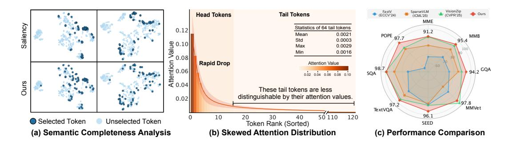
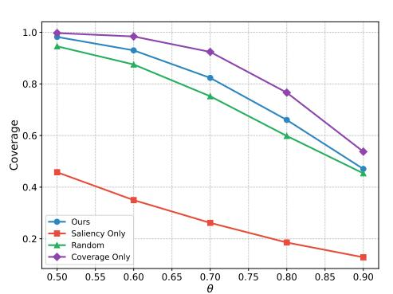
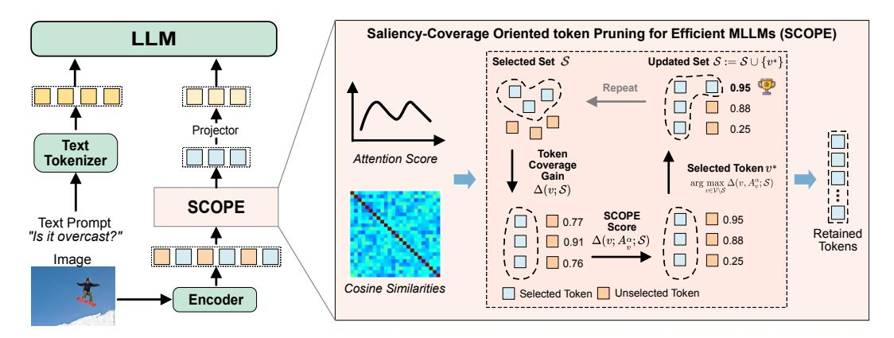

# 1 Introduction

Recent advances in Multimodal Large Language Models (MLLMs)[\[24,](#page-11-0) [25,](#page-11-1) [51,](#page-12-0) [20,](#page-11-2) [21\]](#page-11-3) have significantly advanced open-ended visual understanding tasks[\[12,](#page-10-0) [27,](#page-11-4) [47,](#page-12-1) [8\]](#page-10-1) by integrating powerful vision encoders [\[34\]](#page-11-5) with autoregressive large language models [\[37,](#page-12-2) [1\]](#page-10-2). These systems typically tokenize visual inputs into sequences of patch-level embeddings (*i.e.*, visual tokens), which are then fed into the language model via either projection modules [\[24\]](#page-11-0) or attention-based fusion mechanisms [\[19\]](#page-11-6). Despite its effectiveness, this paradigm incurs substantial computational overhead, particularly when processing high-resolution images or temporally dense video inputs. For instance, a ViT encoder [\[11\]](#page-10-3) applied to a 448 × 448 image can generate over 1,000 visual tokens. This number increases rapidly in high-resolution and video scenarios involving multiple frames. Since these tokens are jointly processed with textual tokens, the computational cost of self-attention grows quadratically with the number of visual tokens [\[30,](#page-11-7) [25\]](#page-11-1), limiting their deployment in practical applications such as edge computing and robotics [\[17,](#page-11-8) [33,](#page-11-9) [44\]](#page-12-3).

∗Corresponding Author.

This work was completed during Jinhong Deng's internship at CFAR, A\*STAR.

Figure 1: (a) Semantic Completeness Analysis. We visualize the selected tokens using a saliency-based rule (Top) and our method (Bottom). The saliency score corresponds to the visual attention assigned to the CLS token. Our method selects tokens that maximize coverage while preserving the most dominant visual information. (b) Skewed Attention Distribution. We show the averaged attention distribution of the top 128 tokens on the MME benchmark. The attention weights rapidly flatten, making tail tokens less distinguishable based on their attention values. (c) Performance comparison with prior methods across various benchmarks. The model is LLaVA-1.5 7B, and the number of retained tokens is 64.

However, not all visual tokens contribute equally to the final outputs of the language model [7]. Many background or repetitive patches carry redundant or less informative content [6, 11]. This motivates the need for efficient visual token pruning or compression, aiming to retain only the most relevant tokens while discarding those that are redundant. To this end, recent works [7, 41, 49] have proposed various pruning strategies that select salient visual tokens based on attention scores, *i.e.*, visual attention from text prompts or from the CLS token in vision transformers. For instance, VisionZIP [43] selects visual tokens that receive the highest attention from the CLS token.

While effective, saliency-based visual token pruning methods exhibit notable limitations in complex vision-language tasks. First, they inevitably **compromise semantic completeness** by discarding key contextual information essential for comprehensive visual understanding. For example, in response to the question "Where is the cat?", attention may focus primarily on the object "cat" while neglecting its surrounding context. The saliency-based methods typically concentrate on a small subset of visual tokens (see Fig. 1(a)), resulting in significant semantic loss. Moreover, saliency-based approaches often suffer from highly **skewed attention distribution**, where only a few tokens receive substantial attention while the rest exhibit nearly uniform (*i.e.*, flat) attention values as shown in Fig. 1(b). This hampers the discriminability among tokens, making it difficult to differentiate potentially informative ones from truly redundant ones.

To address the above challenges, we propose a novel visual token pruning strategy, named Saliency-Coverage Oriented token Pruning for Efficient MLLMs (SCOPE), which jointly models the saliency and coverage of selected visual tokens to preserve semantic completeness. Specifically, we first define a set-coverage score for a selected token set based on token relationships and introduce a token-coverage gain for each unselected token, measuring the additional coverage achieved by including that token. We then propose a SCOPE score to integrate the token saliency score into the token-coverage gain, and iteratively select the token with the highest SCOPE score. This enables our method to retain tokens that not only contribute the most salient information but also ensure broad semantic coverage (see Fig. 1(a)).

To evaluate the effectiveness of our SCOPE, we conduct extensive experiments on a variety of vision-language understanding benchmarks using popular MLLMs, including LLaVA-1.5 [24] and LLaVA-Next [25]. The results demonstrate that our method consistently outperforms prior approaches by a significant margin (see Fig. 1(c)). For instance, SCOPE achieves a 9× reduction in the number of visual tokens while retaining 96.0% of the original performance on LLaVA-1.5 7B [24].

Our main contributions are summarized as follows:

• We reveal the limitation of the saliency-based visual token pruning methods, which unfortunately ignore the semantic completeness of the selected visual tokens and suffer from a highly skewed attention distribution problem.

- We propose a novel visual token pruning strategy, named Saliency-Coverage Oriented token Pruning for Efficient MLLMs (SCOPE), which jointly models saliency and coverage of the retained visual tokens to preserve semantic completeness.
- We integrate SCOPE into representative MLLMs such as LLaVA-1.5 and LLaVA-Next without training, and demonstrate its effectiveness on multiple vision-language benchmarks, achieving a favorable trade-off between computational efficiency and task performance.

#### 2 Related Work

Multimodal Large Language Models (MLLMs). Large Language Models (LLMs)[1, 37, 3, 10, 16] have achieved remarkable success in a wide range of language understanding and generation tasks. Building on this foundation, Multimodal LLMs (MLLMs)[24, 25, 21, 50, 19, 4] have shown impressive progress in visual understanding. A prevailing paradigm in MLLMs projects visual features into a sequence of visual tokens via a vision-to-language projector, and feeds them into the LLM alongside text tokens, as exemplified by LLaVA [24, 25], Qwen-VL [4], and Mini-Gemini [21].

However, real-world images are often high-resolution, resulting in long visual token sequences that significantly slow down inference in MLLMs [23, 30, 20, 9]. For example, LLaVA-Next [25] converts a  $672 \times 672$  image into over 2,000 tokens. The situation worsens when handling multiple images or videos, further increasing the number of visual tokens. This highlights the need for effective strategies to reduce token length and accelerate vision-language inference.

Visual Token Pruning/Compression in MLLMs. A number of recent studies [49, 41, 40, 7] have focused on reducing visual token redundancy in MLLMs without requiring additional model training. Most of these methods [7, 49, 41] rely on specific attention scores to rank token saliency, such as text-to-vision attention in LLMs or CLS-token attention in vision transformers. They typically retain only the top-ranked tokens using a top-k strategy, i.e., selecting tokens with the highest attention scores. For instance, FastV [7] leverages early-layer text-to-vision attention to retain salient tokens. SparseVLM [49] uses important textual words as a rater to guide token selection. VisionZip [43] applies CLS-based attention in the vision transformer for token pruning. To further increase the information density of the selected tokens, several approaches attempt to merge semantically similar tokens [43, 49, 35]. DivPrune [2] selects visual tokens by maximizing the diversity of selected tokens. In contrast, our method jointly considers both saliency and coverage, aiming to preserve semantic completeness while reducing token redundancy.

### 3 Method

In this section, we first introduce the preliminaries of visual token pruning and discuss the instantiation of saliency-based pruning methods in Sec. 3.1. In Sec.3.2, we provide a coverage analysis and show that saliency-based methods often suffer from low coverage. Finally, we present our proposed Saliency-Coverage Oriented token Pruning for Efficient MLLMs (SCOPE) in Sec.3.3.

#### 3.1 Preliminary

**Visual Token Pruning.** The core architecture of LLMs consists of stacked self-attention layers and feed-forward networks (FFNs)[38], where the computational complexity grows quadratically with the input sequence length. In MLLMs, input images are typically high-resolution, resulting in long sequences of visual tokens. For instance, LLaVA[26] produces 576 visual tokens for a single image, which is often significantly longer than the corresponding text input in many visual understanding tasks. Furthermore, visual tokens often exhibit substantial redundancy [7, 41] due to repeated patterns and limited informational content in background regions.

Therefore, reducing the number of visual tokens is essential for enhancing the computational efficiency of MLLMs. In particular,  $\mathcal{V} = \{v_1, \dots, v_N\}$  denotes the full set of N visual tokens extracted from the image, where each token  $v_i \in \mathbb{R}^d$  represents a local region of the image. The goal of visual token pruning algorithm  $\mathcal{A}$  is to select a small subset of visual tokens  $\mathcal{S} = \{v_1, \dots, v_K\} = \mathcal{A}(\mathcal{V})$ , where  $K \ll N$ . The objective of visual token pruning is to ensure that the model's output based on  $\mathcal{S}$  closely approximates the output based on the full set  $\mathcal{V}$ . Formally, the pruning objective can be

formulated as:

$$\min_{\mathcal{S}} \ \mathcal{L}\left(\mathcal{M}(\mathcal{S}, T), \ \mathcal{M}(\mathcal{V}, T)\right), \tag{1}$$

where  $\mathcal{M}(\cdot,T)$  denotes the output of the vision-language model given visual input (either  $\mathcal{V}$  or  $\mathcal{S}$ ) and text input T, and  $\mathcal{L}$  is a function to measure the output difference of LLM.

#### Saliency-based Visual Token Pruning.

The saliency-based visual token pruning methods aim to reduce token redundancy by retaining the most salient visual tokens while discarding the less informative ones. The core challenge lies in how to effectively measure the saliency of each visual token. Several prior works [7, 41, 49, 43] estimate saliency by leveraging attention scores. Specifically, the attention matrix A is calculated as:

$$A = \operatorname{Softmax}\left(\frac{QK^{\top}}{\sqrt{d}}\right),$$
 (2)

where d is the embedding dimension,  $\mathbf{Q}$  and  $\mathbf{K}$  is the query and key matrices in the standard attention mechanism. These attention scores indicate the interaction strength between tokens, guiding the identification of highly salient tokens. In practice, in the vision encoder of CLIP [34], the [CLS] token is used to aggregate global information from the entire image. Therefore, the attention scores from the [CLS] token to the visual tokens serve as a reasonable proxy for token saliency. Based on these saliency scores, token pruning methods typically adopt a top-k selection strategy to retain only the most salient visual tokens. This approach effectively reduces visual token redundancy and significantly accelerates MLLM inference across various tasks.

#### 3.2 Coverage Analysis

Although saliency-based pruning methods can effectively identify important tokens based on attention scores, they inevitably discard certain semantically critical tokens that are essential for comprehensive visual understanding. Semantic completeness, however, is crucial for accurately responding to a wide range of instruction prompts in MLLMs. Furthermore, saliency-based approaches often suffer from highly skewed attention distributions, where a small subset of tokens receives disproportionately high attention, while the remaining tokens exhibit nearly uniform (i.e., flat) attention values. This skewness undermines token discriminability, making it challenging to distinguish between potentially informative tokens and truly redundant ones. To quantitatively assess the representational completeness of the selected

Figure 2: Comparison of  $\theta$ -coverage across different token pruning criteria. The experiments are conducted on the MME benchmark, with 64 tokens selected out of the original 576 in LLaVA 1.5 7B.

tokens, we introduce the notion of the  $\theta$ -coverage (see **Definition** 1), which measures the degree to which the retained tokens cover the semantic space of the full token set.

**Definition 1** ( $\theta$ -Coverage). Let  $\mathcal{V} = \{v_i \in \mathbb{R}^d \mid i = 1, ..., n\}$  denote the full set of tokens extracted from an input image, and let  $\mathcal{V}' \subseteq \mathcal{V}$  be a subset of selected tokens. For a given similarity threshold  $\theta \in [0, 1]$ , we say that a token  $v \in \mathcal{V}$  is covered by  $\mathcal{V}'$  if there exists at least one token  $v' \in \mathcal{V}'$  such that their cosine similarity satisfies:

$$sim(v, v') := \frac{v^{\top}v'}{\|v\| \cdot \|v'\|} \ge \theta.$$
 (3)

The  $\theta$ -coverage of V' over V is then defined as the proportion of tokens in V that are covered by V':

$$\operatorname{Coverage}_{\theta}(\mathcal{V}',\mathcal{V}) = \frac{1}{|\mathcal{V}|} \sum_{v \in \mathcal{V}} \mathbb{I}\left(\max_{v' \in \mathcal{V}'} \operatorname{sim}(v, v') \ge \theta\right), \tag{4}$$

where  $\mathbb{I}(\cdot)$  is the indicator function, which equals 1 if the condition holds and 0 otherwise.

Figure 3: An overview of the proposed visual token pruning framework. The left part illustrates how our method reduces the number of visual tokens before feeding them into the LLM, thereby accelerating inference in MLLMs without requiring additional model training. The right part provides a detailed view of our SCOPE method, which jointly optimizes saliency and coverage to select a compact yet semantically representative subset of visual tokens.

This definition provides a semantic-aware metric to quantify how well the selected tokens set V' represents the full set. A higher value of  $\theta$  imposes a stricter similarity criterion, typically leading to lower coverage but ensuring that the retained tokens are more semantically representative.

In particular, we present the  $\theta$ -coverage results on the MME benchmark in Fig. 2. The Saliency Only method selects dominant tokens solely based on the attention scores from the CLS token. However, it consistently exhibits low coverage across different values of  $\theta$ , even performing worse than the random selection baseline. This observation suggests that although the saliency-based method captures dominant information, it tends to overlook a substantial amount of semantic content. In contrast, our method (detailed in Sec.3.3) incorporates saliency scores into a coverage-aware selection framework, striking a better balance between saliency and semantic coverage. As a result, it achieves significantly higher coverage compared to the Saliency Only method.

#### 3.3 Saliency-Coverage Oriented Token Pruning

In contrast to saliency-based pruning methods, our goal is to jointly optimize saliency and coverage in the visual token selection process. This enables the pruning algorithm to not only preserve the most informative tokens but also maximize the semantic coverage of the selected subset. As a result, the retained tokens are both highly informative and semantically diverse, thereby maintaining semantic completeness under a constrained token budget, which is an essential property for comprehensive visual understanding across a wide range of multimodal tasks.

In the following, we first define the notion of coverage for selected tokens. Next, we introduce the concept of token-coverage gain, *i.e.*, the additional coverage obtained by including a new token in the selected set [14]. Finally, we incorporate the saliency score into the token-coverage gain formulation to balance both selection criteria. The overview of the proposed method is presented in Fig. 3.

Set-coverage for selected tokens. To quantify semantic coverage, we measure the similarity between token vectors using cosine similarity. We first define the individual coverage score C(u, S) for a token  $u \in V$  by a set of selected tokens  $S \subseteq V$  as:

$$C(u, \mathcal{S}) = \max_{s \in \mathcal{S}} \sin(u, s) \tag{5}$$

where sim(u, s) is the cosine similarity metric between token u and token s. The overall coverage of the selected subset  $\mathcal{S}$  is defined as the sum of the maximum similarities between each token in the full set  $\mathcal{V}$  and its most similar token in  $\mathcal{S}$ :

$$f(\mathcal{S}) = \sum_{u \in \mathcal{V}} C(u, \mathcal{S}) = \sum_{u \in \mathcal{V}} \max_{s \in \mathcal{S}} \text{sim}(u, s)$$
 (6)

This formulation encourages the selection of tokens that are semantically diverse and broadly representative of the input space. Intuitively, it ensures that each token in the full set has at least one similar counterpart in the selected subset, thus preserving information while reducing the token count.

#### Algorithm 1 SCOPE

**Require:** A full set of tokens  $\mathcal{V} = \{v_1, ..., v_n\} \subset \mathbb{R}^d$ , number of retained token K, pairwise similarities  $S_{uv} = \sin(u, v)$  for all  $u, v \in \mathcal{V}$ , attention score  $A_v$  for each token v, and a scaling factor  $\alpha$ .

#### **Ensure:**

Selected token subset  $S \subseteq V$  with |S| = K

1: Initialize  $S \leftarrow \emptyset$ 

- Start with an empty selected subset
- 2: Initialize coverage scores:  $c_u \leftarrow 0$  for all  $u \in \mathcal{V} \rightarrow c_u$  tracks the best similarity between u and any selected token so far
- 3: **for** t = 1 to K **do**
- 4: for all  $v \in \mathcal{V} \setminus \mathcal{S}$  do
- 5: Compute marginal gain:  $\Delta(v; \mathcal{S}) = \sum_{u \in \mathcal{V}} [\max(S_{uv}, c_u) c_u]$   $\triangleright$  Compute the additional coverage that token v brings if added to  $\mathcal{S}$
- 6: **end for**
- 7: Select next token:  $v^* \in \arg\max_{v \in \mathcal{V} \setminus \mathcal{S}} \Delta(v; \mathcal{S}) \cdot A_v^{\alpha}$  > Choose the token that balances coverage and saliency score
- 8: Update selected subset:  $S \leftarrow S \cup \{v^*\}$   $\triangleright$  Add the selected token to the subset
- 9: Update coverage scores: cu ← max(cu, Suv\*) ∀u ∈ V ▷ Update coverage scores using the newly added token
- 10: **end for**
- 11: return S

**Token-coverage Gain.** To quantify the contribution of each candidate token  $v \in \mathcal{V} \setminus \mathcal{S}$ , we evaluate its *marginal gain* with respect to the current subset  $\mathcal{S}$  [14]. The marginal gain is defined as the increase in total coverage achieved by including v, and can be formally expressed as follows:

$$\Delta(v; \mathcal{S}) = f(\mathcal{S} \cup \{v\}) - f(\mathcal{S}), \tag{7}$$

Expanding this definition using Eq. (6), we can express the marginal gain as the sum of the new coverage provided by v to each token u that was not already fully covered by S:

$$\Delta(v; \mathcal{S}) = \sum_{u \in \mathcal{V}} \max_{s \in (\mathcal{S} \cup \{v\})} \operatorname{sim}(u, s) - \sum_{u \in \mathcal{V}} \max_{s \in \mathcal{S}} \operatorname{sim}(u, s)$$
$$= \sum_{u \in \mathcal{V}} (\max(C(u, \mathcal{S}), \sin(u, v)) - C(u, \mathcal{S}))$$
(8)

This quantifies how much additional coverage is achieved by selecting token v, taking into account its ability to represent other tokens  $u \in \mathcal{V}$  that are not yet well-represented by the current subset  $\mathcal{S}$ .

**SCOPE score.** While the token-coverage gain considers only the geometric coverage in semantic space, it overlooks the intrinsic information carried by individual tokens. To address this limitation, we propose the SCOPE gain, which incorporates token saliency into the coverage gain to better preserve visual token information. Specifically, we integrate the visual attention score into the coverage gain function as follows:

$$\Delta(v, A_v^{\alpha}; \mathcal{S}) = \Delta(v; \mathcal{S}) \cdot A_v^{\alpha}, \tag{9}$$

where  $A_v^{\alpha}$  denotes the attention score of the visual token v, and  $\alpha$  is a scaling factor. The token  $v^*$  with the highest SCOPE gain is selected and added to the subset  $\mathcal{S}$ :

$$v^* \in \arg\max_{v \in \mathcal{V} \setminus \mathcal{S}} \Delta(v, A_v^{\alpha}; \mathcal{S})$$
 (10)

This process is iteratively repeated until the desired subset size is reached. The pseudocode of the proposed pruning method is presented in Algorithm 1.

**Integration into MLLMs.** The proposed method is applicable to a wide range of MLLMs. In this work, we apply it to the widely adopted LLaVA[26] and LLaVA-Next [25] models, following prior studies [7, 49, 41]. Our method is integrated after the vision encoder to maximize information retention post token pruning. This enables the language model to receive more complete visual signals, thereby supporting comprehensive visual understanding without compromising performance. Our method is train-free and significantly accelerates the inference of MLLMs with minimal performance degradation. For example, our approach preserves over 96% of the original model's performance while reducing the number of visual tokens by a factor of 8 in LLaVA 1.5 7B.

Table 1: Performance comparison under different vision token configurations. We evaluate the LLaVA 1.5 7B model, where the default number of visual tokens is 576. The first row for each method reports the raw accuracy across benchmarks, and the second row indicates the performance relative to the upper bound. † denotes the results adapted from [\[49\]](#page-12-5).

| Vanilla (CVPR'24)   | 61.9 |                   |        |                             |                                |       | SEED  | MMVet         | Avg.           |
|---------------------|------|-------------------|--------|-----------------------------|--------------------------------|-------|-------|---------------|----------------|
|                     |      |                   |        |                             | Upper Bound, 576 Tokens (100%) |       |       |               |                |
|                     |      | 64.7              | 1862   | 85.9                        | 69.5                           | 58.2  | 58.6  | 31.1          |                |
|                     | 100% | 100%              | 100%   | 100%                        | 100%                           | 100%  | 100%  | 100%          | 100%           |
|                     |      |                   |        | Retain 192 Tokens (↓ 66.7%) |                                |       |       |               |                |
| FastV (ECCV'24)     | 52.7 | 61.2              | 1612   | 64.8                        | 67.3                           | 52.5  | 57.1  | 27.7          |                |
|                     |      | 85.1% 94.6% 86.6% |        | 75.4%                       | 96.8%                          | 90.2% | 97.4% | 89.7%         | 89.5%          |
| SparseVLM (ICML'25) | 57.6 | 62.5              | 1721   | 83.6                        | 69.1                           | 56.1  | 55.8  | 31.5          |                |
|                     |      | 93.1% 96.6% 92.4% |        | 97.3%                       | 99.4%                          | 96.4% | 95.2% | 101.3%        | 96.5%          |
| VisionZip (CVPR'25) | 59.3 | 63.0              | 1783   | 85.3                        | 68.9                           | 57.3  | 56.4  | 31.7          |                |
|                     |      | 95.8% 97.4% 95.7% |        | 99.3%                       | 99.1%                          | 98.5% | 96.2% | 101.9%        | 98.0%          |
| †                   | 57.1 | 63.2              | 1766   | 82.3                        | 70.2                           | 56.1  | 54.7  | 30.5          |                |
| PDrop (CVPR'25)     |      | 92.2% 97.7% 94.8% |        | 95.8%                       | 101.0%                         | 96.4% | 93.3% | 98.1%         | 96.2%          |
|                     | 60.1 | 63.6              | 1804   | 86.4                        | 68.8                           | 57.7  | 58.7  | 32.5          |                |
| Ours                |      |                   |        | 97.1% 98.3% 96.9% 100.6%    | 99.0%                          | 99.1% |       | 100.2% 104.5% | 99.5% (↓ 0.5%) |
|                     |      |                   |        | Retain 128 Tokens (↓ 77.8%) |                                |       |       |               |                |
|                     | 49.6 | 56.1              | 1490   | 59.6                        | 60.2                           | 50.6  | 55.9  | 28.1          | 84.4%          |
| FastV (ECCV'24)     |      | 80.1% 86.7% 80.0% |        | 69.4%                       | 86.6%                          | 86.9% | 95.4% | 90.4%         |                |
|                     | 56.0 | 60.0              | 1696   | 80.5                        | 67.1                           | 54.9  | 53.4  | 30.0          |                |
| SparseVLM (ICML'25) |      | 90.5% 92.7% 91.1% |        | 93.7%                       | 96.5%                          | 94.3% | 91.1% | 96.5%         | 93.3%          |
|                     | 57.6 | 62.0              | 1761.7 | 83.2                        | 68.9                           | 56.8  | 54.9  | 32.6          |                |
| VisionZip (CVPR'25) |      | 93.1% 95.8% 94.6% |        | 96.9%                       | 99.1%                          | 97.6% | 93.7% | 104.8%        | 96.9%          |
| †                   | 56   | 61.1              | 1664   | 82.3                        | 69.9                           | 55.1  | 53.3  | 30.8          |                |
| PDrop (CVPR'25)     |      | 90.5% 94.4% 89.4% |        | 95.8%                       | 100.6%                         | 94.7% | 91.0% | 99.0%         | 94.4%          |
|                     | 59.7 | 62.5              | 1776   | 86.1                        | 68.4                           | 57.2  | 57.8  | 31.4          |                |
| Ours                |      |                   |        | 96.4% 96.6% 95.4% 100.2%    | 98.4%                          | 98.3% | 98.6% | 101.0%        | 98.1% (↓ 1.9%) |
|                     |      |                   |        | Retain 64 Tokens (↓ 88.9%)  |                                |       |       |               |                |
|                     | 46.1 | 48.0              | 1256   | 48                          | 51.1                           | 47.8  | 51.9  | 25.8          |                |
| FastV (ECCV'24)     |      | 74.5% 74.2% 67.5% |        | 55.9%                       | 73.5%                          | 82.1% | 88.6% | 83.0%         | 74.9%          |
|                     | 52.7 | 56.2              | 1505   | 75.1                        | 62.2                           | 51.8  | 51.1  | 23.3          |                |
| SparseVLM (ICML'25) |      | 85.1% 86.9% 80.8% |        | 87.4%                       | 89.5%                          | 89.0% | 87.2% | 74.9%         | 85.1%          |
|                     | 55.1 | 60.1              | 1690   | 77.0                        | 69.0                           | 55.5  | 52.2  | 31.7          |                |
| VisionZip (CVPR'25) |      | 89.0% 92.9% 90.8% |        | 89.6%                       | 99.3%                          | 95.4% | 89.1% | 101.9%        | 93.5%          |
| †                   | 41.9 | 33.3              | 1092   | 55.9                        | 69.2                           | 45.9  | 40.0  | 30.7          |                |
| PDrop (CVPR'25)     |      | 67.7% 51.5% 58.6% |        | 65.1%                       | 99.6%                          | 78.9% | 68.3% | 98.7%         | 73.5%          |
|                     | 58.3 | 61.7              | 1698   | 83.9                        | 68.6                           | 56.6  | 56.3  | 30.4          |                |
| Ours                |      | 94.2% 95.4% 91.2% |        | 97.7%                       | 98.7%                          | 97.3% | 96.1% | 97.7%         | 96.0% (↓ 4.0%) |

