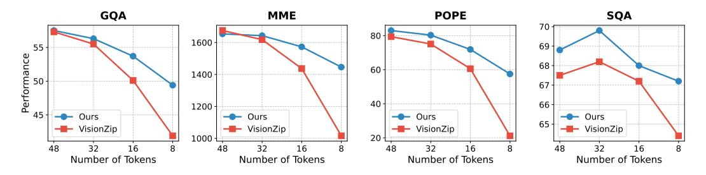
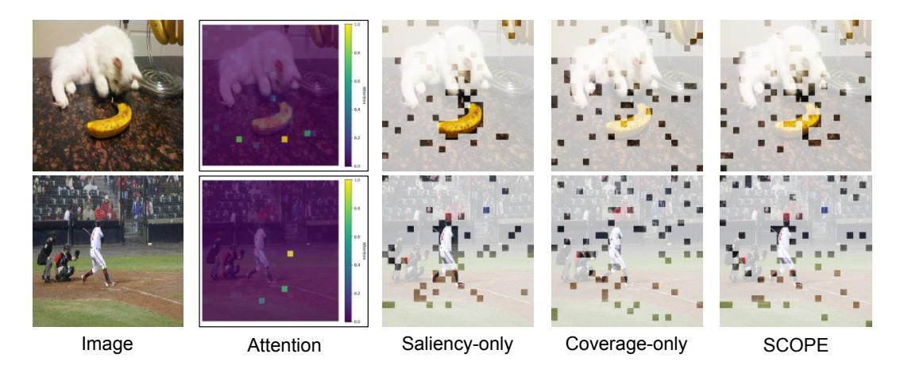

# 4 Experiment

#### 4.1 Experiments Setup

Evaluation Benchmarks and Baselines. Following prior work[\[49\]](#page-12-5), we evaluate the effectiveness of the proposed method using a set of widely adopted multimodal benchmarks. Specifically, these include GQA [\[13\]](#page-10-12), MMBench[\[27\]](#page-11-4), POPE [\[22\]](#page-11-13), ScienceQA[\[29\]](#page-11-14), TextVQA [\[36\]](#page-12-11), SEEDBench[\[18\]](#page-11-15), and MMVet [\[45\]](#page-12-12). We also compare against several state-of-the-art baselines, including FastV[\[7\]](#page-10-4), SparseVLM [\[49\]](#page-12-5), VisionZip[\[43\]](#page-12-6), and PDrop [\[41\]](#page-12-4). For the video benchmarks, we evaluate the MLLMs on the benchmarks TGIF [\[15\]](#page-10-13), MSVD [\[5\]](#page-10-14), MSRVTT [\[42\]](#page-12-13), and ActivityNet [\[46\]](#page-12-14). For further details on evaluation benchmarks and metrics, we refer the reader to the Appendix [B.](#page-13-0)

Implementation Details. We integrate the proposed method into LLaVA 1.5 [\[26\]](#page-11-12) and LLaVA-Next [\[25\]](#page-11-1) for image understanding and Video-LLaVA [\[23\]](#page-11-11) for video understanding. The pruning module is inserted after the vision encoder. The saliency score is derived from the attention weights of visual tokens with respect to the CLS token at the second-to-last layer (layer -2) of the vision encoder. The scaling factor α is set to 1.0 by default. Our implementation is based on the lmms-evals [\[48\]](#page-12-15) package. We conduct the experiments on 4 × A100 GPUs. The inference batch size is set to 1 for all the evaluation results.

Table 2: Performance comparison under different vision token configurations. The evaluated model is LLaVA-Next 7B. The vanilla number of vision tokens is 2,880. The first line of each method is the raw accuracy of benchmarks, and the second line is the proportion relative to the upper bound.

| Method                          | GQA   | MMB   | MME                         | SQA   | TextVQA | MMMU   | Avg.           |  |  |
|---------------------------------|-------|-------|-----------------------------|-------|---------|--------|----------------|--|--|
| Upper Bound, 2880 Tokens (100%) |       |       |                             |       |         |        |                |  |  |
| Vanilla (CVPR'24)               | 64.2  | 67.9  | 1842                        | 70.2  | 61.3    | 35.1   |                |  |  |
|                                 | 100%  | 100%  | 100%                        | 100%  | 100%    | 100%   | 100%           |  |  |
| Retain 640 Tokens (↓ 77.8%)     |       |       |                             |       |         |        |                |  |  |
| SparseVLM (ICML'25)             | 60.3  | 65.7  | 1772                        | 67.7  | 57.8    | 34.6   | 96.0%          |  |  |
|                                 | 93.9% | 96.8% | 96.2%                       | 96.4% | 94.3%   | 98.6%  |                |  |  |
| VisionZip (CVPR'25)             | 61.3  | 66.3  | 1787                        | 68.1  | 60.2    | 34.7   |                |  |  |
|                                 | 95.5% | 97.6% | 97.0%                       | 97.0% | 98.2%   | 98.9%  | 97.4%          |  |  |
|                                 | 61.9  | 66.2  | 1842                        | 67.8  | 60.1    | 36.9   |                |  |  |
| Ours                            | 96.4% | 97.5% | 100.0%                      | 96.6% | 98.0%   | 105.1% | 98.9% (↓ 1.1%) |  |  |
|                                 |       |       | Retain 320 Tokens (↓ 88.9%) |       |         |        |                |  |  |
| SparseVLM (ICML'25)             | 57.7  | 64.3  | 1694                        | 67.3  | 55.9    | 34.4   |                |  |  |
|                                 | 89.9% | 94.7% | 92.0%                       | 95.9% | 91.2%   | 98.0%  | 93.6%          |  |  |
|                                 | 59.3  | 63.1  | 1702                        | 67.3  | 58.9    | 35.3   |                |  |  |
| VisionZip (CVPR'25)             | 92.4% | 92.9% | 92.4%                       | 95.9% | 96.1%   | 100.6% | 95.0%          |  |  |
|                                 | 61.0  | 65.9  | 1789                        | 67.7  | 58.4    | 35.6   |                |  |  |
| Ours                            | 95.0% | 97.1% | 97.1%                       | 96.4% | 95.3%   | 101.4% | 97.1% (↓ 2.9%) |  |  |
|                                 |       |       | Retain 160 Tokens (↓ 94.4%) |       |         |        |                |  |  |
|                                 | 51.2  | 63.1  | 1542                        | 67.5  | 46.4    | 32.8   |                |  |  |
| SparseVLM (ICML'25)             | 79.8% | 92.9% | 83.7%                       | 96.2% | 75.7%   | 93.4%  | 86.9%          |  |  |
|                                 | 55.5  | 60.1  | 1630                        | 68.3  | 56.2    | 36.1   |                |  |  |
| VisionZip (CVPR'25)             | 86.4% | 88.5% | 88.5%                       | 97.3% | 91.7%   | 102.8% | 92.5%          |  |  |
|                                 | 60.0  | 64.3  | 1700                        | 67.4  | 56.8    | 35.6   |                |  |  |
| Ours                            | 93.5% | 94.7% | 92.3%                       | 96.0% | 92.7%   | 101.4% | 95.1% (↓ 4.9%) |  |  |

#### 4.2 Main Results

Results on LLaVA 1.5. LLaVA 1.5 is one of the most representative MLLMs. We therefore apply the proposed pruning method to LLaVA 1.5 and evaluate its performance on a variety of image understanding tasks, following prior works [\[41,](#page-12-4) [49,](#page-12-5) [43\]](#page-12-6). Due to the diverse evaluation metrics used across different benchmarks, which result in inconsistent numerical scales, we report performance as a percentage of the original model's accuracy. We show the results of LLaVA 1.5 7B in Table [1.](#page-6-0) In particular, we follow previous work [\[49,](#page-12-5) [43\]](#page-12-6) and evaluate the performance under three visual token pruning budgets (*i.e.*, 192, 128, and 64) to evaluate the effectiveness of the proposed method. The vanilla model (*i.e.*, LLaVA 1.5 7B with full visual tokens) serves as the upper bound (100%), representing the performance ceiling of any visual token pruning approach. Our method consistently outperforms existing approaches across all token configurations, particularly under aggressive compression settings. As shown in Tabl[e1,](#page-6-0) when retaining only 192 tokens (a 66.7% reduction from the baseline), our method achieves an average accuracy of 99.5% relative to the upper bound. This surpasses state-of-the-art baselines including FastV [\[7\]](#page-10-4) (+6.0%), SparseVLM[\[49\]](#page-12-5) (+3.0%), and VisionZip [\[43\]](#page-12-6) (+1.5%). Under extreme compression (*e.g.*, 64 tokens, 88.9% reduction), our method maintains 96.0% of the original performance, significantly outperforming baselines such as VisionZip [\[43\]](#page-12-6) (93.5%) and SparseVLM [\[49\]](#page-12-5) (85.1%).

Surprisingly, our method preserves or even surpasses the upper bound in performance on several benchmarks. For instance, we observe relative accuracies of 100.2% and 104.5% on POPE [\[22\]](#page-11-13) and MMVet [\[45\]](#page-12-12), respectively, when using 192 tokens. These results suggest that visual tokens in MLLMs contain redundancy, and our method not only reduces this redundancy but also improves performance by eliminating interference from redundant information. We further evaluate our method on the larger LLaVA 1.5 13B model to validate its generalization capability in Appendix [C.1.](#page-14-0)

Results on LLaVA-Next. Compared to LLaVA 1.5, LLaVA-Next is a more advanced MLLM that supports high-resolution image processing, thereby significantly improving vision-language understanding. LLaVA-Next partitions an input image into multiple regions based on its original size. Usually, the image is divided into 4 sub-images. Both the original and partitioned images are then encoded into visual tokens, resulting in a total of 2,880 tokens (576×5). While effective in capturing fine-grained visual details, this strategy substantially increases the number of visual

Figure 4: The performance comparison under extreme token number.

tokens and reduces inference efficiency. Therefore, our objective is to minimize the number of visual tokens while maintaining performance as much as possible. To evaluate the proposed method on LLaVA-Next, we follow previous works [49, 43] and adopt three visual token budget settings (*i.e.*, 640, 320, and 160). The results are presented in Table 2. As shown, our method consistently outperforms state-of-the-art approaches under all configurations. Specifically, when retaining only 640 tokens, our approach achieves an average accuracy of 98.9% relative to the upper bound. Under extreme compression (*e.g.*, 160 tokens, 94.4% reduction), our method maintains 95.1% performance, significantly surpassing baselines such as SparseVLM (86.9%) and VisionZip (92.5%). These results further validate the effectiveness of the proposed method across different MLLM architectures. We also evaluate our method on the LLaVA-Next 13B model in Appendix C.1.

Results on Video benchmarks. We further evaluate the effectiveness of the proposed method, and we implement our SCOPE based on Video-LLaVA following VisionZIP [43]. The results are reported in Table 3. As shown, our method achieves the best performance among all compared methods. Surprisingly, even with aggressive pruning, our method almost fully preserves the original performance. This demonstrates the strong effectiveness of our method on video-language tasks. These findings also

Table 3: Performance comparison on Video-LLaVA. The original Video-LLaVA's video token number is 2048, while our method only retains the 136 tokens.

| Method        | TGIF   | MSVD  | MSRVTT | ActivityNet | Avg    |
|---------------|--------|-------|--------|-------------|--------|
| Video-LLaVA   | 47.1   | 69.8  | 56.7   | 43.1        | 100.0% |
| FastV         | 23.1   | 38.0  | 19.3   | 30.6        | 52.1%  |
| rastv         | 49.0%  | 54.4% | 34.0%  | 71.0%       | 32.170 |
| SparseVLM     | 44.7   | 68.2  | 31.0   | 42.6        | 86.5%  |
| Sparse v Livi | 94.9%  | 97.7% | 54.7%  | 98.8%       | 80.5%  |
| Vision 7 in   | 42.4   | 63.5  | 52.1   | 43.0        | 93.2%  |
| VisionZip     | 90.0%  | 91.0% | 91.9%  | 99.8%       | 93.2%  |
| Our           | 47.1   | 69.2  | 55.9   | 44.9        | 100.5% |
| Ours          | 100.0% | 99.1% | 98.6%  | 104.2%      | 100.5% |

suggest that video benchmarks contain substantial redundancy, and token pruning has great potential for accelerating video LLMs without sacrificing performance.

#### 4.3 Analysis

Results under Extreme Token Reduction. Our method demonstrates superior performance stability as the number of visual tokens is progressively reduced. As shown in Fig. 4, even when the token count is reduced to as few as 8, our approach consistently outperforms VisionZip [43] by increasingly larger margins. This highlights the strong capability of our framework to retain critical visual information under extreme compression. In contrast, VisionZip exhibits a sharp performance drop in low-token regimes, further validating the effectiveness of our token selection strategy and underscoring the potential of our method for aggressive visual token pruning.

**Ablation Studies.** As shown in Table 4, our method, which jointly considers token saliency and coverage, consistently outperforms its ablated variants (saliency-only and coverage-only) across all benchmarks. Both ablated models still perform better than the

Table 4: Ablation studies of the proposed method.

|               | GQA  | MMB  | MME  | POPE | TextVQA |
|---------------|------|------|------|------|---------|
| Random        | 55.5 | 54.0 | 1556 | 75.2 | 48.4    |
| Saliency-only | 55.0 | 60.8 | 1665 | 76.8 | 55.4    |
| Coverage-only | 58.1 | 60.8 | 1687 | 82.1 | 56.3    |
| Ours          | 58.3 | 61.7 | 1698 | 83.9 | 56.6    |

random baseline, indicating the individual effectiveness of each component. For instance, the coverage-only variant achieves moderate performance. However, our full method further improves these results, demonstrating that combining saliency and coverage provides complementary benefits. Explicit modeling of both saliency and coverage leads to superior performance compared to using either criterion alone or selecting tokens randomly.

Figure 5: Visualization of token pruning among different pruning strategies.

Efficiency Analysis. Table [5](#page-9-0) compares the efficiency of our method with that of a baseline pruning approach (PDrop) on LLaVA-NeXT 7B. Despite reducing the number of visual tokens from 2,880 to 160, a compression ratio exceeding 18×, our method maintains strong performance on the POPE metric (81.3% vs. 86.4%), demonstrating

Table 5: Efficiency analysis of our method on LLaVA-NeXT 7B. The experiments are conducted on a system equipped with 4×A100. ∆ denotes the reduction ratio.

|         | Token Number | POPE | Latency (s) | ∆    |
|---------|--------------|------|-------------|------|
| Vanilla | 2880         | 86.4 | 601.9       | -    |
| PDrop   | 160          | 53.2 | 184.0       | 3.3× |
| Ours    | 160          | 81.3 | 188.8       | 3.2× |

that our token selection strategy effectively preserves semantic completeness. In contrast, PDrop [\[41\]](#page-12-4) exhibits a substantial performance drop (53.2%), likely due to its reliance on saliency-based pruning, which may overlook less attended yet semantically important regions. Although our method incurs slightly higher latency than PDrop, it still achieves a 3.2× speedup over the full-token baseline. This indicates that our saliency-coverage oriented pruning strategy is not only effective in preserving performance but also computationally efficient in practice.

Token Pruning Visualization. In Fig. [5,](#page-9-1) we provide a visualization of token pruning to illustrate the difference of selected tokens among different strategies. Saliency-only mainly concentrates on the most salient patch such as the cat and banana in 1st row, demonstrating object-level focus by pruning the background. Coverage-only selects the tokens that are spread across the image, preserving global context but potentially missing important object details. Our SCOPE maintains the high token density on salient patches (*e.g.*, cat and banana in 1st row), while a sparse set of tokens is strategically kept for the background. This captures critical object features without discarding essential scene context.

