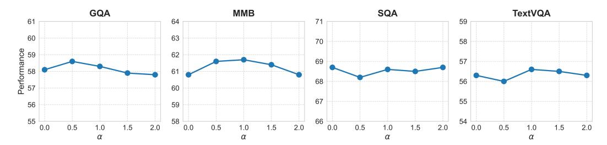
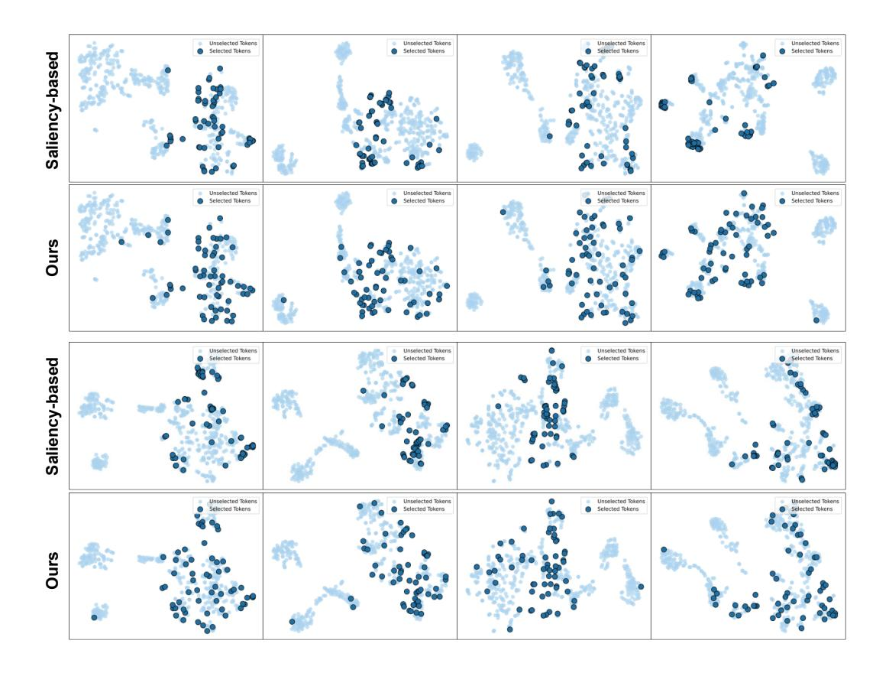

# C.2 Results on LLaVA-Next 13B

We present the results on LLaVA-Next 13B in Table [7.](#page-15-0) We can observe that our method consistently outperforms VisionZip [\[43\]](#page-12-6) under all token budgets. For example, with 640 tokens, our approach

Table 7: Performance comparison under different vision token configurations. The evaluated model is LLaVA-Next 13B. The vanilla number of vision tokens is 2, 880. The first line of each method is the raw accuracy on the benchmarks, and the second line is the proportion relative to the upper bound.

| Method                          | GQA  |                   | MMB MME | POPE                           | SQA   | TextVQA MMMU SEED-I |        |       | Avg.  |
|---------------------------------|------|-------------------|---------|--------------------------------|-------|---------------------|--------|-------|-------|
| Upper Bound, 2880 Tokens (100%) |      |                   |         |                                |       |                     |        |       |       |
|                                 | 65.4 | 70.0              | 1901    | 86.2                           | 73.5  | 64.3                | 36.2   | 71.9  |       |
| Vanilla 13B (CVPR'24)           | 100% | 100%              | 100%    | 100%                           | 100%  | 100%                | 100%   | 100%  | 100%  |
| Vanilla 7B (CVPR'24)            | 64.2 | 67.9              | 1842    | 86.4                           | 70.2  | 61.3                | 35.1   | 70.2  | 97.2% |
|                                 |      |                   |         | 98.2% 97.0% 96.9% 100.2% 95.5% |       | 95.3%               | 97.0%  | 97.6% |       |
|                                 |      |                   |         | Retain 640 Tokens (↓ 77.8%)    |       |                     |        |       |       |
| VisionZip (CVPR'25)             | 63.0 | 68.6              | 1871    | 85.7                           | 71.2  | 62.2                | 36.4   | 68.8  | 97.8% |
|                                 |      | 96.3% 98.0% 98.4% |         | 99.4%                          | 96.9% | 96.7%               | 100.6% | 95.7% |       |
| Ours                            | 63.6 | 69.3              | 1897    | 86.4                           | 72.5  | 62.4                | 36.6   | 69.9  |       |
|                                 |      |                   |         | 97.2% 99.0% 99.8% 100.2% 98.6% |       | 97.0%               | 101.1% | 97.2% | 98.8% |
|                                 |      |                   |         | Retain 320 Tokens (↓ 88.9%)    |       |                     |        |       |       |
| VisionZip (CVPR'25)             | 60.7 | 67.2              | 1805    | 82.0                           | 70.3  | 60.9                | 35.6   | 65.2  | 94.8% |
|                                 |      | 92.8% 96.0% 95.0% |         | 95.1%                          | 95.6% | 94.7%               | 98.3%  | 90.7% |       |
| Ours                            | 63.0 | 67.7              | 1830    | 85.1                           | 71.7  | 60.8                | 36.3   | 67.9  | 96.9% |
|                                 |      | 96.3% 96.7% 96.3% |         | 98.7%                          | 97.6% | 94.6%               | 100.3% | 94.4% |       |
| Retain 160 Tokens (↓ 94.4%)     |      |                   |         |                                |       |                     |        |       |       |
|                                 | 57.8 | 64.9              | 1739    | 76.6                           | 69.3  | 58.4                | 37.0   | 61.1  |       |
| VisionZip (CVPR'25)             |      | 88.4% 92.7% 91.5% |         | 88.9%                          | 94.3% | 90.8%               | 102.2% | 85.0% | 91.7% |
|                                 | 61.4 | 66.9              | 1777    | 82.8                           | 72.0  | 59.3                | 36.2   | 66.1  |       |
| Ours                            |      | 93.9% 95.6% 93.5% |         | 96.1%                          | 98.0% | 92.2%               | 100.0% | 91.9% | 95.1% |

achieves 98.8% of the upper bound's average performance, compared to VisionZip's 97.8%. As the token count decreases to 160, our method still retains 95.1% performance, while VisionZip drops to 91.7%. These results further confirm the superior robustness of our method under aggressive token pruning.

#### C.3 Results on Qwen2-VL

To further evaluate the generalization of the proposed SCOPE, we have also evaluated our method on the Qwen2-VL [\[39\]](#page-12-16) model. The results are summarized in Table [8.](#page-15-1) As shown, our method achieves 94.6% of the full-model performance when retaining only 25% of the tokens. Furthermore, our method significantly outperforms prior approaches such as DivPrune [\[2\]](#page-10-10), with a 3.7% improvement in average score under the 10.0% token ratio.

Table 8: Results on Qwen2-VL. The token ratio means the ratio of retained tokens.

| Method      | Token Ratio GQA MMB MME POPE |      |      |      |      | Avg.         |
|-------------|------------------------------|------|------|------|------|--------------|
| Qwen2-VL 7B | 100%                         | 61.9 | 77.4 | 2286 | 88.4 | 100%         |
| DivPrune    | 25%                          | 59.4 | 72   | 2043 | 85.9 | 93.90%       |
| Ours        | 25%                          | 59.8 | 72.5 | 2065 | 86.5 | 94.6%(+0.7%) |
| DivPrune    | 10%                          | 54.3 | 63.7 | 1874 | 80.8 | 85.90%       |
| Ours        | 10%                          | 56.6 | 66.8 | 1953 | 84.3 | 89.6%(+3.7%) |

#### C.4 Results on more OCR Benchmarks.

In the main paper, we have already evaluated our method on several OCR-related benchmarks, such as MME [\[12\]](#page-10-0) and MMVet [\[45\]](#page-12-12). To further demonstrate the effectiveness of SCOPE, we conducted additional experiments on more OCR-specific benchmarks including DocVQA [\[32\]](#page-11-16), ChartQA [\[31\]](#page-11-17) and OCRBench [28]. The results are shown in Table 9. As illustrated, our method consistently preserves performance and outperforms VisionZip across different token counts. This further supports the robustness of our approach for OCR tasks.

| Method    | #Token | DocVQA | ChartQA | OCRBench | Avg.          |
|-----------|--------|--------|---------|----------|---------------|
| Vanilla   | 576    | 28.0   | 18.2    | 31.3     | 100%          |
| VisionZip | 192    | 26.0   | 17.3    | 31.1     | 95.8%         |
| Ours      | 192    | 26.5   | 17.4    | 31.2     | 96.6% (+0.8%) |
| VisionZip | 128    | 25.1   | 17.1    | 30.0     | 93.1%         |
| Ours      | 128    | 25.9   | 17.3    | 30.7     | 95.2% (+2.1%) |
| VisionZip | 64     | 21.1   | 16.0    | 28.2     | 84.4%         |
| Ours      | 64     | 23.2   | 16.7    | 29.5     | 89.6%(+5.2%)  |

Table 9: **Results on more OCR Benchmarks.** The model is LLaVA 1.5 7B.

#### C.5 Hyper-parameter Analysis

The hyperparameter  $\alpha$  controls the scaling of the attention scores, thereby influencing token selection in our method. As illustrated in Fig. 6, the optimal performance is typically achieved when  $\alpha=1.0$ , suggesting that this setting effectively balances saliency and coverage across most benchmarks.

Figure 6: The hyperparameter  $\alpha$  analysis on LLaVA 1.5 7B with 64 visual tokens.

#### **D** Visualization Results

We present additional results on selected token visualization in Fig. 7. The saliency-based method selects tokens solely based on attention scores, which may overlook semantically important tokens that contribute to the overall completeness of the visual representation. In contrast, our saliency-coverage oriented approach jointly considers both visual saliency and semantic coverage. As a result, the selected tokens span a broader region in the embedding space.

In Fig. 8, we further visualize the attention distribution of selected tokens. Our method preserves the majority of high-attention tokens, demonstrating its ability to retain both informative and representative visual content.

### **E** Broader Impact

Our proposed method aims to improve both the efficiency and effectiveness of multimodal large language models (MLLMs) by reducing the number of visual tokens while preserving semantic completeness. This advancement has the potential to significantly reduce the computational cost and memory footprint of MLLMs, thereby enhancing their feasibility for deployment in resource-constrained environments such as edge devices, mobile platforms, and real-time applications. By enabling more efficient inference, our approach can facilitate the broader adoption of vision-language models across various domains, including education, healthcare, and assistive technologies.

However, as with any technology that enhances the scalability and accessibility of AI systems, there are potential societal risks. For example, more efficient MLLMs could be misused to generate or disseminate misinformation, enable invasive surveillance, or support other malicious activities,

Figure 7: The selected token comparison between the saliency-based method and our saliencycoverage oriented method. The total visual token number is 576, and the selected token number is 64.

particularly when deployed at scale. It is therefore essential to consider these ethical implications and implement appropriate safeguards when deploying such models in practice.

