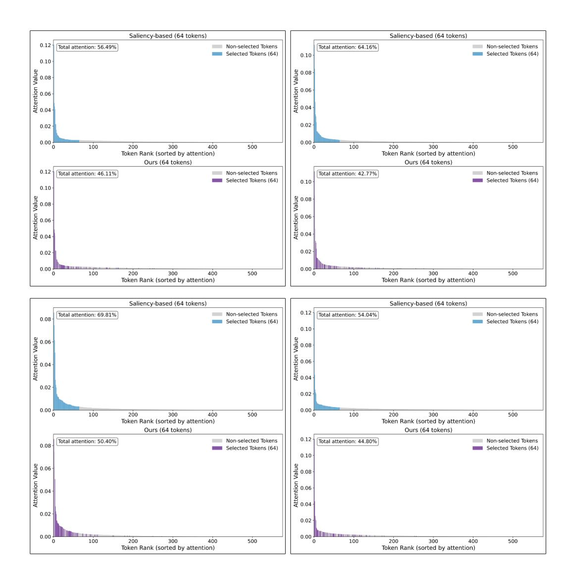

# F Limitations

While SCOPE demonstrates strong performance and efficiency gains across multiple benchmarks and model architectures, several limitations remain. (1) Despite our efforts to balance saliency and coverage, aggressive token pruning may still result in the loss of fine-grained or rare semantic information, potentially affecting tasks that require detailed visual understanding. (2) Our experiments are primarily based on widely used vision-language benchmarks and two representative MLLMs, LLaVA 1.5 and LLaVA-Next. Therefore, the generalizability of SCOPE to other tasks or model architectures has yet to be fully validated.

Figure 8: Attention distribution visualization for selected token. The total visual token number is 576, and the selected token number is 64. Our method retained most of the high attention tokens and some low attention tokens to maximize the coverage.

