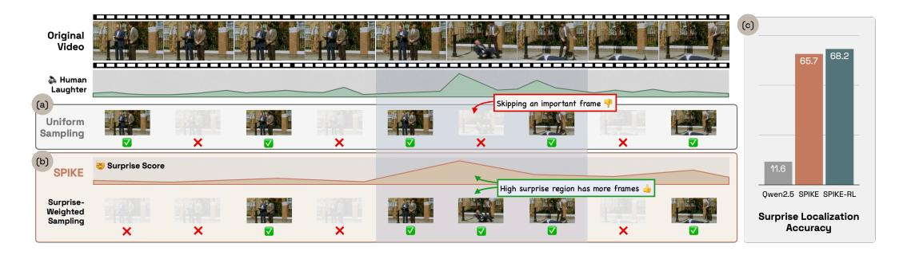

# 1 INTRODUCTION

Humans navigate the world not as passive observers, but as active predictors of the future who infer the hidden causes behind events and update their predictions [\(Millidge et al., 2022\)](#page-11-0). This process, formalized within the Bayesian Theory of Mind (ToM) framework [\(Baker et al., 2017\)](#page-9-0), suggests that our brain continuously builds and updates an internal model of the world, using discrepancies between expectation and reality, or *surprise*, as the primary signal for learning and attention. This allows us to efficiently process a constant stream of sensory data, focusing our cognitive resources on moments that are novel and informative, and ignoring redundant, expected information. For instance, in the Mr. Bean video shown in Figure [1,](#page-1-0) our cognitive focus is on the moment the man unexpectedly falls, because it deviates from the established routine.

However, current Video-LLMs are fundamentally disconnected from this sequential, belief-driven process. Most models treat videos as a 'bag of frames', where a subset is uniformly sampled from the video [\(OpenAI, 2024;](#page-11-1) [Bai et al., 2023;](#page-9-1) [2025;](#page-9-2) [Cheng et al., 2024;](#page-9-3) [Liu et al., 2023\)](#page-10-0). Lacking an evolving belief about the video's story, uniform sampling is much more likely to sample highly frequent mundane moments over rare surprising (and therefore memorable) events. This can potentially overwhelm Video-LLMs with redundant information, over pivotal moments a human observer would focus on, such as the fall in Figure [1.](#page-1-0)

To overcome this, some methods select or retrieve frames retroactively for a given textual query [\(Yu](#page-12-0) [et al., 2025;](#page-12-0) [Wang et al., 2025;](#page-11-2) [2024;](#page-11-3) [Liang et al., 2024;](#page-10-1) [Tang et al., 2025\)](#page-11-4). However, in dynamic, open-world settings, we often don't know in advance what questions will be asked. What we need instead is a model that reasons *proactively*, anticipating what is surprising, and paying attention to these shifts, similar to a human observer. In this work, we study two fundamental questions to bridge this gap: (1) How can Video-LLMs proactively track and update their beliefs as new visual evidence presents itself? and (2) Can detecting semantically surprising events proactively and ahead of downstream queries improve video understanding?

Figure 1: (a) Uniform sampling misses key moments. (b) Our surprise-based sampling focuses on high-surprise regions, strongly aligning with human laughter. (c) Our method achieves significantly better surprise localization than a zero-shot Qwen2.5-VL baseline.

To answer these, we introduce SPIKE, an inference-time framework that represents a model's beliefs as explicit probability distributions over human-interpretable textual hypotheses, and quantifies Bayesian Surprise as the divergence between prior and posterior beliefs [\(Itti & Baldi, 2005\)](#page-10-2), giving us a surprise score. As shown in Figure [1\(](#page-1-0)b), this surprise score pinpoints moments that contradict the model's prior beliefs. We further improve the surprise scoring by introducing SPIKE-RL, trained using a reinforcement learning objective that teaches the model to prioritize beliefs that lead to more accurate video captions. SPIKE achieves 65.7% on FunQA [\(Xie et al., 2025\)](#page-12-1), a surprise localization benchmark, and SPIKE-RL improves on it further, with 68.2%, significantly outperforming the zero-shot performance of Qwen2.5-VL (Figure [1\(](#page-1-0)c)). Our experiments show that SPIKE-RL delivers two complementary benefits: it improves the diversity of generated belief hypotheses, and boosts surprise localization accuracy beyond what the inference-time scorer alone can achieve. Finally, we leverage this signal by replacing the standard uniform frame sampling with surprise-weighted sampling in Qwen2.5-VL and demonstrate that this leads to consistent improvements on five downstream video understanding tasks.

Our approaches allow Video-LLMs to focus on the most salient parts of the video, akin to human notions of surprise. In the future, surprise-aware Video-LLMs can be used to improve the robustness real-time applications such as streaming, surveillance, robotics, and interactive agents that need to adapt to new information on-the-fly.

