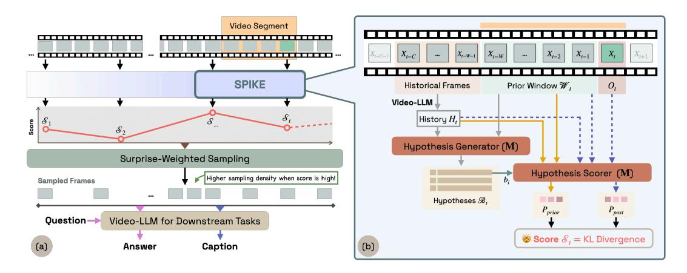

# 2 BAYESIAN BELIEF TRACKING

### 2.1 SURPRISE SCORING

The architecture of SPIKE is shown in Figure [2.](#page-2-0) SPIKE quantifies Bayesian surprise by tracking how the model's belief distribution over human-interpretable textual hypotheses shifts when a new frame is observed. Each incoming frame updates this belief distribution, and the magnitude of the change defines the surprise score. SPIKE produces surprise scores for each step, across the complete video. For simplicity, we describe this process using fixed-length videos. However, our method can be adapted to a streaming video setup by applying the same update online.

Setup. A video is composed of a sequence of frames X1:T , where T is the length of the video. To compute surprise at a timestep t, we use three key inputs as shown in Figure [2\(](#page-2-0)b): (i) the *prior window* of W frames immediately preceding the current t, Wt = Xt−W:t−1, (ii) a *historical summary*, Ht, a textual summary of what happened so far in the video, derived from the C frames, Xt−C:t−W−1, that occurred before Wt, [1](#page-1-1) and (iii) the newly observed frame Ot = Xt. This setup allows the model to form beliefs based on both long-term context and recent events, and then measure surprise with respect to the new information.[2](#page-1-2)

Hypothesis Generation. First, at timestep t, we generate a set of belief hypotheses, Bt = {bt,1, . . . , bt,N }, where each hypothesis b is a textual description of what might happen next, gen-

See Appendix [B](#page-14-0) for further information on how the textual summary is obtained.

See Appendix [A.1](#page-13-0) for the prompts for the hypothesis generation and scoring.

Figure 2: (a) Overall architecture: SPIKE computes surprise scores, which guide weighted frame sampling for downstream tasks. (b) SPIKE: Given history  $H_t$ , prior window W, and observed frame  $O_t$ , the hypothesis generator produces belief set  $B_t$ . The hypothesis scorer computes  $P_{prior}$  and  $P_{post}$ , yielding surprise score  $S_t$  as KL divergence.

erated by a model M by conditioning on the historical summary  $H_t$  and the prior frame window  $W_t$  (Fig. 2). We use a Video-LLM as our model M and generate diverse beliefs  $\mathcal{B}_t$  using nucleus sampling (Holtzman et al., 2020).

**Bayesian Surprise.** Next, we establish **prior** and **posterior** belief distributions over the generated beliefs  $\mathcal{B}_t$ . We define a score for each hypothesis  $b_{t,i}$  based on its plausibility, which is inversely proportional to its negative log-likelihood (NLL) as computed by the Video-LLM M. This score reflects how well the hypothesis aligns with the given context.

The prior distribution  $P_{\text{prior}}$  is calculated based on the historical context  $(H_t)$  and the recent prior window  $(W_t)$ , before the new frame  $O_t$  is observed:

$$P_{\text{prior}}(b_{t,i} \mid H_t, \mathcal{W}_t) = \frac{\exp\left(-\frac{1}{\tau} \cdot \text{NLL}(b_{t,i} \mid H_t, \mathcal{W}_t)\right)}{\sum_{j=1}^{N} \exp\left(-\frac{1}{\tau} \cdot \text{NLL}(b_{t,j} \mid H_t, \mathcal{W}_t)\right)},$$
(1)

where  $\mathrm{NLL}(b_i \mid \cdot) = -\log P_{\mathbf{M}}(b_i \mid \cdot)$  is the negative log-likelihood of the hypothesis tokens given the context, and  $\tau$  is a temperature parameter. We apply softmax to normalize the scores into a probability distribution.

After observing the new frame  $O_t$ , we update our beliefs to form the posterior belief distribution,  $P_{\text{post}}$ , by incorporating this new visual evidence into the model's context:

$$P_{\text{post}}(b_{t,i} \mid H_t, \mathcal{W}_t, O_t) = \frac{\exp\left(-\frac{1}{\tau} \cdot \text{NLL}(b_{t,i} \mid H_t, \mathcal{W}_t, O_t)\right)}{\sum_{j=1}^{N} \exp\left(-\frac{1}{\tau} \cdot \text{NLL}(b_{t,j} \mid H_t, \mathcal{W}_t, O_t)\right)}.$$
 (2)

Following the Bayesian formalization of surprise by Itti & Baldi (2005), we quantify our surprise score to be the information gain induced by  $O_t$ , as the Kullback–Leibler (KL) divergence between posterior and prior beliefs over hypotheses:

$$S_t = D_{\text{KL}} \left( P_{\text{post}}(\cdot \mid H_t, \mathcal{W}_t, O_t) \mid \mid P_{\text{prior}}(\cdot \mid H_t, \mathcal{W}_t) \right)$$
(3)

$$= \sum_{i=1}^{N} P_{\text{post}}(b_{t,i}) \log \frac{P_{\text{post}}(b_{t,i})}{P_{\text{prior}}(b_{t,i})}. \tag{4}$$

Using Equation 3, at each timestep t we compute a scalar surprise score  $\mathcal{S}_t$ , as well as a belief set at t containing hypotheses and their prior and posterior probabilities,  $\mathcal{B}_t = \{(b_{t,i}, P_{\text{prior}}(b_{t,i}), P_{\text{post}}(b_{t,i}))_{i=1}^N\}_t$ .  $\mathcal{B}_t$  is human-readable and interpretable, enabling insight into why a video segment is surprising.

Figure 3: SPIKE-RL explores multiple hypothesis trajectories, whose surprise scores guide frame sampling. Captions from these rollouts are scored with LLM-Match, and GRPO propagates the reward to improve hypothesis generation.

#### 2.2 SURPRISE-WEIGHTED FRAME SAMPLING

Since it is computationally infeasible and impractical to process all frames of a video, Video-LLMs sample frames – by default, uniformly. Only the selected frames are then processed by the model while the rest are discarded. We define frame budget, F, as the maximum number of frames that a Video-LLM uses. Our goal is to effectively select those F frames among the video frames  $X_{1:T}$  by recognizing surprising regions of the video, which may be especially important for downstream tasks such as captioning and question answering.

Computing a Surprise-Guided Probability Distribution. As shown in Fig 2(a), for a given video  $X_{1:T}$ , we first uniformly sample timesteps  $t_1,\ldots,t_K$ , for  $K\leq F$ . Each timestep represents the end of a video segment, on which we measure surprise; this is akin to a sliding window over the frames of the video. We use SPIKE to compute surprise scores for each segment, and obtain scores  $S_1,\ldots,S_K\in[0,1]$  for the corresponding timesteps  $t_1,\ldots,t_K$ . We can now modify the frame sampling to be proportional to the surprise scores. Specifically, we compute the probability of sampling from a segment ending at  $t_i$  as the softmax over scores,  $p_i = \text{softmax}\left(\frac{s_i}{\tau_s}\right) = \frac{\exp(s_i/\tau_s)}{\sum_{j=1}^K \exp(s_j/\tau_s)}$   $(\tau>0)$ , and use  $p_i=1/K$  if all  $s_i$  are equal.  $\tau_s$  is the temperature of this softmax function.

**Sampling.** Given the frame budget F for the Video-LLM, we sample F frames by repeatedly choosing a segment i with probability  $p_i$  (with replacement) and drawing a uniform timestamp within that segment; each timestamp is mapped to a frame index via the video frame rate. Choices are independent, so high-surprise segments can contribute multiple frames. We use  $\tau_s$  in Eq. 2.2 to control sampling: a small  $\tau_s$  concentrates the budget on surprising regions, whereas a larger  $\tau_s$  spreads the frame budget more uniformly. We set  $\tau_s = 0.7$  for our experiments.3

#### 3 REINFORCEMENT LEARNING FOR BELIEF OPTIMIZATION

**Motivation.** The effectiveness of SPIKE relies on the model's ability to generate belief hypotheses that are accurate, diverse, and representative of the video segment shown. However, since VLMs, are not tailored to perform belief tracking on frame windows, the model has no incentive to refine its intermediate hypotheses. However, training SPIKE with direct supervision on this reasoning process is intractable, as it is impractical to collect ground truth hypotheses across every segment of a video, for a large set of videos. Instead, we leverage GRPO (Shao et al., 2024) to optimize SPIKE using reinforcement learning. SPIKE-RL is based on the insight that a strong final caption – i.e. of what happened in the complete video – is built upon accurate intermediate belief hypotheses – i.e. about what is likely to happen after having watched a portion of the video.

Figure 3 demonstrates our approach. To train the hypothesis generator, our policy model, we compute a reward signal based on the quality of the final caption. This reward signal is then propagated backward, assigning credit to the sequence of beliefs that led to the successful outcome. In this way, supervision on the final result is implicitly transformed into training feedback for the model's internal reasoning process. Our rewards are derived from an LLM-based metric that computes the similarity between the generated caption and the ground truth caption.

&lt;sup>3App. F provides the time complexity of the sampling approach.

**Rollout.** We design the GRPO-based training procedure by generating a group of captions, based on different trajectories of beliefs and frame allocations. For each video, we draw M trajectories  $\{\tau^{(r)}\}_{r=1}^M$ . Each trajectory  $\tau^{(r)}$  runs SPIKE over segments of the video. At every timestep t, it samples N textual beliefs  $\mathcal{B}_t^{(r)} = \{b_{t,1}^{(r)}, \ldots, b_{t,N}^{(r)}\}$  and scores prior and posterior beliefs to obtain  $(P_{\text{prior},t}^{(r)}, P_{\text{post},t}^{(r)})$  and the surprise scores  $\mathcal{S}_t^{(r)}$ . We then use the surprise scores to inform the sampling of frames that are inputted into a Video-LLM to generate a single final video caption,  $c^{(r)}$  using our surprise-based frame allocation (§2.2). Thus each input induces a GRPO group:  $\mathcal{G} = \left\{ (\{\mathcal{B}_t^{(r)}, \mathcal{S}_t^{(r)}\}_t^T, c^{(r)}) \right\}_{r=1}^M$ 

**Reward.** At the end of a rollout, the caption  $c^{(r)}$  is scored using LLM-Match, where an LLM judge measures how similar it is to the ground truth caption, to obtain a scalar reward  $R^{(r)}$ . The prompt for the LLM judge is in Appendix A.2. We Z-score the LLM rewards within the group, and use the normalized scores as advantages in the policy objective,  $A^{(r)} = \frac{R^{(r)} - \mu_R}{\sigma_R}$ .

**Loss.** We treat the full set of hypotheses in a trajectory as a sequence-level action. Let  $p_{\theta}(b_{t,k} \mid H_t, \mathcal{W}_t)$  denote the policy for generating a hypothesis given the video context. We define our **belief-optimization** objective as,

$$\mathcal{L}_{\text{belief-optimization}}(\theta) = -\frac{1}{M} \sum_{r=1}^{M} A^{(r)} \left( \sum_{t} \sum_{k=1}^{K} \log p_{\theta}(b_{t,k}^{(r)} \mid H_{t}^{(r)}, \mathcal{W}_{t}^{(r)}) \right), \tag{5}$$

which increases the likelihood of hypotheses along high-advantage trajectories and suppresses those along low-advantage ones. Optimizing Equation 5 trains the model to generate hypotheses that reliably support strong captions, improving both the intermediate belief trajectory and the final output.

**Training.** For training SPIKE-RL, we curated a video captioning dataset of 2,000 videos with 30% *surprising* and 70% *unsurprising* videos. The goal is to expose the policy both to routine events where beliefs remain stable and to inflection points that induce belief shifts. For the unsurprising portion, we used ActivityNet Captions (Caba Heilbron et al., 2015), which predominantly includes videos depicting everyday activities. For the surprising videos, we sample from from the training set of Oops! (Epstein et al., 2020), a collection of short clips centered on unintentional human failures. We use <code>Qwen2.5-VL-7B-Instruct</code> as the Video-LLM model (M) and <code>Olmo-7B-hf</code> as the LLM-Match reward model. See App. C for the training hyperparameters.

#### 4 Surprise Localization

We first evaluate how well SPIKE and SPIKE-RL can identify surprising segments of a video. Hyperparameters for surprise scoring are described in App. C.

#### 4.1 EXPERIMENTAL SETUP

**Benchmarks.** We evaluate surprise localization on three benchmarks: Oops! (Epstein et al., 2020), FunQA (Xie et al., 2025) and Mr. Bean (App. E). Oops! is a surprise detection task, whose test set contains 4,791 videos with precise timestamps marking the exact transition point to surprise. FunQA has 424 videos with annotations for the most surprising segment in each video, given by a start and end time. While these are established benchmarks, they only annotate a single surprising event per video. Since our method is capable of detecting multiple surprising segments in the video, we curate our own benchmark, Mr. Bean, using 48 clips from the live-action TV show. Mr. Bean's audio laughter track serves as silver-standard surprise annotations – segments of the video with laughter are considered surprising.

**Metrics.** Following the protocols of Oops! and FunQA, we report Acc@0.25s and Acc@1.0s for Oops!, and IoU for FunQA. The accuracy metrics (Acc) measure whether the predicted surprise peak falls within 0.25 or 1.0 seconds of the ground truth peak surprise, while IoU measures the overlap between the predicted surprising windows and the ground-truth surprising windows. For details on the implementation of the metrics, see App. D.

**Baselines.** We establish a lower bound with a Random baseline that selects surprising frames at random. We also report the zero-shot performance of our base <code>Qwen2.5-VL-7B-Instruct</code>

Table 1: Performance of SPIKE and SPIKE-RL on surprise localization.

|               | Oops!     |        | FunQA | Mr. Bean  |             |      |
|---------------|-----------|--------|-------|-----------|-------------|------|
| Method        | Acc@0.25s | Acc@1s | IoU   | Acc@0.25s | Acc@1s      | IoU  |
| Baselines     |           |        |       |           |             |      |
| Random        | 6.8       | 2.6    | 7.5   | 0.6       | 3.5         | 0.9  |
| Motion        | 23.1      | 50.7   | _     | _         | _           | _    |
| Video Speed   | 36.6      | 65.3   | _     | _         | _           | _    |
| F2C2V         | 39.5      | 69.5   | _     | _         | _           | _    |
| TimeChat      | _         | _      | 9.6   | _         | _           | _    |
| UniVTG        | _         | _      | 45.3  | _         | _           | _    |
| LLaVA-NeXT-CR | _         | _      | 62.3  | _         | _           | _    |
| Qwen2.5-VL    | 6.6       | 9.6    | 11.6  | 11.2      | 23.2        | 13.8 |
| SPIKE         | 60.0      | 67.3   | 65.7  | 53.2      | 70.2        | 54.8 |
| SPIKE-RL      | 62.9      | 69.1   | 68.2  | 57.4      | <b>78.7</b> | 61.1 |
| Human         | 62.1      | 88.0   | _     | _         | _           | _    |

model, which directly scores each uniformly sampled frame on whether it is surprising or not, without our proposed belief tracking mechanism (See Appendix A.3 for the prompt and setup). On Oops!, we compare against: (i) VideoSpeed (Epstein et al., 2020), the strongest reported baseline for this dataset; (ii) Motion Magnitude (Epstein et al., 2020), an optical-flow-based approach; and (iii) F2C2V (Duka et al., 2022), a self-supervised method. As an upper-bound reference, we also report the human consistency or agreement from the original dataset. On FunQA, we compare against TimeChat (Ren et al., 2023), UniVTG (Lin et al., 2023), a specialized video temporal grounding framework, and LLaVA-Next-CR, a baseline provided by the FunQA benchmark that applies the clipping and rating (CR) technique from UniVTG to LLaVA-NeXT (Liu et al., 2024).

#### 4.2 RESULTS

Table 1 shows the performance of SPIKE and SPIKE-RL on the surprise localization task. On the Oops! benchmark, our SPIKE-RL model achieves an score of 62.9% on Acc@0.25s, remarkably close to the human performance (62.1%). Notably, both SPIKE and SPIKE-RL show about a tenfold improvement over the performance of the zero-shot version of the same model (Qwen2.5-VL-7B). Compared to VideoSpeed, F2C2V, we observe that SPIKE and SPIKE-RL are better at accurate localization, with a 23.4% higher Acc@0.25s, and achieve similar Acc@1s scores. On the FunQA benchmark, SPIKE-RL once again demonstrates superior performance with an IoU of 68.2, surpassing both prior approaches and the zero-shot model by a substantial margin. It is worth noting that this significant boost is despite the fact that FunQA – which is composed of positive surprises related to humor and creativity – is out-of-distribution for SPIKE-RL.

Mr. Bean shows a similar trend to the other benchmarks, but the absolute Acc@0.25s is lower. This dataset is particularly challenging. In contrast to the other benchmarks, some of the surprising moments in Mr. Bean arise from subtle, fine-grained nuances in his facial expressions rather than easily noticeable unexpected events. Finally, we observe a significant 6.3% gain in IoU score with SPIKE-RL over SPIKE. Since IoU on Mr. Bean evaluates detection across multiple surprising segments, this gain highlights the ability of our scorer to capture nuanced surprises within a video.

Overall, the inference-time method, SPIKE, achieves superior performance across all benchmarks and generalizes to different types of surprises, while SPIKE-RL further boosts performance through reinforcement-guided refinement.

#### 4.3 Belief Set Evaluation

We evaluate the hypotheses generated by SPIKE and SPIKE-RL using a combination of automatic metrics and human evaluation.

**Diversity.** We are interested in whether models generate multiple conceptually-diverse hypotheses or different lexical variations of the same hypothesis. For a given video, we measure the diversity of a hypothesis set with the average inverse cosine similarity  $(1 - cos(b_i, b_j))$  across all hypothesis

Table 2: Performance of Qwen2.5-VL with uniform vs. surprise-weighted and other query-free frame sampling methods. MCQ tasks are evaluated with accuracy; generative tasks with LLM-Match. Comparable open-source Video-LLMs are shown for context.

| Model       | Size | Sampling      |      |      | BlackSwan FunQA ExFunTube | VideoMME-S NextQA |      |
|-------------|------|---------------|------|------|---------------------------|-------------------|------|
| VideoChat2  | 7B   | Uniform       | 49.7 | 17.9 | –                         | 45.6              | –    |
| VideoLlama2 | 7B   | Uniform       | 52.9 | 7.7  | –                         | 56.0              | –    |
| FunMentor   | 7B   | Uniform       | –    | 33.2 | –                         | –                 | –    |
| LLaVA-Video | 7B   | Uniform       | 70.4 | –    | –                         | 46.6              | 62.7 |
| Qwen2.5-VL  | 7B   | Uniform       | 67.2 | 66.8 | 68.7                      | 59.8              | 68.6 |
| Qwen2.5-VL  | 7B   | RGB Histogram | 49.6 | –    | –                         | 55.4              | –    |
| Qwen2.5-VL  | 7B   | ECR           | 49.7 | –    | –                         | 58.2              | –    |
| Qwen2.5-VL  | 7B   | Katna         | 54.6 | –    | –                         | 57.4              | –    |
| Qwen2.5-VL  | 7B   | Optical Flow  | 58.6 | –    | –                         | 58.1              | –    |
| Qwen2.5-VL  | 7B   | SPIKE         | 68.8 | 70.3 | 73.2                      | 60.8              | 69.8 |
| Qwen2.5-VL  | 7B   | SPIKE-RL      | 69.5 | 71.4 | 75.7                      | 62.5              | 70.3 |
| Qwen2.5-VL  | 32B  | Uniform       | 69.4 | 72.7 | 71.9                      | 69.9              | 72.3 |
| Qwen2.5-VL  | 32B  | SPIKE-RL      | 71.7 | 75.8 | 75.8                      | 73.5              | 74.1 |

pairs. SPIKE-RL achieves 40.3%, higher than SPIKE's 33.5%, showing that the RL training improves diversity.

Correlation with human judgments. We measure how well our surprise score aligns with human judgments by showing human annotators a random sample of 100 videos from Oops! along with the generated hypotheses and asking them to rank the hypotheses by dragging them onto a 0–100 scale. Each video segment is evaluated twice: first using only the prior frames (O<t), and then again after revealing the observed frame (Ot). This setup emulates the prior and posterior probabilities in Eq. [3,](#page-2-1) from which we compute human-derived surprise scores. Comparing these to SPIKE and SPIKE-RL's surprise scores yields a Spearman correlation of 0.84 and 0.87 respectively, indicating very strong correlation and confirming that our method effectively captures belief shifts. The template for human evaluation is provided in App. [H.](#page-16-0)

