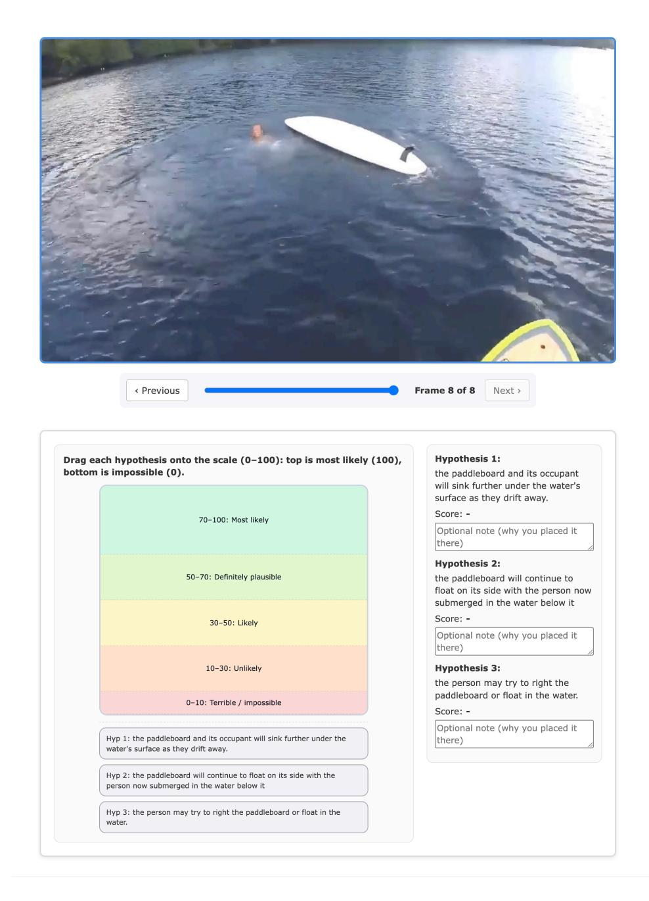

# D SURPRISE LOCALIZATION METRICS

Accuracy@δ. Let tˆ be the predicted time (in seconds) obtained by converting the frame with the highest surprise score to time, and let t ⋆ be the ground-truth transition time. We use the transition time provided in Oops! directly. For FunQA and Mr.Bean, center of the most surprising window is used as transition time. The instance-level score is

$$\text{Accuracy} @ \delta \ = \ \mathbb{1} \left[ \ |\hat{t} - t^{\star}| \leq \delta \ \right],$$

and the reported metric is the mean of this indicator over the evaluation videos. Typical choices include δ∈ {0.25, 1.0} seconds.

IoU. Let Wpred = {[a, b] : s(t) > τ for t ∈ [a, b]} be the predicted surprising windows and Wgt be the given set of ground truth surprising windows. The Temporal IoU is:

$$\text{Temporal IoU} = \frac{\text{intersection coverage}}{\text{union coverage}} = \frac{|\bigcup \mathcal{W}_{pred} \cap \bigcup \mathcal{W}_{gt}|}{|\bigcup \mathcal{W}_{pred} \cup \bigcup \mathcal{W}_{gt}|}$$

where  $|\cdot|$  denotes temporal coverage (total duration). We define predicted surprising windows as a set of maximal contiguous intervals where the surprise score exceeds a threshold  $\tau=0.8\times\max_t s(t)$  for that video.

#### E Mr. Bean

We collect 48 videos from Mr. Bean compilation videos on YouTube. Specifically, we follow this process:

- 1. Each clip is divided into its scenes using a scene detector model, PySceneDetect, using its ContentDetector5, with a threshold of 30.
- 2. Scenes shorter than 12 seconds and longer than 60 seconds are filtered out, to reduce incorrect scene cuts or have videos that are too short for our analysis.
- 3. We extract the audio from these scenes, and use a laughter segmentation model from Omine et al. (2024) to identify where laughter is present. We filter scenes to obtain only those that have 1 to 3 laughter segments.
- 4. Because we rely on laughter tracks as our silver-standard surprise annotation, we transcribe the audio in these clips. We use OpenAI's Whisper (Radford et al., 2023), with the *turbo* model. If a clip has too many words in its transcription (> 8), it is discarded. Through empirical observation, we found that laughter occurs in small peaks. We ensure that at least one such loud peak (> -28dB) of at least 1 second occurs.
- 5. As a final step, we manually filter through the video set to discard scenes which contain additional noises (e.g. bells) or scenes that are not semantically meaningful (e.g. the opening credits) that may have passed the other filters. This leaves us with 48 video clips.

The full list of clips, a link to their original source, along with video scenes which we use, will be provided with the code and data release.

#### F COMPLEXITY ANALYSIS

Let a video contain T frames. We uniformly sample a fixed budget of F frames, so the video is divided into W=T/F segments and one frame is drawn from each segment. For each sampled frame we generate N text hypotheses and compute their prior and posterior likelihoods.

**Time Complexity.** The method requires F hypothesis-generation steps and two batched likelihood evaluations per step. The total cost is therefore

$$O(F \cdot N)$$
,

which is linear in the chosen frame budget F (and therefore at most linear in T if F grows with T).

**Relation to Inference-Time Scaling.** Our overhead is comparable to recent inference-time scaling methods for Video-LLMs: a controllable number of extra forward passes improves where the model allocates its fixed frame budget, without changing its architecture.

**Interpretability.** Because SPIKE represents beliefs as *textual hypotheses*, its Bayesian surprise scores are interpretable: one can inspect the generated hypotheses to understand what the model "expected" versus what the new frames revealed.

#### G JSD

For bounded and symmetric reporting, we convert KL to the Jensen-Shannon divergence (JSD), where,

$$S_t = JSD(P_{post}, P_{prior}) = \frac{1}{2}D_{KL}(P_{post}||M) + \frac{1}{2}D_{KL}(P_{prior}||M),$$
(6)

where  $M = \frac{1}{2}(P_{post} + P_{prior})$ , which maps naturally to [0, 1] after  $\log_2$  normalization.

&lt;sup>5https://www.scenedetect.com/docs/0.6.1/api/detectors.html

Figure A1: We ask human evaluators to score the hypotheses by dragging and dropping them into likelihood bands between 0 – 100. This is repeated twice – by scoring the hypothesis with and without the observed new frame.

