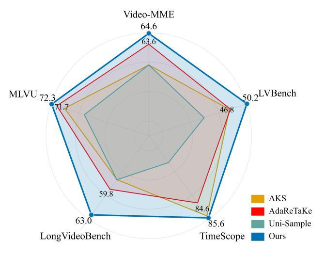

# 1. Introduction

Recent years have witnessed the remarkable progress made by *Multimodal Large Language Models* (MLLMs) [\[28,](#page-9-0) [43,](#page-9-1) [55,](#page-10-0) [67–](#page-11-0)[69\]](#page-11-1) towards effective vision-language understanding. Despite the great success, long video understand-

Performance Comparison of Different Methods on the RTX 3090 GPU Figure 1. Comparison between FlexMem (ours) and existing efficient video understanding methods for MLLMs on five benchmarks. All methods are run on the same device of one 3090 GPU, and our FlexMem presents obvious performance gains.

ing is still a main obstacle for existing MLLMs mainly due to the difficulty of processing excessive long video frames [\[14,](#page-8-0) [34\]](#page-9-2). In addition to high computation complexity, the large number of visual tokens from long videos can easily exceed the upper limit of the sequence length of existing MLLMs [\[13,](#page-8-1) [36,](#page-9-3) [52\]](#page-10-1), *e.g.*, more than 200k for 1024 video frames [\[18\]](#page-8-2), resulting in both performance degradation and expensive memory overhead [\[7,](#page-8-3) [18\]](#page-8-2).

To tackle this issue, recent efforts [\[11,](#page-8-4) [14,](#page-8-0) [42,](#page-9-4) [53\]](#page-10-2) are devoted to efficient long video understanding for MLLMs. One popular solution is to adopt *retrieval augmentation generation* (RAG) based strategies to select key video information for MLLMs [\[29,](#page-9-5) [42\]](#page-9-4), drawing on the successful experience of LLMs [\[2,](#page-8-5) [38\]](#page-9-6). Concretely, RAG methods regard the whole video as a knowledge base, and then find out the question-related key frames (or clips) as the input of MLLMs, thereby avoiding the processing of all frames. Although effective in video tasks like *needle-in-*

†Corresponding author: zhouyiyi@xmu.edu.cn.

*a-haystack* [\[65\]](#page-11-2), which requires evident localization from thousands of video frames, RAG methods are still inferior in mastering continual and overall understanding of videos [\[22,](#page-9-7) [35\]](#page-9-8). In this case, they are still sensitive to memory overhead for more keyframe inputs [\[4,](#page-8-6) [17\]](#page-8-7). The other viable solution is to use visual feature compression for the longer input of video frames [\[9,](#page-8-8) [50,](#page-10-3) [61\]](#page-10-4). For instance, Wang *et al.* [\[50\]](#page-10-3) apply visual *Key-Value* (KV) caches compression to reduce the per-clip footprint, thereby increasing the number of input frames. However, visual compression methods [\[39,](#page-9-9) [49,](#page-10-5) [50\]](#page-10-3) still require MLLMs to input all compressed visual features for the final answering, still yielding obvious computation bottlenecks. Overall, existing methods are still hard to strike a trade-off between efficient video understanding and optimal performance.

In this paper, we study the long video understanding of MLLMs from the perspective of visual memory mechanism [\[11,](#page-8-4) [14,](#page-8-0) [62\]](#page-10-6). Specifically, we aim to help MLLMs to be able to watch videos continuously, form visual memories and answer questions based on relevant memory fragments, just like a human. In this way, MLLMs can answer the question without having to using all information, *i.e.*, breaking the input limit of the final prediction, while also being capable of handling different question types, *e.g.*, the global and general ones. More ideally, this memory mechanism should be also independent to MLLMs' structure and training, and can be a plug-and-play component that directly applied to MLLMs without great structure tweaks.

However, achieving the above target still encounters several key challenges. The first one is how to effectively encode memory fragments. While some recent works use KV caches as the viable representations [\[15,](#page-8-9) [16,](#page-8-10) [50\]](#page-10-3), we think that the memories for video MLLMs should not be only highly compressed but also transferable and continuous, thereby handling different types of video tasks, as discussed above. Secondly, the effective reading of memory is also critical. One intuitive solution is to leverage the MLLM's cross-modal attention during encoding to judge the relevance of memories. However, in scenarios with multiple questions or streaming QA [\[21,](#page-9-10) [32\]](#page-9-11), the repeated encoding of video clips and answers will incur excessive computation overhead. In this case, the design of effective and efficient visual memory mechanism for MLLMs is still a intractable problem.

To address these challenges, we propose a novel and training-free visual memory mechanism for video-MLLMs, termed *Flexible Memory* (FlexMem). Concretely, FlexMem resorts to *Key-Value* caches of visual tokens as the MLLM's memory representations, similar to some existing compression-based works [\[31,](#page-9-12) [49\]](#page-10-5). In practice, we also introduce a novel *dual-pathway compression* design that can greatly reduce the memory sizes while ensuring the continuity of each memory snippet. In terms of memory reading, FlexMem is also equipped with a novel and fast indexing approach in addition to the aforementioned encoding-based one, called *MemIndex*. Via statistically fitting the encodingbased retrieval, MemIndex adaptively select the representative cache layers and tokens to form a much smaller memory index tensor, supporting the fast and flexible memory retrieval. With these innovative designs, the proposed FlexMem can scale the input frames of MLLMs, thereby significantly enhancing their long video understanding.

To validate FlexMem, we apply it to two representative video MLLMs, namely LLaVA-OneVision [\[18\]](#page-8-2) and LLaVA-Video [\[64\]](#page-10-7), and conduct extensive experiments on a bunch of highly competitive benchmarks. The experimental results not only show the great improvement to video MLLMs, *e.g.*, +32.2% on TimeScope for LLaVA-Video, but also validate its merits than existing methods for efficient video understanding. For instance, under the same setting of one 3090 GPU, our FlexMem can outperforms the SOTA methods such as AKS [\[42\]](#page-9-4) and AdaRETAKE [\[50\]](#page-10-3) by 3.9% and 5.2% on average for LLaVA-Video, respectively.

Overall, our contributions are two-fold:

- We study the long video understanding of MLLMs from the perspective of visual memory mechanism, and propose a novel approached termed FlexMem to scale up the input of video frames.
- On a set of benchmarks, our FlexMem can greatly improve the capabilities of base MLLMs and outperform a set of SOTA methods using only one 3090 GPU.

