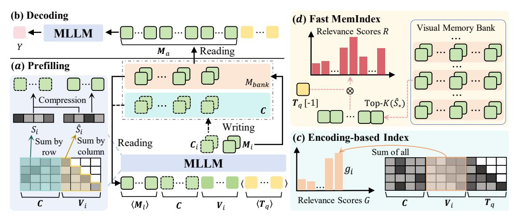

# 2.1. Video Multimodal Large Language Models

The rapid advancement of Large Language Models (LLMs) has catalyzed significant breakthroughs in multimodal understanding [\[25](#page-9-13)[–27\]](#page-9-14), leading to the emergence of Video Multimodal Large Language Models (Video-MLLMs) [\[1,](#page-8-11) [19,](#page-8-12) [20,](#page-9-15) [30\]](#page-9-16). Early pioneering works like Flamingo [\[1\]](#page-8-11) and VideoChat [\[19\]](#page-8-12) laid the foundation by extending imagebased multimodal models with temporal modeling modules, enabling basic video comprehension capabilities. Subsequent works such as Video-LLaVA [\[20\]](#page-9-15) and Video-ChatGPT [\[30\]](#page-9-16) improve temporal reasoning through unified visual representations and joint image-video training. More recent state-of-the-art models like Qwen3-VL [\[3\]](#page-8-13) and InternVL3.5 [\[48\]](#page-10-8) have achieved remarkable performance improvements by scaling both model parameters and training data. However, despite their impressive capabilities, these methods are fundamentally constrained by computational resources and typically process only a limited number of frames, which significantly restricts their applicability to long video understanding scenarios.

Figure 2. Illustration of the proposed FlexMem method. (a) FlexMem is an iterative method, and it encodes two types of compressed memories for each video clip Vi, namely *Context Memory* Ci and *Local Memory* Mi, based on the metrics of aggregation score Si and local saliency score Sˆi, respectively. Mi is then stored in the *visual memory bank* Mbank, while the context memory C are used in the iterative encoding step for information propagation. Besides, we can also retrieval some stored Ml as the long-term memory for encoding, while it is optional as well as the text instruction Tq. (b) The stored memories Ma will be recalled from the memory bank for the decoding of answers Y . (c) One intuitive and effective indexing for FlexMem is the *Encoding-based* one, which uses the cross-attention during memory encoding with Tq (a) to reflect the relevance of memories. (d) We also investigate the other fast index method, termed *MemIndex*, based on the compact index tensors for both question and visual memories, of which process is independent to the encoding of memories. Its selection of cache layers and tokens stems from the fitting results of the encoding-based index.

### 2.2. Long Video Understanding

To tackle the above challenge, some efforts resort to Retrieval-Augmented Generation (RAG) strategies derived from LLMs [\[2,](#page-8-5) [38\]](#page-9-6) to long video understanding. Video-RAG methods [\[29,](#page-9-5) [35,](#page-9-8) [37,](#page-9-17) [42,](#page-9-4) [59\]](#page-10-9) typically employ a twostage pipeline, *i.e.*, first retrieving keyframes based on query similarity, then processing them for answer generation. For instance, AKS [\[42\]](#page-9-4) uses vision-language embedding Models for similarity-based retrieval, while VideoAgent [\[11\]](#page-8-4) employs an iterative refinement process with LLM-based planning. However, such retrieval methods face inherent limitations in maintaining temporal coherence and capturing long-range dependencies. These methods often lack important contextual information that spans multiple segments and struggle with queries requiring holistic video understanding. Recently, visual compression methods have been extensively studied [\[39,](#page-9-9) [49,](#page-10-5) [50\]](#page-10-3), which maintain compressed features of historical context for comprehensive understanding. For instance, AdaRETAKE [\[50\]](#page-10-3) designs adaptive allocation modules to determine compression ratios across temporal dimensions and MLLM layers. Video-XL [\[39\]](#page-9-9) introduces special tokens to summarize the visual information within video fragments. Despite these advances, their input context length grows linearly with video duration, limiting their scalability. FlexMem combines the benefits of both paradigms, *i.e.*, maintaining comprehensive visual memories with constant footprint through iterative processing, and reading the most relevant information for answer generation via memory recall mechanism.

