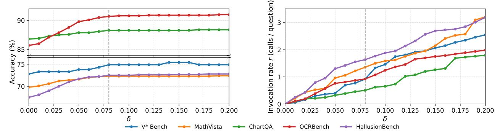
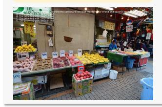
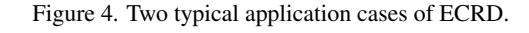

# 3.5. Efficiency analysis and uncertainty threshold

ECRD adds two sources of computation on top of the base decoder: (i) evidence scoring over the knee-selected candidate set and (ii) decider calls triggered when uncertainty persists. The former is lightweight. At step t, after knee truncation produces Ct = {w1, . . . , wk}, scoring requires a pass over the evidence pool Et to form the KL-style preference s(wi |Et). Because each evidence contributes precomputed log-likelihoods on a separate and cache-disabled backend (stored as FP16 on CPU), the inference-time computation is O(k|Et|) with negligible GPU pressure. In practice k is single-digit and |Et| grows slowly, so this path contributes only a small fraction of total latency.

The heavier component is the visual decider. Let r denote the average number of decider calls per question. As Fig. [3](#page-6-1) shows, increasing the uncertainty threshold δ monotonically raises r (right panel), while accuracy (left panel) exhibits a consistent elbow: a rapid lift for small δ, followed by saturation. The knee for all five benchmarks concentrates around the gray dashed line (δ ≈ 0.08), which is precisely where the negotiated distribution most often flags genuinely ambiguous, visually charged steps. Benchmarks whose items hinge on precise perceptual grounding such as OCRBench and HallusionBench benefit early and strongly, their curves rise steeply with a small number of calls, whereas tasks that already align well with text-only priors like ChartQA show milder, earlier saturation. Math-Vista and V\* Bench lie in between: accuracy improves steadily as a handful of targeted micro-observations are injected, then flattens when further calls add little new information. Importantly, beyond the knee, the invocation of visual decider grows faster than accuracy, and some curves even level off or gently fluctuate, reflecting diminishing returns once the few decisive ambiguities have been resolved.

The cost trend aligns with a simple latency model grounded in Tab. [6.](#page-6-2) Let t0 be the base time per question at δ = 0 (no calls) and l0 be the average marginal latency of a single call. Then the end-to-end time obeys

$$T(\delta) \approx t_0 + l_0 r(\delta).$$
 (14)

| Model V* Bench             |             |         | ch      | MathVista | ChartQA | OCRBench | HallusionBench |
|----------------------------|-------------|---------|---------|-----------|---------|----------|----------------|
|                            | Attr        | Spatial | Overall |           |         |          |                |
| LLaVA-OneVision-7B [8]     | 73.0        | 60.5    | 68.1    | 63.2      | 80.0    | 62.2     | 55.1           |
| LLaVA-OneVision-7B + ECRD  | 74.8        | 65.8    | 71.2    | 67.9      | 86.3    | 73.8     | 63.7           |
| Qwen2.5-VL-7B [1]          | 73.9        | 67.1    | 71.2    | 68.2      | 84.4    | 82.3     | 61.3           |
| Qwen2.5-VL-7B + supervisor | 73.9        | 71.1    | 72.8    | 69.8      | 86.8    | 85.7     | 67.5           |
| Qwen2.5-VL-7B + ECRD       | <b>74.8</b> | 75.0    | 74.9    | 72.3      | 88.3    | 90.7     | 72.5           |

Table 5. Results on five general multimodal benchmarks. Better performances are highlighted in **bold**. ECRD brings consistent gains across diverse tasks on both Qwen2.5-VL-7B and LLaVA-OneVision-7B, demonstrating backbone-agnostic, task-general effectiveness.

Figure 3. Analysis of the uncertainty threshold  $\delta$ : accuracy as a function of  $\delta$  across five benchmarks, and the average visual decider invocation rate (calls per question) as  $\delta$  varies. The gray dashed line marks  $\delta = 0.08$ .

| Benchmark | V* Bench | MathVista | ChartQA | OCRBench | HallusionBench |
|-----------|----------|-----------|---------|----------|----------------|
| $t_0$     | 8.98     | 12.92     | 9.76    | 3.24     | 11.67          |
| $l_0$     | 1.32     | 1.46      | 1.30    | 1.12     | 1.43           |

Table 6. Average time per question at  $\delta=0$  ( $t_0$ , seconds per question) and global average latency of a single visual decider call ( $l_0$ , seconds). Note that  $l_0$  is computed as an overall mean across all benchmarks and  $\delta$  settings, and is not restricted to the  $\delta=0$  condition. All tests are conducted on a single H20-NVLink GPU.

with  $t_0$  varying by benchmark and  $l_0$  staying in a narrow band (single-second scale) across settings. Combined with Fig. 3, this explains the observed cost–accuracy balance: near  $\delta \approx 0.08$ , accuracy captures most of the attainable gain while r remains in the low single-digit regime, yielding modest overhead relative to  $t_0$ , whereas pushing  $\delta$  higher mainly increases r (and thus T) with little additional accuracy. Hence we adopt  $\delta = 0.08$  as a default: it lies at the elbow where added calls cease to be cost-effective, yet the model already recovers most of the gains in Tabs. 1 to 5.

## 3.6. Qualitative analysis: how ECRD works

As shown in Figs. 2 and 4, we present three representative cases that correct typical failure modes, corresponding to ECRD's two components—the supervisor and the visual decider: (i) negotiated reweighting with textual evidence and (ii) on-demand visual arbitration when uncertainty persists.

Case A: Negotiated evidence resolves the step. As shown in Fig. 4, the question asks whether rubber cars are fewer than brown jets. At critical steps, ECRD does not trig-

ger the decider because of the large reweighted gap, instead, it reweights the candidates so that tokens consistent with evidence are favored, yielding the correct answer "Yes".

Case B.1: Visual decider supplies mid-chain grounding. As shown in Fig. 2 (full examples are provided in supplementary material), at the key step the candidate set is { "blue", "red" }. The base slightly prefers "red", while the evidence-induced distribution prefers "blue"; the negotiated gap remains small, so the trigger fires. This choice is pivotal for the rest of the chain: if the model commits to "red", the subsequent localization and description would drift toward the red garment and propagate errors. The visual decider reads the image with the current prefix and returns the grounding sentence: "The first dress from the right-hand side is blue, partially hidden by the tree." ECRD forces "blue" for the current step and adds this sentence to the pool. Later tokens then follow this micro-observation to correctly describe all three dresses and reach the right final color judgment for the queried position.

Case B.2: Visual decider supplies the final answer. As shown in Fig. 4, here the candidate set at the decisive step is { "5", "3" }. The base leans toward "5", the evidence-induced distribution leans toward "3", and the small negotiated gap triggers the decider. The visual decider localizes the tag behind the box and returns: "The number behind the cardboard box with the 'favorita' brand and banana illustration is '300'." ECRD commits token "3" and inserts the sentence into the pool; at the next two steps the supervisor

Question: Is the number of rubber cars less than the number of brown jets?

#### Greedy Decoding

There are two rubber cars in the image: one cyan car and one green car. There are two brown jets in the image: one large jet and one small jet. Since the number of rubber cars (2) is equal to the number of brown jets (2). Therefore, the answer is No.

Question: Recognize the question and options in the image and answer it.

## ECRD Case A: negotiated evidence resolves the step.

## Critical Evidence:

The image shows 9 objects in total with colors including yellow, blue, cyan, green, brown, gray, and orange. A yellow bicycle is on the left, a blue car is near the center, a cyan van is near the center, a yellow train is near the center, a gray train is in front, a brown road bike is on the right, a green car is on the right, a brown small airplane is near the centerright, and a brown large airplane is at the back. For the task, note that there are 2 brown jets (one large at the back and one small near the center-right), and there is 1 rubber car (a rubber cyan minivan) near the center. No text is visible.

## Model Answer:

Let's count the rubber cars and brown jets. There is 1 rubber car (a cyan minivan) near the center, and there are 2 brown jets (one large and one small) with one at the back and one near the center-right. Since the number of rubber cars (1) is less than the number of brown jets (2), the statement is true. Therefore, the answer is Yes.

## ECRD Case B: visual decider corrects the chain.

#### Model Answer Prefix:

The question asks for the object located directly behind the cardboard box with the \"favorita\" brand and banana illustration. In the image, there is a cardboard box with the \"favorita\" logo and bananas on it. Directly behind this box, there is a price tag with the number \"

Candidate Set: { "5", "3" }

## Negotiation (token, probability):

base model: (5, 0.498) (3, 0.483) evidence: (5, 0.503) (3, 0.478) reweighted: (5, 0.501) (3, 0.480)

## Visual Decider Output:

coordinates: see the red box in the left image. evidence: The number behind the cardboard box with the \"favorita\" brand and banana illustration is \"300\".

## Model Final Answer:

The question asks for the object located directly behind the cardboard box with the \"favorita\" brand and banana illustration. In the image, there is a cardboard box with the \"favorita\" logo and bananas on it. Behind this box, there is a price tag with the number \"300\" written on it. Therefore, the correct answer should be the price tag with \"300\" in text.

Figure 5. Breakdown of ECRD's gain on TreeBench based on Qwen2.5-VL-7B.

prefers tokens consistent with this evidence, selecting "0" then "0" without additional calls. The chain thus outputs the correct answer "300".

Where the gains come from. Based on a detailed statistical analysis of the experimental results, we find that on Qwen2.5-VL-7B, ECRD yields a +10.9-point overall improvement on TreeBench. As shown in Fig. 5, within this

lift, cases where the visual decider directly outputs the final answer account for 11.4% of the gain, while cases where the decider injects a mid-chain visual grounding that unlocks the rest of the reasoning account for 18.2%. The remaining improvement primarily comes from the supervisor's negotiated reweighting and the indirect benefits of an expanding evidence pool, which stabilizes later token choices even when no further decider calls are needed.

## 4. Conclusion

We presented ECRD, a decoding-time, training-free, plugand-play framework for visually grounded reasoning. By reconciling base probabilities with an evidence-guided distribution, ECRD preserves model confidence, invokes a lightweight visual decider only when necessary, and propagates visual grounding through reasoning chain. Experiments show consistent gains across diverse benchmarks.

