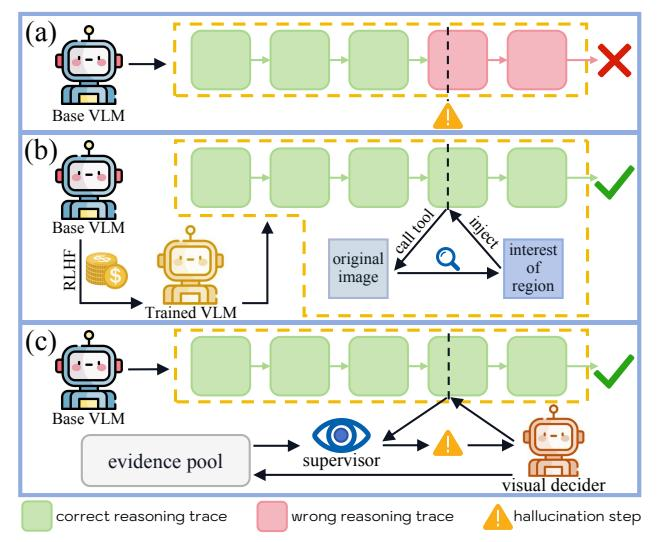

# See It, Say It, Sorted: An Iterative Training-Free Framework for Visually-Grounded Multimodal Reasoning in LVLMs

Yongchang Zhang1,3\*, Oliver Ma2\*, Tianyi Liu1†, Guangquan Zhou1†, Yang Chen1† Southeast University 2University of Oxford 3AIIA, Ministry of Education, China

yongchangzhang2005@gmail.com chenyang.list@seu.edu.cn

https://github.com/uuuuZYC/See-It-Say-It-Sorted

## **Abstract**

Recent large vision-language models (LVLMs) have demonstrated impressive reasoning ability by generating long chain-of-thought (CoT) responses. However, CoT reasoning in multimodal contexts is highly vulnerable to visual hallucination propagation: once an intermediate reasoning step becomes inconsistent with the visual evidence, subsequent steps—even if logically valid—can still lead to incorrect final answers. Existing solutions attempt to mitigate this issue by training models to "think with images" via reinforcement learning (RL). While effective, these methods are costly, model-specific, and difficult to generalize across architectures. Differently, we present a lightweight method that bypasses RL training and provides an iterative, training-free, plug-and-play framework for visuallygrounded multimodal reasoning. Our key idea is to supervise each reasoning step at test time with visual evidence, ensuring that every decoded token is justified by corresponding visual cues. Concretely, we construct a textual visual-evidence pool that guides the model's reasoning generation. When existing evidence is insufficient, a visual decider module dynamically extracts additional relevant evidence from the image based on the ongoing reasoning context, expanding the pool until the model achieves sufficient visual certainty to terminate reasoning and produce the final answer. Extensive experiments on multiple LVLM backbones and benchmarks demonstrate the effectiveness of our approach. Our method achieves 16.5%-29.5% improvements on TreeBench and 13.7% RH-AUC gains on RH-Bench, substantially reducing hallucination rates while improving reasoning accuracy without additional training.

## 1. Introduction

Large vision—language models (LVLMs) now generate long chain-of-thought (CoT) explanations and solve diverse mul-

Figure 1. **Reasoning pattern comparison.** (a) Greedy decoding: the base VLM selects the top-1 token at each step; any hallucination in an intermediate step propagates to an incorrect final answer. (b) RLHF-based "think-with-images": the model learns when to call tools to zoom or crop the image and re-inject cropped regions into the reasoning context—effective but costly and model-specific. (c) Ours: a lightweight, training-free, model-agnostic framework. A supervisor maintains a dynamic visual-evidence pool to detect and correct hallucination steps. When uncertainty arises, it invokes a visual decider to extract new evidence, enabling visually grounded reasoning throughout the chain.

timodal reasoning tasks [7, 18, 20, 22, 23]. Yet, the very ability to "think more" often coincides with "seeing less". [10] During inference-time decoding, a model must balance three competing contexts: the image, a growing textual context, and instruction tokens. As the context lengthens, subtle but decisive visual cues are easily dominated by language priors. Even a single token that departs from the visual evidence can steer the remaining chain of thought toward a fluent but visually inconsistent trajectory (Fig. 1 (a)). This reasoning—perception drift originates at decoding time—not because the model lacks visual understanding, but because long-horizon token generation gradually ampli-

\*Equal contribution †Corresponding author

fies language priors over visual grounding [\[9,](#page-8-6) [11,](#page-8-7) [17,](#page-8-8) [25\]](#page-8-9).

A prevailing solution is to explicitly train models to "think with images" by learning when and where to zoom or crop during CoT generation (Fig. [1\(](#page-0-0)b)). These RL- or preference-optimization pipelines train a policy to call visual tools, inspect regions, and re-inject pixels into the reasoning context. While effective, they rely on curated data, reward design, heavy computation, and tight coupling to specific backbones. The learned policy intertwines spatial exploration with the CoT, repeatedly encoding cropped views and incurring latency. As model scale increases, such visually grounded training becomes prohibitively expensive, limiting accessibility for broader use.

To address these limitations, we pursue a different principle: rather than learning when to look at training time, we supervise each reasoning step with visual evidence at test time (Fig. [1](#page-0-0) (c)). We introduce an iterative, training-free, plug-and-play framework that treats decoding as a sequence of evidence-justified token selections. The system maintains a textual evidence pool that operates alongside the base LVLM. At each step, the LVLM proposes a compact top-k set of candidate tokens from its local probability distribution. A lightweight supervisor computes an evidenceinduced preference over these candidates and negotiates a reweighted distribution with the base probabilities, preserving confident behavior while reallocating probability mass toward tokens consistent with accumulated evidence. When residual uncertainty remains, a visual decider inspects the image under the current reasoning context and generates a concise micro-observation in natural language. This observation is appended to the evidence pool and reused in all subsequent reasoning steps.

This design exhibits three key properties that directly mitigate the limitations of RL-based pipelines such as PixelReasoner [\[19\]](#page-8-10) and DeepEyes [\[29\]](#page-9-0). First, it is training-free and inherently transferable: the framework wraps around a frozen LVLM with a lightweight decider, requiring no task-specific finetuning or policy optimization. Second, it is cost-aware by construction. A simple uncertainty test on the negotiated distribution determines whether to invoke the decider, ensuring that additional visual computation occurs only when most likely to prevent a hallucination. Third, it represents evidence in text rather than pixels, enabling subsequent tokens to directly reference prior micro-observations without repeatedly re-encoding image crops. This textual form makes the framework easier to deploy at inference time and substantially reduces computational overhead compared with pixel-level reasoning.

Empirically, the framework improves both grounding and end-task accuracy across backbones and benchmarks while keeping overhead modest. Because evidence is accumulated on demand, fine-grained cues can be reused downstream to stabilize the remainder of the chain. Qualitative analyses show that many previously cascading failures reduce to one or two decisive micro-observations that the decider contributes precisely at uncertain steps; Quantitatively, we observe a clear accuracy–latency trade-off as the uncertainty threshold varies, allowing flexible adaptation to different deployment budgets.

The main contributions are summarized as follows:

- We present a training-free, plug-and-play decoding framework that supervises token selection with a growing textual evidence pool and negotiates next-token probabilities with the base model rather than relying on learned tool-calling policies.
- An uncertainty-triggered visual decider emits concise, reusable micro-evidence only when necessary, yielding strong cost–accuracy trade-offs.
- The approach transfers across LVLM backbones and consistently reduces hallucination while obviously improving task accuracy on a wide range of benchmarks.

