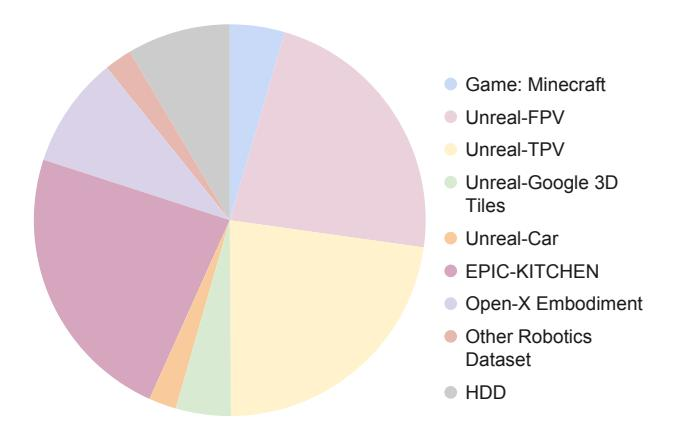

# CONTENTS

| 1 | Introduction  |                                                                                |    |  |  |  |  |  |
|---|---------------|--------------------------------------------------------------------------------|----|--|--|--|--|--|
| 2 |               | Related Works                                                                  | 3  |  |  |  |  |  |
| 3 | SlowFast-VGen |                                                                                |    |  |  |  |  |  |
|   | 3.1           | Slow Learning                                                                  | 4  |  |  |  |  |  |
|   |               | 3.1.1 Masked Conditional Video Diffusion                                 | 4  |  |  |  |  |  |
|   |               | 3.1.2 Dataset Collection                                                 | 5  |  |  |  |  |  |
|   | 3.2           | Fast Learning                                                               | 5  |  |  |  |  |  |
|   | 3.3           | Slow-Fast Learning Loop with Temp-LoRA                                         | 7  |  |  |  |  |  |
|   | 3.4           | Video Planning                                                              | 7  |  |  |  |  |  |
|   | 3.5           | Rethinking Slow-Fast Learning in the Context of Complementary Learning Systems | 7  |  |  |  |  |  |
| 4 |               | Experiment                                                                     |    |  |  |  |  |  |
|   | 4.1           | Evaluation on Video Generation                                              | 8  |  |  |  |  |  |
|   | 4.2           | Evaluation on Long-Horizon Planning                                         | 10 |  |  |  |  |  |
| 5 |               | Conclusion and Limitations                                                     | 11 |  |  |  |  |  |
| A |               | Contribution Statement 17                                                   |    |  |  |  |  |  |
| B |               | More Details about the Method                                                  | 17 |  |  |  |  |  |
|   | B.1           | Preliminaries on Latent Diffusion Models                                    | 17 |  |  |  |  |  |
|   | B.2           | Preliminaries on Low-Rank Adaptation (LoRA)                                    | 17 |  |  |  |  |  |
|   | B.3           | ModelscopeT2V Details                                                       | 18 |  |  |  |  |  |
| C |               | Dataset Statistics                                                             | 18 |  |  |  |  |  |
| D |               | More Experimental Details                                                      | 18 |  |  |  |  |  |
|   | D.1           | Experimental Setup and Implementation Details                                  | 18 |  |  |  |  |  |
|   | D.2           | Computation Costs                                                           | 19 |  |  |  |  |  |
|   | D.3           | Human Evaluation Details                                                    | 19 |  |  |  |  |  |
| E |               | Experiments on Ablations and Variations of SLOWFAST-VGEN                       | 19 |  |  |  |  |  |
| F |               | More Qualitative Examples                                                      | 20 |  |  |  |  |  |
|   | F.1           | More Qualitative Examples of Slow Learning                                  | 20 |  |  |  |  |  |
|   | F.2           | More Qualitative Examples of Fast Learning                                     | 20 |  |  |  |  |  |

### A CONTRIBUTION STATEMENT

**Yining Hong** was responsible for all of the code development, paper writing, and experiments. She also collected the data for Minecraft.

**Beide Liu** contributed to most of the data collection with regard to Unreal data. He was in charge of setting up the Unreal Engine, purchasing assets online, writing the Python scripts for automate agent control, and recording first-person and third-person videos of Unreal data.

**Maxine Wu** collected the data of Google 3D Tiles. She was also responsible for the task setup of RLBench and the data collection of RLBench. She also curated part of the driving data.

Yuanhao Zhai wrote the codes for AnimateDiff, which was one of the baseline models.

The other people took on the advising roles, contributing extensively to the project by offering innovative ideas, providing detailed technical recommendations, assisting with troubleshooting code issues, and conducting multiple rounds of thorough paper reviews. They provided valuable expertise on video diffusion models. **Zhengyuan Yang, Yingnian Wu and Lijuan Wang** were involved in brainstorming and critical review throughout the project. Specifically, **Zhengyuan Yang** provided much technical support. **Yingnian Wu** came up with the idea of TEMP-LORA for modelling episodic memory as well as the masked video diffusion model. **Lijuan Wang** provided valuable insights throughout the project.

### B More Details about the Method

#### B.1 Preliminaries on Latent Diffusion Models

Stable Diffusion (Rombach et al., 2022), operates in the compressed latent space of an autoencoder obtained by a pre-trained VAE. Given an input  $x_0$ , the process begins by encoding it into a latent representation:  $z_0 = E(x_0)$  where E is the VAE encoder function. Noise is then progressively added to the latent codes through a Gaussian diffusion process:

$$q(z_t|z_{t-1}) = \mathcal{N}(z_t; \sqrt{1 - \beta_t} z_{t-1}, \beta_t \mathbf{I})$$
(7)

for t = 1, ..., T, where T is the total number of diffusion steps and  $\beta_t$  are noise schedule parameters. This iterative process can be expressed in a simpler form:

$$z_t = \sqrt{\bar{\alpha}_t} z_0 + \sqrt{1 - \bar{\alpha}_t} \epsilon \tag{8}$$

where  $\epsilon \sim \mathcal{N}(0, \mathbf{I})$ ,  $\bar{\alpha}_t = \prod_{i=1}^t \alpha_i$ , and  $\alpha_i = 1 - \beta_i$ . Stable Diffusion employs an  $\epsilon$ -prediction approach, training a neural network  $\epsilon_{\theta}$  to predict the noise added to the latent representation. The loss function is defined as:

$$L = \mathbb{E}_{t, z_0 \sim p_{\text{data}}, \epsilon \sim \mathcal{N}(0, 1), c} \left[ ||\epsilon - \epsilon_{\theta}(z_t, t, c)||_2^2 \right]$$
(9)

Here, c represents the conditioning (e.g., text), and  $\theta$  denotes the neural network parameters, typically implemented as a U-Net (Ronneberger et al., 2015).

During inference, the model iteratively denoises random Gaussian noise, guided by the learned  $\epsilon_{\theta}$ , to generate latent representations. These are then decoded to produce high-quality images consistent with the given textual descriptions.

Video diffusion models (Ho et al., 2022b) typically build upon LDMs by utilizing a 3D U-Net architecture, which enhances the standard 2D structure by adding temporal convolutions after each spatial convolution and temporal attention blocks following spatial attention blocks.

### B.2 PRELIMINARIES ON LOW-RANK ADAPTATION (LORA)

LoRA Hu et al. (2021) transforms the fine-tuning process for large-scale models by avoiding the need to adjust all parameters. Instead, it utilizes compact, low-rank matrices to modify only a subset of the model's weights. This approach keeps the original model parameters fixed, addressing the problem of catastrophic forgetting, where new learning can overwrite existing knowledge. LoRA

utilizes compact, low-rank matrices to modify only a subset of the model's weights, therefore avoiding the need to adjust all parameters. In LoRA, the weight matrix  $W \in \mathbb{R}^{m \times n}$  is updated by adding a learnable residual. The modified weight matrix W' is:

$$W' = W + \Delta W = W + AB^T$$

where  $A \in \mathbb{R}^{m \times r}$  and  $B \in \mathbb{R}^{n \times r}$  are low-rank matrices, and r is the rank parameter that determines their size. In this paper, we denote the LoRA finetuning as the fast learning process and the pretraining as slow learning process. The equation then becomes:

$$W' = W + \Delta W = W_{\text{slow}} + W_{\text{fast}} = \Phi + \Theta \tag{10}$$

where  $\Phi$  corresponds to the pre-trained slow-learning weights, and  $\Theta$  corresponds to the LoRA paraemters in the fast learning phase.

#### B.3 MODELSCOPET2V DETAILS

We base our slow learning model on ModelscopeT2V (Wang et al., 2023). Here, we introduce the details of this model.

Given a text prompt p, the model generates a video  $v_{pr}$  through a latent video diffusion model that aligns with the semantic meaning of the prompt. The architecture is composed of a visual space where the training video  $v_{gt}$  and generated video  $v_{pr}$  reside, while the diffusion process and denoising UNet  $\epsilon_{\theta}$  operate in a latent space. Utilizing VQGAN, which facilitates data conversion between visual and latent spaces, the model encodes a training video  $v_{gt} = [f_1, \ldots, f_F]$  into its latent representation  $Z_{gt} = [E(f_1), \ldots, E(f_F)]$ . During the training phase, the diffusion process introduces Gaussian noise to the latent variable, ultimately allowing the model to predict and denoise these latent representations during inference.

To ensure that ModelScopeT2V generates videos that adhere to given text prompts, it incorporates a text conditioning mechanism that effectively injects textual information into the generative process. Inspired by Stable Diffusion, the model augments the UNet structure with a cross-attention mechanism that allows for conditioning of visual content based on textual input. The text embedding c derived from the prompt p is utilized as the key and value in the multi-head attention layer, enabling the intermediate UNet features to integrate text features. The text encoder from the pre-trained CLIP ViT-H/14 converts the prompt into a text embedding, ensuring a strong alignment between language and vision embeddings.

The core of the latent video diffusion model lies in the denoising UNet, which encompasses various blocks, including the initial block, downsampling block, spatio-temporal block, and upsampling block. Most of the model's parameters are concentrated in the denoising UNet  $\epsilon_{\theta}$ , which is tasked with the diffusion process in the latent space. The model aims to minimize the discrepancy between the predicted noise and the ground-truth noise, thereby achieving effective video synthesis through denoising. ModelScopeT2V's architecture also includes a spatio-temporal block, which captures complex spatial and temporal dependencies to enhance video synthesis quality. The spatio-temporal block is comprised of spatial convolutions, temporal convolutions, and attention mechanisms. By effectively synthesizing videos through this structure, ModelScopeT2V learns comprehensive spatio-temporal representations, allowing it to generate high-quality videos. The model implements a combination of self-attention and cross-attention mechanisms, facilitating both cross-modal interactions and spatial modeling to capture correlations across frames effectively.

### C DATASET STATISTICS

We provide the dataset statistics in Figure 6.

### D More Experimental Details

### D.1 EXPERIMENTAL SETUP AND IMPLEMENTATION DETAILS

We utilize approximately 64 V100 GPUs for the pre-training of SLOWFAST-VGEN, with a batch size of 128. The slow learning rate is set to 5e-6, while the fast learning rate is 1e-4. Training

Figure 6: Statistics of our Training Dataset.

videos of mixed lengths are used, all within the context window of 32 frames. During training, we freeze the VAE and CLIP Encoder, allowing only the UNet to be trained. For inference and fast learning, we employ a single V100 GPU. For TEMP-LORA, a LoRA rank of 32 is used, and the Adam optimizer is employed in both learning phases.

### D.2 COMPUTATION COSTS

In Table [3,](#page-18-4) we show the computation costs with and without TEMP-LORA. While the inclusion of TEMP-LORA does introduce some additional computation during the inference process, the difference is relatively minor and remains within acceptable limit.

|                                             | Ours wo TEMP-LORA | Ours w TEMP-LORA |
|---------------------------------------------|-------------------|------------------|
| Average Inference Time per Sample (seconds) | 12.9305           | 13.8066          |
| Inference Memory Usage (MB)                 | 9579              | 9931             |

Table 3: Comparison of Computation Costs with and without TEMP-LORA

### D.3 HUMAN EVALUATION DETAILS

In our human evaluation session for action-conditioned long video generation, 30 participants assessed the generated video samples (50 videos per person) based on three criteria:

- Video Quality (0 to 1): Participants evaluated the overall visual quality, considering aspects such as resolution, clarity, and aesthetic appeal.
- Coherence (0 to 1): They examined the logical flow of actions and whether the events progressed seamlessly throughout the video, ensuring there were no abrupt changes or disconnections.
- Adherence to Actions (0 to 1): Participants judged how accurately the generated videos reflected the specified action prompts, assessing whether the actions were effectively depicted.

Each video was rated by at least three different individuals to ensure reliability. The collected ratings were then compiled for analysis, with average scores calculated to assess performance across the different criteria.

