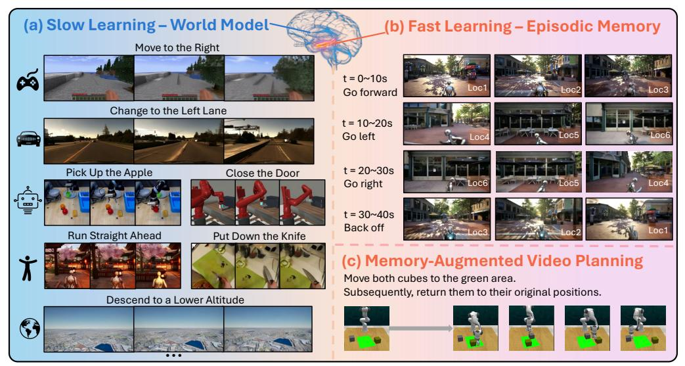

# SLOWFAST-VGEN: SLOW-FAST LEARNING FOR ACTION-DRIVEN LONG VIDEO GENERATION

Yining Hong1 , Beide Liu1 †, Maxine Wu1 †, Yuanhao Zhai3 , Kai-Wei Chang1 , Linjie Li2 , Kevin Lin2 , Chung-Ching Lin2 , Jianfeng Wang2 , Zhengyuan Yang2,†† , Yingnian Wu1,††, Lijuan Wang2,††

1 UCLA, 2 Microsoft Research, 3 State University of New York at Buffalo

† Co-second Contribution, †† Equal Advising

Figure 1: We propose SLOWFAST-VGEN, a dual-speed action-driven video generation system that mimics the complementary learning system in human brains. The slow learning phase (a) learns an approximate world model that simulates general dynamics across a diverse set of scenarios. The fast learning phase (b) stores episodic memory for consistent long video generation, *e.g.,* generating the same scene for "Loc1" after traveling across different locations. Slow-fast learning also facilitates long-horizon planning tasks (c) that require the efficient storage of long-term episodic memories.

