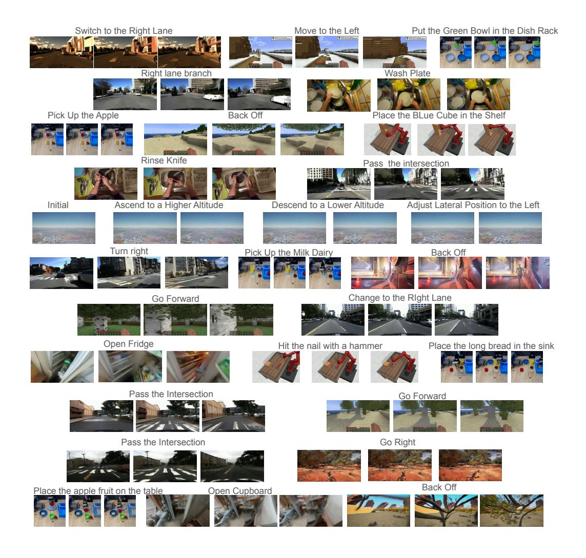

# F MORE QUALITATIVE EXAMPLES

### F.1 MORE QUALITATIVE EXAMPLES OF SLOW LEARNING

In Figure [7](#page-20-0) and Figure [8,](#page-21-0) we include more qualitative examples with regard to slow learning.

### F.2 MORE QUALITATIVE EXAMPLES OF FAST LEARNING

In Figure [9](#page-22-0) and Figure [10,](#page-23-0) we include more qualitative examples with regard to fast learning.

Figure 7: Qualitative Examples on Slow Learning. Part 1.

Figure 8: Qualitative Examples on Slow Learning. Part 2.

Figure 9: Qualitative Examples on Fast Learning. Part 1. We mark consistent objects / frames in green bounding boxes and inconsistent ones in red.

Figure 10: Qualitative Examples on Fast Learning. Part 2. We mark consistent objects / frames in green bounding boxes and inconsistent ones in red.