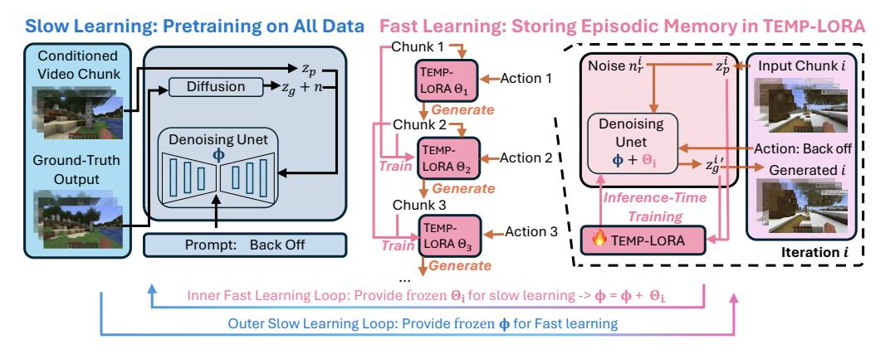

# <span id="page-2-0"></span>2 RELATED WORKS

Text-to-Video Generation Nowadays, research on text-conditioned video generation has been evolving fast [\(Ho et al., 2022b](#page-12-4)[;a;](#page-12-5) [Singer et al., 2022;](#page-13-6) [Luo et al., 2023;](#page-12-6) [Esser et al., 2023;](#page-11-0) [Blattmann](#page-10-2) [et al., 2023b;](#page-10-2) [Zhou et al., 2023;](#page-14-3) [Khachatryan et al., 2023;](#page-12-7) [Wang et al., 2023\)](#page-13-7), enabling the generation of short videos based on text inputs. Recently, several studies have introduced world models capable of generating videos conditioned on free-text actions [\(Wang et al., 2024a;](#page-13-3) [Xiang et al., 2024;](#page-14-2) [Yang](#page-14-0) [et al., 2024\)](#page-14-0). While these papers claim that a general world model is pretrained, they often struggle to simulate dynamics beyond the context window, thus unable to generate consistent long videos. There are also several works that formulate robot planning as a text-to-video generation problem [\(Du et al., 2023;](#page-11-1) [Ko et al., 2023\)](#page-12-8). Specifically, [Du et al.](#page-11-1) [\(2023\)](#page-11-1) trains a video diffusion model to predict future frames and gets actions with inverse dynamic policy, which is followed by this paper.

Long Video Generation A primary challenge in long video generation lies in the limited number of frames that can be processed simultaneously due to memory constraints. Existing techniques often condition on the last chunk to generate the next chunk[\(Harvey et al., 2022;](#page-12-1) [Villegas et al., 2022;](#page-13-4) [Chen et al., 2023;](#page-10-1) [Guo et al., 2023a;](#page-12-2) [Henschel et al., 2024;](#page-12-3) [Zeng et al., 2023;](#page-14-4) [Ren et al., 2024\)](#page-13-8), which hinders the model's ability to retain information beyond the most recent chunk, leading to inconsistencies when revisiting earlier scenes. Some approaches use an anchor frame [\(Yang et al.,](#page-14-5) [2023;](#page-14-5) [Henschel et al., 2024\)](#page-12-3) to capture global context, but this is often insufficient for memorizing the whole trajectory. Other methods generate key frames and interpolate between them [\(He et al.,](#page-12-9) [2023;](#page-12-9) [Ge et al., 2022;](#page-11-2) [Harvey et al., 2022;](#page-12-1) [Yin et al., 2023\)](#page-14-6), diverging from how world models simulate future states through sequential actions, limiting their suitability for real-time action streaming, such as in gaming contexts. Additionally, these methods require long training videos, which are hard to obtain due to frequent shot changes in online content. In this paper, we propose storing episodic memory of the entire generated sequence in LoRA parameters during inference-time fast learning, enabling rapid adaptation to new scenes while retaining consistency with a limited set of parameters.

**Low-Rank Adaptation** LoRA (Hu et al., 2021) addresses the computational challenges of fine-tuning large pretrained language models by using low-rank matrices to approximate weight changes, reducing parameter training and hardware demands. It enables efficient task-switching and personalization without additional inference costs, as the trainable matrices integrate seamlessly with frozen weights. In this work, we develop a TEMP-LORA module, which adapts quickly to new scenes during inference and stores long-context memory in its parameters.

#### <span id="page-3-1"></span>3 SLOWFAST-VGEN

In this section, we introduce our SLOWFAST-VGEN framework. We first present the masked diffusion model for slow learning and the dataset we collected (Sec 3.1). Slow learning enables the generation of new chunks based on previous ones and input actions, while lacking memory retention beyond the most recent chunk. To address this, we introduce a fast learning strategy, which can store episodic memory in LoRA parameters (Sec 3.2). Moving forward, we propose a slow-fast learning loop algorithm (Sec 3.3) that integrates TEMP-LORA into the slow learning process for context-aware tasks that require knowledge from multiple episodes, such as long-horizon planning. We also illustrate how to apply this framework for video planning (Sec 4.2) and conduct a thorough investigation and comparison between our model and complementary learning system in cognitive science, highlighting parallels between artificial and biological learning mechanisms (Sec 3.5).



Figure 2: SLOWFAST-VGEN Architecture. The left side illustrates the slow learning process, pretraining on all data with a masked conditional video diffusion model. The right side depicts the fast learning process, where TEMP-LORA stores episodic memory during inference. Streamin actions guide the generation of video chunks, with TEMP-LORA parameters updated after each chunk. In our slow-fast learning loop algorithm, the inner loop performs fast learning, supplying TEMP-LORA parameters from multiple episodes to the slow learning process, which updates slow learning parameters  $\Phi$  based on frozen fast learning parameters.

### <span id="page-3-0"></span>3.1 SLOW LEARNING

#### <span id="page-3-2"></span>3.1.1 Masked Conditional Video Diffusion

We develop our slow learning model based on the pre-trained ModelScopeT2V model (Wang et al., 2023), which generates videos from text prompts using a latent video diffusion approach. It encodes training videos into a latent space z, gradually adding Gaussian noise to the latent via  $z_t = \sqrt{\bar{\alpha}_t} z_0 + \sqrt{1-\bar{\alpha}_t} \epsilon$ . A Unet architecture, augmented with spatial-temporal blocks, is responsible for denoising. Text prompts are encoded by the CLIP encoder (Radford et al., 2021).

To better condition on the previous chunk, we follow Voleti et al. (2022) for masked conditional video diffusion, conditioning on past frames in the last video chunk to generate frames for the subsequent chunk, while applying masks on past frames for loss calculation. Given  $f_p$  past frames and  $f_q$  frames to be generated, we revise the Gaussian diffusion process to:

$$z_{t,:f_p} = z_{0,:f_p} z_{t,f_p:(f_p+f_g)} = \sqrt{\bar{\alpha}_t} z_{0,f_p:(f_p+f_g)} + \sqrt{1-\bar{\alpha}_t} \epsilon z_t = z_{t,:f_p} \oplus z_{t,f_p:(f_p+f_g)}$$
(1)

where  $z_{t,:f_p}$  is the latent of the first  $f_p$  frames at diffusion step t, which is clean as we do not add noise to the conditional frames.  $z_{t,f_p:(f_p+f_g)}$  corresponds to the latent of the ground-truth output frames, which we add noise to for conditional generation of the diffusion process. We concatenate  $(\oplus)$  them together and send them all into the UNet. We then get the noise predictions out of the UNet, and apply masks to the losses corresponding to the first  $f_p$  frames. Thus, only the last  $f_g$  frames are used for calculating loss. The final loss is:

$$L(\Phi) = \mathbb{E}_{t, z_0 \sim p_{\text{data}}, \epsilon \sim \mathcal{N}(0, 1), c} \left[ ||\epsilon - \epsilon_{\Phi}(z_t[f_p : (f_p + f_g)], t, c)||_2^2 \right]$$
 (2)

Here, c represents the conditioning (e.g., text), and  $\Phi$  denotes the UNet parameters. Our model is able to handle videos of arbitrary lengths smaller than the context window size (i.e., arbitrary  $f_p$  and  $f_q$ ). For the first frame image input,  $f_p$  equals 1.

### <span id="page-4-1"></span>3.1.2 Dataset Collection

Our slow learning dataset consists of 200k data, with each data point in the format of (input video chunk, input free-text action, output video chunk). The dataset can be categorized into 4 domains:

- Unreal. We utilize the Unreal Game Engine (Epic Games) for data collection, incorporating environments such as Google 3D Tiles, Unreal City Sample, and various assets purchased online. We introduce different agent types (e.g., human agents and droids) and use a Python script to automate action control. We record videos from both first-person and third-person perspectives, capturing keyboard and mouse inputs as actions and translating them into text (e.g., "go left").
- Game. We manually play Minecraft, recording keyboard and mouse inputs and capturing videos.
- Human Activities. We include the EPIC-KITCHENS (Damen et al., 2018; 2022) dataset, which
  comprises extensive first-person (egocentric) vision recordings of daily activities in the kitchen.
- **Robot**. We use several datasets from OpenX-Embodiment (Collaboration et al., 2024), as well as tasks from Metaworld (Yu et al., 2021) and RLBench (James et al., 2019). As most robot datasets consist of short episodes (where each episode is linked with one language instruction) rather than long videos with sequential language inputs, we set  $f_p$  to 1 for these datasets.
- Driving. We utilize the HRI Driving Dataset (HDD) (Ramanishka et al., 2018), which includes 104 hours of real human driving. We also include driving videos generated in the Unreal Engine.

#### <span id="page-4-0"></span>3.2 FAST LEARNING

The slow learning process enables the generation of new video chunks based on action descriptions. A complete episode can thus be generated by sequentially conditioning on previous outputs. However, this method does not ensure the retention of memory beyond the most recent chunk, potentially leading to inconsistencies among temporally distant segments. In this section, we introduce the novel fast learning strategy, which can store episodic memory of all generated chunks. We begin by briefly outlining the generation process of our video diffusion model. Subsequently, we introduce a temporary LoRA module, TEMP-LORA, for storing episodic memory.

Generation Each iteration i consists of T denoising steps ( $t=T\dots 1$ ). We initialize new chunks with random noise at  $z_T^i$ . During each step, we combine the previous iteration's clean output  $z_0^{i-1}$  with the current noisy latent  $z_t^i$ . This combined input is fed into a UNet to predict and remove noise, producing a less noisy version for the next step. We focus only on the newly generated frames, masking out previous-iteration outputs. This process repeats until the iteration's final step, yielding a clean latent  $z_0^i$ . The resulting  $z_0^i$  becomes input for the next iteration. The generation process works directly with the latent representation, progressively extending the video without decoding and re-encoding from pixel space between iterations.

**TEMP-LORA** Inspired by Wang et al. (2024b), we utilize a temporary LoRA module that embeds the episodic memory in its parameters. TEMP-LORA was initially designed for long text generation, progressively generating new text chunks based on inputs, and use the generated chunk as ground-truth to train the model conditioned on the input chunk. We improve TEMP-LORA for video generation to focus on memorizing entire trajectories rather than focusing on immediate input-output

### Algorithm 1 SLOWFAST-VGEN Algorithm

```
frozen pretrained weights \Phi and LoRA parameters \Theta_0, fast learning learning rate \alpha
    Output: Long Video Sequence \mathcal{Y}
1: \mathcal{X}_0 = \text{VAE\_ENCODE}(\mathcal{X}_0); \mathcal{Y} \leftarrow X_0
                                                                                                                          {Encode into latents}
2: for i in 0 to \mathcal{I} - 1 do
              // Generate the sequence in the current context window
4:
        if i \neq 0 then
5:
            \mathcal{X}_i \leftarrow \mathcal{Y}_{i-1}
        end if
6:
7:
        C_i \leftarrow \text{User\_Input}(i)
                                                                    {Action conditioning acquired through user interface input}
        \mathcal{Y}_i = (\Phi + \Theta_i)(\mathcal{X}_i, C_i)
8:
9:
        \mathcal{Y} = \mathcal{Y} \oplus \mathcal{Y}_i
```

First frame of video sequence  $\mathcal{X}_0$ , total generating iterations  $\mathcal{I}$ , video diffusion model with

{Concatenate the output latents to the final sequence latents} 10: // Use the input and output in the context window to train TEMP-LORA

11:  $\mathcal{X}_i = \mathcal{X}_i \oplus \mathcal{Y}_i$ {Concatenate input and output to prepare TEMP-LORA training data}

12: Sample Noise  $\mathcal{N}$  on the whole  $\mathcal{X}_i$  sequence

13: Calculate Loss on the whole  $\mathcal{X}_i$  sequence

 $\Theta_{i+1} \leftarrow \Theta_i - \alpha \cdot \nabla_{\theta} \text{Loss}$ 15: end for

(a) Fast Learning

16:  $\mathcal{Y} = VAE\_DECODE(\mathcal{Y})$ 

{Decode into video}

17: return  $\mathcal{Y}$ 

<span id="page-5-0"></span>17:

end for 18: end while

### (b) Slow-Fast Learning Loop

**Definition:** task-specific slow learning weights  $\Phi$ , task-specific dataset D, LoRA parameters of all episodes  $\Theta$ , slow learning learning rate  $\beta$ , slow-learning dataset  $D_s$ 

```
// Slow Learning Loop
 1: while not converged do
        D_s \leftarrow \emptyset //prepare dataset for slow learning
        for each sample (x, episode) in D do
 3:
 4:
            // Fast Learning Loop
 5:
            Suppose episode could be divided into \mathcal{I} short sequences: \mathcal{X}_i^e for i in 0 to \mathcal{I}-1
 6:
            Initialize TEMP-LORA parameters for this episode \Theta_0^e
 7:
            for i in 0 to \mathcal{I}-1 do
 8:
               D_s = D_s \cup \{X_i^e, X_{i+1}^e, \Theta_i^e\}
                                                                              \{X_{i+1}^e \text{ is the ground-truth output of input } X_i^e\}
 9:
               Fix \Phi and update \Theta_i^e using fast learning algorithm
10:
            end for
11:
        end for
12:
        // Use the D_s dataset for slow learning update
13:
        for \{X_i^e, X_{i+1}^e, \Theta_i^e\} in D_s do
14:
            \Phi_i^e = \Phi + \Theta_i^e
15:
            Calculate Loss based on the model output of input X_i^e, and ground-truth output X_{i+1}^e
16:
            Fix \Theta_i^e and update \Phi only: \Phi \leftarrow \Phi - \beta \cdot \nabla_{\Phi} \text{Loss}
```

streams. Specifically, after the generation process of iteration i, we use the concatenation of the input latent and output latent at this iteration to update the TEMP-LORA parameters.

<span id="page-5-1"></span>
$$z_0^{i'} = z_0^{i-1} \oplus z_0^{i}; \quad z_t^{i'} = \sqrt{\bar{\alpha}_t} z_0^{i'} + \sqrt{1 - \bar{\alpha}_t} \epsilon$$

$$L(\Theta_i | \Phi) = \mathbb{E}_{t, z_0^{i'}, \epsilon \sim \mathcal{N}(0, 1)} \left[ ||\epsilon - \epsilon_{\Phi + \Theta_i}(z_t^{i'}, t)||_2^2 \right]$$
(3)

Specifically, we concatenate the clean output from the last iteration  $z_0^{i-1}$  (which is also the input of the current iteration) and the clean output from the current iteration  $z_0^i$  to construct a temporal continuum  $z_0^{i'}$ . Then, we add noise to the whole  $z_0^{i'}$  sequence, which results in  $z_t^{i'}$  at noise diffusion step t. Note that here we do not condition on clean  $z_0^{i-1}$  anymore, and exclude text conditioning to focus on remembering full trajectories rather than conditions. Then, we update the TEMP-LORA parameters of the UNet  $\Theta_i$  using the concatenated noise-augmented, action-agnostic  $z_0^{i'}$ . Through forward diffusion and reverse denoising, we effectively consolidate sequential episodic memory in the TEMP-LORA parameters. The fast learning algorithm is illustrated in Algorithm 1 (a).

### <span id="page-6-0"></span>3.3 SLOW-FAST LEARNING LOOP WITH TEMP-LORA

Previously, we develop TEMP-LORA for inference-time training, allowing for rapid adaptation to new contexts and the storage of per-episode memory in the LoRA parameters. However, some specific context-aware tasks require learning from all collected long-term episodes rather than just memorizing individual ones. For instance, solving a maze involves not only recalling the long-term trajectory within each maze, but also leveraging prior experiences to generalize the ability to navigate and solve different mazes effectively. Therefore, to enhance our framework's ability to solve various tasks that require learning over long-term episodes, we propose the slow-fast learning loop algorithm, which integrates the TEMP-LORA modules into a dual-speed learning process.

We detail our slow-fast learning loop algorithm in Algorithm 1 (b). Our slow-fast learning loop consists of two primary loops: an inner loop for fast learning and an outer loop for slow learning. The inner loop, representing the fast learning component, utilizes TEMP-LORA for quick adaptation to each episode. It inherits the fast learning algorithm in Algorithm 1 (a) and updates the memory in the TEMP-LORA throughout the long video generation process. Crucially, the inner loop not only generates long video outputs and updates the TEMP-LORA parameters, but also prepares training data for the slow learning process. It aggregates inputs, ground-truth outputs, and corresponding TEMP-LORA parameters in individual episodes into a dataset  $D_s$ . The outer loop implements the slow learning process. It leverages the learned frozen TEMP-LORA parameters in different episodes to capture the long-term information of the input data. Specifically, it utilizes the data collected from multiple episodes by the inner loop, which consists of the inputs and ground-truth outputs of each iteration in the episodes, together with the memory saved in TEMP-LORA up to this iteration.

While the slow-fast learning loop may be intensive for full pre-training of the approximate world model, it can be effectively used in finetuning for specific domains or tasks requiring long-horizon planning or experience consolidation. A key application is in robot planning, where slow accumulation of task-solving strategies across environments can enhance the robot's ability to generalize to complex, multi-step challenges in new settings, as illustrated in our experiment (Sec 4.2).

#### <span id="page-6-2"></span>3.4 VIDEO PLANNING

We follow Du et al. (2023), formulating task planning as a text-conditioned video generation problem using Unified Predictive Decision Process (UPDP). We define a UPDP as  $G = \langle X, C, H, \phi \rangle$ , where X is the space of image observations, C denotes textual task descriptions,  $H \in \mathcal{T}$  is a finite horizon length, and  $\phi(\cdot|x_0,c): X\times C \to \Delta(X^{T-1})$  is our proposed conditional video generator.  $\phi$  synthesizes a video sequence given an initial observation  $x_0$  and text description c. To transform synthesized videos into executable actions, we use a trajectory-task conditioned policy  $\pi(\cdot|x_{t_{t=0}}^{T-1},c): X^T\times C \to \Delta(A^{T-1})$ . Decision-making is reduced to learning  $\phi$ , which generates future image states based on language instructions. Action execution translates the synthesized video plan  $[x_1,...,x^T]$  to actions. We employ an inverse dynamics model to infer necessary actions for realizing the video plan. This policy determines appropriate actions by taking two consecutive image observations from the synthesized video. For long-horizon planning, ChatGPT decomposes tasks into subgoals, each realized as a UPDP process. After generating a video chunk for a subgoal, we use the inverse dynamics model to execute actions. We sequentially generate video chunks for subgoals, updating TEMP-LORA throughout the long-horizon video generation process.

