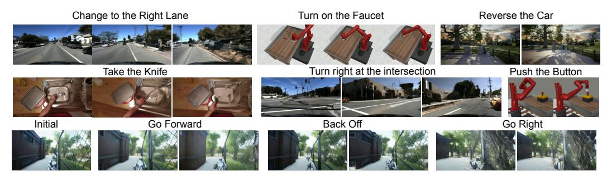
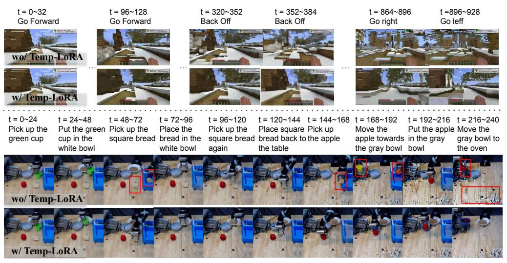

# 3.5 RETHINKING SLOW-FAST LEARNING IN THE CONTEXT OF COMPLEMENTARY LEARNING SYSTEMS

### Slow-Fast Learning as in Brain Structures

In neuroscience, the neocortex is associated with slow learning, while the hippocampus facilitates fast learning and memory formation, thus forming a complementary learning system where the two learning mechanisms complement each other. While slow learning involves gradual knowledge acquisition, fast learning enables rapid formation of new memories from single experiences for quick adaptation to new situations through one-shot contextual learning. However, current pre-training paradigms (*e.g.*, LLMs or diffusion models) primarily emulate slow learning, akin to procedural memory in cognitive science. In our setting, TEMP-LORA serves as an analogy to the hippocampus.

### **TEMP-LORA** as Local Learning Rule

It's long believed that fast learning is achieved by local learning rule (Palm, 2013). Specifically, given pairs of patterns  $(x^{\mu}, y^{\mu})$  to be stored in the matrix C, the process of storage could be formulated by the following equation:

$$c = \sum_{\mu} x^{\mu} y^{\mu} \tag{4}$$

Consider a sequential memory storage process where learning steps involve adding input-output pairs  $(x^{\mu}, y^{\mu})$  to memory, the change  $\Delta c_{ij}$  in each memory entry depends only on local input-output interactions (Palm, 2013):

$$\Delta c(t) = x^{\mu}(t) \cdot y^{\mu}(t) \tag{5}$$

This local learning rule bears a striking resemblance to LoRA's update mechanism.

$$W' = W + \Delta W = W_{\text{slow}} + W_{\text{fast}} = \Phi + \Theta \tag{6}$$

Where  $W_{\text{fast}}$  is achieved by the matrix change, updated based on the current-iteration input and output locally as in Equation 3 ( $\Delta W \leftarrow z_{0,i-1} \oplus z_{0,i}$ ).

### Slow-Fast Learning Loop as a Computational Analogue to Hippocampus-Neocortex Interplay

The relationship between TEMP-LORA and slow learning weights mirrors the interplay between hippocampus and neocortex in complementary learning systems. This involves rapid encoding of new experiences by the hippocampus, followed by gradual integration into neocortical networks (McClelland et al., 1995). As in Klinzing et al. (2019), memory consolidation is the process where hippocampal memories are abstracted and integrated into neocortical structures, forming general knowledge via offline phases, particularly during sleep. This bidirectional interaction allows for both quick adaptation and long-term retention (Kumaran et al., 2016). Our slow-fast learning loop emulates this process, where  $W' = W + \Delta W = W_{\rm slow} + W_{\rm fast}$ . Here,  $W_{\rm fast}$  (TEMP-LORA) rapidly adapts to new experiences, analogous to hippocampal encoding, while  $W_{\rm slow}$  gradually incorporates this information, mirroring neocortical consolidation.

### 4 EXPERIMENT

For our experimental evaluation, we will focus on assessing the capabilities of our proposed approach with regard to two perspectives: video generation and video planning. We will detail our baseline models, datasets, evaluation metrics, results, and qualitative examples for each component. Please refer to the supplementary material for experimental setup, implementation details, human evaluation details, computational costs, more ablative studies and more qualitative examples.

#### 4.1 EVALUATION ON VIDEO GENERATION

Baseline Models and Evaluation Metrics We compare our SLOWFASTVGEN with several baselines. AVDC (Ko et al., 2023) is a video generation model that uses action descriptions for training video policies in image space. Streaming-T2V (Henschel et al., 2024) is a state-of-the-art text-to-long-video generation model featuring a conditional attention module and video enhancer. We also evaluate Runway (Runway) in an off-the-shelf manner to assess commercial text-to-video generation models. Additionally, AnimateDiff (Guo et al., 2023b) animates personalized T2I models. SEINE (Chen et al., 2023) is a short-to-long video generation method that generates transitions based on text descriptions. iVideoGPT (Wu et al., 2024) is an interactive autoregressive transformer framework. We tune these models (except for Runway) on our proposed dataset for a fair comparison.

We first evaluate the slow learning process, which takes in a previous video together with an input action, and outputs the new video chunk. We include a series of evaluation metrics, including: Fréchet Video Distance (FVD), Peak Signal-to-Noise Ratio (PSNR), Structural Similarity Index (SSIM) and Learned Perceptual Image Patch Similarity (LPIPS). We reserved a portion of our collected dataset as the test set, ensuring no scene overlap with the training set. We evaluate the model's ability to generate consistent long videos through an iterative process. Starting with an initial image and action sequence, the model sequentially generates video chunks by conditioning on the previous chunk and the next action. To assess the consistency of the generated sequence, we use Short-term Content Consistency (SCuts) Henschel et al. (2024), which measures temporal coherence between adjacent frames. We utilize PySceneDetect (PySceneDetect) to detect scene cuts and report their number.

|                      | FVD ↓ | PSNR ↑ | SSIM ↑ | LPIPS ↓ | SCuts ↓ | SRC ↑ | Human |
|----------------------|-------|--------|--------|---------|---------|-------|-------|
| AVDC                 | 1408  | 16.96  | 52.63  | 20.65   | 3.13    | 83.89 | 0.478 |
| Streaming-T2V        | 990   | 14.87  | 48.33  | 33.00   | 0.89    | 91.02 | 0.814 |
| Runway Gen-3 Turbo   | 1763  | 11.15  | 47.29  | 52.71   | 2.46    | 80.26 | 0.205 |
| AnimateDiff          | 782   | 17.89  | 52.34  | 33.41   | 2.94    | 90.12 | 0.872 |
| SEINE                | 919   | 18.04  | 54.15  | 35.72   | 1.03    | 88.95 | 0.843 |
| iVideoGPT            | 1303  | 13.08  | 31.37  | 27.22   | 1.32    | 82.19 | 0.536 |
| Ours (wo/ Temp-LoRA) | /     | /      | /      | /       | 1.88    | 89.04 | 0.869 |
| Ours SLOWFAST-VGEN   | 514   | 19.21  | 60.53  | 25.06   | 0.37    | 93.71 | 0.897 |

Table 1: Video Generation Results. SLOWFAST-VGEN outperforms baselines both in slow learning and long video generation, while achieving good scores in human evaluation.

We also introduce Scene Revisit Consistency (SRC), a new metric that quantifies how consistently a video represents the same location when revisited via reverse actions (e.g., moving forward and then back). SRC is computed by measuring the cosine similarities between visual features (using ResNet-18 [\(He et al., 2015\)](#page-12-15)) of the first visit and subsequent visits. We construct an SRC benchmark in Minecraft and Unreal, automating a script to generate specific navigation paths that involve revisiting the same locations multiple times during the course of a long video sequence. Finally, we conduct Human Evaluation, where human raters assess video quality, coherence, and adherence to actions, with each sample rated by at least three individuals on a scale from 0 to 1.

Result Analysis In Table [4,](#page-19-0) we include the experimental results of video generation, where the left part focuses on slow learning for action-conditioned video generation, and the right part evaluates the ability to generate consistent long videos. From the table, we can see that our model outperforms others with regard to both slow learning and long video generation. Specifically, our method achieves a notable FVD score of 514, significantly lower than those of other methods, such as AVDC (1408) and Runway Gen-3 Turbo (1763), demonstrating its capability to capture the underlying dynamics of video content. The high PSNR and SSIM scores also indicate that our model achieves high visual fidelity and similarity with ground-truth videos. Runway produces less satisfactory results and could not comprehend text inputs, suggesting that state-of-the-art commercial models still struggle to serve as action-conditioned world models. From the long video generation perspective, we can see that our model and Streaming-T2V outperform other models by a large margin, with fewer scene changes (indicated by SCuts) and better scene revisit consistency. We attribute the notable improvement in performance to the mechanisms of the two models specially designed to handle short- and long-term memory. However, Streaming-T2V is still inferior to our model, since the appearance preservation module it uses only takes in one anchor frame, neglecting the full episode memory along the generation process. On the other hand, our TEMP-LORA module takes into account the full trajectory, therefore achieving better consistency. We also observe that AVDC suffers from incoherence and ambiguity in output videos, which might be blamed to the image-space diffusion, which results in instability and low quality compared with latent-space diffusion models.

Qualitative Study Figure [3](#page-9-2) shows the results of slow learning. Our model is able to encompass a variety of scenarios in action-conditioned video generation, including driving scenes, robotics, human avatars, droid scenes *etc*. The model is able to condition on and conform to various actions (*e.g.*, in the third row, it manages to go in different directions given different prompts). We also observe that our model adheres to physical constraints. For instance, in the last action for row three, it knows to come to a halt and bring the hands to a resting position. In Figure [4,](#page-9-0) we compare our model's results with and without the TEMP-LORA module. The TEMP-LORA improves quality and consistency in long video generation, demonstrating more smoothness across frames. In the first example, the scene generated without TEMP-LORA begins to morph at t = 96, and becomes completely distorted and irrelevant at t = 864. The scene generated with TEMP-LORA almost remains unchanged for the first 400 frames, exhibiting only minor inconsistencies by t = 896. Our model is able to generate up to 1000 frames without significant distortion and degradation. Additionally, the model lacking TEMP-LORA suffers from severe hallucinations for the second example, such as generating an extra bread at t = 48, changing the apple's color at t = 144, and adding a yellow cup at t = 168. Although the robotics data does not involve long-term videos with sequential instructions, but rather short episodes of single executions, our model still performs well by conditioning on previous frames. With TEMP-LORA, our model also produces less noise in later frames (*e.g.*, t = 216). As the scene is unseen in training, our model also demonstrates strong adaptation ability.

Figure 3: Qualitative Examples of Video Generation with Regard to Slow Learning. Our SLOWFAST-VGEN is able to conduct action-conditioned video generation in diverse scenarios.

Figure 4: Qualitative Examples of Fast Learning for Video Generation. t means frame number. Red boxes denote objects inconsistent with before. TEMP-LORA boosts consistency in long videos.

### 4.2 EVALUATION ON LONG-HORIZON PLANNING

In this section, we show how SLOWFAST-VGEN could benefit long-horizon planning. We carefully design two tasks which emphasize the memorization of previous trajectories, in the domains of robot manipulation and game navigation respectively. We follow the steps in Section [4.2](#page-9-1) for task execution and employ the slow-fast learning loop for these two specific tasks separately. We report the distance to pre-defined waypoints as well as the FVD of the generated long videos.

|           | AVDC  |      |       | StreamingT2V |       | Ours wo Temp-LORA |       | Ours wo Loop | Ours  |      |
|-----------|-------|------|-------|--------------|-------|-------------------|-------|--------------|-------|------|
|           | Dist  | FVD  | Dist  | FVD          | Dist  | FVD               | Dist  | FVD          | Dist  | FVD  |
| RLBench   | 0.078 | 81.4 | 0.022 | 68.2         | 0.080 | 70.3              | 0.055 | 69.8         | 0.013 | 65.9 |
| Minecraft | 5.57  | 526  | 2.18  | 497          | 6.31  | 513               | 2.23  | 501          | 1.51  | 446  |

Table 2: Long-horizon Planning Results. Our model outperforms baselines in both tasks.

Robot Manipulation We build a new task from scratch in the RLBench [\(James et al., 2019\)](#page-12-11) environment. The task focuses on moving objects and then returning them to previous locations. We record the distance to the previous locations of the cubes. Table [4.2](#page-9-1) shows that our model and Streaming-T2V outperform models without memories. Streaming-T2V has satisfying results since the appearance preservation module takes an anchor image as input, yet is still inferior to our model. Ablative results of "Ours wo Loop" also demonstrate the importance of the slow-fast learning loop.

Game Navigation We develop a task in Minecraft that requires the gamer to retrace the initial path to return to a point. We define a set of waypoints along the way, and measure the closest distance to these waypoints. From Table [4.2](#page-9-1) and Figure [5,](#page-10-4) we can see that our model achieves superior results.

Figure 5: Qualitative Example of Planning. SLOWFAST-VGEN can retain long-term memory.

