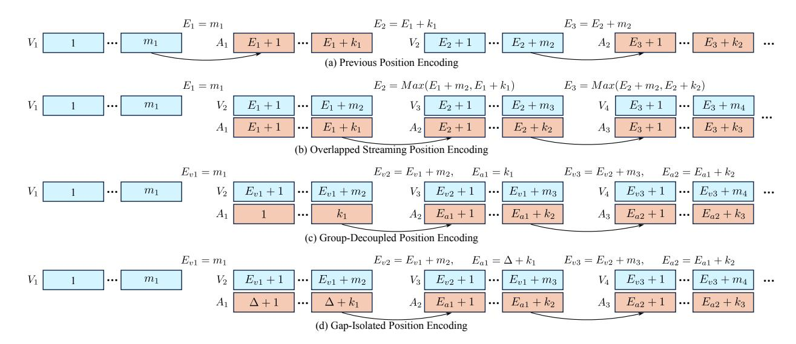
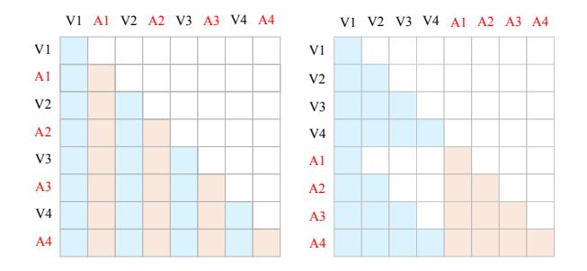

# 3. Position Encoding Strategies

#### 3.1. Limitations of Continuous Position Encoding

Early models such as the LLaVA series [\[23,](#page-9-20) [24\]](#page-9-11) and MiniGPT-4 [\[45\]](#page-9-21) adopt a uniform 1D positional encoding strategy for both visual and textual tokens, following the original design logic of LLMs. While this simplifies training, it overlooks the fact that visual information possesses unique structural dimensions such as height (H), width (W), and temporal axis (T), which differ from text. As a result, recent works increasingly explore 2D or 3D positional encoding strategies (e.g., Qwen2.5-VL [\[1\]](#page-8-0)), enabling the model to better understand the spatial and temporal relationships among tokens. Despite their promising performance, these position encoding strategies all impose a global continuity constraint: every new token must be assigned a position index that strictly follows the used indices. As a result, the position indices of future visual inputs cannot be determined until all previously generated answer tokens have fin-

Figure 2. Comparison of different position encoding strategies, where  $V_i$  represents the video token sequence from the i-th input clip, and  $A_i$  represents the corresponding textual output token sequence. Arrows denote the source dependency for the first generated token of each textual output segment. (a) **Previous Position Encoding**: assigns consecutive positions strictly following the interleaved video-text streaming order; (b) **Overlapped Streaming Position Encoding (OSPE)**: enables video-text streaming parallelism by allowing temporal overlap between encoding and decoding; (c) **Group-Decoupled Position Encoding (GDPE)**: divides video and text into independent groups that maintain intra-group continuity while being inter-group decoupled; (d) **Gap-Isolated Position Encoding (GIPE)**: introduces a fixed gap between groups to fully isolate their index spaces and further reduce cross-modal interference.

ished decoding. Fig. 2(a) illustrates this position encoding paradigm, where  $V_i$  denotes the i-th round of visual input with  $m_i$  visual tokens, and  $A_i$  represents the corresponding textual answer with  $k_i$  text tokens.  $E_i$  indicates the ending token index of either the visual input or textual output in the i-th round. It can be observed that the indexing of the next input or output depends on knowing the length of  $m_i$  or  $k_i$  from the previous round. This creates a hard coupling between prefilling and decoding, forcing the model to alternate between input and output in a strictly sequential manner rather than processing them in parallel.

In summary, continuity in position encoding is the *primary obstacle* preventing streaming MLLMs from achieving real-time interaction. To overcome this issue, we revisit the design of position index allocation and propose a unified framework that relaxes global continuity while preserving intra-modal ordering. We propose three intuitive position encoding strategies: (1) Overlapped Streaming Position Encoding (OSPE), (2) Group-Decoupled Position Encoding (GDPE), and (3) Gap-Isolated Position Encoding (GIPE), which provide alternative ways to relax global continuity and thereby enable genuine input—output parallelism in streaming environments. For illustrative purposes, we describe our methods using a standard 1D positional indexing scheme as a running example.

#### 3.2. Overlapped Streaming Position Encoding

Due to the limitation of position encoding strategies, video segments V and answer tokens A in the previous paradigm

are strictly interleaved. The most intuitive way to break the continuity is to allow the model to continue ingesting  $V_{i+1}$  while generating  $A_i$ , as if  $A_i$  did not occupy additional index space as shown in Fig. 2b. In this case, both  $A_i$  and  $V_{i+1}$  share the same starting position ID, denoted as  $E_i+1$ . The next pair,  $A_{i+1}$  and  $V_{i+2}$ , then start from one greater than the maximum of the end positions of  $A_i$  and  $V_{i+1}$ . In most cases, by the time the model starts generating  $A_{i+1}$ ,  $A_i$  has already been completed, since the number of text tokens is usually much smaller than that of visual tokens.

For subsequent rounds, the same rule applies. The starting index of both  $A_{i+1}$  and  $V_{i+2}$  is assigned as one greater than the maximum  $E_{i+1}$  of the end indices of  $A_i$  and  $V_{i+1}$ :

$$E_{i+1} = \max(E_i + m_{i+1}, E_{i+1} + k_i), \tag{1}$$

where  $E_{i+1} + k_i$  and  $E_i + m_{i+1}$  denote the ending indices of  $A_i$  and  $V_{i+1}$ , respectively. Here,  $k_i$  and  $m_{i+1}$  are the numbers of text tokens and visual tokens in the *i*-th and (i+1)-th rounds. This update rule generalizes the OSPE strategy across all rounds, preserving intra-modal ordering while eliminating the global continuity constraint, thereby enabling true parallel streaming.

#### 3.3. Group-Decoupled Position Encoding

Fig. 2(c) illustrates another possible solution, which divides the entire sequence into two independent groups: one for visual inputs and one for textual outputs. Within each group, position indices are assigned continuously, while continuity across groups is removed. This allows new visual inputs to be indexed independently of the textual generation process, effectively decoupling perception and language in the positional space. In practice, each newly received visual segment Vi+1 is indexed based only on the end position of the previous visual segment Vi , and each newly generated answer Ai+1 is indexed based only on the end position of the previous answer Ai :

$$E_{vi+1} = E_{vi} + m_{i+1},$$
  

$$E_{ai+1} = E_{ai} + k_{i+1},$$
(2)

where mi+1 and ki+1 denote the numbers of visual and text tokens in the (i+1)-th round, respectively.

Figure 3. Causal mask visualization. (*left*) Casual mask for previous video-text interleaved streaming paradigm. (*right*) Casual mask for parallel streaming paradigm.

Although each textual output Ai must still attend to the visual input Vi within the same round, their positional indices reside in separate continuous spaces. This design preserves intra-modal ordering and cross-modal attention while removing inter-modal positional dependency, enabling the model to process visual and textual streams in parallel without violating contextual consistency.

It is worth noting that during training, the input consists of the complete sequences V1, V2, . . . , Vn and A1, A2, . . . , An, where n denotes all video segments and their corresponding answers. In this process, the causal mask must be carefully set: Vi+1 should only attend to V1 through Vi , while Ai should only attend to V1 through Vi and A1 through Ai . A visualization of the causal mask is shown in Figure [3.](#page-4-0)

#### 3.4. Gap-Isolated Position Encoding

While the Group-Decoupled Position Encoding (GDPE) removes cross-modal continuity by assigning independent index spaces to visual and textual groups, their index ranges still remain numerically adjacent within the same overall space. Although it is uncertain whether this adjacency introduces any undesired coupling, we propose Gap-Isolated Position Encoding (GIPE) as a more isolated design that inserts a fixed offset between the two index spaces. Formally, after assigning indices to all visual tokens V1, . . . , Vn, the starting index of the first textual token A1 is ∆ + 1, where ∆ is a constant gap that isolates the two groups in the positional domain. This ensures that all textual tokens occupy an index range strictly separated from that of visual tokens, making the two modalities positionally disjoint. The causal mask configuration of GIPE remains identical to that of GDPE.

