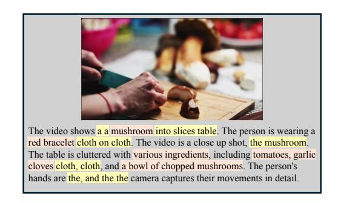
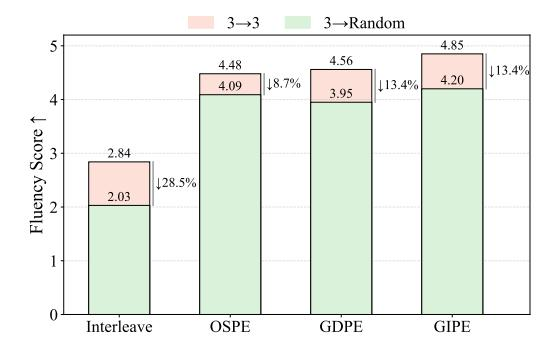

# 4. Experiment

### 4.1. Overview

We conduct a comprehensive evaluation of our three continuity-breaking position encoding strategies—OSPE, GDPE, and GIPE—built upon the representative 3D spatiotemporal encoding used in recent state-of-the-art MLLMs such as Qwen2.5-VL [\[1\]](#page-8-0). Experiments are performed on two tasks, video description and video question answering, to examine how different positional designs affect real-time multimodal understanding.

### 4.2. Tasks

(a) Streaming Video Description. In the streaming scenario, the Video Description task aims to generate natural language descriptions for continuously incoming video streams. Unlike traditional offline captioning, the model must comprehend partial visual context and produce temporally coherent captions on the fly, reflecting real-world applications such as live narration and visual assistance, where minimizing perceptual delay is essential. We adapt the *PE Video Dataset*[\[4\]](#page-8-10), which was originally developed for offline video perception. The PE Video contains high-quality videos with rich motion dynamics and human-refined captions, making it suitable for streaming scenarios.

(b) Streaming Video QA. In the streaming setting, the Video QA task requires the model to answer questions based on continuously arriving video frames rather than full offline clips. The model must reason over partial and evolving visual context, making timely evidence integration essential. We adapt the *FunQA* dataset [\[38\]](#page-9-19), which provides diverse human-annotated videos QA pair. It consists of three subsets: *HumorQA*, *CreativeQA*, and *MagicQA*. For each subset, we evaluate two task types: video description Q&A and counterintuitive reasoning Q&A. This results in six distinct streaming Video QA sub-tasks, allowing us to comprehensively assess the model's ability to perform diverse reasoning under streaming conditions.

### 4.3. Metric

For both PE-Video and FunQA tasks, we follow the standard evaluation metrics widely adopted in video captioning and question-answering, including CIDEr [\[36\]](#page-9-22), BLEU [\[27\]](#page-9-23),

Table 1. Video Description (VD) and VQA on Qwen2.5-VL. Metrics: CIDEr, BLEU-1, BLEU-4, METEOR, ROUGE-L, BLEURT, and Fluency (higher is better). *VD* denotes video description task and *VQA* denotes video QA task. For the video QA task, we evaluate the model across all six subsets, but report only the average performance here. Detailed per-subset results are provided in the Appendix.

| Category            | Method                      | CIDEr | BLEU-1 | BLEU-4 | METEOR | ROUGE-L | BLEURT | Fluency |  |  |  |  |
|---------------------|-----------------------------|-------|--------|--------|--------|---------|--------|---------|--|--|--|--|
|                     | Video Description (VD) task |       |        |        |        |         |        |         |  |  |  |  |
| Offline             | Origin                      | 35.44 | 42.36  | 14.45  | 29.18  | 30.47   | 53.21  | 4.84    |  |  |  |  |
|                     | GDPE                        | 30.86 | 40.26  | 13.64  | 28.49  | 34.12   | 53.19  | 4.93    |  |  |  |  |
| Streaming           | Interleave                  | 20.08 | 44.40  | 14.41  | 27.17  | 34.95   | 44.11  | 2.84    |  |  |  |  |
|                     | OSPE                        | 26.32 | 42.14  | 12.78  | 27.92  | 32.29   | 50.62  | 4.48    |  |  |  |  |
|                     | GDPE                        | 12.52 | 26.32  | 7.42   | 30.03  | 27.37   | 51.53  | 4.56    |  |  |  |  |
|                     | GIPE                        | 28.11 | 40.42  | 11.52  | 29.13  | 30.69   | 51.20  | 4.85    |  |  |  |  |
| Video QA (VQA) task |                             |       |        |        |        |         |        |         |  |  |  |  |
| Offline             | Origin                      | 6.98  | 34.47  | 4.74   | 19.67  | 22.43   | 41.34  | 4.70    |  |  |  |  |
|                     | GDPE                        | 7.25  | 35.23  | 5.13   | 19.50  | 22.98   | 42.04  | 4.52    |  |  |  |  |
| Streaming           | Interleave                  | 3.00  | 21.95  | 1.71   | 13.03  | 18.00   | 31.22  | 3.72    |  |  |  |  |
|                     | OSPE                        | 4.22  | 33.40  | 3.68   | 20.23  | 19.61   | 37.38  | 3.98    |  |  |  |  |
|                     | GDPE                        | 3.22  | 31.32  | 3.32   | 21.82  | 18.96   | 41.16  | 4.13    |  |  |  |  |
|                     | GIPE                        | 3.99  | 30.95  | 2.48   | 17.58  | 19.33   | 37.25  | 4.61    |  |  |  |  |

METEOR [\[2\]](#page-8-16), and ROUGE [\[21\]](#page-9-24). To better capture the semantic fidelity between generated and reference texts, we further include BLEURT [\[30\]](#page-9-25) as a sentence-level quality metric, which measures contextual similarity beyond surface n-gram overlap. However, these automatic metrics still fail to reflect the human-perceived fluency and readability of streaming outputs. Therefore, we additionally employ an LLM-as-Judge evaluation [\[18\]](#page-9-26), where GPT-5 [\[26\]](#page-9-27) assesses each generated sentence from a human-like perspective. Specifically, the model rates linguistic fluency on a 1–5 scale, with higher scores indicating more natural, coherent, and well-structured expressions. The detailed prompt design is provided in the supplementary material.

#### 4.4. Baseline and Experimental Setup

We adopt *Qwen2.5-VL* as the baseline in our experiments, which employs explicit three-dimensional positional encoding (x, y, t) for visual tokens, enabling the model to perceive both spatial structures and temporal dynamics. For textual tokens, the three positional dimensions are kept identical, ensuring consistent positional representation across modalities. This 3D positional design allows the model to jointly reason over spatial, temporal, and semantic contexts within a unified embedding space.

We adopt a *streaming* evaluation setting based on a fixed *wait-*K policy: at test time the model consumes one frame and emits exactly K = 3 tokens, matching the average frame–token ratio (≈ 3) observed in PE-Video and FunQA. Unless otherwise specified, all models are trained and evaluated under this default *wait-*K = 3 configuration. To ensure a fair comparison, all streaming variants share identical data, optimization settings, and temporal pacing.

Following the sampling protocol of *Qwen2.5-VL*, we set the frame rate to 2 fps. Videos shorter than 5 seconds or longer than 30 seconds are removed. For each sample from PE-Video or FunQA, we compute the number of text tokens L in its caption/answer and divide it by the video duration Tvid to obtain the average tokens per second. Let M = Tvid × K denote the expected caption length under the *wait-*K setting. We discard samples where the response length L is smaller than M (insufficient supervision) or more than twice M, since extremely long captions lead to most tokens being emitted at the final frame, causing the generation to behave like offline rather than streaming. Finally, we randomly select 20K samples for training. *More details such as dataset examples and additional experimental results are included in the supplementary material.*

#### 4.5. Performance Analysis

Table [1](#page-5-0) summarizes the performance of all methods under *Offline* and *Streaming* settings. Within the Offline category, the Origin model, which fine-tunes Qwen2.5-VL using its native positional encoding, achieves strong results across both Video Description and Video QA. The Offline-GDPE variant replaces the original positional encoding with a GDPE-style layout while keeping the decoding pro-

Table 2. BLEURT of video description under scheduling disturbance. Models are trained with fixed wait-K=3 and evaluated under both fixed wait-K=3 and test-time Random schedules.

| Setting  | Interleave | OSPE  | GDPE  | GIPE  |
|----------|------------|-------|-------|-------|
| 3→3      | 44.11      | 50.62 | 51.53 | 51.20 |
| 3→Random | 40.56      | 50.71 | 51.76 | 51.56 |

cess fully offline. Its overall performance remains close to that of Origin, indicating that modifying the positional layout alone does not fundamentally disrupt the pretrained visual–language alignment, and that such changes can be successfully compensated through limited fine-tuning.

In the Streaming category, the Interleave model which using native positional encoding shows a severe degradation in linguistic fluency compared with both Offline variants. This degradation arises because visual frames are inserted inside the ongoing text sequence, forcing the model to alternate between writing a partial sentence and processing new visual tokens. As a result, the next generated words no longer attend directly to the preceding text token but first encounter the inserted visual tokens in the attention path. This fragmentation disrupts sentence continuity and leads to substantial drops in fluency-sensitive metrics such as BLEURT, revealing that the interleaving mechanism compromises the continuity and readability of the generated text.

In contrast, our continuity-breaking strategies overcome this issue by restructuring the attention order between input and output tokens, as illustrated in Fig. [3,](#page-4-0) ensuring that visual tokens never interrupt the ongoing textual sequence. Among the three, OSPE resumes each textual segment from the maximum position index of the previous stage's text output and the current stage's visual input, which yields uninterrupted text segments with non-contiguous position indices. GDPE and GIPE enforce an independent and strictly continuous index space for input tokens and output tokens.

Building upon these properties, despite altering the native positional encoding and inference paradigm, the three continuity-breaking strategies achieve competitive performance across the two tasks. Among them, OSPE produces lower BLEURT and fluency scores than GDPE, which is consistent with its non-contiguous index updates that limit coherence. GIPE, on the other hand, benefits from the clear separation between input and output numerical position, as well as the minimized interaction distance between words, allowing it to reach fluency levels close to those of the offline models. However, its ability to capture key semantic content is slightly weaker than GDPE. Considering linguistic quality, GDPE offers the most balanced overall performance and therefore represents the most promising default configuration for future streaming applications.

Figure 4. Example of the generated caption by *Interleave* under random scheduling. Duplicated, fragmented, and grammatically broken segments are highlighted in yellow, while correctly recognized key objects and actions are highlighted in red.

### 4.6. Robustness under Scheduling Disturbance

In real streaming scenarios, video frames and user tokens rarely arrive in a perfectly regular pattern. Multiple frames may be buffered together, responses can be delayed, or the emission rate may fluctuate over time. To simulate such irregular behaviors, we train all models with a fixed wait-K=3 configuration and evaluate them under both the same fixed schedule and a test-time Random schedule, where the number of emitted tokens per step is randomly perturbed. Due to BLEURT's sensitivity to sentence-level coherence, we rely on it to assess the impact of scheduling disturbance on streaming generation.

The results in Table [2](#page-6-0) show that the three continuitybreaking strategies remain stable across settings, whereas Interleave experiences a clear drop under the Random schedule. To further illustrate how scheduling disturbance affects generation, we additionally examine representative outputs together with the fluency evaluation. As shown in Fig. [4,](#page-6-1) Interleave frequently produces duplicated, fragmented, or abruptly truncated phrases when evaluated under random scheduling. These failures arise from the repeated alternation between text generation and visual prefilling, which interrupts sentence progression and causes the model to lose track of its prior context. This qualitative breakdown aligns with the fluency results in Fig. [5,](#page-7-0) where Interleave exhibits a pronounced decline under the Random schedule, far larger than that observed for our continuity-breaking strategies. Taken together, these analyses show that Interleave is highly vulnerable to scheduling disturbance, whereas our methods maintain stable and readable outputs even under irregular emission patterns by preserving an uninterrupted textual index space.

#### 4.7. Theoretical Latency and Speedup Analysis

In the previous experiments, we have demonstrated that the proposed OSPE, GDPE, and GIPE strategies maintain stable performance under streaming conditions. Beyond

Figure 5. LLM-as-Judge fluency under scheduling disturbance. The two colors correspond to: (1) trained and evaluated under fixed wait-K=3, and (2) trained with wait-K=3 but evaluated under random scheduling (disturbance setting).

Figure 6. Theoretical latency and speedup analysis. (a) Parallel streaming overlaps perception and generation to reduce total step latency. (b) The achievable speedup peaks when perception and generation workloads are balanced  $(r \approx 1)$ . Please zoom in for a clearer view of details.

their accuracy, their core advantage lies in enabling parallel perception and generation by breaking the global positional continuity between input and output tokens, thereby substantially reducing end-to-end latency. This subsection further provides a theoretical analysis of the acceleration achieved through such parallelization.

Assume that the entire streaming process consists of N time steps. At each step i, the model receives  $m_i$  visual tokens (perception stage) and generates  $k_i$  textual tokens (generation stage). Let  $R_v$  and  $R_t$  denote the visual processing throughput and text decoding throughput (tokens per second), respectively.

**Interleaved Streaming (Conventional Paradigm).** The total latency for the *i*-th step can be expressed as:

$$T_{\text{interleave},i} = \frac{m_i}{R_v} + \frac{k_i}{R_t}.$$
 (3)

The overall latency across N steps accumulates as:

$$T_{\text{interleave}} = \sum_{i=1}^{N} \left( \frac{m_i}{R_v} + \frac{k_i}{R_t} \right), \tag{4}$$

which implies that each stage must wait until the previous one finishes before proceeding to the next, resulting in strictly serialized perception—generation cycles.

**Parallel Streaming (Our Paradigm).** our OSPE, GDPE, and GIPE strategies allow the model to prefetch visual tokens for the (i+1)-th segment while simultaneously generating textual outputs for the i-th step. Accordingly, the latency per step under ideal parallelization becomes:

$$T_{\text{parallel},i} = \max\left(\frac{m_i}{R_v}, \frac{k_i}{R_t}\right),$$
 (5)

which is evidently smaller than the conventional paradigm. In practice, this formulation can be efficiently implemented on two separate GPUs or computational streams, where the prefill stage and the decode stage operate in parallel with minimal synchronization overhead.

To further quantify the theoretical acceleration, we define the per-step speedup ratio as

$$S_i = \frac{T_{\text{interleave},i}}{T_{\text{parallel},i}} = \frac{\frac{m_i}{R_v} + \frac{k_i}{R_t}}{\max\left(\frac{m_i}{R_v}, \frac{k_i}{R_t}\right)}.$$
 (6)

Let  $r=\frac{m_i/R_v}{k_i/R_t}$  denote the workload ratio between perception and generation, where  $r\gg 1$  indicates vision (input)-dominated latency and  $r\ll 1$  corresponds to text (output)-dominated latency. The relationship between the speedup S and workload ratio r is illustrated in Fig. 6.

This trend can be clearly observed across different tasks. In *video description* tasks, the model processes long video inputs but generates relatively short textual outputs (i.e.,  $r\gg 1$ ), resulting in a vision-dominated runtime and only moderate speedup. In contrast, *video chain-of-thought* (*Video-CoT*) involves both extensive perception and long-form reasoning outputs ( $r\approx 1$ ), placing it near the balanced regime of Fig. 6 and leading to the highest acceleration, where the per-step latency is reduced by nearly half compared with the interleaved baseline.

Overall, the achievable speedup is bounded by approximately  $2\times$  when perception and generation workloads are balanced, whereas the latency asymptotically approaches the perception-only limit as r increases.

