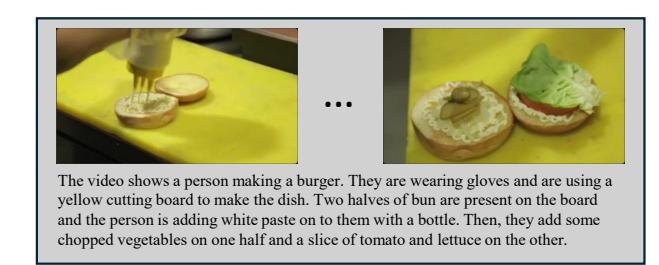

# C. Streaming Input Examples on PE-Video and FunQA

To better illustrate our streaming protocol, we provide a representative example for each task we test.

PE-Video (Streaming Video Description). Fig. [8](#page-11-2) shows a PE-Video example. The ground-truth captions in this dataset are high-quality and often rely heavily on finegrained temporal cues, making the task naturally compat-

Figure 8. PE-Video streaming input example. The model receives frames step-by-step and must produce the caption as the video unfolds.

Figure 9. FunQA streaming input example. The question is fixed, while the video evidence arrives over time and must be integrated incrementally.

ible with a streaming formulation where the model must describe the video as frames arrive.

FunQA (Streaming Video QA). Fig. [9](#page-11-3) shows a FunQA sample. Unlike multiple-choice QA, FunQA requires openended, descriptive answers that explain the underlying visual phenomena. This makes its output form closely aligned with PE-Video captions, enabling a consistent streaming setup where the model integrates incoming frames to produce a free-form answer.

