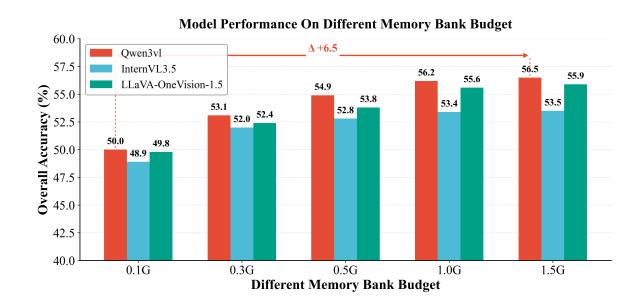

# 4.2 Datasets

We evaluate StreamingEval on two widely used benchmarks for online/streaming video understanding: OVO-Bench [\(Huang et al.,](#page-9-8) [2025\)](#page-9-8) and StreamingBench [\(Lin et al.,](#page-9-11) [2024b\)](#page-9-11). Both benchmarks cover diverse video understanding and question answering formats, designed to test temporal reasoning, event recognition, and multimodal inference.

OVO-Bench. OVO-Bench is designed to evaluate online video understanding capabilities and assess models in three typical online scenarios: Backward Tracing, Real-Time Understanding, and Forward Active Responding. It comprises 12 tasks

and approximately 2,800 fine-grained annotations with precise timestamps, and supports systematic query-based evaluation along the video timeline.

StreamingBench. StreamingBench organizes its task taxonomy around three dimensions: real-time visual understanding, multi-source (audio–visual) understanding, and contextual understanding. The benchmark comprises 18 tasks, 900 video clips, and 4,500 human-annotated QA pairs, and issues multiple queries at different timestamps within the same video to simulate continuous streaming inputs.

## 4.3 Main Results

Table [1](#page-6-0) summarizes the results of 12 mainstream multimodal and online models under StreamingEval. We report task-level performance , system-level deployability metrics , and provide a normalized composite score, StreamingScore, for convenient comparison.

Encoding Efficiency. Most models achieve a peak throughput (MaxFPS) that satisfies the minimum requirement for streaming online inference (1 FPS), indicating basic real-time feasibility on the input side. VideoChatOnline is a notable exception: its MaxFPS is substantially below 1 FPS, revealing a severe bottleneck in the video encoding/stateupdate pipeline. We attribute this to its relatively complex memory-update and cross-frame maintenance mechanism, which significantly reduces the number of frames that can be processed per unit time. At such throughput, the system cannot keep pace with the incoming video stream. In practice, this would induce persistent backlog and accumulating latency, rendering the model difficult to deploy in real-world streaming settings.

Time-to-First-Token. For most models, the TTFT is primarily governed by the size of the visual-memory context window and the overhead of cross-modal context construction, yet it remains below 1.5 seconds in nearly all cases. Consequently, assuming the encoding throughput is sufficient, this level of decoding startup latency is unlikely to constitute a primary obstacle to practical deployment.

Overall Capability Comparison: Offline vs. Online Models As shown in Table [1,](#page-6-0) under our strict streaming protocol, offline VideoLLMs and native online models exhibit a relatively consistent gap in

| Model                                   |      | MaxFPS Mem(GB) TTFT |      |           |                               | StreamingBench |       |                                  |       |                |
|-----------------------------------------|------|---------------------|------|-----------|-------------------------------|----------------|-------|----------------------------------|-------|----------------|
|                                         |      |                     |      | Real-Time | Backward                      | Forward        |       | Overall StreamingScore Real-time |       | StreamingScore |
|                                         |      |                     |      |           | Open-source Offline VideoLLMs |                |       |                                  |       |                |
| Qwen3-VL-8B (Bai et al., 2025)          | 8    | 0.5                 | 0.20 | 78.73     | 51.82                         | 43.46          | 58.00 | 2.21                             | 77.31 | 2.37           |
| InternVL3.5-8B (Wang et al., 2025a)     | 7    | 0.5                 | 0.21 | 74.31     | 40.89                         | 46.14          | 53.78 | 2.04                             | 77.96 | 2.24           |
| Llava-OV1.5-8B (An et al., 2025)        | 7    | 0.5                 | 0.21 | 75.51     | 45.80                         | 45.44          | 55.58 | 2.05                             | 76.19 | 2.22           |
| MiniCPM-V4.5-8B (Yu et al., 2025)       | 6    | 0.5                 | 0.18 | 74.55     | 54.52                         | 42.05          | 57.04 | 2.07                             | 76.55 | 2.23           |
| VideoLLaMA3-7B (Zhang et al., 2025a)    | 7    | 0.5                 | 0.56 | 55.73     | 45.32                         | 45.88          | 48.44 | 1.58                             | 68.90 | 1.72           |
| VideoChat-7B (Li et al., 2023)          | 9    | 0.5                 | 0.52 | 69.77     | 40.25                         | 43.27          | 49.95 | 1.73                             | 72.22 | 1.89           |
|                                         |      |                     |      |           | Open-source Online Video-LLMs |                |       |                                  |       |                |
| Flash-VStream-7B (Zhang et al., 2024)   | 8    | 0.35                | 0.12 | 29.86     | 25.35                         | 44.23          | 33.15 | 2.34                             | 23.23 | 2.18           |
| Flash-VStream-7B* (Zhang et al., 2025b) | 1    | 0.66                | 1.31 | 59.88     | 46.43                         | 47.41          | 50.31 | 0.74                             | 74.48 | 0.81           |
| ReKV-7B (Di et al., 2025)               | 5    | 0.50                | 1.29 | 57.34     | 44.69                         | 44.35          | 48.00 | 1.18                             | 64.53 | 1.27           |
| StreamForest-7B (Zeng et al., 2025)     | 4    | 0.46                | 0.98 | 61.20     | 52.02                         | 53.49          | 55.57 | 1.26                             | 77.26 | 1.37           |
| TimeChat-Online-7B (Yao et al., 2025)   | 7    | 0.34                | 0.62 | 58.60     | 42.00                         | 36.40          | 45.67 | 1.67                             | 73.64 | 1.88           |
| VideoChatOnline-4B (Huang et al., 2025) | 0.14 | 0.32                | 0.18 | 43.97     | 37.40                         | 39.69          | 40.40 | 0.92                             | 58.81 | 1.19           |

Table 1: Overall results on OVO-Bench and StreamingBench. For OVO-Bench, we report the average scores of the Real-Time, Backward, and Forward task clusters; for StreamingBench, we report the overall Real-time average score, where the streaming score is computed following the definition described in the main text. Detailed results are provided in Table [3.](#page-12-0)

question-answering accuracy. Overall, offline models tend to achieve higher accuracy on the aggregate scores of OVO-Bench and StreamingBench, reflecting their stronger representation and reasoning capacity, as well as their advantage in more fully leveraging visual evidence during answer generation. In contrast, to satisfy causal constraints and limited state updates, native online models typically rely on incremental memory mechanisms that compress, truncate, or selectively retrieve historical information, which is more prone to information loss on tasks requiring long-range temporal dependencies or fine-grained cues, thereby resulting in lower accuracy. Moreover, from the perspective of streaming interactivity, although offline models are often superior in accuracy, their streaming scores on OVO/SB do not necessarily lead accordingly; instead, some native online models attain higher streaming scores by offering faster responses and a more stable online pace under causal constraints, further revealing a systematic trade-off between strict streaming deployability and task accuracy. Overall, the results indicate a practical tension between strict online deployability and task accuracy: retaining critical information more effectively under limited resources remains a key direction for improving accuracy in streaming scenarios.

Performance Differences Across Task Categories. The per-category results in Table [1](#page-6-0) reveal systematic performance divergences between offline and online VideoLLMs across task types.

For Backward Tracing, which relies on long-

horizon temporal integration and reasoning over extended visual history, offline models are typically stronger, suggesting that full-context modeling better supports retrospective inference and evidence aggregation.

By contrast, for Forward Active Responding which emphasizes rapid decision making and incremental interaction under strict streaming constraints—online models are largely on par with offline counterparts, and can even outperform them in some cases, highlighting the structural benefits of native online mechanisms for continuous updates and timely responses.

For Real-Time Visual Perception, offline models remain generally superior overall. This indicates that even when the task is more "current-segment" oriented, online approaches may still suffer from information compression and noise accumulation induced by limited buffering and incremental updates, which can undermine the stability of finegrained visual representations compared to offline models with unified context encoding.

#### 4.4 Further Discussion

Sensitivity to the Memory\_bank Budget. To evaluate model performance under different historical-cache budgets, we keep all other protocol settings fixed and vary the Memory\_bank budget over {1.5G, 1.0G, 0.5G, 0.3G, 0.1G}, reporting the resulting changes in Overall Accuracy (Figure [3\)](#page-7-0). As shown, accuracy nearly saturates in the relatively ample regime of 1.0G–1.5G: in-

Figure 3: Overall accuracy versus memory\_bank budget for three representative models. Detailed results are provided in Table [6.](#page-14-0)

creasing the budget from 1.0G to 1.5G yields only marginal gains, indicating diminishing returns from further cache expansion. In contrast, as the budget is tightened from 1.0G to 0.5G, 0.3G, and finally 0.1G, all three models exhibit a clear accuracy drop, suggesting that performance is largely constrained by a historical-information bottleneck. While the overall ranking remains consistent, the scores converge substantially under the most restrictive 0.1G setting, implying that different methods are more strongly capped by the shared cache constraint. Meanwhile, Qwen3-VL still retains relatively higher accuracy at this extreme budget, reflecting more efficient extraction and utilization of limited historical information and better suitability for resource-constrained deployment.

Different Input Resolution. Different input resolution determines how much visual detail is available per frame. With Memory\_bank fixed (set to the default in Table [2\)](#page-7-1) and all other protocol settings unchanged, we evaluate three common input sizes (448×448, 336×336, and 224×224), using a unified video-frame resizing pipeline to ensure consistent processing (Table [2\)](#page-7-1). As shown in Table [2,](#page-7-1) all three representative models achieve their best accuracy at the highest resolution of 448×448; as the resolution decreases, performance drops to varying degrees, indicating a stable degradation when downscaling inputs. The models also differ in robustness to resolution reduction: Qwen3-VL degrades more mildly, whereas InternVL 3.5 shows a more pronounced drop, suggesting stronger reliance on the additional fine-grained details provided by higher resolution; Flash-VStream also deteriorates as resolution decreases and remains substantially behind the other two in absolute accuracy. From the perspective of "downscaling loss," the drop from 448×448 to 336×336 is relatively

| Input Res. | Qwen3-VL | InternVL 3.5 | FlashVstream |
|------------|----------|--------------|--------------|
| 224×224    | 51.99    | 48.93        | 33.15        |
| 336×336    | 52.95    | 51.70        | 34.67        |
| 448×448    | 53.34    | 52.75        | 35.73        |

Table 2: Overall results under different input resolutions on OVO-Bench. We report the overall score for each model under 224×224, 336×336, and 448×448 inputs. Detailed results are provided in Table [7.](#page-14-1)

small, while the drop from 336×336 to 224×224 is more evident, implying that further downscaling more quickly hits a detail bottleneck. Overall, higher resolution improves accuracy but comes with higher computation and latency costs; under deployment budget constraints, 336×336 is often a more robust trade-off between effectiveness and cost, whereas 224×224 is cheaper but incurs a notably larger performance decrease.

