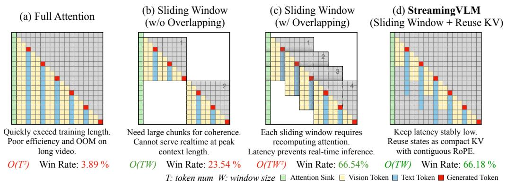
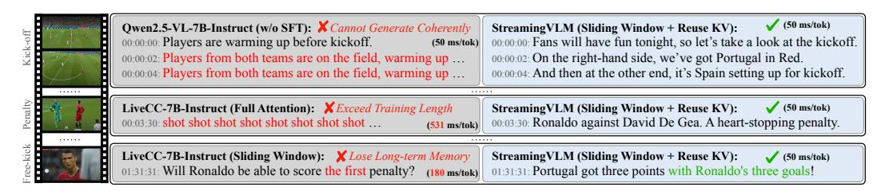

# 1 INTRODUCTION

VLMs could power autonomous driving, embodied agents, and real-time assistants, but they face critical challenges: understanding near-infinite video, responding in real time stably. To accept infinite input, common ideas are Sliding Window Attention with or without overlapping. As shown in Figure [1:](#page-1-0) (a) *Full Attention* suffers from heavy memory and latency; (b) *Sliding Window (w/o Overlapping)* resets context frequently and breaks coherence; (c) *Sliding Window Attention (w/ Overlapping)* keeps recent tokens but recomputes attention many times, which hurts efficiency.

Aligning training with inference adds further challenges. Real streaming requires taking infinite visual input in real time and replying with very low delay, but training cannot use extremely long videos. Current approaches to KV cache eviction often lack alignment with the training phase. How to train on short videos and still enable the model to reason over very long streams remains underexplored. This leads to our core question: *How can we train VLMs to understand video chunks in real time and reason stably over infinite video, moving toward human-like intelligence?*

In this paper, we propose StreamingVLM, a unified framework that aligns training with streaming inference and a dataset curation pipeline. The key ideas are: (1) Train the VLM with full attention on short, overlapped video chunks. (2) At inference, use an attention sink and a sliding window with to handle infinite video, aligned with training. (3) Reuse past KV states and use contiguous position IDs to keep inference stable.

∗Equal contribution

Figure 1: Illustration of StreamingVLM vs. existing VLMs. Let T be video length and W the sliding-window size. (a) *Full Attention*: O(T 2 ) cost; unbounded memory; degrades beyond training length. (b) *Sliding Window (no overlap)*: bounded memory but short chunks break coherence; long chunks raise latency. (c) *Sliding Window (overlap)*: recomputation per window yields high latency. (d) *StreamingVLM* (Sliding Window + Reuse KV): reuses states of attention sinks, a short vision window and long text window, preserving history at low latency. "Win rate" is the pairwise win share vs. GPT-4o mini (judge: GPT-5).

Using this framework, we build Inf-Streams-Train, a sports commentary SFT dataset of over 4000 hours and Inf-Streams-Eval, a new benchmark with videos averaging over two hours that requires dense, per-second alignment between frames and text. Then, we fine-tune Qwen-2.5-VL-7B-Instruct for real-time commentary, yielding StreamingVLM that can understand infinite video and response in real time. We evaluate StreamingVLM on captioning and VQA tasks, including LiveCC-Sports-3K CC and Inf-Streams-Eval for captioning, and LongVideoBench (and related VQA benchmarks) for video understanding [\(Chen et al., 2025a;](#page-9-0) [Wang et al., 2025a\)](#page-10-0).

On captioning tasks, StreamingVLM, with its infinite video understanding, outperforms existing models such as Livecc-7B-Instruct. As shown in Figure [2,](#page-1-1) StreamingVLM performs well on practical tasks: it can provide continuous commentary for more than two hours on sports games. On VQA tasks, even without any VQA fine-tuning, StreamingVLM still improves on LongVideoBench by +4.30. In terms of efficiency, StreamingVLM maintains a low and stable latency, making it highly suitable for real-world streaming understanding tasks.

Figure 2: Issues with existing VLMs. (1) Without SFT, models cannot generate cross-round content coherently. (2) With full attention, the context exceeds the training length after processing 2–5 minutes of video and latency becomes prohibitive. (3) With a sliding window, models cannot retain enough context to benefit from efficiency. In contrast, StreamingVLM addresses these issues, enabling coherent commentary, real-time generation, and long-term history.

