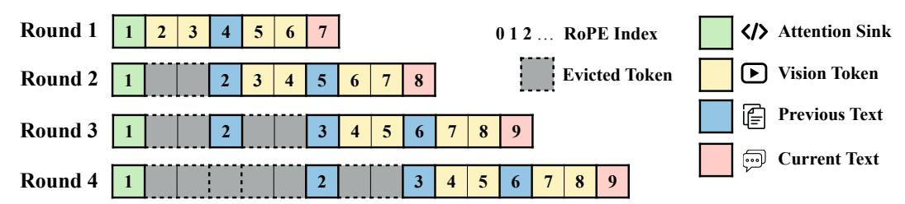
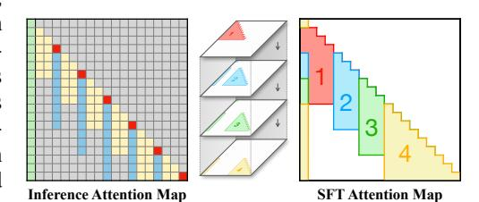
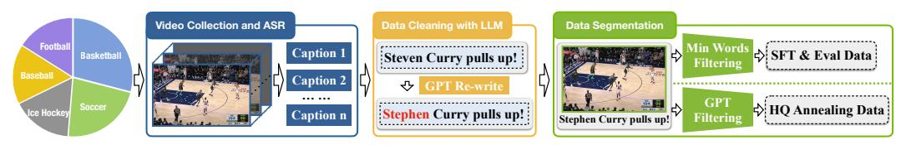

# 2 METHOD

In this section, we introduce our method for the model and the data. This part has three components: (1) inference scheme for vision–language processing that supports low-latency updates on infinite video used by StreamingVLM; (2) a training strategy that equips StreamingVLM with streaming inference capability; and (3) the data curation pipelines that provides long-horizon, real-time data for training and a new benchmark, Inf-Streams.

Figure 3: **Inference scheme of StreamingVLM.** We keep 512 attention-sink tokens to stabilize attention, a long text window of 512 recent tokens to preserve long-term memory, and a short vision window covering 16 seconds to track ongoing actions. We use *Contiguous RoPE*: indices are shifted to stay within a fixed range, keeping positions in-distribution and within the training length.

#### 2.1 Inference Scheme of StreamingVLM

This section describes the StreamingVLM inference structure shown in Figure 3. These design choices reduce the computation in Figure 1(c) while maintaining comparable performance.

Streaming-aware KV Cache The key idea is to maintain a compact and stable KV cache by reusing previous states during streaming inference. As new video frames arrive, we **reuse** the states of (i) a set of sink text tokens — including the system and previous text — of length  $T_{\rm sink}$ ; (ii) a long window of the most recent text tokens of length  $T_{\rm window}$ ; and (iii) a short window of the most recent vision tokens of length  $V_{\rm window}$ . In Figure 3, the cache lengths are  $T_{\rm sink}=1$ ,  $T_{\rm window}=3$ , and  $V_{\rm window}=4$ .

With this structure, older vision tokens are evicted first; early text is evicted only when the budget is exceeded. Instead of recomputing previous tokens, this asymmetric retention keep the lowest computation while maintaining sufficient context for coherent generation over time, yielding comparable performance with Sliding Window with Overlapping (Figure 1(c)).

**Contiguous RoPE** To prevent positional drift after eviction, we apply contiguous rotary positional embeddings (RoPE). When earlier tokens are removed, the RoPE indices of subsequent and incoming tokens are shifted so that their positions remain numerically contiguous with the last retained token. Once the video length surpasses the total window size, the effective RoPE indices stop growing and remain within a bounded range. This keeps positional values in-distribution and stabilizes long-horizon streaming inference.

When applied to the Qwen-VL family, which uses 3D positional embeddings for visual tokens, we use *contiguous 3D RoPE*. The RoPE index is still left-shifted to stay contiguous; for vision tokens, we build 3D indices (time, height, width) and assemble them by the 3D rule, matching the interleaved vision–text layout.

### 2.2 Training Strategy

To endow the model with the ability to follow the streaming inference pattern in Figure 3 while keeping training simple, we adopt an *overlapped-chunk*, *full-attention* strategy (see Figure 4). The left panel of Figure 4 illustrates the attention at inference time. In this Figure 4, the cache lengths are the same to Figure 3, with  $T_{\rm sink}=1$ ,  $T_{\rm window}=3$ , and  $T_{\rm window}=4$ .

During training (middle panel of Figure 4), rather than replicating the exact sliding-window schedule used at inference, we split a long video stream into consecutive chunks  $\{C_1, C_2, \ldots\}$  of length W frames, with temporal overlap O frames between  $C_i$  and  $C_{i+1}$  (0 < O < W). Each chunk is treated as a training instance in which vision and text tokens (V/T) are sampled and interleaved at 1 s intervals. We apply full attention within a chunk, i.e., every token may attend to all tokens inside the same chunk.

As highlighted in the right panel of Figure 4, this overlapped full-attention supervision closely approximates the effective attention pattern at inference — attention sink, a longer window of recent text, and a shorter window of recent vision retained in the compact KV cache. Aligning training

supervision with the test-time context teaches the model the intended recency bias and yields stable streaming behavior without training on prohibitively long, quadratic-cost contexts.

Importantly, mirroring the inference-time schedule, we interleave vision and text tokens within each training chunk — rather than adopting the common VLM paradigm that places all vision tokens before text. We compute loss only on text positions aligned to the per-second narration; when a second has no narration, we insert a placeholder token "..." in that slot while keeping the interleaved V/T layout. This supervision teaches the model to synchronize generation with the stream—learning when to speak and when to remain silent—and consequently endows StreamingVLM with reliable streaming narration behavior at inference.

Figure 4: Training Strategy. We train with *overlapped full attention* that mimics test-time attention. (1), (2), (3) and (4) are four training samples, both keeping the attention sinks and overlap later in time.

### 2.3 DATA CURATION PIPELINE

Figure 5: Data Curation Pipeline. We collect games from five sports—basketball, soccer, American football, ice hockey, and baseball. We use GPT to edit or reject low-quality segments, yielding 2,449 full games. We then build two datasets through separate pipelines: an SFT dataset using overlapped chunking, and a high-quality annealing dataset focused on real-time actions.

### 2.3.1 VIDEO COLLECTION AND ASR

As shown in Figure [5,](#page-3-1) we collected game videos from five sports: basketball, soccer, ice hockey, baseball, and American football, including 712 basketball games, 544 soccer games, 402 ice hockey games, 399 baseball games, and 392 American football games. The commentary language is English. To ensure video quality and read speed, we constrained the video resolution to 360P–720P with a frame rate of 24 FPS. First, we used the WhisperX model to extract real-time speech (ASR) from these games, obtaining an initial corpus of videos with a total duration of over 6,000 hours and their corresponding real-time commentary.

### 2.3.2 DATA CLEANING

In complete commentary videos, there are often many useless segments, such as advertisements and host monologues. These segments have weak connections between visual content and ASR semantics, making it impossible for the model to infer content from the footage. In addition, the ASR model sometimes fails to correctly recognize details such as player names and team names.

Therefore, we set rules and used GPT to clean these data. We first split a game into 120-second segments and concatenate the commentary within each segment, then split it into sentences. Using the segment and the video title (including game time and both teams) as context, we ask the GPT-5 model to make a decision according to the rules, with options "keep," "delete," and "edit" each sentence in one chunk. "Keep" means the content is game commentary and is correct. "Edit" means it is commentary but needs to modify some details, such as incorrect names, and the corrected complete sentence is returned. "Delete" means non-compliant content that should not appear in the training data.

For kept sentences, the timestamps are consistent with the ASR results; for edited sentences, we evenly distribute the original sentence duration over each word of the edited sentence (since a sentence typically lasts about 3–5 seconds, the error is within a tolerable range). In the original ASR data, 46.32% were kept, 37.89% were edited, and 15.79% were deleted, ultimately forming the raw video-commentary pairs of our data.

