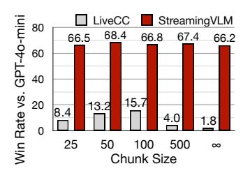
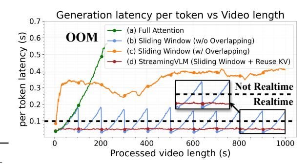

# 3 EXPERIMENTS

In this section, we first describe the implementation details, then evaluate on video captioning and VQA against strong baselines. We next test the efficiency of StreamingVLM. Finally, we run ablations to better understand its behavior.

### 3.1 EXPERIMENTAL SETUP

Training We fine-tune StreamingVLM from Qwen2.5-VL-Instruct-7B [\(Bai et al., 2025\)](#page-9-1). Step 1 teaches the model the infinite streaming inference pattern. We train on our SFT set (525K streaming samples) and on LiveCC's Live-WhisperX-526K (526K streaming samples) [\(Chen et al., 2025a\)](#page-9-0). Step 2 uses our high-quality annealing data (14K streaming samples, each 16–64 s with detailed actions) to boost real-time action commentary and improve human experience. After these two stages, we obtain StreamingVLM. The total compute is about 128 H100-days.

Baselines We select strong baselines to compare with StreamingVLM. For the captioning task, we use GPT-4o mini to show commentary strength, and Livecc-7B-Instruct, which is trained on 5.5M YouTube video clips (30 – 240 s) and 178K Video-Question-Answer samples, working well on short videos commentary [\(OpenAI, 2024;](#page-9-2) [Chen et al., 2025a\)](#page-9-0). We also include ReKV, a strong trainingfree streaming-inference method [\(Di et al., 2025\)](#page-9-3). Due to design limits, GPT-4o mini is evaluated on Inf-Streams-Eval in the *chunk* setting, not the infinite mode used by StreamingVLM. LiveCC-7B-Instruct is tested in both *chunked* and *infinite* settings. For the VQA task, we use Qwen2.5-VL-7B-Instruct, which is the base model before SFT for StreamingVLM, to show that our SFT pipeline improves the base ability [\(Bai et al., 2025\)](#page-9-1).

Table 1: Captioning accuracy (win rate vs. baselines). Baselines with/without chunking fall short; StreamingVLM surpasses strong models such as GPT-4o and produces compelling commentary.(Superscripts for Inf-Streams-Eval:  $^{\infty}$  = infinite;  $^{\dagger}$  = chunk length 100s. On Livecc-Sports-3K CC, LiveCC has only one mode and cannot be compared against itself, so we show "–".

| Win Rate A vs. B                                        | Inf-                 | Inf-Streams-Eval    |                                  |                       | Livecc-Sports-3K cc   |                       |            |  |
|---------------------------------------------------------|----------------------|---------------------|----------------------------------|-----------------------|-----------------------|-----------------------|------------|--|
| Model B Model A                                      | GPT-40 †  | Livecc † | $\operatorname{Livecc}^{\infty}$ | LLaVA                 | GPT-40                | Gemini                | Livecc     |  |
| Qwen-2.5-VL-7B-Instruct †                               | 0.01                 | 20.44               | 95.97                            | 24.50                 | 16.25                 | 28.38                 | 34.11      |  |
| Livecc-7B-Instruct †                                    | 15.73                | -                   | _                                | -                     | _                     | _                     | _          |  |
| Livecc-7B-Instruct $^{\infty}$ StreamingVLM $^{\infty}$ | 1.82 <b>66.18</b> | - 87.81          | 99.12                            | 41.50 <b>47.33</b> | 40.06 <b>45.59</b> | 39.73 <b>44.21</b> | - 56.19 |  |

Figure 6: For existing VLMs, balancing cross-chunk coherence with training-length limits is challenging.

Benchmark We evaluate real-time captioning and video understanding across a broad set of tasks. For captioning, we use our Inf-Streams-Eval (average length 2.12 hours), which tests long-horizon commentary and the LiveSports3K-CC benchmark (49 sports, 416 clips, each ≥ 10 s) (Chen et al., 2025a). For video understanding, we evaluate StreamingVLM on four public suites. VideoMME: a multi-task set (QA, caption, grounding) covering short and long videos for general comprehension (Fu et al., 2025). MVBench: fine-grained skills on short clips (actions, objects, counting, temporal order) (Li et al., 2024b). LongVideoBench: long-video QA that requires long-term memory and cross-segment reasoning (Wang et al., 2025a). OVOBench: video QA that tests real-time understanding and streaming perception (Li et al., 2025).

#### 3.2 ACCURACY RESULTS

#### 3.2.1 CAPTIONING

We first compare our inference strategy with ReKV on the captioning task. We observe a paradox for training-free ReKV: models without task-specific fine-tuning perform poorly, yet models that are specially fine-tuned (e.g., StreamingVLM) rely on a fixed context format that ReKV's eviction policy disrupts, often yielding no output. In contrast, StreamingVLM's training—inference consistent design resolves this issue.

Then, we evaluate StreamingVLM, Qwen-2.5-VL-7B-Instruct, and LiveCC-7B-Instruct on LiveCC-3K-Sports-CC and Inf-Streams-Eval. As shown in Table 1, on Inf-Streams-Eval, Qwen-2.5-VL-7B-Instruct cannot keep continuous commentary and thus performs poorly. LiveCC-7B-Instruct works

Table 2: **Training-inference consistency surpasses ReKV.** Non-fine-tuned models lack capability of real-time captioning, while with fine-tuning models ReKV's eviction policy disrupts context, frequently resulting in no output. (Superscripts for Inf-Streams-Eval:  $^{\infty}$  = infinite;  $^{\dagger}$  = chunk length 100s.)

| Win Rate                           | Inf-Streams-Eval    |                     |         |  |  |  |
|------------------------------------|---------------------|---------------------|---------|--|--|--|
| Model B Model A                 | GPT-40 † | Livecc † | Livecc∞ |  |  |  |
| Qwen (+ ReKV) ∞         | 0.00                | 19.56               | 63.57   |  |  |  |
| Streaming VLM (+ ReKV) $^{\infty}$ | 0.00                | 0.00                | 0.00    |  |  |  |
| Streaming VLM (+ Ours) $^{\infty}$ | 66.18               | 87.81               | 99.12   |  |  |  |

better with *chunked* inference. Figure 6 further shows that short chunks break coherence; these designs do not support infinite inference, and with long chunks they soon exceed the training length and degrade.

In contrast, Streaming VLM runs in infinite mode; its long-term memory and streaming video perception give it a clear edge, surpassing GPT-40 mini in commentary quality. Figure 2 (the figure shown) illustrates a real case where Streaming VLM maintains coherent output, real-time latency, and long-term memory, addressing the core challenge of real-time perception for infinite video streams. On LiveCC-3K-Sports-CC, Streaming VLM also performs better than baselines, showing stable streaming captioning on videos of various length.

#### 3.2.2 VQA

We evaluate Streaming VLM and its base model, Qwen-2.5-VL-7B-Instruct, on four VQA tasks. As shown in Table 3, even without any VQA SFT, Streaming VLM outperforms the base on all tasks,

Table 3: VQA results comparing Streaming VLM with its base model. Without any VQA fine-tuning, Streaming VLM delivers consistent accuracy gains across all tasks, with the strongest improvements on long-horizon and real-time settings.

|                         | MVBench | Video MME (w/o sub.) | Long Video Bench | OVOBench (Realtime) |
|-------------------------|---------|----------------------|------------------|---------------------|
| Qwen-2.5-VL-7B-Instruct |         | 65.10                | 54.70            | 56.00               |
| StreamingVLM            | 69.16   | 65.10                | 59.00            | 61.96               |

Table 4: Ablation of RoPE on captioning (win rate). Native RoPE drops on infinite streams; 100 s chunking partly recovers but hurts long-term memory; contiguous RoPE keeps indices bounded and sustains infinite performance. (Superscripts for Inf-Streams-Eval:  $^{\infty}$  = infinite;  $^{\dagger}$  = chunk length 100 s.)

| Win Rate A vs. B        | Inf-Streams-Eval    |                     |         |  |  |  |
|-------------------------|---------------------|---------------------|---------|--|--|--|
| Model B Model A      | GPT-40 † | Livecc † | Livecc∝ |  |  |  |
| Native †                | 63.23               | 74.00               | 98.07   |  |  |  |
| Native $^{\infty}$      | 25.09               | 59.42               | 60.32   |  |  |  |
| Contiguous ∞ | 66.18               | 87.81               | 99.12   |  |  |  |

Figure 7: Per-token latency vs. video length. Full attention hits OOM; sliding window w/o Overlapping spikes above real time; sliding window w/ Overlapping remains inefficient; Streaming VLM latency stays low and stable. The dashed line marks the real-time threshold (10 tokens/s  $\Rightarrow \leq 0.1$  s per token).

showing that our SFT improves general visual ability. OVOBench Realtime tests understanding of the immediate, streaming scene. On this streaming perception task, StreamingVLM improves by **5.96%**. This highlights the strength of Inf-Streams-Train and our training strategy, which enhances the model's core abilities.

## 3.3 Efficiency Tests

As shown in Figure 7, we report per-token latency for the three methods in Figure 1 on infinite commentary: VLMs with full attention, sliding window attention (w/o overlapping), sliding window attention (w/overlapping), and the inference strategy of Streaming VLM, respectively correspond to panels (a), (b), (c), and (d) in the Figure 1.

Real-time replies require latency below a fixed threshold as the dashed line. Full attention soon exceed the limit and OOM. Sliding window (w/o overlapping) needs large chunks for coherence, so it shows a periodic latency pattern: at the start of each chunk the model rebuilds context and the commentary is not coherent with the past; later in the chunk, latency rises sharply and fails to meet real-time needs. Sliding window (w/ overlapping) remains inefficient for computation redundancy. StreamingVLM keeps fixed context length and reuses KV, maintains lower and stable latency, and supports real-time commentary at 8 FPS on a single NVIDIA H100.

#### 3.4 ABLATION STUDY

#### 3.4.1 Contiguous RoPE

We study the effect of contiguous RoPE indices. Since we train with full attention, training only uses the native RoPE. At inference, we compare contiguous RoPE with the native version. As shown in Table 4, native RoPE degrades sharply on infinite streams because its index grows fast and exceeds the training range. Splitting the video into 100 s chunks can partly recover accuracy, but it harms long-term conherence. With *contiguous RoPE*, the position index stays bounded, so the model supports infinite inference without loss.

Table 5: Ablation of sliding window and sink size with accuracy on captioning tasks (win rate). **Left**: effect of  $T_{\rm sink}$  and  $T_{\rm window}$ , trained with  $V_{\rm window}=16\,{\rm s}$ . **Right**: effect of  $V_{\rm window}$ , trained with  $T_{\rm sink}=512$  and  $T_{\rm window}=512$ . (Superscripts for Inf-Streams-Eval:  $^{\infty}=$  infinite;  $^{\dagger}=$  chunk length 100s. )

| Infe           | er args          | SFT args       |                  | Inf-Streams-Eval (Basketball) |                     |                                  |  |
|----------------|------------------|----------------|------------------|-------------------------------|---------------------|----------------------------------|--|
| $T_{\rm sink}$ | $T_{\rm window}$ | $T_{\rm sink}$ | $T_{\rm window}$ | GPT-40 †           | Livecc † | $\operatorname{Livecc}^{\infty}$ |  |
| 512            | 0                | 512            | 512              | 69.68                         | 89.42               | 99.19                            |  |
| 0              | 512              | 512            | 512              | 66.76                         | 86.03               | 98.69                            |  |
| 256            | 256              | 512            | 512              | 70.17                         | 91.79               | 99.62                            |  |
| 1024           | 1024             | 512            | 512              | 71.43                         | 91.69               | 99.84                            |  |
| $\infty$       | $\infty$         | $\infty$       | $\infty$         | 60.41                         | 72.08               | 98.55                            |  |
| 512            | 512              | 512            | 512              | 73.64                         | 92.33               | 99.38                            |  |

| $V_{\rm window}$ | Inf-Streams-Eval    |                     |                 |  |  |  |  |
|------------------|---------------------|---------------------|-----------------|--|--|--|--|
| Win Rate vs.     | GPT-40 † | Livecc † | $Livecc^\infty$ |  |  |  |  |
| 0 s              | 52.90               | 77.49               | 97.56           |  |  |  |  |
| 1 s              | 63.46               | 83.24               | 98.18           |  |  |  |  |
| 4 s              | 66.08               | 83.86               | 98.73           |  |  |  |  |
| 8 s              | 65.66               | 85.09               | 99.14           |  |  |  |  |
| 32 s             | 65.49               | 85.58               | 99.06           |  |  |  |  |
| 16 s             | 66.18               | 87.81               | 99.38           |  |  |  |  |

Table 6: Ablation of SFT strategy and dataset on captioning and VQA. Overlapped SFT strategy improves over the Live-WhisperX-526K base, and adding the high-quality annealing data brings further improvements, especially for infinite streaming task Inf-Streams-Eval. (Superscripts for Inf-Streams-Eval:  $^{\infty}$  = infinite;  $^{\dagger}$  = chunk length 100s.)

| Win Rate A vs. B                          | Inf-Streams-Eval    |         |         | Livecc-Sports-3K cc |        |        | MVBench    | MVBench Video MME Long Video Bench OVO Bench |          |       |          |
|-------------------------------------------|---------------------|---------|---------|---------------------|--------|--------|------------|----------------------------------------------|----------|-------|----------|
| Model B Model A                        | GPT-40 † | Livecc† | Livecc∞ | LLaVA               | GPT-40 | Gemini | Livecc Sco | ore                                          | w/o sub. |       | Realtime |
| Qwen-2.5-VL-7B-Instruct †                 | 0.01                | 20.44   | 95.97   | 24.50               | 16.25  | 28.38  | 34.11      | 67.34                                        | 65.10    | 54.70 | 56.00    |
| + Live-WhisperX-526K ∞                    | 32.17               | 56.52   | 99.05   | 42.77               | 41.86  | 39.37  | 47.80      | 63.71                                        | 62.10    | 54.30 | 57.69    |
| + Inf-Streams-Train ∞                     | 63.46               | 83.82   | 98.95   | 46.45               | 45.48  | 44.27  | 53.07      | 68.66                                        | 64.90    | 59.00 | 60.55    |
| + High-Quality Annealing Data $^{\infty}$ | 66.18               | 87.81   | 99.12   | 47.33               | 45.59  | 44.39  | 56.19      | 69.16                                        | 65.10    | 59.00 | 61.96    |

### 3.4.2 SLIDING WINDOW AND SINK

We firstly verify the value of evicting text during training. Then we search for the best inference settings of  $T_{\text{sink}}$ ,  $T_{\text{window}}$ ,  $V_{\text{window}}$ .

First, the left table in Table 5 ablates the lengths of the attention sink and text window. Here  $T_{\rm sink}$  and  $T_{\rm window}$  are the lengths of previous attention sink and text window kept during both training and inference. We take a basketball-only subset of the SFT data and train two models: one with text eviction using  $T_{\rm sink}=512$  and  $T_{\rm window}=512$ , and one without eviction. On the Inf-Streams-Eval (basketball subset), we evaluate each model under its matching policy (evict vs. no-evict). The left table in table 5 shows that, for infinite inference, evicting previous text tokens is important and improves performance.

Next, we study different choices of  $V_{\rm window}$ . The right table in Table 5 shows that a 16 s visual window is a good choice: it is long enough to cover recent actions, yet short enough to stay efficient. In contrast, keeping 0 s of vision context leads to a clear drop, confirming that retaining recent vision tokens for continuous actions is essential.

#### 3.4.3 TRAINING STRATEGY AND DATASET

We study the effect of our SFT data and high-quality annealing data. The SFT set teaches the model the infinite streaming inference pattern, while the high-quality annealing data further improves commentary quality.

**SFT Strategy** As shown in Table 6, with our overlapped training strategy, our SFT subset helps the model adapt to the interleaved vision–text pattern and to understand very long videos. Compared with a model trained only on Live-WhisperX-526K, training on the overlapped SFT data strengthens perception of infinite video, yielding clear gains +31.29 (win rate against GPT-40-mini) on Inf-Streams-Eval and +3.68 (win rate against LLaVA-Video-72B-Qwen2) on Livecc-Sports-3K cc.

**High-quality Annealing Data** Our high-quality annealing data focus on real-time content and further boosts model ability. As shown in Table 6, we compare training with and without the high-quality annealing data. We can observe significant gains on both captioning and VQA benchmarks.

