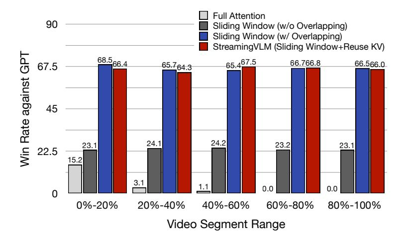

# A APPENDIX

### A.1 LLM USAGE STATEMENT

We acknowledge the use of Large Language Models (specifically Claude and GPT-5) in the preparation of this manuscript. The LLMs were used exclusively as writing assistants to:

- Polish and refine the language for clarity and conciseness
- Improve grammar and sentence structure
- Suggest alternative phrasings for technical descriptions
- Help organize and structure sections for better flow

All research ideas, experimental design, theoretical derivations, and scientific contributions are entirely our own. The LLMs did not contribute to research ideation, hypothesis formulation, or any core scientific aspects of this work. We used LLMs in a manner similar to grammar-checking tools, but with more sophisticated language capabilities. All content, including any LLM-assisted text, has been carefully reviewed and verified by the authors. We take full responsibility for all contents of this paper, including their accuracy and originality.

### A.2 STABILITY OVER TIME

We split each video into five segments at 20% intervals and evaluate on the 2-hour test set. As shown in Figure [8,](#page-11-0) StreamingVLM does not degrade across later segments and reaches performance close to Sliding-Window w/ Overlap. This indicates that StreamingVLM maintains quality as videos grow and effectively supports unbounded inference.

Figure 8: Stability over time. Each test video is split into five segments at 20% intervals. StreamingVLM (Sliding Window + Reuse KV) maintains nearly constant win rate across segments and matches the performance of Sliding Window w/ Overlap, while Full Attention and Sliding Window w/o Overlap degrade or remain far lower.

### A.3 DEMO

We provide a demo video in the supplementary materials showing StreamingVLM 's commentary after 100 minutes of continuous inference. The video is randomly selected and edited to remove long pauses and mid-length ads. As the base model is modest in size, occasional hallucinations may occur. Please see the supplementary materials for details.