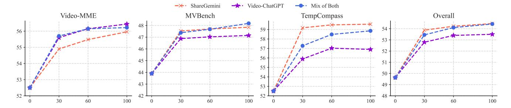
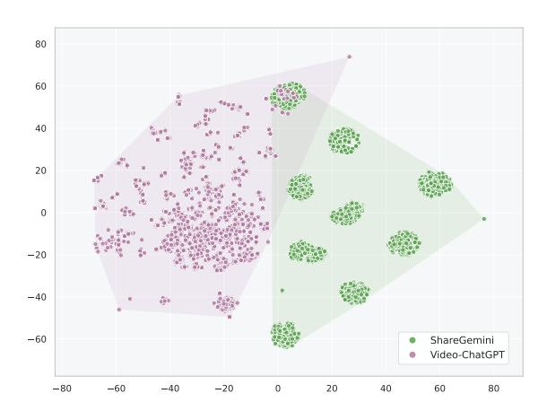

# 4.1. Training Setup

## 4.1.1. Model Setup

During our exploration, we mainly utilize two image-LLMs, including Mini-InternVL-Chat-4B-V1.5 [12] (termed as InternVL hereafter), MiniCPM-Llama3-8B-V2.5 [1] (termed as MiniCPM-8B hereafter). These instruction-tuned models are trained with massive image data and equipped with strong foundational capabilities. To support higher-resolution vision input, these models adopt the patchifying

technique [44–46] with a dynamic resolution scheme, where an image can be cropped into multiple sub-images according to different aspect ratios. Specifically, InternVL supports up to 13 sub-images, each of which is converted into 256 visual tokens; MiniCPM-8B slices images into a maximum of 10 patches, where each is represented by 96 visual tokens. During training and evaluation, we switch off the patchifying option for higher efficiency.

### 4.1.2. Training Configurations

For fairness and ease of reproduction, we follow the official implementations. More specifically, we train the whole model end-to-end (except for InternVL-4B, where we freeze the vision encoder) with a learning rate of 5e-6.

Figure 2. Video length statistics of ShareGemini and Video-ChatGPT datasets. Both datasets mostly cover videos shorter than 3.5 minutes. We extract video frames at an FPS of 1 for each video.. For better visibility, we pick samples with frame numbers lower than 99.9 percentile for visualization.

## 4.1.3. Training Datasets

During our investigation, we utilize two representative types of datasets, *i.e.*, video-caption pairs and video instruction data. Specifically, we choose the ShareGemini [47] dataset and the Video-ChatGPT [22] dataset as caption and instruction data, respectively. For each video, frames are extracted at an FPS of 1. In consideration of efficiency, we use up to 64 frames for InternVL-4B and 24 frames for MiniCPM-8B. When the total number of frames exceeds the threshold, we uniformly downsample the video frames. The statistics of video lengths are shown in Fig. 2, and we provide more introduction to the two datasets below.

**ShareGemini-Webvid-core100k.** This dataset comprises 100K video-caption pairs in total. The videos in the dataset are sourced from WebVid [48], a web-scale video-caption dataset spanning diverse open-domain topics. In terms of temporal duration, the majority of videos are short-form, with lengths under 30 seconds.

The captions are annotated by calling the strong Gemini-1.5-Pro [49] API. To ensure the diversity of video content, an advanced clustering algorithm [50] is used to filter out highly similar videos. For simplicity, we refer to this dataset as ShareGemini in the following parts of the paper.

**Video-ChatGPT.** The video instruction dataset contains 100K video-instruction pairs. The videos in this collection are derived from ActivityNet [51]. The dataset's coverage of video duration is larger, yet the average video length is no more than 3.5 minutes. There are broadly three types of instructions: video summarization, questions about video content, and creative/generative tasks.

The dataset is annotated in a semi-automatic manner. A small portion of data samples are manually annotated by human annotators by refining and enriching the video captions. Other instruction data are generated by GPT-3.5 with the aid of off-the-shelf dense prediction and captioning models.

### 4.2. Evaluation Setup

To evaluate the model capabilities in an efficient and comprehensive way, we use Video-MME [38], MVBench [15], and TempCompass [39] as our benchmarks. We do not use traditional video-QA benchmarks (e.g., MSVD-QA [35], TGIF-QA [36], ActivityNet-QA [37]) since these benchmarks are generally limited to a small coverage of domains, task types, and video lengths. Moreover, the questions asked often involve shallow perception without deeper reasoning since early models generally lack reasoning capacity, whereas recent LLM-based models excel. We illustrate more about the benchmarks used as follows:

**Video-MME** is a comprehensive benchmark designed for the evaluation of video-LLMs. For temporal coverage, videos of short length (up to 2 minutes), medium length (4–15 minutes), and longer duration (30–60 minutes) are included. The videos and annotations are manually collected and filtered. We only use the raw frames without the subtitles to focus on the evaluation of video understanding capabilities.

**MVBench** designs a set of 20 video tasks that cover both perception and cognition, such as scene transition and episodic reasoning. Compared to Video-MME, the videos are sourced from existing benchmarks, and the QAs are automatically generated for the 20 pre-defined tasks.

**TempCompass** is designed to evaluate models' temporal understanding capabilities, encompassing temporal aspects such as action, speed, and attribute change. The videos and corresponding meta-information are manually collected, followed by LLM-generated annotations. We use the multiple-choice QA (MCQ) format to align with other benchmarks.

To ensure robust and efficient judging of model answers, we use a combination of exact matching and LLM matching for assessment. More details about the implementation of this evaluation scheme are available in Appendix A.

### 4.3. Main Findings

#### 4.3.1. Low Learning Efficiency Issue

Our experiments start with scaling up the training data volume and evaluating the video understanding performance on different general video understanding benchmarks. The

Figure 3. Scaling performance of fine-tuning InternVL with different data volumes and types on different benchmarks. We consider fine-tuning with ShareGemini, Video-ChatGPT, and a mix of both with a 1 : 1 sampling ratio. Training samples are measured in K, where 0 sample indicates zero-shot inference.

Figure 4. t-SNE plot of instruction distributions for video datasets – ShareGemini and Video-ChatGPT. We sample 5,000 instructions from each dataset for visualization. The relatively limited instruction diversity observed in both datasets may hinder learning efficiency during fine-tuning.

results are shown in Fig. [3.](#page-4-0) In general, training either with video caption data (ShareGemini), instruction data (Video-ChatGPT), or a mix of both can boost the image-LLM's video understanding performance. Meanwhile, increasing the training volume brings additional gains in accordance with the data scaling law. However, the gains from scaling up quickly reach a plateau. For instance, on the Video-MME benchmark, when training with mixed data, 30K samples improve overall accuracy by 3.1 points, while 100K samples only add another 0.5 points, resembling a logarithmic growth. In view of this quick and early saturation, the learning efficiency with these video datasets can be quite limited. The phenomenon also suggests that there could be high redundancy in the training corpus, and it is possible that we may use less data to achieve a performance comparable to or even better than training with more data samples.

### 4.3.2. Probing of Instruction Diversity

Previous results prompt us to explore the reason for such low learning efficiency. Inspired by prior studies, which have underscored the importance of instruction diversity for finetuning LLMs [\[52\]](#page-12-12) and image-LLMs [\[53\]](#page-12-13), we conduct an inspection of training data in this aspect. Specifically, we follow previous approaches [\[54,](#page-12-14) [55\]](#page-12-15) to visualize the distribution of instructions in the training corpus. 5,000 instructions are sampled from ShareGemini and Video-ChatGPT, respectively. Then, the instructions are embedded and visualized using the t-SNE technique, as shown in Fig. [4.](#page-4-1) Overall, the instruction distribution of these two datasets is not diverse enough, which leads to a low data efficiency: The distribution of ShareGemini exhibits 9 clear clusters in the figure, indicating very similar instructions. This is because this dataset samples from a fixed pool of 9 templates as instructions, each of which is a variant of "Describe this video in detail". On the other hand, the distribution of Video-ChatGPT seems relatively more diverse, as it includes specific questions related to video content and details besides video summarization. Nevertheless, the instruction diversity is still low due to the nature of self-instruction and a few fixed task-specific prompting templates for data curation.

