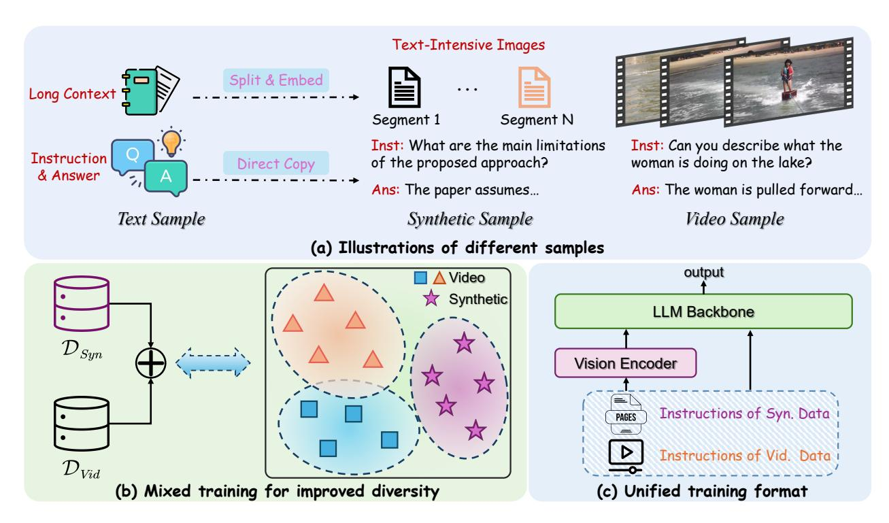

# 5.1. Design Concept

Since currently available video data can be limited in instruction diversity, and annotating high-quality video data is costly, we aim to expand the instruction diversity by incorporating new synthetic data. A rich source of instruction data lies in the text domain, and it can effectively complement the vision domain. Nevertheless, there is inherently a modality gap between the text and visual domains. To better utilize these data, we bridge the modality gap by synthesizing images with the text. Fig. [5](#page-5-0) illustrates the overall data synthesis pipeline and characteristics of our scheme. Our proposed scheme enjoys three benefits: (1) Mixing in text data can effectively enrich the instruction diversity (Fig. [6\)](#page-5-1), thus improving the learning efficiency for video fine-tuning; (2) Images synthesized from text can emulate the 1D temporal structure of video frames since text segments are generally

Figure 5. Conceptual illustration of our proposed scheme. (a) We illustrate the structures of text, synthetic, and video samples. Synthetic video-like samples are generated from textual data, with a structure mimicking real video samples. Specifically, for each (long context, instruction, answer) triplet, the long context part is split into segments, which are then transcribed into a sequence of text-rich images, simulating a video. (b) The domain differences between real and synthetic sources contribute to greater instruction diversity when used jointly for training. (c) The sequential nature of synthetic image sequences aligns well with the structure of real video data, thus enabling a unified training format.

correlated in the context, thus mitigating the gap between common video samples and synthetic ones; (3) Text data is easier to collect than video samples. Thus, utilizing synthetic data can be economical.

Figure 6. t-SNE plot of instruction distribution after applying our proposed method.

