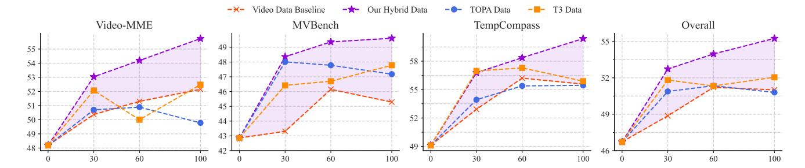
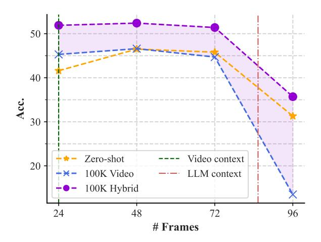

# 6.3. Examination of Key Properties

In this section, we further examine the key properties of our proposed method, including its general effectiveness, scaling performance, and effectiveness when applied to long video understanding scenarios.

### 6.3.1. General Effectiveness and Scaling Performance

We further verify the proposed scheme's effectiveness by evaluating our methods on another image-LLM of larger parameter size, *i.e*., MiniCPM-8B, across different benchmarks. Through scaling up with different volumes and types of data, we compare our methods against a pure video data baseline, as well as other relevant methods, including TOPA and T3. Both TOPA and T3 first translate vision information into text, such as captions and relations between objects. Then, synthetic text QAs are constructed to simulate video reasoning samples, aiming to transfer temporal reasoning capabilities from text to video. Note that since the original data format of TOPA is largely different from the current paradigm, we design a template to adapt the samples to the instruction data format (More details are available in Appendix B). The results are summarized in Fig. [7.](#page-8-0)

General effectiveness. When using the same amount of training samples, our methods almost always outperform other methods by a clear margin in all the evaluated benchmarks. Specifically, when using 30K samples, our method achieves an overall accuracy of 52.7, surpassing the baseline by 3.9 points. Notably, it even outperforms the baseline trained with 100K samples by 1.7 points. Similarly, on the MVBench benchmark, with 100K samples, our method attains a 4.3-point absolute gain over the baseline. Overall, the superior performance on different benchmarks showcases the general effectiveness of our proposed method.

Scaling performance. A notable limitation of other methods is that they are more prone to performance saturation when scaling up the data budget. For instance, the baseline method uses 60K samples to improve the Video-MME benchmark by 3.1 points, while using 100K samples only achieves another 0.9 points of absolute gains. In contrast, our proposed scheme shows more stable and consistent improvements when scaling up the data volumes compared with other methods. This underscores the importance of maintaining instruction diversity in video-language training, as insufficient diversity can lead to reduced learning efficiency. In such cases, our data augmentation strategy facilitates a more diverse instructional distribution.

Figure 7. Scaling performance with different data volumes and types on general video benchmarks. Specifically, we scale up the volume of training data until the overall performance gain saturates (empirically set as 1 point). Four settings are considered, *i.e*., fine-tuning with video data only, our hybrid data (video data mixed with our synthetic samples with a ratio of 2 : 1), TOPA data, and T3 data. By default, video data (the caption dataset and the instruction dataset) are mixed with a 1 : 1 sampling ratio. Training samples are measured in K, where 0 sample indicates zero-shot inference. Purple-shaded area indicates gains of our methods over the video data baseline.

| Methods    | Samples (K) | Frames | Video-MMEL | LongVideoBench | MLVU        | Overall    |
|------------|-------------|--------|------------|----------------|-------------|------------|
|            | 0           | 24     | 40.1       | 40.0           | 44.5        | 41.6       |
| BASELINE   | 30          | 24     | 44.7       | 39.7           | 45.4        | 43.3       |
|            | 30          | 48     | 45.3       | 39.6           | 45.3        | 43.4       |
|            | 60          | 24     | 46.2       | 42.7           | 46.2        | 45.1       |
|            | 60          | 48     | 46.2       | 42.1           | 45.0        | 44.5       |
|            | 100         | 24     | 46.7       | 44.1           | 45.3        | 45.3       |
|            | 100         | 48     | 44.9       | 40.7           | 45.0        | 43.5       |
|            | 30          | 24     | 45.6(+0.9) | 48.7(+9.0)     | 51.4(+6.0)  | 48.5(+5.2) |
| OUR METHOD | 60          | 24     | 46.2       | 51.2(+8.5)     | 53.2(+7.0)  | 50.2(+5.1) |
|            | 100         | 24     | 48.7(+2.0) | 50.1(+6.0)     | 57.0(+11.7) | 51.9(+6.6) |

Table 3. Long video understanding performance with different data volumes and types. The BASELINE method adopts only video data, while OUR METHOD utilizes a mix of video data and synthetic samples attained from our method. In the BASELINE group, 0 sample indicates zero-shot inference. The performance gains are calculated relative to the video data fine-tuning baseline trained with the same number of samples.

Discussion: Can we scale up only with synthetic textual samples? An intriguing and highly relevant question is whether we can scale up the synthetic samples without using any real video samples. Since the text is more compact and less redundant than a whole video, training in this way is more economical. Unfortunately, the empirical results show that this is probably unfeasible. As shown in Fig. [7,](#page-8-0) scaling with synthetic text data (TOPA and T3) shows undesirable characteristics, *i.e*., this approach can easily reach the saturation point or even slightly downgrade. Other critical issues include the modality gap and special processing of videos in various domains (such as egocentric videos and movies). Besides, since text suffers inevitably from information loss when translated from videos, text data might be better used as a supplement to videos, which helps inject temporal reasoning language prior into the LLM backbones (similar to TOPA or T3) or mixing with video data as a regularization method (as our method does).

### 6.3.2. Long Video Understanding Performance

We adopt tailored benchmarks to evaluate long video understanding capabilities, including LongVideoBench [\[62\]](#page-12-22), MLVU-M [\[63\]](#page-12-23), and the long video set of Video-MME, and report the performance on evaluation sets for the former two benchmarks. Our study focuses on two aspects: (1) performance improvement in terms of long video understanding compared with the video fine-tuning baseline, and (2) frame number (multimodal context) generalization ability in the inference stage.

Performance change w.r.t. training configurations. As presented in Table [3,](#page-8-1) our method consistently outperforms the video-only fine-tuning baseline in long video understanding across varying sample sizes, despite the absence of any long video training data. Remarkably, with the same number of 100K training samples, our hybrid data strategy achieves a performance gain of 6.6 points over the baseline. We attribute this improvement to the transferable reasoning patterns embedded in long-form textual data, which may enhance the

Figure 8. Long video understanding performance evaluated with a different number of frames. "Video context" denotes the max number of video frames used in training, *i.e*., 24 frames; "LLM context" denotes the context window of the LLM backbone. Purpleshaded area indicates performance gains of our proposed method over the video data baseline.

model's temporal comprehension capabilities without requiring vision-derived textual supervision [\[41,](#page-12-1) [42\]](#page-12-2).

We also examine whether adopting a denser sampling scheme can improve long video understanding performance, as this approach can also expand the context window. Specifically, we double the sampling frame limit (*i.e*., from 24 to 48) for authentic videos and find no improvements in long video understanding performance. This is because the training dataset predominantly contains short videos, and the dynamics within each video are relatively small. In this case, sampling more frames does not introduce more information but instead can bring redundancy, and thus, achieve no improvements in long video understanding.

Performance change w.r.t. frame number. We also investigate whether our approach expands the context window. Larger context windows are usually beneficial since video-LLMs derived from large-context LLM backbones often accompany frame number generalization and benefit from inputting more video frames [\[26,](#page-11-15) [62\]](#page-12-22). However, we do not observe this trend. As shown in Fig. [8,](#page-9-0) the model fine-tuned with long synthetic samples still follows a similar pattern, that is, when performing inference beyond the video context of the training stage, the performance stays relatively stable and does not benefit from more frame input. And when the frame number exceeds the LLM context, the performance plunges to a low level. Thus, promising directions for further improvements may include continued pre-training to expand the LLM context window.

