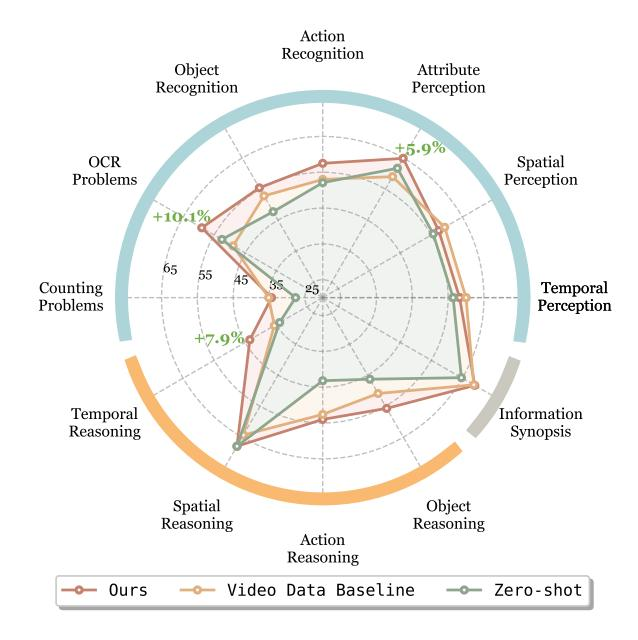

# 7. Conclusion

In this paper, we propose Sparrow, a data-efficient training scheme for video-LLMs, which enables training with fewer samples and achieving better video understanding performance. This method derives from our empirical findings that the low learning efficiency in data scaling may be ascribed to a limited instruction diversity in the training corpus. Thus, we design an economical data augmentation method that synthesizes video-like samples rich in instruction diversity. Comprehensive experiments demonstrate the general effectiveness and key properties of our proposed method. We hope this paper's findings can spark more explorations of efficient training and high-quality video training corpora.

**Ours:** The video shows a player wearing the number 6 dunking.

**Zero-shot:** The player with the number 5 on their jersey is the one who dunks in the video. This can be determined by observing the players on the court and noting the player's jersey number during the dunking action.

**Video Data Baseline:** The video shows a dunk by the player with number 4.

Figure 9. Qualitative results of OCR-related capabilities. The video features the process of dunking by a basketball player. Three settings are compared, *i.e*., zero-shot (direct inference with image-LLM), video data baseline (trained with 100K video samples), and our Sparrow scheme (trained with 66K video samples and 34K synthetic samples).

Figure 10. Model performance across various task categories on Video-MME. The Perception and Cognition categories are highlighted in the outer circle. Performance gains exceeding 5 points over the video data baseline are marked in green.

