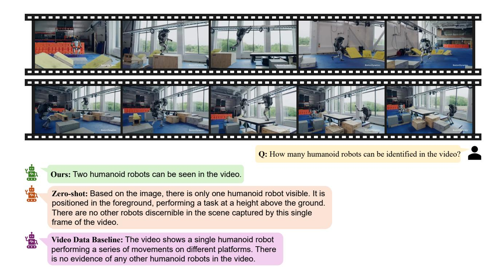

# Frame 2:

Caption: the person takes a chisel from a red toolbox and starts chiseling the plank.

chisel: There are a chisel and a hammer on the workbench in the center of the frame.

the person: the person is holding a chisel in the center of the frame.

red toolbox: There is a red toolbox in the right corner of the frame.

workbench: He is sitting on a workbench in the center of the frame.

#### Frame 3:

Caption: the person measures the length of the plank with a measuring tape.

the person: the person carries a pencil and a ruler in his right hand.

pencil: There is a pencil in the right hand of the person.

measuring tape: the person is holding a measuring tape in his right hand.

wooden plank: The plank is above the workbench.

...

#### Frame 8:

Caption: the person puts his hammer and chisel into the toolbox and leaves the workshop.

toolbox: the person is putting a hammer and a chisel into a toolbox in the center of the frame.

the person: the person is walking toward the door in the center of the frame.

hammer: There are a hammer and a chisel in the right hand of the person.

workshop: the person is leaving the workshop.

Question: Why does the person use a measuring tape in the third frame?

- A. To hammer the plank
- B. To cut the plank
- C. To measure the length of the plank
- D. To handle the saw
- E. To fix the length of the wooden plank

Answer with the option's letter from the given choices directly.

### Assistant:

C

Table 5. An example of using the template for structuring textual samples into the training format. For simplicity, we only show part of the frame-level information.

Figure 11. A qualitative example from Video-MME. The video depicts humanoid robots performing a sequence of actions. Our model demonstrates a clear understanding of the video content by accurately detecting both motion patterns and the presence of two distinct robots.

Figure 12. A qualitative example from Video-MME. The video presents a tutorial on watercolor painting. In the zero-shot setting, the model exhibits an incorrect reasoning process, ultimately producing a conclusion that contradicts its own reasoning chain. In contrast, only our model demonstrates strong temporal reasoning abilities, successfully arriving at the correct answer.