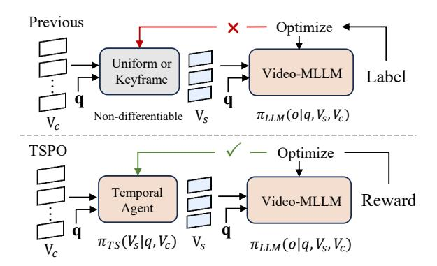

# Related Work

## MLLMs for Long Video Understanding

Multimodal Large Language Models (MLLMs) have demonstrated significant progress in vision-language tasks, yet they still face challenges when processing long-duration videos with extremely long context. Previous works (Xu et al. 2024a; Xu, Yin, and Peng 2025; Xu et al. 2025a,b, 2024b; Liu et al. 2024b; Lin et al. 2023; Cheng et al. 2024; Zhang et al. 2024d,b) often employ uniform frame sampling or perform token compression to reduce the length of the context. LLaVA-Video (Zhang et al. 2024d) and SlowFast-LLaVA (Xu et al. 2024b) utilize spatial and temporal pooling techniques to decrease the number of tokens. Beyond uniform sampling, recent works are exploring keyframe search methods (Ye et al. 2025; Guo et al. 2025; Wang et al. 2023; Shen et al. 2024; Hu et al. 2025a). For instance, LongVU (Shen et al. 2024) identifies cross-frame distinct frames by leveraging robust feature extractors such as DINOv2 (Oquab et al. 2023) and further discards tokens that exhibit minimal feature differences between the current frame and those of the previous frames. More recently, Chain-of-Shot (Hu et al. 2025a) leverages off-the-shelf multimodal large models, such as LLaVA-1.5 (Liu et al. 2024a), to select task-relevant shots and task-irrelevant shots. However, due to the inherently non-differentiable and unsupervised nature of keyframe sampling in general video understanding tasks, these methods opt for a training-free approach, which cannot be further optimized. In this paper, we propose a learnable temporal agent and present the TSPO algorithm to optimize keyframe sampling.

## Reinforcement Learning for MLLMs

Reinforcement Learning (RL) is often used in post-training of LLMs to align with human preferences. To enhance multi-modal capabilities (Wang et al. 2024b; Zhang et al. 2024c; DeepSeek-AI et al. 2025). RLHF(Ouyang et al. 2022) utilizes human feedback to train a reward model, treating the LLM as a policy network and optimizing it using PPO (Schulman et al. 2017). DPO (Rafailov et al. 2024) simplifies RLHF by directly constructing preference data without requiring a reward model. LLaVA-Hound-DPO (Zhang et al. 2024c) and TPO (Li et al. 2025) construct temporal preference data and optimize the LLM within the DPO framework. More recently, Deepseek-R1 (DeepSeek-AI et al. 2025) has garnered significant attention by using the GRPO (Shao et al. 2024) algorithm to achieve robust reasoning capabilities. However, these reinforcement learning approaches focus solely on optimizing the reasoning abilities of LLMs. In contrast, our TSPO takes a novel perspective by modeling the discrete keyframe selection and language generation as a unified decision-making process, directly addressing the most challenging issue in current long video understanding: the extremely long context problem.

Figure 2: The overview of our TSPO framework. The training pipeline takes long videos as inputs, first employing a temporal agent to sample G keyframe combinations (only one during inference), then optimizing the sampling policy through our temporal sampling policy optimization algorithm with Temporal localization reward  $R_T$  and Answering Accuracy reward  $R_A$ .

#### Method

As shown in Fig. 2, we propose Temporal Sampling Policy Optimization (TSPO) to advance MLLMs' long-form video-language understanding via reinforcement learning. First, we model the temporal sampling policy for Video-MLLM by integrating discrete frame sampling into the language model's decision-making process and establishing an event-aware temporal agent for probabilistic keyframe selection. Second, we propose an RL-based temporal optimization approach for Video-MLLMs. Finally, we present our TSPO training dataset construction pipeline and reward designs.

#### **Modeling Temporal Sampling Video-MLLM**

Previous works based on supervised fine-tuning or reinforcement learning focus solely on MLLM optimization, while overlooking the optimization for frame selection. Unlike training-free uniform frame sampling or keyframe search, as shown in Fig. 3, we aim to explore RL-based optimization schema by modeling discrete keyframe selection and language generation as a joint decision-making process.

Vanilla Video-MLLM Policy. Video-MLLMs are typically composed of three core components: a visual encoder, a multimodal projector, and a large language model (LLM)  $\pi_l$ . Video-MLLMs take a video  ${\bf v}$  and a text query  ${\bf q}$  as inputs. Due to the LLM context limit, the video is first processed into sparse frames  ${\bf V}_s$  by uniform sampling or training-free selectors. Video-MLLMs encode them into visual tokens and text tokens, respectively. These multimodal tokens are then concatenated and processed by the LLM through autoregressive generation to produce the final textual response. Then Video-MLLM models the likelihood of generating a language response output  ${\bf o}$  as follows:

$$\pi_l(\mathbf{o} \mid \mathbf{q}, \mathbf{V}_s) = \prod_{i=1}^n \pi_l(o_i \mid o_{< i}, \mathbf{q}, \mathbf{V}_s). \tag{1}$$

Figure 3: Comparison between our TSPO and previous Video-MLLM optimization methods. We model keyframe selection and language generation as a joint decision-making process for end-to-end optimization of the temporal agent.

Temporal Sampling Video-MLLM Policy. Our TSPO first integrates frame sampling into the decision-making process of Video-MLLMs. Considering computing cost, uniform sampling is first applied to obtain  $T_c$  candidate frames from a T-frame video. Then, adaptive keyframe selection is conducted based on textual query  $\mathbf{q} \in \mathbf{Q}$  and framelevel visual features, yielding a keyframe combination with  $T_s$ -frames. The temporal sampling policy is formulated as  $\pi(\mathbf{y}, \mathbf{V_s} \mid \mathbf{q}, \mathbf{V}_c)$ . Following the conditional probability rule and the chain rule, this policy can be expressed as:

$$\pi(\mathbf{o}, \mathbf{V_s} \mid \mathbf{q}, \mathbf{V}_c) = \pi_l(\mathbf{o} \mid \mathbf{q}, \mathbf{V}_s, \mathbf{V}_c) \cdot \pi_{ts}(\mathbf{V}_s \mid \mathbf{q}, \mathbf{V}_c),$$
 (2)

where  $\mathbf{V}_c$  is the candidate video frames, and  $\mathbf{V}_s$  denotes the selected keyframes.

#### **Event-aware Temporal Agent**

To model the  $\pi_{ts}(\mathbf{V}_s | \mathbf{q}, \mathbf{V}_c)$  policy, we first propose a trainable event-aware temporal agent, which captures event-query correlation and performs probabilistic keyframe selection from an RL perspective.

As shown in Fig. 2, the temporal agent takes CLIP (Radford et al. 2021) frame-level visual features  $\mathbf{F}_f \in \mathbb{R}^{T_c \times D}$  and text features  $\mathbf{F}_t \in \mathbb{R}^{1 \times D}$  as the inputs, where  $T_c$  denotes the candidate frame number and D denotes the feature dimension. The visual features are then enhanced with event perception capabilities through local window attention (Pu et al. 2024). Then the attention is restricted to a local window of length w centered at the current frame, augmented with sinusoidal positional embeddings (Vaswani et al. 2017), and projected by an MLP to learn intra-event dependencies and temporal awareness. This leads to the refined event representation  $\mathbf{F}_e \in \mathbb{R}^{T_c \times D}$ , and the cosine similarity  $Sim_{event}(\mathbf{F}_e, \mathbf{F}_t)$  is then computed to capture eventtext alignment. To strengthen temporal localization robustness, frame-level similarity  $Sim_{frame}(\mathbf{F}_f, \mathbf{F}_t)$  between visual features  $F_v$  and text features  $F_t$  is concurrently calculated. The final cross-modal similarity  $S \in \mathbb{R}^{T_c}$  is derived through the fusion of the two scores:

$$S = \operatorname{Sim}_{event}(\mathbf{F}_e, \mathbf{F}_t) + \operatorname{Sim}_{frame}(\mathbf{F}_f, \mathbf{F}_t).$$
 (3)

In the reinforcement learning framework, the **agent state** is defined by the input long video V and the text instruction Q. The **agent action** corresponds to keyframe selection, outputting the selected indices  $\mathcal{I} = \{i_1, i_2, ..., i_{T_s}\}$  and the corresponding probability  $\mathcal{P} = \{p_1, p_2, ..., p_{T_s}\}$ . To enable diverse action generation for RL exploration (Wei et al. 2023; Cui et al. 2023), our method employs the Gumbel-Softmax (Jang, Gu, and Poole 2016) operator:

$$\mathcal{P}, \mathcal{I} = \text{TopK } \left( \text{Softmax}(S/\tau + \gamma) \right), \ \gamma \sim \text{Gumbel}(0, 1),$$
 (4

where  $\tau$  is the temperature parameter. The generation process injects Gumbel (0,1) noise into cross-model scores, then selects the Top- $T_s$  query-relevant frames with their corresponding probabilities. The probability is expressed by:

$$\pi_{ts}(\mathbf{V}_s \mid \mathbf{q}, \mathbf{V}_c) = \prod_{i=1}^{T_s} \mathcal{P}_i(\mathbf{V}_c, \mathbf{q}).$$
 (5)

**Temperature annealing.** A high temperature is used early in training to encourage exploration, and it is gradually reduced to a low temperature to converge to key segments. Then, the selected frames indices  $\mathcal{I}$  are used to obtain the sparse frames, which serve as inputs to the Video-MLLMs.

#### **Temporal Sampling Policy Optimization**

In this part, we present a novel multimodal temporal sampling policy optimization algorithm that enables end-to-end group relative optimization of keyframe selection.

Vanilla Group Relative Policy Optimization (GRPO). Deepseek-R1 (DeepSeek-AI et al. 2025) proposes the GRPO (Shao et al. 2024) algorithm, which foregoes the critic model and estimates the baseline from rule-based rewards instead. Specifically, for each question **q** from the training set **Q**, a group of language outputs is sampled

 $\{\mathbf{o}_1, \mathbf{o}_2, \cdots, \mathbf{o}_G\}$  from the old policy  $\pi_{\theta_{old}}$  and then optimizes the policy model  $\pi_{\theta}$  by maximizing:

$$\mathcal{J}_{grpo}(\theta) = \mathbb{E}_{\mathbf{q} \sim \mathbf{Q}, \{\mathbf{o}_i\} \sim \pi_{\theta_{old}}(\mathbf{O}|\mathbf{q})} \\
\frac{1}{G} \sum_{i=1}^{G} \left( \frac{\pi_{\theta}(\mathbf{o}_i|\mathbf{q})}{\pi_{\theta_{old}}(\mathbf{o}_i|\mathbf{q})} A_i - \beta \cdot \mathbb{D}_{KL} \left( \pi_{\theta} || \pi_{ref} \right) \right), \tag{6}$$

where  $\mathbb{D}_{KL}$  is the unbiased estimator (Schulman 2020) for KL divergence and  $\beta$  is a hyper-parameter to balance the weights.  $\pi_{ref}$  is the reference model, typically a LLM that has undergone large-scale Supervised Fine-Tuning (SFT).  $A_i$  is the relative advantage, computed using a group of rewards  $\{r_1, r_2, \ldots, r_G\}$  corresponding to the group outputs (DeepSeek-AI et al. 2025).

Temporal Sampling Policy Optimization (TSPO). As shown in Fig. 3, our TSPO models keyframe selection and language generation as a joint decision-making process, enabling end-to-end GRPO optimization through language supervision. In detail, the temporal agent and Video-MLLMs are treated as a policy pool capable of making probabilistic estimations for frame selection and response generation, as shown in Eq. (2). Then, the decision process is supervised by maximizing the expected reward of actions. Therefore, the objective can be reformulated as follows:

$$\mathcal{J}_{tspo}(\theta) = \mathbb{E}_{\mathbf{q} \sim \mathbf{Q}, \mathbf{v} \sim \mathbf{V}, \{\mathbf{o}_{i}, \mathbf{V}_{s}\} \sim \pi_{old}(\mathbf{O} \mid \mathbf{q}, \mathbf{V}_{c})} \\
\frac{1}{G} \sum_{i=1}^{G} \frac{\pi_{l}(\mathbf{o}_{i} \mid \mathbf{q}, \mathbf{V}_{s}, \mathbf{V}_{c}) \cdot \pi_{ts}(\mathbf{V}_{s} \mid \mathbf{q}, \mathbf{V}_{c})}{\pi_{l_{old}}(\mathbf{o}_{i} \mid \mathbf{q}, \mathbf{V}_{s}, \mathbf{V}_{c}) \cdot \pi_{ts_{old}}(\mathbf{V}_{s} \mid \mathbf{q}, \mathbf{V}_{c})} A_{i} \quad (7) \\
- \beta \cdot \mathbb{D}_{KL} \left( \pi_{\theta} || \pi_{ref} \right).$$

Considering the extremely long context problem is more significant for the current long video understanding model, we maintain focus on optimizing the Temporal Sampler while preserving the strong prior of language generation capabilities. We employ a pre-trained MLLM and keep it frozen, thereby ensuring that:

$$\pi_l(\mathbf{o}_i \mid \mathbf{q}, \mathbf{V}_s, \mathbf{V}_c) / \pi_{l_{old}}(\mathbf{o}_i \mid \mathbf{q}, \mathbf{V}_s, \mathbf{V}_c) = 1.$$
 (8)

Notably, the MLLM has been SFT-trained on LLaVA-Video-178K (our source dataset) with uniform 32 frames and thus can answer questions well when correct keyframes are selected. Therefore, our TSPO objective can be simplified to optimize only the temporal agent as follows:

$$\mathcal{J}_{tspo}^{*}(\theta) = \mathbb{E}_{\mathbf{q} \sim \mathbf{Q}, \mathbf{v} \sim \mathbf{V}, \{\mathbf{o}_{i}, \mathbf{V}_{s}\} \sim \pi_{old}(\mathbf{O} \mid \mathbf{q}, \mathbf{V}_{c})} 
\frac{1}{G} \sum_{i=1}^{G} \frac{\pi_{ts}(\mathbf{V}_{s} \mid \mathbf{q}, \mathbf{V}_{c})}{\pi_{ts_{old}}(\mathbf{V}_{s} \mid \mathbf{q}, \mathbf{V}_{c})} A_{i},$$
(9)

where the advantage  $A_i$  is computed through an efficient rule-based reward mechanism.

#### **TSPO Training Dataset and Reward Design**

To drive TSPO training, we introduce *comprehensive temporal data* for general video understanding and *video Needle-in-a-Haystack data* for long-range temporal localization, as shown in Fig. 4. The training incorporates question answering accuracy and temporal localization rewards.

Figure 4: Our proposed TSPO-targeted long video training data construction pipeline.

(1) Comprehensive Temporal Data. Thanks to our TSPO's capability for end-to-end language-guided optimization without frame-level annotations, we can reuse existing video QA datasets with little effort. We collect video multiple-choice QA data longer than 1 minute from LLaVA-Video-178K (Zhang et al. 2024d) (Video max length: 3 minutes). Furthermore, to increase data quality, we filter items that are answerable from 4 uniform frames (too easy) or unsolvable even when sampling 64 frames from a 1-to-3 minute video (too hard). The remaining data requires sampling multiple keyframes, featuring comprehensive temporal dependency. (2) Video Needle-in-a-Haystack. The Video-MLLMs community still lacks high-quality long-video QA datasets. For instance, the prominent LLaVA-Video-178K dataset contains videos no longer than 3 minutes. Inspired by the "Needle-in-a-Haystack" designed for evaluation (Zhang et al. 2024b), we propose a long video training data construction pipeline. We sample videos from LLaVA-Video-178K as target videos, applying QA augmentation since some original training questions are too generic to localize segments in spliced videos. Using Qwen2.5-VL (Bai et al. 2025), we generate detailed event descriptions for target videos, reformatted into multiple-choice questions. Finally, the target videos are concatenated and shuffled with irrelevant videos at the segment level to form long training videos (10∼60 minutes).

The dual pipelines yield TSPO-10K, a high-quality long video dataset comprising 10,000 samples specifically optimized for temporal sampling policy training.

Dual Reward Designs. First, we follow an intuition that Video-MLLMs can only give correct answers if the temporal agent samples the correct keyframes. Thanks to our TSPO modeling, we can use the language response accuracy derived from multiple-choice training data to supervise the temporal agent. The accuracy reward is defined as:

$$R_A = \mathbf{1}(y = \overline{y}),\tag{10}$$

where 1 is the indicator function, y is the predicted option, and y is the ground-truth option.

For the video Needle-in-a-Haystack task, we leverage the pseudo-labels from our video synthesis pipeline. We quantify the localization precision by computing the ratio of correctly sampled frames to total frames:

$$R_T = T_t / T_a, \tag{11}$$

where Tt is the count of frames residing in the target video, and Ta is the total sampled frames. For data from "Comprehensive temporal", the total reward is RA + 1, while for data from "Needle-in-a-Haystack", the reward is RA + RT .

