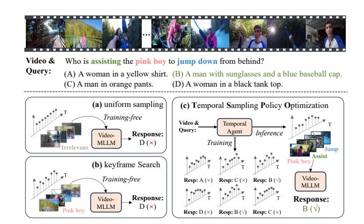

# TSPO: Temporal Sampling Policy Optimization for Long-form Video Language Understanding

Canhui Tang1,2\*, Zifan Han1,2\*, Hongbo Sun2, Sanping Zhou1†, Xuchong Zhang1, Xin Wei2, Ye Yuan2, Huayu Zhang2, Jinglin Xu3, Hao Sun2‡

1National Key Laboratory of Human-Machine Hybrid Augmented Intelligence, National Engineering Research Center for Visual Information and Applications, Institute of Artificial Intelligence and Robotics, Xi'an Jiaotong University 2Institute of Artificial Intelligence (TeleAI), China Telecom 3University of Science and Technology Beijing

#### **Abstract**

Multimodal Large Language Models (MLLMs) have demonstrated significant progress in vision-language tasks, yet they still face challenges when processing long-duration video inputs. The limitation arises from MLLMs' context limit and training costs, necessitating sparse frame sampling before feeding videos into MLLMs. However, building a trainable sampling method remains challenging due to the unsupervised and non-differentiable nature of sparse frame sampling in Video-MLLMs. To address these problems, we propose Temporal Sampling Policy Optimization (TSPO), advancing MLLMs' long-form video-language understanding via reinforcement learning. Specifically, we first propose a trainable event-aware temporal agent, which captures eventquery correlation for performing probabilistic keyframe selection. Then, we propose the TSPO reinforcement learning paradigm, which models keyframe selection and language generation as a joint decision-making process, enabling endto-end group relative optimization for the temporal sampling policy. Furthermore, we propose a dual-style long video training data construction pipeline, balancing comprehensive temporal understanding and key segment localization. Finally, we incorporate rule-based answering accuracy and temporal locating reward mechanisms to optimize the temporal sampling policy. Comprehensive experiments show that our TSPO achieves state-of-the-art performance across multiple long video understanding benchmarks, and shows transferable ability across different cutting-edge Video-MLLMs.

Code — https://github.com/Hui-design/TSPO

### Introduction

Multimodal Large Language Models (MLLMs) have achieved significant progress in various vision-language tasks, such as image captioning, visual question answering, OCR, etc. They typically extract visual information as visual tokens into the Large Language Models (LLMs) for openworld understanding. As a natural extension, video-based

Copyright © 2026, Association for the Advancement of Artificial Intelligence (www.aaai.org). All rights reserved.

Figure 1: Illustrations of different frame sampling methods: Training-free uniform sampling (a) and keyframe search (b) select unsatisfactory frames, while our method (c) explores and optimizes the temporal sampling policy that leads to the correct answer in an end-to-end training manner.

MLLMs (Video-MLLMs) (Zhang et al. 2024d; Shen et al. 2024; Bai et al. 2025) have attracted great attention, where videos contain more complex temporal and visual information, bringing more significant challenges.

Existing MLLMs are compelled to employ sparse frame sampling when dealing with videos (Zhang et al. 2024d; Shen et al. 2024; Kim et al. 2024; Xu et al. 2024b; Liu et al. 2024c). The core challenge mainly lies in determining the optimal frame sampling strategy that maximizes MLLMs' video comprehension accuracy while minimizing computational overhead. Most existing Video-MLLM approaches, such as LLaVA-Video (Zhang et al. 2024d) and Qwen2.5VL (Bai et al. 2025), simply perform uniform frame sampling, which often misses key information that is relevant to queries, as shown in Fig. 1. Recently, some studies (Hu et al. 2025a; Shen et al. 2024; Tang et al. 2025) focus on exploring training-free keyframe extraction approaches. For instance, LongVU (Shen et al. 2024) identifies crossframe distinct frames by leveraging pre-trained feature extractors such as DINOv2-1B (Oquab et al. 2023). CoS (Hu

\*These authors contributed equally.

&lt;sup>†Corresponding authors.

‡Corresponding authors.

et al. 2025a) employs LLaVA-1.5-13B (Liu et al. 2024a) to filter query-relevant frames for inputting into Video-MLLM, which incurs significant computational costs. Without training optimization, training-free methods are limited by the cross-modal event understanding capabilities of pre-trained keyframe selectors and may incur more computation during inference. These limitations lead to a question: *Can we develop a trainable sparse frame sampling approach for reliable and efficient long-video language understanding?*

However, there exist two fundamental challenges to obtaining a trainable temporal sampling approach for Video-MLLMs: (1) Unsupervised nature: frame-level annotations are generally unavailable in general video understanding training (Zhang et al. 2024d; Bai et al. 2025), resulting in a lack of precise localization guidance. (2) Nondifferentiability: frame sampling is a discrete subset selection problem, where the output consists of frame indices rather than continuous variables, making it difficult to optimize via backpropagation in Supervised Fine-Tuning (SFT).

Based on the above analyses and inspired by the progress of Deepseek-R1 (DeepSeek-AI et al. 2025; Shao et al. 2024) in enhancing MLLM reasoning through Group Relative Policy Optimization (GRPO), we propose Temporal Sampling Policy Optimization (TSPO) to explore and optimize keyframe selection strategy for Video-MLLMs. It novelly models keyframe selection and language generation as a joint decision-making process, performing end-toend GRPO optimization of the temporal agent through rulebased rewards. Specifically, a trainable temporal sampler is first modeled as a decision agent to capture event-query correlation for keyframe probability estimation, which also maintains structural simplicity instead of using other heavy MLLMs like (Hu et al. 2025a,b). Furthermore, for TSPO's training, we propose a long video training data construction pipeline with *comprehensive temporal data* for general video understanding and *video Needle-in-a-Haystack* data for long-range temporal localization. In the reinforcement learning-based temporal sampling policy optimization, we establish efficient rule-based answering accuracy and coarse-level temporal locating reward mechanisms that optimize the temporal agent to maximize the expected reward by choosing critical frames for queries adaptively.

Extensive experiments demonstrate the effectiveness and strong generalization of our TSPO method, achieving average performance gains of 4.3% on LLaVA-Video and 6.1% on Qwen2.5-VL. Our contributions are as follows:

- We propose the Temporal Sampling Policy Optimization algorithm, which models keyframe selection and language generation as a joint decision-making process, performing end-to-end group relative optimization for the temporal sampling policy. This effectively tackles the unsupervised and non-differentiable challenge of sparse frame sampling in Video-MLLMs.
- We propose a TSPO-targeted training data construction pipeline with comprehensive temporal data and Video Needle-in-a-Haystack data, incorporating the establishment of rule-based answering accuracy and temporal locating reward mechanisms.

• Our TSPO achieves state-of-the-art performance across multiple general long video understanding benchmarks, and shows strong transferable ability across different cutting-edge Video-MLLMs.

