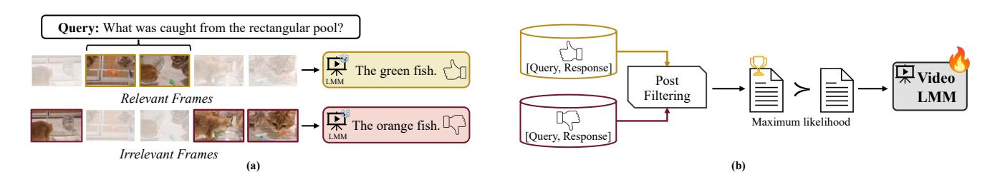

# **Temporal Preference Optimization of Large Multimodal Models**

**Rui Li**\* **Xiaohan Wang**\* **Yuhui Zhang Orr Zohar Zeyu Wang Serena Yeung-Levy**

Stanford University

Link: [Project Page](https://ruili33.github.io/tpo_website) | [Code](https://github.com/ruili33/TPO) | [Dataset & Checkpoints](https://huggingface.co/collections/ruili0/temporal-preference-optimization-67874b451f65db189fa35e10)

**Figure** 1: **Temporal Preference Optimization (TPO).** TPO is a post-training algorithm designed to enhance temporal comprehension in video-LMMs. In TPO, (a) preference data is generated by prompting the video-LMM with both well-grounded and manipulated (irrelevant or incomplete) video clips to collect contrastive response pairs. (b) These pairs undergo an LLM-based post-filtering process to remove noisy or misaligned samples. The generated preference data is then used in the preference optimization process, which improves the model's temporal reasoning by prioritizing preferred responses, ultimately enhancing overall video understanding.

**Abstract:** Despite recent advancements in video Large Multimodal Models (video-LMMs), accurate temporal grounding remains a key challenge. In this work, we introduce **Temporal Preference Optimization** (**TPO**)—a post-training framework that unlocks superior temporal reasoning in video-LMMs without requiring human annotations. TPO enables preference modeling by manipulating video inputs to generate contrastive responses, ensuring that preferred responses are more temporally grounded than dis-preferred ones. Through preference learning, TPO enhances the model's capability to distinguish and localize events with better temporal reasoning. Extensive experiments on LongVideoBench, MLVU, and Video-MME demonstrate that TPO significantly improves temporal grounding across multiple video-LMMs. Notably, LLaVA-Video-TPO achieves state-of-the-art performance among 7B models on Video-MME, establishing TPO as a scalable and effective solution for advancing temporal understanding in video analysis.

## **1. Introduction**

Recent advancements in video Large Multimodal Models (video-LMMs) [\[2,](#page-12-0) [45,](#page-14-0) [52\]](#page-15-0) have marked a significant step forward for generalizable video understanding. While image-based LMMs [\[5,](#page-12-1) [19,](#page-13-0) [39\]](#page-14-1) primarily focus on spatial reasoning, video-LMMs face the additional complexity of modeling temporal dependencies—a critical aspect for capturing the dynamic nature of video content.

\* Equal Contributions.

Most existing video-LMMs acquire temporal grounding implicitly during supervised finetuning by leveraging weak correspondences between input videos and textual responses [\[6,](#page-12-2) [67\]](#page-16-0). While some responses may reference specific segments of a video, they lack explicit temporal alignment under next-token prediction training, limiting the model's ability to learn precise temporal grounding. Recently, alternative approaches [\[7,](#page-12-3) [20,](#page-13-1) [29,](#page-13-2) [46,](#page-14-2) [51\]](#page-15-1) have emerged that incorporate explicit temporal annotations into training, enriching textual responses with structured temporal information as supervision. However, these methods rely on additional temporal annotations, which are costly to obtain and scale to large training datasets.

In this work, we introduce Temporal Preference Optimization (TPO), a post-training framework designed to enhance the temporal grounding capabilities of video-LMMs. TPO systematically refines the pretrained video-LMMs' ability to distinguish temporally relevant content by leveraging contrastive responses from manipulated video inputs. As shown in Fig. [1,](#page-0-0) TPO first prompts a video-LMM with the same question on both the original and the corrupted video. Questions are formulated based on a set of video frames, with preferred responses generated using these frames. In contrast, dis-preferred responses are produced using the same question but paired with irrelevant or incomplete frame sets. This pipeline ensures that preferred responses contain richer and more temporally relevant information than dis-preferred ones, thereby establishing a clear preference hierarchy. By dynamically manipulating video inputs based on the query, TPO automatically injects temporal preferences into the preference dataset through simple input transformations. To further refine the dataset, a post-filtering process is applied to remove imperfect samples caused by errors from the pretrained video-LMMs and ambiguous preference data. The resulting preference dataset is then used to optimize the model's temporal grounding capabilities via Direct Preference Optimization (DPO) [\[44\]](#page-14-3), chosen for its flexibility and stability. This structured pipeline enables TPO to enhance the temporal reasoning capabilities of the base video-LMM using a curated post-training dataset, while preserving its pre-trained knowledge. This makes TPO a scalable and robust solution for advancing video understanding tasks.

We conducted extensive experiments on three challenging multimodal video understanding benchmarks, and the results clearly demonstrate that TPO significantly enhances the temporal grounding capabilities of video-LMMs. Specifically, TPO achieves performance gains of 2.9% on LongVideoBench [\[55\]](#page-15-2), 3.1% on MLVU [\[70\]](#page-16-1), and 2.5% on Video-MME [\[14\]](#page-12-4), when applied to the strong base model LongVA-7B [\[65\]](#page-16-2). Furthermore, even when integrated with the state-of-the-art large-scale pretrained video-LMM, LLaVA-Video, TPO still delivers a 2.3% improvement, establishing LLaVA-Video-TPO as the best-performing 7B model on the Video-MME benchmark.

## **2. Preliminaries**

**Preference learning** [\[41,](#page-14-4) [49,](#page-15-3) [72\]](#page-16-3) focuses on modeling human preferences to align model behavior with user expectations. In LLMs and image-LMMs, this involves training models to generate responses favored by users. This is typically achieved by collecting human feedback on pairs of model-generated outputs and learning a function that predicts which output is preferred. Formally, given an input x and two outputs + (preferred) and − (dispreferred), the model aims to satisfy:

$$\pi_{\theta}(y^+|x) > \pi_{\theta}(y^-|x) \tag{1}$$

where (|) is the model's probability of generating output given input with parameters . In the context of video-LMMs, a preference dataset is constructed as a collection of tuples (, , +, −), where denotes a video, represents a query, + is the preferred temporally grounded response, and − is the dispreferred response.

**Direct Preference Optimization** (DPO) [\[44\]](#page-14-3) is a methodology that directly integrates human preference data into the optimization of model parameters. Compared to Proximal Policy Optimization (PPO) [\[41,](#page-14-4) [49,](#page-15-3) [72\]](#page-16-3), another popular preference learning implementation, DPO eliminates the need for explicit reward models or complex reinforcement learning algorithms. By leveraging human preference data as a guiding signal during optimization, DPO enhances the model's ability to generate outputs that are better aligned with human values and expectations.

