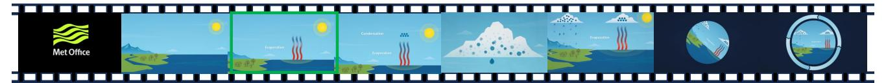

# <span id="page-18-1"></span>**F. Qualitative Analysis Examples**

We provide three additional qualitative analysis examples from the Video-MME dataset [\[14\]](#page-12-4), as illustrated in Fig. [11.](#page-22-0) Example (a) involves an information extraction and optical character recognition (OCR) task, where the question asks for the total number of measurements involved in chip manufacturing. The original LongVA model failed to accurately locate the relevant frame containing the necessary information, resulting in an incorrect response. In contrast, our LongVA-TPO model, enhanced through temporal preference optimization, successfully identified the pertinent frame within the lengthy input and provided the correct answer to the question.

Example (b) involves a high-level video understanding and information extraction task, where the question asks for the main topic introduced in the video. The original LongVA model failed to capture the overarching theme, instead responding with an unrelated term, "Criminal Trial," mentioned elsewhere in the video. In contrast, our LongVA-TPO model effectively identified the video's central theme and accurately provided the correct topic introduced in the content.

Example (c) involves an object reasoning task, where the question asks what the three curved lines extending from the bottom upward symbolize. The original LongVA model failed to interpret the representation accurately, erroneously stating that the lines represent three stages of the water cycle, which was a hallucination. In contrast, our LongVA-TPO model successfully understood the symbolic meaning of the three curved lines as representing evaporation, providing a correct and detailed response.

```
< Video Caption >
Using the caption of a video , create a question - answer pair that focuses on < Task
   ˓→ Prompt >.
Please generate a question tailored to the given caption . If it 's inappropriate to
   ˓→ generate such question , please output None .
Output format :
Q: < question >
A: < answer >
```

**Figure** 8: **Detailed prompt for the query generation given the video captions.**

```
< Video Caption >
Question : < Query >
Answer1 : < Preferred Answer >
Answer2 : <Dis - Preferred Answer >
Task1 : You are given a question , the golden answer and related captions . Is answer1
   ˓→ better than answer2 ? Please answer with Yes or No or Equally .
Task2 : Please check if this question and Answer1 contradicts to any part of the golden
   ˓→ caption or this question might have another answer different from the given
   ˓→ answer . Please respond with Yes or No .
Task3 : Is the Answer1 is correct given the question and golden caption ? Please respond
   ˓→ with Yes or No .
```

**Figure** 9: **Detailed prompt for the post-filtering process for the preference data pairs.**

<span id="page-21-0"></span>

Query: What quote is featured below the mural in the video, and who is it attributed to?

Dis-preferred Response: The quote below the mural is "Forward, Warrior!" and it is attributed to a woman.

Preferred Response: The quote below the mural in the video is "I appeal to all of you to get into this great revolution that's sweeping this nation. Get in and stay in the streets of every city, every village and hamlet of this nation until true freedom comes, until the revolution of 1776 is complete." This quote is attributed to John Lewis.

(a)

Query: What are the four levels represented in the pyramid diagram of the wine tasting guide, and how do they classify wine quality?

Dis-preferred Response: The pyramid diagram in the wine tasting guide represents four levels of wine quality classification: AOC, IGP, Vin de Pays, and Vins. These levels are arranged in a descending order of quality …

Preferred Response: The pyramid diagram in the wine tasting guide represents four levels of wine quality classification: AOC, VDQS, IGP, and Vin. The pyramid structure indicates that each level is a subset of the one above it, with AOC being the highest and Vin being the lowest. …

(b)

Query: Describe the exercise routine depicted in the video, including the name of the exercises, the number of repetitions, and any additional instructions provided.

Dis-preferred Response: The video shows a man performing a mountain climber exercise, which involves kicking the feet back as the hands touch the floor. He also does a walkout push-up, which involves lifting the body off the ground and then returning to the starting position. The video provides the number of repetitions for each exercise, which are 10 to 12 reps.

Preferred Response: The video shows a man performing a variety of exercises in a gym. He starts by lifting a dumbbell over his head, then proceeds to do mountain climbers, burpees, kettlebell swings, and push-ups. The video also includes a summary of the workout, which includes the following exercises and repetitions: 1. Dumbbell Squat Press (10-12 reps) 2. Mountain Climbers (10-12 reps) 3. Burpees (10-12 reps) 4. Kettlebell Swings (10-12 reps) 5. Walkout Push-ups (10-12 reps). The man is wearing a black shirt and shorts, and he appears to be in good physical shape.

(c)

**Figure** 10: Examples from the preference dataset.

<span id="page-22-0"></span>

Query: Based on the video, what is the total number of measurements involved in chip manufacturing?

LongVA: The video shows a sequence of images with the text \"270 measures\" at different stages of chip manufacturing. This suggests that there are 270 measurements involved in the process of chip manufacturing as depicted in the video.

LongVA-TPO: The video states that there are 200 measurements involved in chip manufacturing.

(a)


Query: What topic is introduced in the video?

LongVA: The video introduces the topic of \"Criminal Trial\" with a humorous and animated approach. It features a courtroom setting … The characters are drawn in a cartoonish style, which adds to the comedic effect.

LongVA-TPO: The video introduces the topic of the roles of different people in a courtroom.

(b)



Query: According to the video, what do the three curved lines extending from bottom up symbolize?

LongVA: The three curved lines extending from bottom up in the image are likely representing the three main stages of the water cycle: evaporation, condensation, and precipitation. These stages are typically depicted in educational materials to illustrate how water changes state and moves through the environment.

LongVA-TPO: The three curved lines extending from bottom up in the image symbolize the process of evaporation. They represent the upward movement of water vapor as it transitions from a liquid state to a gaseous state, rising into the atmosphere. This is a key part of the water cycle and demonstrates the concept visually.

(c)

**Figure** 11: Additional qualitative examples from Video-MME [\[14\]](#page-12-4).