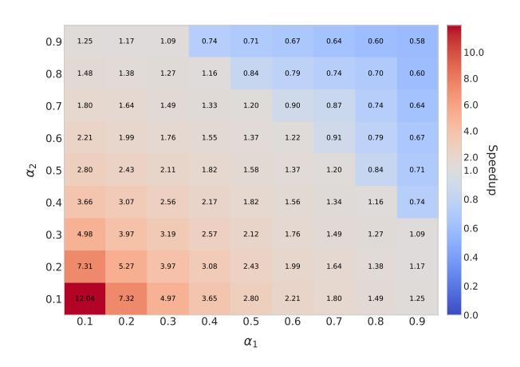

# 3.5. Stage 3: Multi-Subsequence Inference & Logit Aggregation

Using sequence packing, the resulting subsequences  $\hat{\mathbf{v}}^{(i)}$  are concatenated into a single long sequence. The MLLM then processes the packed sequence, concatenated with the text prompt t, in a single forward pass using a block-diagonal attention mask:

$$o_i = \text{MLLM}(\langle \hat{\mathbf{v}}^{(i)}, \mathbf{t} \rangle), i = 1, ..., m,$$
 (9)

yielding logits  $o_i \in \mathbb{R}^D$  (D vocabulary size). By inferring on multiple short subsequences instead of a single long sequence, T3S significantly reduces inference time while maintaining comprehensive content coverage.

Let  $\pi(o)$  denote the softmax distribution derived from logit vector o. We aggregate the logits from the m trials using one of the following methods.

**(A) Mean logits (default).** We average the logits across trials:

$$o_{\text{avg}} = \frac{1}{m} \sum_{i=1}^{m} o_i, \quad t^* = \arg\max_{t} o_{\text{avg}}[t].$$
 (10)

Figure 2. Empirical speedup w.r.t.  $\alpha_1$  and  $\alpha_2$ .

This strategy is parameter-free yet we find it surprisingly robust in practice.

**(B) Confidence-weighted aggregation.** Each trial is weighted by the inverse entropy of its predictive distribution:

$$w_i \propto \frac{1}{H(\pi(o_i))}, \quad o_{\text{weighted}} = \sum_i w_i o_i,$$
 (11)  
 $t^* = \arg\max_t o_{\text{weighted}}[t].$ 

(C) Two-trial cross-refinement (m = 2). When using just two trials (m = 2), we observe empirical gains from an asymmetric verification scheme. Let  $o_1, o_2$  be the two logits. Trial 1 proposes the top-k:

$$\mathcal{K} = \text{top-}k(o_1, k), \tag{12}$$

and trial 2 re-rank them:

$$t^* = \arg\max_{t \in \mathcal{K}} o_2[t]. \tag{13}$$

The intuition is that trial 1 generates high-confidence hypotheses, while trial 2 acts as a lightweight verifier—without ever computing expensive cross-trial attention. In Table 6, we conduct a detailed analysis on how the aggregation affects the performance.

#### 3.6. Time Complexity Analysis

We analyze the computational cost of our proposed T3S method in comparison to a standard single-trial baseline. This analysis considers both the theoretical complexity based on dominant operations and the practical performance observed empirically, as presented in Figure 2.

**Single-trial baseline.** For a sequence of length L, the computational cost per layer in a standard transformer is dominated by the self-attention mechanism. This results in a time complexity of:

$$C_{\text{base}} = \mathcal{O}(L^2). \tag{14}$$

This model disregards lower-order terms, such as those from MLP and layer normalization operations, which scale linearly with the sequence length  $(\mathcal{O}(L))$ .

Multi-trial cost and empirical performance. In our multi-trial approach, using m trials with respective subsampling rates  $\{\alpha_i\}_{i=1}^m$ , the theoretical complexity is the sum of costs for each trial:

$$C_{\text{multi}} = \mathcal{O}\left(L^2 \sum_{i=1}^m \alpha_i^2\right).$$
 (15)

This suggests a theoretical speedup is achievable whenever  $\sum_{i=1}^{m} \alpha_i^2 < 1$ .

In our practical implementation, the m subsequences are packed into a long sequence and processed together in one forward pass. While this packing-based strategy differs from the simplified theoretical model that assumes idealized batching, our empirical results show the theoretical trend still holds. For example, with  $\alpha_1=\alpha_2=0.6$  (so that  $\sum \alpha_i^2=0.72$ ), we observe a modest yet meaningful  $1.22\times$  speedup in Figure 2. This demonstrates that, despite the practical overheads, the essential efficiency benefits of the T3S approach are retained.

Note that in the region where  $\alpha_1 + \alpha_2 \ge 1.3$ , processing the packed long sequence results in an out-of-memory error. In this case, we report the time for two serial forward passes instead.

### 3.7. Design Rationale: Why T3S Wins

Randomness is a feature, not a concession. Stochastic sampling remains *provably* unbiased across domains, frame-rates, and resolutions. In contrast, deterministic or learned selectors embed hidden priors and require retraining as distributions shift. Random sampling offers broad coverage of rare events at zero cost—no parameters, tuning, or engineering overhead.

**Temporal breadth over spatial depth.** Rather than densely sampling one long sequence, we spread the token budget across *uncorrelated* temporal windows. Each trial has a new chance to catch key frames, reducing the chance of missing important moments. The cost grows linearly with trials but is amortized by packing, while recall improves exponentially.

**Multi-subsequence inference.** In contrast to performing inference on a single long sequence, our method processes a batch of m shorter subsequences. This approach mitigates the quadratic time complexity of the attention mechanism, resulting in a significant speedup.

**Summary.** T3S trades a single fragile trajectory for multiple lightweight probes. This shift yields a system that is faster, more efficient, and more robust—outperforming any single-sequence baseline.

Table 1. Accuracy (%) and speedup comparison on VideoMME.

| Model          | Short | Medium | Long | Overall | Speedup |
|----------------|-------|--------|------|---------|---------|
| Qwen2.5-VL-7B  | 74.6  | 63.7   | 53.6 | 63.9    | –       |
| + T3S          | 76.6  | 64.4   | 54.6 | 65.2    | 2.03×   |
| LLaVA-Video-7B | 75.8  | 62.7   | 53.6 | 64.0    | –       |
| + T3S          | 77.4  | 63.3   | 54.5 | 65.1    | 1.69×   |
| Oryx-1.5-7B    | 71.1  | 55.9   | 51.6 | 59.5    | –       |
| + T3S          | 71.7  | 56.1   | 52.6 | 60.1    | 1.32×   |

