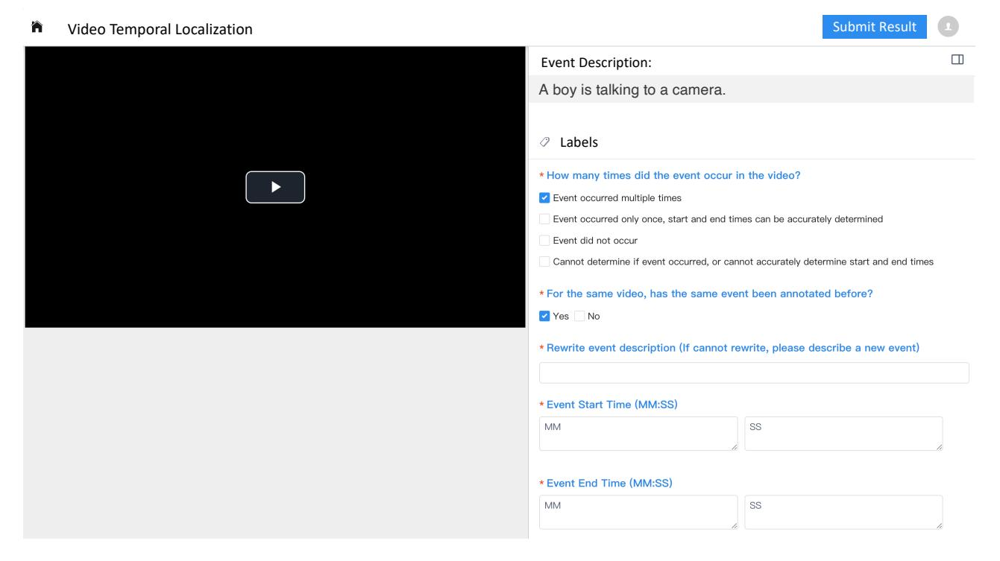

# **Prompt for Evaluating Qwen/MiMo Models**

Please find the visual event described by the sentence '**{query}**', determining its starting and ending times. The format should be: 'The event happens in <start time> - <end time> seconds'.

Figure 13. Prompt for evaluating Qwen3-VL, Qwen2.5-VL and MiMo-VL models.

Figure 14. Illustration of our annotation interface.

### **Video Temporal Localization Annotation Guidelines**

#### **Task Overview**

The annotation page contains a video and a description of a specific event. You need to watch the video to confirm whether the event occurred, how many times it occurred, select the corresponding option, and fill in the subsequent information (rewriting the description, filling in the start and end times of the event, etc.).

#### **Annotation Page Description**

The annotation page is shown below.

- **Left side:** The video page where you can play the video.
- **Right side (Red Box):** The "Event Description" area. This provides a sentence describing the event that needs to be annotated.
- **Right side (Green Box):** The options that need to be selected.

#### **Image Here**

**Instructions:** Watch the video, select the corresponding option, and the information required to be filled in will appear below. Fields marked with a red asterisk (\*) are mandatory.

**Image Here**

#### **Important Note on Time Entry**

When filling in the "Event Start Time" and "Event End Time" in the image above, you need to move your mouse over the video timeline. You will see the specific time of the current moment in the **white text box** (indicated by the **Red Box** in the diagram below; e.g., 0 min 29 sec).

**Please Note:** The time displayed on the right side of the video timeline (indicated by the **Green Box** area below) is **NOT** the time of the current moment! **Do not enter this time!**

(a)

**Image Here**

#### **Scenario A: You selected "Event occurs only once..."**

If you selected the second option in the first question ("Event occurs only once..."), and selected "No" in the second question:

- 1. Please perform appropriate **Polishing** on the event description. Make the description clearer and smoother without changing the semantic meaning of the sentence. You must ensure that after polishing, the start and end times of the event remain unchanged, and the event still occurs only once in the video. (If the original description already meets the requirements, you do not need to fill this in).
- 2. Then, near the start and end times of the event, pause the video and drag the progress bar to determine the start and end times as accurately as possible. Fill in the **minutes and seconds** for the start and end.

**Note:** For detailed instructions on "Polishing," please refer to the "Precautions" section of this document.

#### **Scenario B: You selected other options**

If you selected any other option in the first question (Multiple times, Did not occur, etc.):

- 1. You need to **Rewrite** the description of the event (if it is truly impossible to rewrite, choose a **new event** to describe). Ensure the modified event occurs **only once** in the video and that you can accurately determine its start and end times.
  - **Example 1:** "A person walking" occurs multiple times. It can be rewritten as "A man wearing blue clothes is walking," "A person walking on the crosswalk," "A person walking while holding an ice cream," or "A man walking with two women."
  - **Example 2:** "A man walking" did not occur, but there is a woman walking. It can be rewritten as "A woman is walking."
- 2. Then, near the start and end times of the **rewritten** event, pause the video and drag the progress bar to determine the start and end times as accurately as possible. Fill in the **minutes and seconds** for the start and end.

(c)

#### **Image Here**

#### **Detailed Step-by-Step Instructions**

First, you need to watch the **entire video** in **mute mode**. Pay attention to observe in which time segments the "Event Description" occurred, and complete the first multiplechoice question on the page:

#### **Image Here**

- **1. If the event occurs multiple times in the video (i.e., occurs in several noncontinuous time segments):**
- a) You need to select the **"Event occurs multiple times"** option.
- **2. If the event described by the sentence occurs in only one continuous time segment, and you can clearly determine the start and end times of the event:**
- a) You need to select the **"Event occurs only once, and start and end times can be accurately determined"** option.
- **3. If the event described by the sentence does not occur at all in the entire video:**
- a) You need to select the **"Event did not occur"** option.
- **4. If for various reasons (description is unclear, video is too blurry, etc.) you cannot judge whether the event occurred, or cannot accurately determine the start and end times:**
- a) You need to select the **"Unable to determine if event occurred, or unable to accurately determine start and end times"** option.
- b) Then, you need to fill in the specific reason in the "Why unable to determine" field.

**Image Here**

#### **Next, complete the second multiple-choice question:**

If you have already annotated the **same event** for the **same video**, select **"Yes"**; otherwise, select **"No"**.

(b)

**Note:** For detailed instructions on "Rewriting," please refer to the "Precautions" section of this document.

### **Final Check**

Afterwards, please **watch the entire video again** to check the filled content:

- 1. Ensure the event described by the modified sentence occurs **only once**.
- 2. Ensure the start and end times of the event are **correct and accurate**.

After checking, you can proceed to the next annotation.

### **Annotation Examples**

#### **Precautions / Important Notes**

### **I. Instructions regarding "Rewriting"**

When rewriting the original sentence, please follow these steps:

**II. Instructions regarding "Polishing"**

#### **FAQ (Frequently Asked Questions)**

**Question 1: Question 2:**

(d)

Figure 15. Illustration of our annotation manual. Some figures and details are removed for confidentiality and safety reasons.