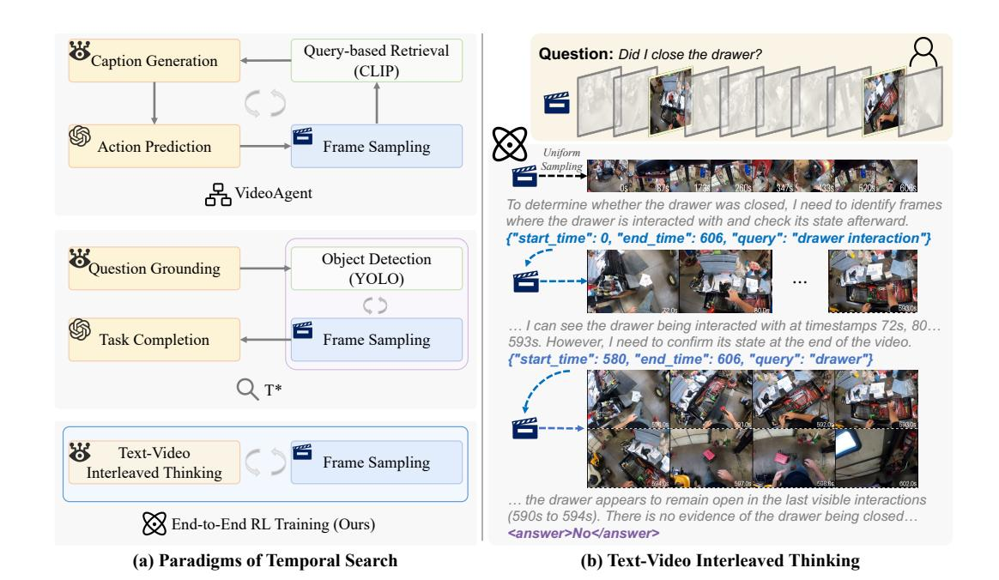

# 1 INTRODUCTION

Long-form video understanding requires models to navigate through tens of thousands of frames to identify the most relevant information for answering specific questions [\(Fu et al., 2024;](#page-9-0) [Zhou](#page-11-0) [et al., 2024;](#page-11-0) [Wu et al., 2024\)](#page-11-1). Temporal search lies at the heart of making long-video understanding both accurate and interpretable [\(Park et al., 2025;](#page-10-0) [Li et al., 2023;](#page-10-1) [Ye et al., 2025\)](#page-11-2). In contrast to the human visual system, which conducts adaptive temporal search [\(Yarbus, 1967;](#page-11-3) [Hayhoe & Ballard,](#page-9-1) [2005\)](#page-9-1), current large video-language models (LVLMs) primarily rely on hand-crafted search strategies with static frame sampling [\(Lin et al., 2023;](#page-10-2) [Bai et al., 2025a;](#page-9-2) [Feng et al., 2025\)](#page-9-3). Humans naturally alternate between broad scanning and targeted inspection, refining their focus iteratively based on intermediate findings [\(Castelhano & Henderson, 2007;](#page-9-4) [Henderson & Hayes, 2017\)](#page-9-5). In contrast, existing methods are limited to a fixed set of frames established before the reasoning process begins. This design presents a fundamental contradiction: video reasoning is a dynamic process where temporal search interleaves with video reasoning; however, the video frames accessible to the model remain fixed from the outset, ultimately hindering effective reasoning.

∗Equal contribution. † Project lead. BCorresponding author.

Figure 1: (a) Different paradigms of temporal search. Previous works such as VideoAgent [\(Wang](#page-11-4) [et al., 2024\)](#page-11-4) and T\* [\(Ye et al., 2025\)](#page-11-2) predominantly rely on handcrafted workflows, resulting in suboptimal strategies. Our approach adopts end-to-end reinforcement learning, enabling the model to learn optimal search strategies directly from data. (b) Interleaved text-video thinking process. We reformulate the temporal search task as an interleaved text-video thinking process, where the temporal search is seamlessly interleaved into the reasoning process.

Inspired by the gap between human cognition and model reasoning, recent studies have explored interactive video agents that attempt to bridge this divide through multi-turn temporal search, as illustrated in Figure [1](#page-1-0) (a). VideoAgent [\(Wang et al., 2024\)](#page-11-4) first employs a large language model (LLM) as the central agent, which iteratively calls tools like vision-language models (VLMs) and CLIP [\(Radford et al., 2021\)](#page-10-3) for frame captioning and retrieval, and then aggregates information in the textual modality to perform reasoning and predict answers. T\* [\(Ye et al., 2025\)](#page-11-2) extends this paradigm by introducing an object-oriented spatial-temporal search. It first leverages a VLM to extract target objects from the question, then employs object detection models (e.g., YOLO [\(Cheng et al., 2024\)](#page-9-6)) to identify keyframes containing these objects, and finally uses the retrieved frame set to complete the task. Moreover, strategies that introduce tree-structured search to improve efficiency have also been explored [\(Wang et al., 2025;](#page-11-5) [Li et al., 2025;](#page-10-4) [Pan et al., 2025\)](#page-10-5). However, all of these approaches depend on manually designed workflows, which lead to suboptimal search strategies.

This motivates us to explore an end-to-end learning approach that discovers optimal temporal search strategies directly from data. In this work, we reformulate the temporal search task as an interleaved text-video thinking process, and propose TIMESEARCH-R, a model that learns to actively search for relevant temporal clips through reinforcement learning (RL). As shown in Figure [1](#page-1-0) (b), our model alternates between textual reasoning and temporal exploration, iteratively refining its understanding of the video. We refer to this dynamic process as Thinking with Videos—a paradigm where models gradually improves their comprehension by searching for relevant video content conditioned on intermediate reasoning states. This concept extends the recent advances in multimodal reasoning, *Thinking with Images* [\(Su et al., 2025;](#page-11-6) [Hu et al., 2024;](#page-9-7) [Zheng et al., 2025\)](#page-11-7), to the long-video domain.

Although recent works have successfully applied RL algorithms like Group Relative Policy Optimization (GRPO) [\(DeepSeek-AI, 2025\)](#page-9-8) to textual [\(Jin et al., 2025\)](#page-9-9) and spatial search [\(Zheng et al., 2025\)](#page-11-7), temporal search in videos poses unique challenges. The original GRPO rewards only the final output while ignoring intermediate search decisions, leading to several failure modes illustrated in Figure [2.](#page-2-0) The first mode, termed insufficient temporal exploration, arises because the final output reward provides no incentive for comprehensive exploration of video frames. LVLMs may arrive at correct answers through partial evidence or language bias without proper visual grounding [\(Niu et al., 2021\)](#page-10-6),

Figure 2: Two failure modes with the original GRPO reward. Left: Insufficient temporal exploration. The model misses critical frames required to correctly answer the question. Right: Inconsistent logical reasoning. The intermediate reasoning process contradicts the final answer.

missing critical frames required for reliable understanding. The second mode, termed inconsistent logical reasoning, emerges when models produce plausible thinking processes disconnected from the final answers, a phenomenon also observed in text-only reasoning [\(Lanham et al., 2023\)](#page-10-7). These two failure modes hinder proper temporal search and diminish the benefits of video reasoning.

To address these challenges, we propose Completeness Self-Verification (CSV) as a supplement to the original GRPO algorithm, providing supervision over the intermediate steps of temporal search. GRPO-CSV tackles insufficient temporal exploration by ensuring the model to acquire sufficient visual evidence through self-verification, and promotes consistency between intermediate reasoning and the final answer by re-answering the question using the searched frames. Besides, we construct a high-quality video reasoning dataset to support GRPO-CSV training. Existing datasets contain a large number of trivial samples solvable through prue linguistic bias, as well as noisy samples that remain unsolvable even with extensive search, severely hindering progress in long-video reasoning. We implement a two-stage data filtering pipeline to curate high-quality samples tailored to the demands of video reasoning, ensuring that the model learns the correct process of temporal search.

We evaluate our TimeSearch-R on both temporal search and long-form video understanding tasks, demonstrating its superiority in long video reasoning. On temporal search tasks, TimeSearch-R improving the temporal F1 score on Haystack-LVBench by 5.6% and the accuracy on Haystack-Ego4D by 8.5%, compared to the previous state-of-the-art (SOTA) method. On long-form video understanding tasks, TimeSearch-R establishes new SOTA results with 4.1% improvement over the base model Qwen2.5-VL and 2.0% over the advanced reasoning model Video-R1 on LongVideoBench.

In summary, our main contributions are three-fold:

- 1. We propose the TimeSearch-R framework, which reformulates temporal search as interleaved text-video thinking and learns optimal search strategies directly from data.
- 2. We introduce GRPO-CSV, a novel RL algorithm, which ensures sufficient and accurate video exploration by supervising the intermediate steps of temporal search. To support GRPO-CSV training, we also construct a high-quality video reasoning dataset via a twostage filtering pipeline, enabling the model to learn correct temporal search processes.
- 3. Extensive experiments demonstrate the superiority of our approach on both temporal search and long-form video understanding. Notably, TimeSearch-R establishes a new SOTA on LongVideoBench, outperforming the latest reasoning model Video-R1 by 2.0%.

