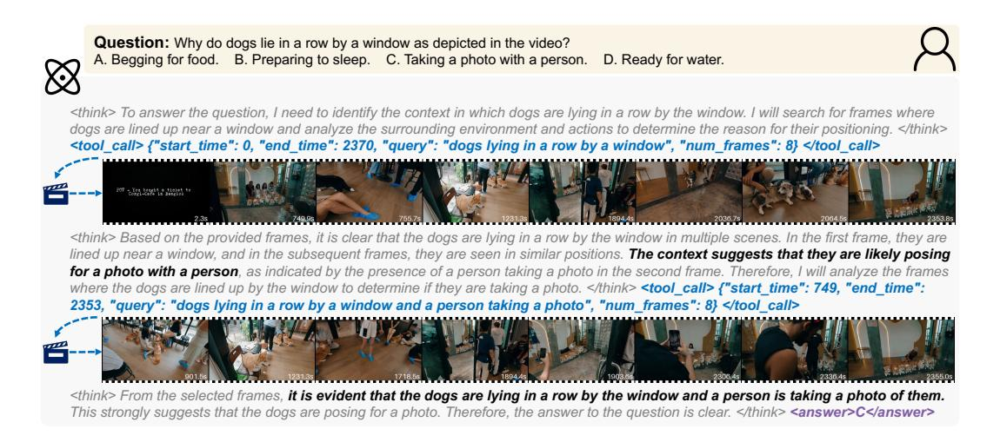

# 2 METHODS

In this section, we first reformulate the temporal search task as an interleaved text-video thinking process, enabling the model to learn optimal search strategies directly from data. To address the challenges of insufficient temporal exploration and inconsistent logical reasoning, we introduce GRPO-CSV as a novel RL algorithm for long videos, which ensures both sufficient and accurate video exploration by supervising intermediate steps of temporal search. Finally, we describe the model training process, including the construction of a high-quality long-video reasoning dataset.

### 2.1 TASK FORMULATION

Temporal Search within Thinking Process. To learn optimal search strategies directly from data, we reformulate temporal search as a multi-turn thinking process interleaved with video clip retrieval. Given a video V and a corresponding question Q, an initial preview  $\tilde{V}$  is uniformly sampled from V for subsequent reasoning. At each thinking step k, the policy model  $\pi_{\theta}$  generates a textual reasoning  $T_k$ . If  $T_k$  contains a search instruction, the video environment executes it according to frame timestamps, retrieving a clip  $V_k \subseteq V$  that is appended to the ongoing chain of thought (CoT) as input for later steps. The interleaved text-video CoT at reasoning step k is formalized as:

$$C_k \triangleq \{ (T_1, V_1), (T_2, V_2), \dots, (T_k, V_k) \}.$$
 (1)

This interaction process repeats until the model emits the final answer A or reaches the pre-defined reasoning budget. For further analysis, the entire reasoning chain can be decomposed into two components: temporal search and answer prediction, which can be formulated as:

$$P_{\theta}(A, C \mid \tilde{V}, Q) = \underbrace{P_{\theta}(C \mid \tilde{V}, Q)}_{Temporal \ Search} \cdot \underbrace{P_{\theta}(A \mid C, \tilde{V}, Q)}_{Answer \ Prediction}. \tag{2}$$

**Dynamic Video Frames.** During the interleaved thinking process, the model autonomously explores the video by searching for additional clips. At reasoning step k, if the model outputs a search instruction, it is also required to specify the temporal boundaries  $t_s^k$  and  $t_e^k$  to be explored, along with a corresponding textual query  $q^k$ . The video environment then executes a frame retrieval function to obtain additional F frames  $V_k = \text{search}(V; t_s^k, t_e^k, q^k, F) = \{f_k^1, f_k^2, \dots, f_k^F\}$ . This function serves as an interface to the policy model  $\pi_\theta$ , employing a small VLM (e.g., SigLIP (Zhai et al., 2023)) to calculate the similarity among frames within the specified temporal clip  $[t_s^k, t_e^k]$ , as well as the relevance with the textual query  $q^k$ . The most informative F frames are then sampled using determinantal point process (DPP) (Kulesza & Taskar, 2012), which has been widely used for information retrieval (Chen et al., 2018; Celis et al., 2018; Sun et al., 2025). This operation significantly improves the efficiency of temporal search, and more details can be found in Section A.

### 2.2 GRPO WITH COMPLETENESS SELF-VERIFICATION

Evaluating temporal search typically requires frame-level annotations (Ye et al., 2025), which are time-consuming and labor-intensive. To circumvent this challenge, previous works (Yu et al., 2025; Sun et al., 2025) have treated downstream video understanding task as a surrogate metric for assessing the searched frame set. However, these approaches are limited to selecting an optimal subset from a predefined pool of candidate frames, lacking interaction with and exploration of the video environment. Inspired by this, we design a **Completeness Self-Verification (CSV)** mechanism for GRPO, which is annotation-free and can be seamlessly integrated into RL training, serving as a complementary to the original outcome reward. The overall pipeline of GRPO-CSV is illustrated in Figure 3.

**GRPO-CSV.** We introduce CSV as a complement to GRPO with only outcome rewards. During the GRPO rollout phase, the policy model  $\pi_{\theta}$  generates a text-video interleaved CoT C and a final answer A. Applying rewards only to the final answer may reduce the effectiveness of intermediate search processes. To address this, we extract the video clips from C to form a dynamic frame set  $V_c$  as the input for the CSV phase. In the CSV rollout phase, the same policy model is required to re-answer the question Q using only  $V_c$ , yielding a CSV answer  $A_c$ . Critically, the model is prohibited from any further temporal searching and must rely solely on the currently searched frames to answer the question. The CSV answer  $A_c$  is expected to remain consistent with the original answer A:

$$P_{\theta}(A_c \mid V_c, Q) \approx P_{\theta}(A \mid C, \tilde{V}, Q). \tag{3}$$

**Completeness Reward.** We design a completeness reward for the CSV phase, which is computed using the original answer A, the CSV answer  $A_c$ , and the ground-truth answer  $A^*$  as follows:

$$R_c = \mathbb{1}[\text{Acc}(A, A^*) > 0.5] \cdot \text{Acc}(A_c, A^*).$$
 (4)

where  $Acc(A, A^*)$  and  $Acc(A_c, A^*)$  denote the correctness scores of the original answer and the CSV answer, respectively, and  $\mathbb{1}[\cdot]$  is an indicator function activated only when the original answer A is correct. This conditional design ensures that the CSV reward is applied only to promising reasoning trajectories, encouraging meaningful temporal search while verifying both the sufficiency of acquired visual evidence and the consistency between the reasoning process and the final answer.

Figure 3: **Overall pipeline of GRPO-CSV.** Building upon the original GRPO, CSV extracts a dynamic frame set from the multi-modal CoT and constructs a vision-only CoT for re-answering. This design verifies that the searched dynamic frames provide sufficient evidence for correct reasoning, ensuring completeness and consistency without requiring explicit frame-level supervision.

**Format Reward.** The format reward enforces adherence to a predefined schema throughout the multi-turn reasoning process, validating the structural integrity of the entire trajectory rather than individual steps. During reasoning, each step must follow either the <think>...</think><tool\_call>...</tool\_call> pattern for temporal search or the <think>...</think><answer>...</answer> pattern for the final response. We assign a binary score to the full trajectory: 1 if all steps are structurally valid, and 0 otherwise.

**Accuracy Reward.** We evaluate answer accuracy for two task types. For multiple-choice questions, we extract the option letter from the model's output and perform an exact match with the ground-truth option. For open-ended questions, we adopt an LLM-as-a-Judge approach (Zheng et al., 2023) to assess the semantic agreement between the model's final answer and the reference answer. The scores for both cases are given in binary form, with 1 indicating alignment with the standard answer.

**Overall Reward.** The total reward is the sum of completeness, format, and accuracy components:

$$R = R_c + R_{\text{fmt}} + R_{\text{acc}}.$$
 (5)

This composition encourages sufficient temporal exploration  $(R_c)$ , consistent reasoning structures  $(R_{\rm fmt})$ , and correct final answers  $(R_{\rm acc})$ , enhancing the model's ability to understand long-form videos.

### 2.3 MODEL TRAINING

**Dataset Construction.** A fundamental challenge in RL for long-video reasoning lies in the fact that a large number of samples in the existing datasets can be solved through pure linguistic bias, reducing the reliance on temporal search. Moreover, some noisy samples remain unsolvable even under ideal temporal search, preventing the model from effectively exploring the video. To address these challenges, we implement a two-stage data filtering pipeline to construct a high-quality dataset tailored to video reasoning. In the first stage, we remove samples that the policy model can solve correctly using only 4 uniformly sampled frames, thereby discouraging reliance on linguistic shortcuts. In the second stage, we further discard samples that remain unsolvable even with multiple temporal searches and numerous video frames, ensuring active video exploration. Additional details of this filtering pipeline are provided in Section B.1. And we enhance dataset diversity through the incorporation of samples sourced from Haystack-Ego4D (Ye et al., 2025), VideoMarathon (Lin et al., 2025), and CinePile (Rawal et al., 2024). A detailed analysis of the dataset is presented in Section B.2.

Table 1: **Temporal search performance.** We report temporal similarity, visual similarity, and question-answering (QA) accuracy on Haystack-LVBench, as well as QA accuracy on Haystack-Ego4D test-tiny subset. Baseline results are directly cited from Ye et al. (2025). † indicates the average number of keyframes determined by the model adaptively.

| Method                            | Base Model # Fr | # Frame           | Temporal |      | Visual           |      | QA   |       |         |       |
|-----------------------------------|-----------------|-------------------|----------|------|------------------|------|------|-------|---------|-------|
| Method                            |                 | # Frame           | P        | R    | $\overline{F_1}$ | P    | R    | $F_1$ | LVBench | Ego4D |
|                                   |                 | Static Frame      | Samp     | ling |                  |      |      |       |         |       |
| Uniform                           | Qwen2.5VL-7B    | 8                 | 1.4      | 6.3  | 2.2              | 56.0 | 72.0 | 62.7  | 33.7    | 32.0  |
| Uniform                           | GPT-4o          | 8                 | 1.4      | 6.3  | 2.2              | 56.0 | 72.0 | 62.7  | 47.1    | 41.5  |
| Uniform                           | GPT-40          | 32                | 1.4      | 24.9 | 2.7              | 58.7 | 81.6 | 67.3  | 50.5    | 45.5  |
| Adaptive Temporal Search          |                 |                   |          |      |                  |      |      |       |         |       |
| VideoAgent (Wang et al., 2024)    | GPT-4           | 10.1 † | 1.2      | 8.5  | 2.1              | 58.8 | 73.2 | 64.7  | -       | -     |
| Retrieval-based (Ye et al., 2025) | GPT-4o          | 8                 | 1.5      | 6.3  | 2.3              | 63.1 | 65.5 | 64.1  | _       | -     |
| T* (Ye et al., 2025)              | GPT-4o          | 8                 | 1.6      | 7.1  | 2.5              | 58.4 | 72.7 | 64.3  | 51.9    | 45.0  |
| Retrieval-based (Ye et al., 2025) | GPT-40          | 32                | 1.3      | 21.8 | 2.4              | 59.9 | 80.8 | 67.8  |         | -     |
| T* (Ye et al., 2025)              | GPT-40          | 32                | 1.7      | 28.2 | 3.1              | 58.3 | 83.2 | 67.8  | 53.1    | 46.5  |
| Text-Video Interleaved Reasoning  |                 |                   |          |      |                  |      |      |       |         |       |
| TimeSearch-R (Ours)               | Qwen2.5VL-7B    | 8.8†              | 5.4      | 22.3 | 8.1              | 63.2 | 76.4 | 69.2  | 52.1    | 53.5  |

**Model Training.** We employ a two-stage training scheme for our TimeSearch-R. In the first stage, supervised fine-tuning (SFT) serves as a cold start, guiding the model to follow the correct reasoning format and enabling effective policy learning in the subsequent RL stage. SFT training adopts the above dataset construction pipeline, using GPT-40 (OpenAI, 2024) to generate the text-video interleaved reasoning processes and the corresponding final answers. Following practices in the text domain (Jin et al., 2025), we mask the temporal search results during training to force the model to learn meaningful temporal windows and textual queries. The objective in this stage is to minimize the standard cross-entropy loss over reasoning tokens, while excluding masked video tokens from gradient computation. Building on this cold-start, we further conduct RL post-training based on the proposed GRPO-CSV algorithm to stimulate the temporal reasoning capability of the model.

### 3 EXPERIMENTS

### 3.1 EXPERIMENTAL SETUP

**Baselines.** To comprehensively evaluate the effectiveness of TimeSearch-R, we compare it against three types of baselines: (1) Advanced foundation models with static frame sampling, including both API models (OpenAI, 2024; Team et al., 2024) and open-source models (Bai et al., 2025a). (2) State-of-the-art temporal search agents, such as VideoAgent (Wang et al., 2024), T\* (Ye et al., 2025), and VideoTree (Wang et al., 2025). (3) Video reasoning models like Video-R1 (Feng et al., 2025).

**Datasets.** We evaluate TimeSearch-R on two tasks: (1) Temporal search on Haystack-LVBench and Haystack-Ego4D (Ye et al., 2025), where the task is modeled as long video needle-in-a-haystack, measuring temporal and visual similarity as well as QA accuracy. (2) Long-form video understanding on VideoMME (Fu et al., 2024), MLVU (Zhou et al., 2024), and LongVideoBench (Wu et al., 2024).

**Evaluation Metrics.** Besides the original metrics used in the benchmarks, we additionally introduce two metrics to assess the quality of the text-video interleaved thinking process for ablation study. Among them, *completeness* measures whether the searched frame set is sufficient for the correct answer, while *consistency* measures the alignment between intermediate reasoning and the final answer. Further details on these two metrics are provided in Section D.

**Implementation Details.** We train TimeSearch-R based on Qwen2.5-VL-7B-Instruct (Bai et al., 2025a). In the RL training, we use the AdamW (Loshchilov & Hutter, 2017) optimizer with a learning rate of 1e-6, a KL penalty coefficient  $\beta = 0.005$ , and a batch size of 4 with 8 rollouts per prompt. We limit each search operation to retrieving at most 8 frames from a specified temporal clip, with up to 8 search steps in total. Training is conducted on 32 A100 GPUs. See more details in Section F.

Table 2: **Video understanding performance.** E2E stands for end-to-end optimization. # Frame represents the number of input frames. † indicates the keyframes produced by temporal search.

| Model                                  | E2E # Frame           |                  | VideoMME (w/o sub) |        |      |         | MLVU  | LVB  |
|----------------------------------------|-----------------------|------------------|--------------------|--------|------|---------|-------|------|
| iviouei                                |                       | EZE # Frame      |                    | medium | long | overall | m-avg | val  |
|                                        | Static Frame Sampling |                  |                    |        |      |         |       |      |
| Qwen2.5VL-7B (Bai et al., 2025b)       | 1                     | 768              | 76.3               | 66.0   | 54.6 | 65.1    | 70.2  | 56.0 |
| GPT-4o (OpenAI, 2024)                  | 1                     | 384              | 80.0               | 70.3   | 65.3 | 71.9    | 64.6  | 66.7 |
| Gemini-1.5-Pro (Team et al., 2024)     | ✓                     | 1 fps            | 81.7               | 74.3   | 67.4 | 75.0    | -     | 64.0 |
|                                        | Adap                  | tive Tempor      | al Searc           | h      |      |         |       |      |
| VideoAgent (GPT-4) (Wang et al., 2024) | X                     | 87 †  | -                  | -      | 49.0 | 56.0    | -     | -    |
| VideoTree (GPT-4) (Wang et al., 2025)  | X                     | 128 † | 67.8               | 59.9   | 54.2 | _       | -     | _    |
| T* (GPT-40) (Ye et al., 2025)          | X                     | $32^{\dagger}$   | 69.5               | 63.5   | 59.3 | 64.1    | -     | _    |
|                                        | Te                    | xt-only Reas     | oning              |        |      |         |       |      |
| Video-R1-7B (Feng et al., 2025)        | 1                     | 32               | 71.1               | 59.0   | 49.4 | 59.9    | 61.6  | 56.4 |
| Video-R1-7B (Feng et al., 2025)        | ✓                     | 768              | 74.1               | 65.1   | 55.6 | 65.7    | 68.4  | 58.1 |
| T                                      | ext-Vide              | eo Interleave    | d Reaso            | ning   |      |         |       |      |
| Qwen2.5VL-7B + Search                  | X                     | 768              | 53.4               | 53.8   | 48.2 | 51.8    | 58.9  | 49.1 |
| TimeSearch-R-7B (Ours)                 | 1                     | 768              | 76.8               | 67.1   | 56.0 | 66.6    | 71.5  | 60.1 |
| $\Delta$ (v.s. Qwen2.5VL-7B)           | _                     | -                | +0.5               | +1.1   | +1.4 | +1.5    | +1.3  | +4.1 |

### 3.2 MAIN RESULTS

**Temporal Search.** On the temporal search task, TimeSearch-R establishes a new state-of-the-art on LV-Haystack, as shown in Table 1. Under a budget of 8 keyframes, our method achieves an  $F_1$  score of 8.1 in temporal similarity, more than three times the previous best result of 2.5 obtained by T\*. In visual similarity, TimeSearch-R reaches an  $F_1$  score of 69.2, surpassing the previous SOTA method VideoAgent by 5.5, and even outperforming the retrieval-based method and T\* with larger keyframe budgets. For the needle-in-a-haystack QA, our TimeSearch-R consistently outperforms the advanced API model GPT-40, achieving 52.1% accuracy on Haystack-LVBench and 53.5% on Haystack-Ego4D. These results demonstrate the superiority of end-to-end learned temporal search strategies over handcrafted workflows based on human heuristics.

**Long-Form Video Understanding.** Our TimeSearch-R also achieves strong performance on the long-form video understanding task, which is shown in Table 2. On VideoMME, our method reaches an overall accuracy of 66.6%, surpassing the base model Qwen2.5-VL by 1.5%. As the duration of the video increases, our method can achieve more gains, from 0.5% on short videos to 1.4% on long videos, demonstrating that temporal search becomes more valuable when the video length increases. On MLVU and LongVideoBench, TimeSearch-R achieves 71.5% and 60.1%, improving over the base model by 1.3% and 4.1%, respectively. Compared with video search agents, TimeSearch-R outperforms VideoAgent and T\* on VideoMME by 10.6% and 2.5%, highlighting the advantage of end-to-end optimization. Notably, our method consistently surpasses the latest video reasoning model Video-R1 across all benchmarks, validating that text-video interleaved reasoning is more effective than text-only reasoning for long-form video understanding. Moreover, directly applying temporal search to Qwen2.5-VL through CoT prompting without additional training actually degrades performance, underscoring the necessity of RL post-training with the proposed GRPO-CSV.

## 3.3 ABLATION STUDIES

**Training Scheme.** We explore the impact of different training stages in Table 4a, from zero-shot CoT to SFT and finally RL, yielding two key findings: (1) **SFT enables search capability:** The model cannot perform the search well only through zero-shot CoT prompts. SFT allows the model to rapidly acquire temporal search skills, dramatically improving temporal  $F_1$  from 0.0 to 7.8 and searched frame completeness from 44.2% to 60.5%. (2) **RL enhances video reasoning:** While RL provides modest improvements to temporal similarity and search completeness, its primary advantage lies in boosting overall understanding performance. The post-training stage improves reasoning consistency by 2.6%, which in turn raises QA accuracy from 59.2% to 66.6%.

**GRPO-CSV Component.** We further conduct an ablation study on the components of GRPO-CSV in Figure 4, and obtain three key findings: (1) **GRPO reduces search completeness.** Without CSV

| M.d. 1                                                                  | Hay                                                               | stack-LVBe                                   | ench                                   | VideoMME                                |                                       |                                                                      |  |
|-------------------------------------------------------------------------|-------------------------------------------------------------------|----------------------------------------------|----------------------------------------|-----------------------------------------|---------------------------------------|----------------------------------------------------------------------|--|
| Method                                                                  | P                                                                 | R                                            | $F_1$                                  | Comp.                                   | Cons.                                 | Acc.                                                                 |  |
| Qwen2.5-VL w/ search SFT                                             | 0.0 7.4                                                        | 0.0 11.6                                  | 0.0 7.8                             | 44.2 60.5                            | 59.4 69.2                          | 51.8 59.2                                                         |  |
| GRPO (Before Collapse) GRPO-CSV w/o Acc. Rwd GRPO-CSV w/ Acc. Rwd | 5.2 -2.2 6.1 -1.3 5.4 -2.0 | $18.8_{+7.2} \\ 19.8_{+8.2} \\ 22.3_{+10.7}$ | $7.4_{-0.4}$ $8.2_{+0.4}$ $8.1_{+0.3}$ | $57.2_{-3.3}  61.2_{+0.7}  60.2_{-0.3}$ | $69.3_{+0.1} 75.3_{+6.1} 71.8_{+2.6}$ | 65.1 +5.9 64.8 +5.6 66.6 +7.4 |  |

(a) Ablation Results

(b) Training Dynamics

Figure 4: **Ablation study of GRPO-CSV.** (a) Comparison of different training schemes on temporal search and long-form video understanding. (b) When CSV is removed, training begins to collapse. The model gradually reduces the number of search calls and eventually stops searching altogether.

Table 3: Ablation study of data composition. Line 1 shows the accuracy of original Qwen2.5-VL.

| Eas          | Ewo          | Eller        |       | Gene   | eral        |             | Reasoning   |             |        |             |
|--------------|--------------|--------------|-------|--------|-------------|-------------|-------------|-------------|--------|-------------|
| Ego          | Exo          | Filter       | short | medium | long        | overall     | temporal    | spatial     | action | object      |
| _            | -            | _            | 76.3  | 66.0   | 54.6        | <u>65.1</u> | 51.4        | 76.8        | 56.8   | <u>59.5</u> |
| <b>√</b>     | <b>√</b>     |              | 74.2  | 62.7   | 51.3        | 62.8        | 40.1        | 67.9        | 60.0   | 56.2        |
| $\checkmark$ |              | $\checkmark$ | 76.4  | 64.7   | <u>54.9</u> | 65.3        | <u>54.8</u> | 73.2        | 58.2   | 59.0        |
| $\checkmark$ | $\checkmark$ | $\checkmark$ | 76.8  | 67.1   | 56.0        | 66.6        | 58.8        | <u>75.0</u> | 62.5   | 61.9        |

as a complement, GRPO drops completeness from 60.5% to 57.2% and temporal  $F_1$  from 7.8 to 7.4, demonstrating that outcome-only rewards lead to insufficient temporal exploration. (2) **GRPO-CSV improves training stability.** As illustrated in Figure4b, removing CSV causes training to collapse around step 300, after which the model ceases to make search calls and completeness drops to zero. (3) **GRPO-CSV with accuracy reward achieves the best QA performance.** While completeness reward alone achieves the highest completeness and consistency, it slightly reduces QA accuracy by 0.3%. Combining GRPO-CSV with accuracy reward leads to the best overall QA performance.

**Data Composition.** We also analyze the data composition in RL training, as shown in Table 3, revealing the contributions of data filtering and domain diversity. Without data filtering, RL training leads to a substantial performance drop compared to the original Qwen2.5-VL. This degradation arises because linguistic biases induce zero advantage in GRPO group computation: when questions can be trivially answered through linguistic shortcuts, all rollouts achieve perfect accuracy and completeness, yielding no learning signal and severely hindering RL efficiency and training stability. After applying data filtering, the model trained solely on egocentric data recovers baseline performance, but the lack of diversity weakens the benefits of RL. By incorporating exocentric data to enhance domain diversity, the model achieves its best general QA accuracy of 66.6%. Notably, although the training data only includes general long-video QA tasks, RL training significantly boosts the model's temporal and action reasoning capabilities, improving them by 7.4% and 5.7%, respectively. This remarkable performance demonstrates that TimeSearch-R learns fundamental cognitive patterns through end-to-end policy optimization, validating the strong generalization of our proposed GRPO-CSV algorithm.

### 3.4 CASE STUDIES

We analyze the search patterns that emerge during end-to-end RL training, demonstrating how the model executes temporal search within its reasoning process in a manner analogous to human cognition. These search patterns exhibit adaptability and flexibility across different task types:

**Hypothesis-driven search.** The model formulates hypotheses based on limited context and executes targeted searches to gather additional video frames as supporting evidence. (Figure 5)

**Confirmation or elimination.** When the initially sampled dynamic frame set provides insufficient support for an answer, the model employs multi-faceted search strategies or elimination methods to collect additional evidence and reduces uncertainties. (Figure 13 and 14)

**Sequential search.** The model performs segment-by-segment analysis to accomplish temporal reasoning tasks that require understanding sequential relationships. (Figure 15)

Figure 5: Hypothesis-driven search. Given the context that dogs are lying in a row across multiple scenes and remain still, the model hypothesizes that they are waiting to be photographed. It then searches for the person taking a photo to gather supporting evidence and provides the final answer.

