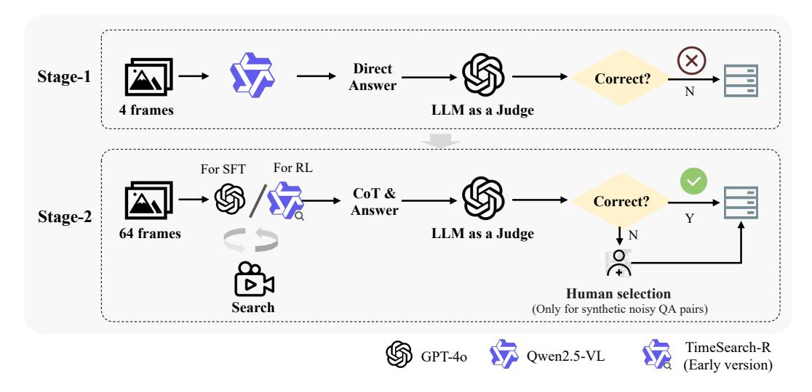

# TIMESEARCH-R: ADAPTIVE TEMPORAL SEARCH FOR LONG-FORM VIDEO UNDERSTANDING VIA SELF-VERIFICATION REINFORCEMENT LEARNING

Junwen Pan1∗ Qizhe Zhang1,2 ∗ Rui Zhang1 Ming Lu2 † Xin Wan1 Yuan Zhang1,2 Chang Liu1 Qi She1 B 1 ByteDance 2 School of Computer Science, Peking University {panjunwen,sheqi.roger}@bytedance.com

# TIMESEARCH-R: ADAPTIVE TEMPORAL SEARCH FOR LONG-FORM VIDEO UNDERSTANDING VIA SELF-VERIFICATION REINFORCEMENT LEARNING

### **APPENDIX**

This appendix provides more details about our methods, dataset, training, more case studies, broader impacts, as well as the LLM usage, organized as follows:

- Section A: Search Function
- · Section B: Dataset Details
- Section C: Prompt Design
- Section D: Evaluation Metrics
- Section E: Efficiency Analysis
- Section F: Training Details
- Section G: More Case Studies
- Section H: Boarder Impacts
- Section I: LLM Usage

### A SEARCH FUNCTION

### A.1 FRAME SELECTION

The video search function selects the most informative frames within predicted temporal clips. Specifically, we leverage determinantal point process (DPP) (Kulesza & Taskar, 2012) as the search optimization for its ability to naturally balance query relevance and diversity that penalizes redundancy, which has been widely applied in information retrieval (Celis et al., 2018; Sun et al., 2025).

Recall the definition of search in Sec. 2.1, it aims to select F optimal frames guided by a temporal clip  $[t_s,t_e]$  and a query q from the original video V. First, the function first subsamples N candidate frames  $\mathcal{F}_{[t_s,t_e]}=\{v_i\}_{i=1}^N$  within the temporal clip. Subsequently, we obtain a visual embedding  $\mathbf{h}_i \in \mathbb{R}^d$  for each candidate frame in  $\mathcal{F}_{[t_s,t_e]}$ , and a query embedding  $\mathbf{q} \in \mathbb{R}^d$  for q. Then we define the pairwise cosine similarity for candidate frames as  $S_{ij}=\mathbf{h}_i^{\top}\mathbf{h}_j$  and compute an unnormalized query relevance score for each frame as  $\tilde{r}_i=\mathbf{q}^{\top}\mathbf{h}_i$ , which is rescaled to [0,1] by min-max normalization  $r_i=\frac{\tilde{r}_i-\min \tilde{\mathbf{r}}}{\max \tilde{\mathbf{r}}-\min \tilde{\mathbf{r}}+\epsilon}$ , where  $\epsilon$  is a small constant to avoid division by zero. The kernel is constructed by diagonal conditioning with these relevance weights:

$$\tilde{\mathbf{L}} = \operatorname{diag}(\mathbf{r}) \mathbf{S} \operatorname{diag}(\mathbf{r}), \tag{6}$$

which is equivalent to  $\tilde{L}_{ij} = r_i r_j \mathbf{h}_i^{\top} \mathbf{h}_j$ . The optimal subset  $V^* \subset \mathcal{F}_{[t_s,t_e]}$  with  $|V^*| = F$  is then obtained through fast greedy MAP inference (Chen et al., 2018):

$$V^* = \arg \max_{S \subseteq \mathcal{F}_{[t_s, t_e], |S| = F}} \det(\tilde{\mathbf{L}}_S). \tag{7}$$

This formulation ensures that selected frames are both diverse and relevant to the query. When available frames are fewer than F, the search function degrades to uniform temporal sampling.

### A.2 FRAME REPRESENTATION

The selected clip frames are sparse and non-uniform. To maintain the temporal pace, we attach an explicit absolute timestamp to each frame by inserting a short text token with the time in seconds (e.g., "12.3s") immediately before the image. This simple interleaving of timestamp text and the corresponding image maintains absolute temporal grounding when inter-frame intervals vary and

Figure 6: Illustration of the proposed two-stage data filtering pipeline.

complements the native temporal ids. Explicit absolute timestamp augmented frame representation has also been observed to improve temporal capability in prior work on long-video temporal grounding [\(Pan et al., 2025\)](#page-10-5). For uniformly sampled preview frames, we employ the native dynamic-FPS and absolute time encoding following Qwen2.5-VL [\(Bai et al., 2025a\)](#page-9-2), which bind image token sequences to temporal ids aligned with real absolute timestamps.

