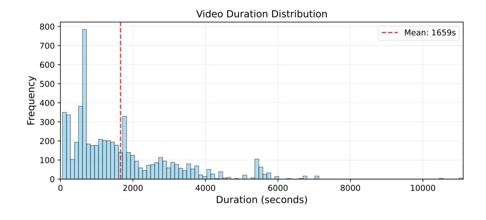

# B.2 DATASET ANALYSIS

The dataset exhibits a pronounced long-tail distribution in video duration with a mean length of 1,659 seconds. Most videos are shorter than 2,000 seconds, while a nontrivial tail extends beyond one hour, posing significant challenges for static frame sampling. This distribution motivates adaptive temporal search and multi-turn interaction to progressively retrieve evidence under tight keyframe budgets.

Figure 7: **Dataset analysis.** (1) The training set is mainly composed of long videos. The average length is 1659 seconds, and the maximum length exceeds 10,000 seconds. (2) Egocentric QA pairs come from Haystack-Ego4D, and Exocentric QA data mainly from VideoMarathon and Cinepile, where VideoMarathon employs Panda-70M as the video source. (3) Question types include multiple-choice and open-ended questions. To obtain open-ended QA pairs, we convert some multiple-choice tasks into open-ended questions.

We curate data from four major sources to ensure coverage of diverse visual domains and camera styles. As shown in Fig. 7, Ego4D from Haystack-Ego4D (Ye et al., 2025) training set contributes 49.5% of samples, providing egocentric daily activities with frequent viewpoint changes. Panda-70M from VideoMarathon (Lin et al., 2025) accounts for 35.6%, expanding the variety of internet videos with heterogeneous motion patterns and scene dynamics. CinePile (Rawal et al., 2024) provides 9.5% of short videos with narrative structure and rapid scene transitions. The remaining 5.4% are from other sources and serve to reduce distributional bias.

Question types are intentionally imbalanced toward open-ended reasoning to better evaluate generative capabilities. Open-ended questions make up 60.3% of the data and emphasize step-by-step analysis, temporal grounding, and explanation quality. Multiple-choice questions comprise 39.7% and offer reliable automatic evaluation signals that complement outcome rewards in RL.

This composition yields wide coverage over motion intensity, scene diversity, and narrative structure while maintaining sufficient automatic evaluability. The mixture of long-tail durations and openended questions creates a setting where end-to-end RL and adaptive temporal search offer clear benefits over single-shot heuristics.

