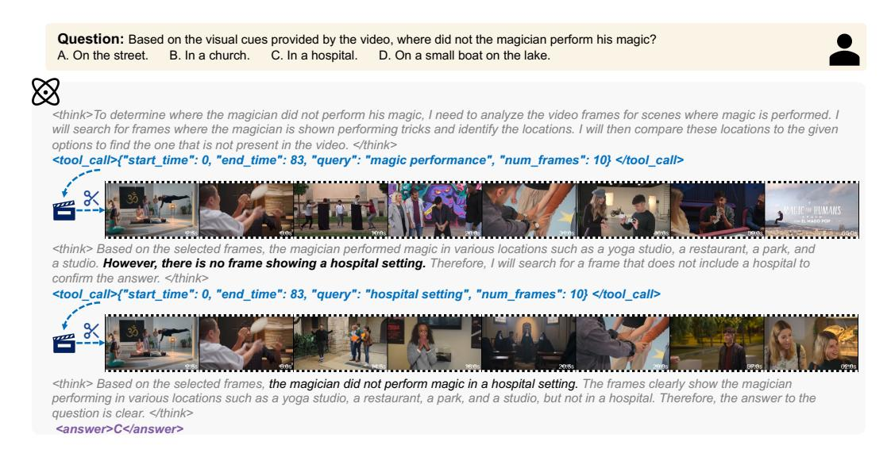
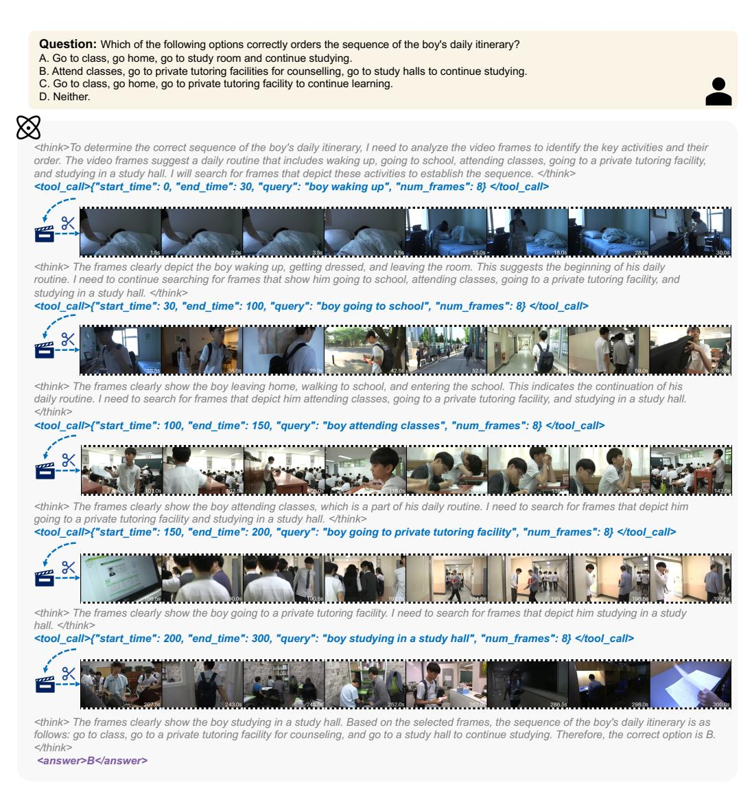
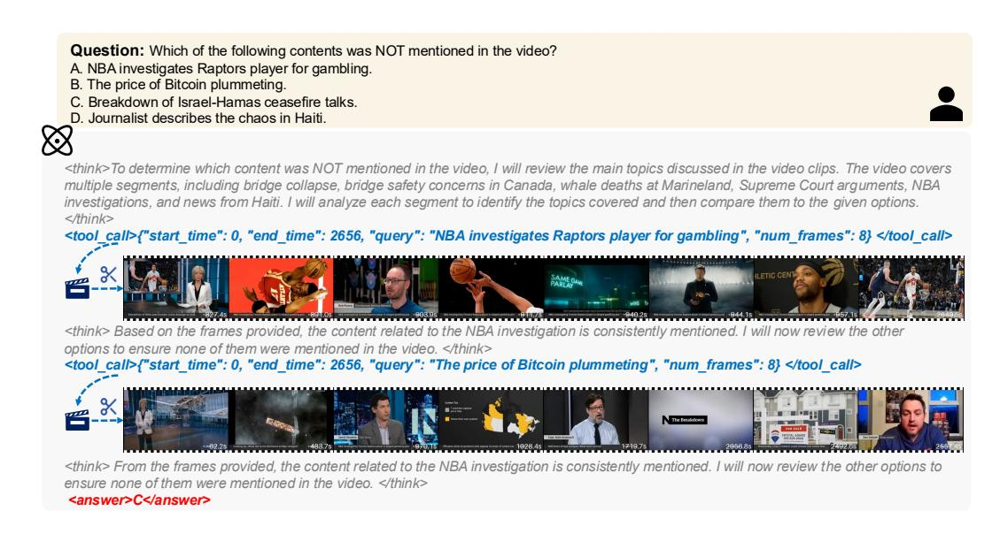
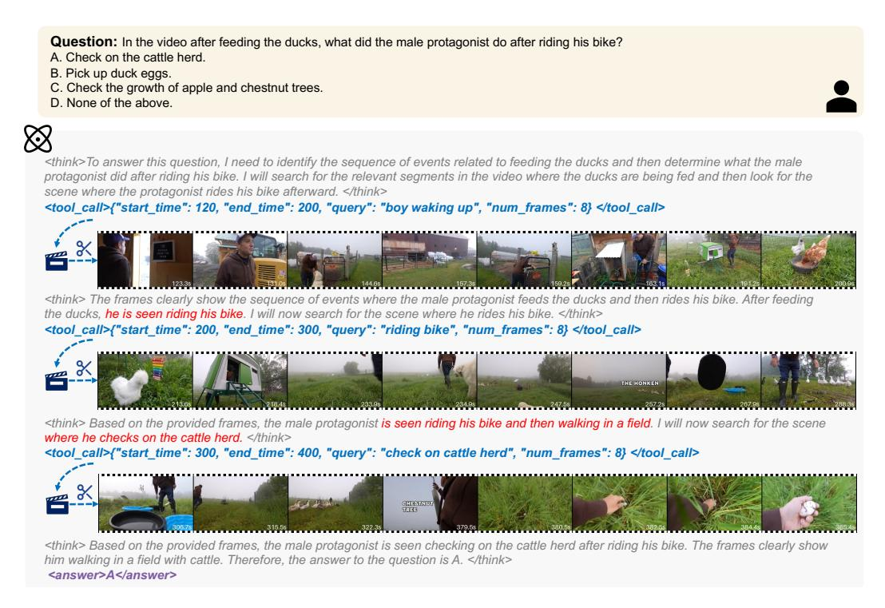

# I THE USE OF LARGE LANGUAGE MODELS

The authors declare that Large Language Models were used in this paper for polishing the writing. Specifically, the LLM assisted with tasks such as grammar checking, sentence simplification, and improving the overall fluency of the text. It is important to note that the LLM was not used for any literature review or research ideation. All research ideas and experimental analyses presented in the paper were solely conducted by the authors.

Figure 13: Search pattern: search confirmation.

Figure 14: Search pattern: elimination method.

Figure 15: Search pattern: sequential search.

Figure 16: Failure case: insufficient search. There were 4 options in total, but only 2 were reviewed before the search was terminated.

Figure 17: Failure case: visual hallucination. No information related to riding was found in the search results.