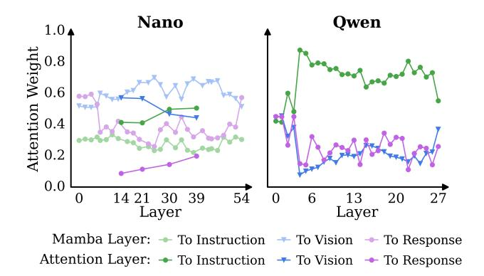

# 5. Conclusion

This work takes an initial step toward understanding and compressing hybrid vision-language models for long videos. We introduce TimeViper, a Mamba-Transformer hybrid model equipped with TransV, an internal LLM token transfer module that compresses vision information into text tokens. We reveal that visual information gradually shifts into text tokens as depth of hybrid LLM layer increases, resulting in substantial redundancy among vision tokens in deep layers. TimeViper can efficiently process hour-long videos while maintaining strong multimodal understanding. TimeViper achieves promising performance for long video understanding across multi-choice video QA, temporal video grounding, and detailed video captioning.

## **Appendix**

#### A. Limitations

First, our current performance still falls short of the SOTA models due to limited training data and insufficient model training. Second, while TransV enables processing over 10,000 frames, the model has not been trained on videos of such duration.

Implementation details. When training attention-based

## **B.** Experimental Setups

dropping in multi-turn dialogue scenarios, the attention distribution is computed using the last token of the final instruction as the query. For temporal video grounding data, we incorporate a time-aware prompt [50]: "The video lasts for {} seconds, and {} frames are uniformly sampled from it." During training, we randomly sample one instruction from a pool of 15 manually constructed task prompts, such as: "From the video, locate the portion that aligns with the textual query, and output the start and end timestamps in seconds. The output format of the predicted timestamp should be like: 'start to end' seconds. A specific example is : 12.0 to 20.0 seconds". We do not use a system prompt, but we retain the BOS token to act as an attention sink [91]. **Training data summary.** Our training pipeline adopts a two-stage strategy. We summarize the training data in Table 3. Specifically, in the first image-text alignment stage, we utilize 3 million images randomly sampled from the CC12M dataset [15], paired with captions sourced from PixelProse [75]. In the second video instruction tuning stage, we assemble a composite dataset to enhance MLLM's video understanding and timestamp prediction capabilities, comprising: (1) 1.3M samples from LLaVA-Video [113]; (2) 253K data from Kinetics400 [13] and WebVid [8] that are recaptioned with GPT-40 or Gemini by ShareGemini [71] and ShareGPT-4 [17]; (3) 100K samples from ET-Instruct [57]; (4) 112K samples from VideoGPT-Plus [59]; (5) 11K samples from LongVid [50] and MovieChat [76]; (6) 26K dense video captioning (DVC) samples aggregated from ActivityNet [12], COIN [78], HiREST [105], ViTT [37], and YouCook2 [117]; and (7) 250K temporal video grounding (TVG) samples [89] from YT-Temporal [95], DiDeMo [6], QuerYD [62], Intern-Vid [88], and HowTo100M [61]. We obtain grounding data with annotations from VTG-IT [34], TimeIT [69], Time-Pro [106], HTStep [2], and LongVid [50]. This data collection process yields 339K temporal grounding samples. To ensure data quality, we apply a simple cleaning protocol to the TVG data. Specifically, we filter out coarsegrained samples where the ground truth duration exceeds 30 seconds or spans more than one-third of the total video length. We also discard invalid entries containing out-of-

Figure 10. Comparison of average attention scores across all layers in Nanov2 and Qwen2.5. The visualization shows both attention and Mamba layers for Nano, and attention layers for Qwen. For Mamba layers, we normalize each row of the attention scores using the  $L_1$  norm so that all values fall within the range [0, 1].

bound timestamps. Consequently, our TVG training data remains 250K.

#### C. Main Results

**TransV** can be also applied to Qwen2.5. Qwen can also use TransV to handle ultra-long sequences, as shown in Table 4. We observe that on LVBench, this even brings a +0.4 improvement. However, the performance drop on VDC is more severe for Qwen than for Nano. For example, Qwen drops from 42.0 to 40.7 (a decrease of 1.3 points), whereas Nano drops from 39.7 to 39.1 (a decrease of 0.6 points).

## **D.** Qualitative Results

We define average attention scores used in both Mamba-2 and self-attention layers to analyze attentions received by different types of tokens.

Average attention score computation. We adopt the category-level attention score definition from LLaVA-Mini [111]. Tokens are grouped into instruction, vision, and response categories:  $\mathcal{T}_{ins}$ ,  $\mathcal{T}_{vis}$ , and  $\mathcal{T}_{res}$ . Let  $a_{ij}$  denote the attention score from token  $t_i$  to token  $t_j$ , averaged over all attention heads. For two token categories  $\mathcal{A}, \mathcal{B} \in \{\mathcal{T}_{ins}, \mathcal{T}_{vis}, \mathcal{T}_{res}\}$ , we define their category-level attention score as:

$$Attn(\mathcal{A} \to \mathcal{B}) = \frac{\sum_{t_i \in \mathcal{A}} \sum_{t_j \in \mathcal{B}} a_{ij}}{\left| \left\{ t_i \in \mathcal{A} \mid \sum_{t_j \in \mathcal{B}} a_{ij} > 0 \right\} \right|}.$$
 (9)

The denominator counts the number of tokens in  $\mathcal{A}$  that attend to any token in  $\mathcal{B}$  with non-zero weight, ensuring that tokens masked by the causal attention mask are excluded.

In Figure 10, we analyze the overall attention scores from the entire sequence  $\mathcal{T} = \mathcal{T}_{ins} \cup \mathcal{T}_{vis} \cup \mathcal{T}_{res}$  to a target category

Table 3. Data recipe. Overview of the datasets used in our two-stage training pipeline.

| Stage 1: Projector Alignment      |                                                                                                                                                                                                                    |  |  |  |  |  |  |
|-----------------------------------|--------------------------------------------------------------------------------------------------------------------------------------------------------------------------------------------------------------------|--|--|--|--|--|--|
| Image caption data (3M)           | CC12M (3M) [15] with PixelProse captions [75]                                                                                                                                                                      |  |  |  |  |  |  |
| Stage 2: Video Instruction-Tuning |                                                                                                                                                                                                                    |  |  |  |  |  |  |
| Image instruction data (2.8M)     | LLaVA-OneVision (2.8M) [46];                                                                                                                                                                                       |  |  |  |  |  |  |
| Video instruction data (1.8M)     | LLaVA-Video (1.3M) [113]; Kinetics400 & WebVid (253K) [8, 13] (recaptioned via ShareGem ini [71] & ShareGPT-4 [17]); VideoGPT-Plus (112K) [59]; ET-Instruct (100K) [57]; LongVid [50] & MovieChat (11K) [76] |  |  |  |  |  |  |
| Dense video captioning (26K)      | ActivityNet [12], COIN [78], HiREST [105], ViTT [37], YouCook2 [117]                                                                                                                                               |  |  |  |  |  |  |
| Temporal video grounding (250K)   | YT-Temporal [95], DiDeMo [6], QuerYD [62], InternVid [88], HowTo100M [61] (Annotated by VTG-IT [34], TimeIT [69], TimePro [106], HTStep [2], LongVid [50])                                                      |  |  |  |  |  |  |

Table 4. Performance of applying TransV to Qwen2.5 and Nano.

| Model                       | LLM             | >10K frame input | MVBench | LongVideoBench | MLVU  | VideoMME |      | LVBench | Charades-STA | VDC     |
|-----------------------------|-----------------|------------------|---------|----------------|-------|----------|------|---------|--------------|---------|
|                             |                 |                  | avg.acc | val            | M-Avg | overall  | long | avg.acc | mIoU         | avg.acc |
| Qwen2.5-7B (ours)           | Qwen2.5-7B [96] | ✗                | 57.6    | 55.4           | 64.9  | 56.6     | 48.7 | 36.6    | 40.8         | 42.0    |
| Qwen2.5-7B (ours w/ TransV) | Qwen2.5-7B [96] | ✓                | 55.7    | 53.7           | 63.3  | 55.7     | 47.4 | 37.0    | 38.7         | 40.7    |
| TimeViper (ours)            | Nanov2-9B [9]   | ✗                | 57.2    | 54.1           | 65.6  | 58.8     | 48.8 | 35.5    | 40.5         | 39.7    |
| TimeViper (ours w/ TransV)  | Nanov2-9B [9]   | ✓                | 56.2    | 52.0           | 63.1  | 56.9     | 48.2 | 35.6    | 37.9         | 39.1    |

B. To ensure equal contribution from each category, we compute the arithmetic mean of the scores:

$$Attn(\mathcal{T} \to \mathcal{B}) = \frac{1}{3} \left( Attn(\mathcal{T}_{ins} \to \mathcal{B}) + Attn(\mathcal{T}_{vis} \to \mathcal{B}) + Attn(\mathcal{T}_{res} \to \mathcal{B}) \right).$$
(10)

Hybrid MLLMs preserve stronger attention to vision tokens. To quantify model behavior, we compute the average attention received by instruction, vision, and response tokens across all layers. As shown in Figure [10,](#page-9-0) Qwen rapidly down-weights vision tokens after the early layers, instead favoring instruction and response tokens. In contrast, Nano maintains noticeably higher attention to vision tokens throughout the network. These findings suggest that the hybrid model is more effective at attending to visual information than the Transformer-based architecture.

Qualitative results on VideoMME. Figure [11c](#page-11-0) provides qualitative examples illustrating the effectiveness of TransV on the MCQ task. In the first case (top row), the query requires retrieving fine-grained visual information, specifically, the defending layers about the Berlin Wall. The compressed model, TimeViper w/ TransV, successfully attends to the critical frame at 03:36, which clearly depicts the structure of the wall, enabling it to select the correct answer. This example highlights TransV's capability to identify and attend to key visual cues within long videos. In the second case (bottom row), the query requires long-term temporal reasoning to infer the chronological order of topics in a biology lecture. The correct answer relies on aggregating information across the entire video duration. In this case, a model must accurately align the textual concepts (e.g., structure, photosynthesis) with their corresponding temporal segments (00:52, 07:37, etc.), As shown in the visual evidence, TimeViper w/ TransV correctly deduces the sequence (c)-(d)-(e)-(a)-(b), demonstrating its capability in modeling global temporal dependencies and understanding narrative structure.

Qualitative results on Charades. For temporal video grounding results shown in Figure [11b,](#page-11-0) we observe that incorporating the compression module yields only minimal changes. Both the original and compressed models correctly interpret timestamps and successfully localize video segments that correspond to the natural language query.

Qualitative results on VDC. Figure [11a](#page-11-0) presents the qualitative comparison for the video detailed captioning task. In the generated captions, green text denotes accurate visual details, while red text indicates hallucinations or factual errors. In the first example showing a person painting (top row), the baseline model suffers from severe object hallucination, fabricating elements such as a "sponge" which are absent in the video. Surprisingly, TimeViper w/ TransV generates more faithful description, accurately recognizing specific objects like "paintbrushes". This suggests that compression may help reduce hallucination by filtering out irrelevant or misleading visual information. In the second example (bottom row), the compression module TransV largely retains the original model behavior where there are both correct and incorrect captions.

(a) Qualitative results on VDC.

(b) Qualitative results on Charades.

(c) Qualitative results on VideoMME.

Figure 11. Qualitative results on three benchmarks.

