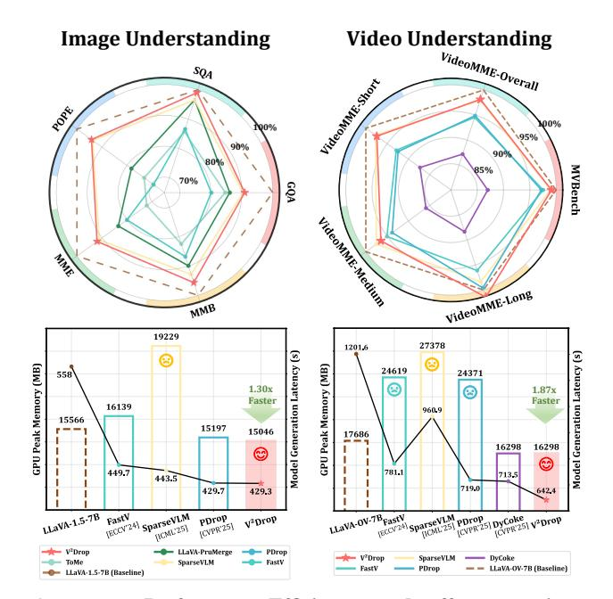
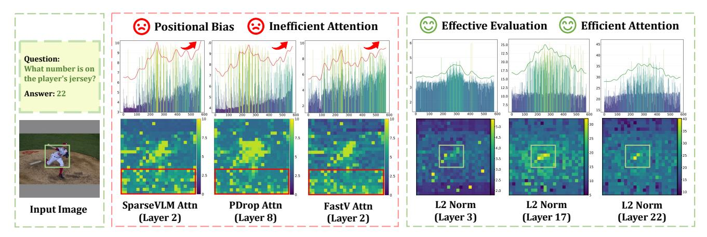
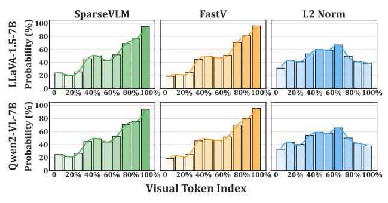

# 1. Introduction

Large vision-language models (LVLMs) have demonstrated remarkable capabilities in visual understanding and reasoning [\[17,](#page-8-0) [23,](#page-8-1) [36,](#page-9-0) [41\]](#page-9-1), excelling across diverse visionlanguage tasks. However, high-resolution image understanding [\[8,](#page-8-2) [13\]](#page-8-3) and long video comprehension [\[6,](#page-8-4) [45\]](#page-9-2) intro-

Figure 1. Performance-Efficiency trade-offs comparison. V 2Drop achieves superior performance-efficiency trade-offs across both image and video understanding tasks.

duce substantial visual tokens that significantly reduce computational efficiency and hinder practical deployment [\[28\]](#page-9-3).

To address this challenge, numerous token compression methods have emerged to eliminate redundant visual tokens, enhancing LVLM efficiency while preserving performance [\[1,](#page-8-5) [5,](#page-8-6) [7,](#page-8-7) [39\]](#page-9-4). Methods that compress visual tokens within LLMs have gained particular attention due to their architecture-agnostic and plug-and-play nature [\[14,](#page-8-8) [24,](#page-9-5) [42,](#page-9-6) [46\]](#page-9-7). These approaches leverage LLM attention weights to selectively retain important visual tokens while pruning less significant ones, thereby accelerating inference. However, despite promising results, these methods face fundamental challenges that limit their practical deployment.

To investigate this phenomenon, we analyzed visual tokens retained by attention-guided methods (*e.g.*, FastV [\[5\]](#page-8-6), SparseVLM [\[46\]](#page-9-7)) and variation-aware evalu-

∗ Equal contributions.  Corresponding author: Honggang Chen (honggang chen@scu.edu.cn). † Project leader: Xuyang Liu (seanleo666@gmail.com).

Figure 2. Attention-guided token evaluation vs. variation-aware token evaluation. Attention-guided methods (e.g., FastV [5], PDrop [42], SparseVLM [46]) exhibit information-agnostic positional bias, assigning high importance to later positions regardless of content (red arrows and boxes), and are incompatible with efficient operators. In contrast, measuring token-wise variation (e.g., L2 Norm) intuitively reflects token importance (green boxes) while maintaining compatibility with efficient operators. The red and green curves show the trends of attention scores and variation scores, respectively.

Figure 3. Analysis of the distribution of retained visual tokens with respect to token index positions. Visual tokens with larger indexes are located at the bottom of images. The probability denotes the chance of each token being retained during pruning.

ation (L2 Norm) using LLaVA-1.5-7B and Qwen2-VL-7B on TextVQA, POPE, and MME. Figure 2 illustrates this through a representative example, while Figure 3 provides quantitative evidence: attention-guided methods exhibit strong bias toward retaining tokens at the end of visual sequences regardless of content, while variation-aware evaluation produces naturally uniform spatial distributions.

This analysis reveals that existing attention-guided compression methods [42, 46] suffer from a fundamental flaw: relying on external attention signals rather than intrinsic token properties, leading to two critical issues: (i) Information-agnostic positional bias: These methods systematically assign high importance to later-positioned tokens regardless of visual content, retaining irrelevant information while discarding important tokens, thereby exacerbating multi-modal hallucinations. (ii) Incompatibility with efficient operators: Computing attention weights conflicts with efficient mechanisms attention (e.g., FlashAttention [10]), resulting in peak memory usage exceeding uncompressed models (Table 5). This raises a fundamental

question: Instead of relying on indirect attention signals, can we directly assess token importance through their intrinsic behavioral patterns within the model?.

To address this fundamental challenge, we propose a paradigm shift from external signal dependence to intrinsic property analysis. We present the **first** study from a **token variation** perspective, revealing that visual token variations within LLMs naturally encode importance information. Our key insight is that *lazy tokens*—those showing minimal variation across LLM layers—less likely to impact final predictions and can be safely removed without performance degradation. Based on this finding, we propose Variationaware Vision Token **Drop**ping (*i.e.*, V2**Drop**), which naturally avoids positional bias by focusing on intrinsic token dynamics and maintains full compatibility with efficient operators by eliminating attention weight computation.

Consequently,  $V^2$ Drop demonstrates outstanding performance and efficiency across both image and video understanding tasks, achieving  $1.30 \times$  and  $1.87 \times$  acceleration for image and video understanding, as shown in Figure 1. The main contributions are summarized as follows:

- Systematic Analysis of Token Variation Patterns: We conduct the first comprehensive analysis of visual token evolution within LVLMs, revealing that token-wise variation magnitudes correlate with task relevance and effectively reflect token importance, pioneering token compression from the variation perspective.
- Variation-aware Token Dropping: We propose V2Drop, a variation-aware compression method that identifies and progressively drops tokens based on their intrinsic behavioral patterns, eliminating positional bias while maintaining compatibility with efficient operators.
- Comprehensive Performance-Efficiency Trade-offs: Extensive experiments demonstrate that V2Drop achieves

Figure 4. Quantifying vision token variation with different metrics. Regions corresponding to the answer exhibit significant variation magnitudes (red boxes). The green curve shows the trends of variation scores.

exceptional performance across diverse LVLMs and VideoLLMs, with comprehensive analyses validating its robustness in balancing accuracy and efficiency.

#### 2. Related Work

Large Vision-Language Models. Large vision-language models (LVLMs) integrate a vision encoder (*i.e.*, ViT), projection module, and LLM for multi-modal comprehension [2, 8, 9, 22]. Recent work introduces higher-resolution inputs through dynamic cropping (*e.g.*, InternVL-3 [47], LLaVA-OneVision [17]) and native resolution methods (*e.g.*, Qwen2-VL [36], Seed1.5-VL [13]). Similarly, VideoLLMs process increasingly longer sequences (*e.g.*, LLaVA-Video [45], VideoLLaMA3 [44]), with VideoXL-Pro [25] achieving multi-hour frame-level understanding. However, this substantially increases visual tokens, introducing quadratic computational complexity, severely constraining scalability and practical deployment.

Token Compression for LVLMs. Token compression directly reduces sequence length to improve model efficiency [28, 33], evolving from training-aware paradigms [19, 40] to training-free methods [5] that enable plug-and-play LVLM inference acceleration. They can be categorized into two paradigms: (i) Pre-LLM compression [27, 31, 43], which compresses visual tokens before LLM, and (ii) Inner-LLM compression [42, 46], which performs compression during LLM forward propagation. However, most Inner-LLM methods rely on attention weights, making them incompatible with efficient operators like FlashAttention [10] and causing substantial memory increases for VideoLLMs [26, 32, 35, 37]. Additionally, they exhibit positional bias, favoring tokens near final positions regardless of semantic relevance [27, 38, 39].

In this work, we explore progressively dropping low-

variation vision tokens during LLM inference, maintaining compatibility with efficient operators while eliminating positional bias for training-free LVLM acceleration.

