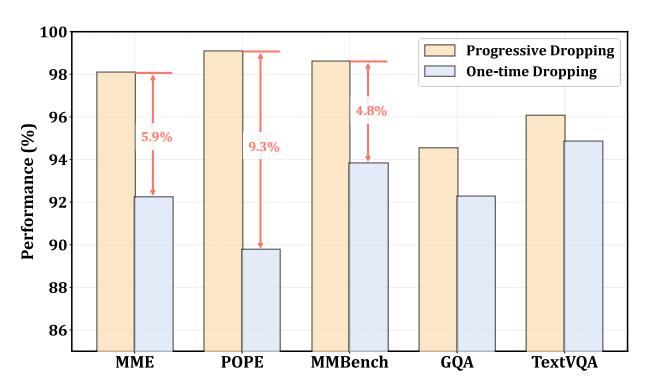

# 4.2. Ablation Study

**Effects of Variation Metric.** Figure 6 presents a analysis of three variation metrics against FastV across multiple benchmarks. All three metrics—Cosine Similarity, L1 Norm, and L2 Norm—outperform FastV in average performance, validating the robustness of variation-based dropping strategies.

Furthermore, all metrics demonstrate notable improvements in inference throughput, with L2 Norm achieving the optimal balance between performance and efficiency.

Effects of Token Dropping across Different Layers. We investigate the effects of token dropping across different LLM transformer layers. As shown in Figure 8, V2Drop achieves 97.3% of vanilla performance on average across all benchmarks and consistently outperforms FastV and SparseVLM under varying dropping layers. Furthermore, V2Drop exhibits superior inference efficiency, delivering substantial throughput improvements and GPU peak memory reduction while maintaining competitive performance.

Effects of Progressive Token Dropping. We investigate the impact of two token pruning strategies on V2Drop: progressive dropping and one-time dropping. As shown in Figure 9, progressive dropping outperforms one-time dropping, achieving gains of 5.9% and 9.3% on MME and POPE, respectively. These results validate that progressive dropping more effectively preserves visual information through gradual selection, mitigating the risk of prematurely discarding important features while reducing computational overhead.

#### 4.3. Visualizations

Figure 7 illustrates token compression effects on TextVQA. From left to right, we visualize results after pruning at different layers. FastV employs one-time dropping, retaining redundant tokens in subsequent layers. SparseVLM adopts progressive dropping but exhibits positional bias, preferentially retaining later-sequence tokens and causing information loss. In contrast, V2Drop preserves critical tokens based on variation, progressively selecting semantically important regions while avoiding positional bias.

Figure 6. Effects of different variation measurement metrics. Comparison of three variation measurement methods with FastV when retaining 128 tokens on LLaVA-1.5-7B across different datasets. The red line represents the average performance gap between the three strategies and FastV, while the green line shows throughput.

Question1: "Are these bottles of pepsi?"

FastV

Answer1: "**Yes**"

Answer2: "**REDHOOK**" SparseVLM FastV

Question2: "What brand is this drink?"

Figure 7. Visualization of token compression. Rows 1, Rows 2 and Rows 3 present compressed results from FastV, SparseVLM and our V 2Drop respectively, where grey masks indicate discarded tokens.

Figure 8. Effects of token dropping across layers. Performance with 192 retained tokens on LLaVA-1.5-7B across datasets, and efficiency analysis on MMB.

Figure 9. Effects of progressive token dropping. Performance with 192 retained tokens on LLaVA-1.5-7B.

