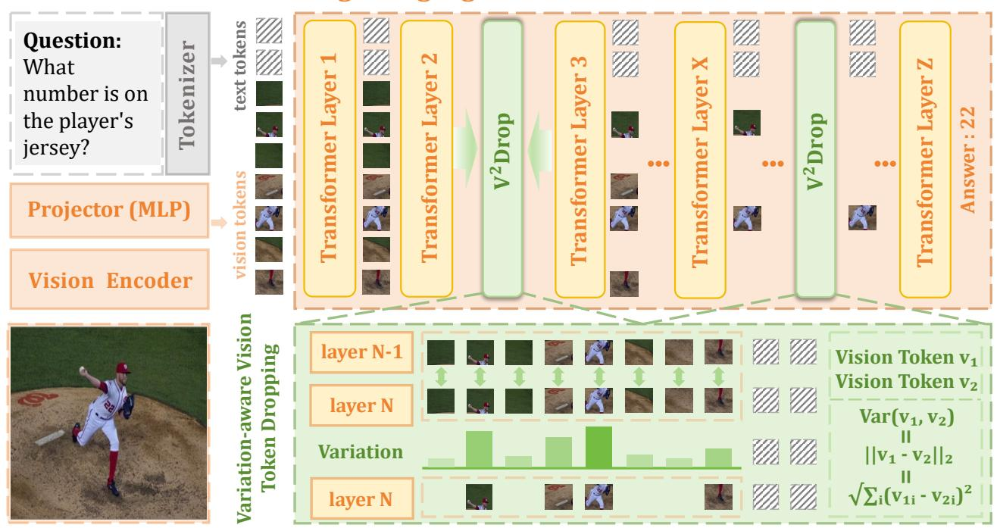

# **Large Language Model**

Figure 5. Overall framework of  $V^2$ Drop.  $V^2$ Drop measures token-wise variation across adjacent LLM layers and progressively drops vision tokens with minimal variation (*i.e.*, lazy tokens), thereby achieving plug-and-play LVLM inference acceleration.

captures overall magnitude, and cosine similarity reflects directional changes in the representation space.

Variation-Relevance Relationship. Figure 4 demonstrates token variation quantification across three metrics for visual tokens in the third transformer layer of LLaVA-1.5-7B. We observe a **consistent and crucial pattern**: tokens exhibiting significant variation (high L1/L2 distances, low cosine similarity) consistently correspond to question-relevant regions (red boxes), encoding rich semantic information essential for task completion. Conversely, tokens with minimal variation—termed *lazy tokens*—correspond to task-irrelevant regions with limited impact to final predictions

Importantly, Figure 4 presents two distinct cases where question-relevant regions appear in different spatial locations (bottom and center), corresponding to middle and posterior token positions. All three variation metrics accurately capture these semantically important regions regardless of spatial position, demonstrating the robustness of using token variation to measure token importance against positional bias. This spatial-agnostic detection capability represents a fundamental advantage over attentionguided approaches that suffer from positional bias.

These findings validate our core hypothesis: high-variation vision tokens actively participate in reasoning processes, encoding semantically crucial information that must be preserved for optimal performance. Conversely, lazy tokens maintain stable representations throughout LLM pro-

cessing, indicating limited contribution to final predictions.

#### 3.3. Variation-aware Vision Token Dropping

Building on this key insight, we propose Variation-aware Vision Token **Drop**ping ( $V^2$ **Drop**), a novel approach that progressively identify and efficiently drop lazy tokens by measuring vision token variation magnitudes in LLMs while preserving semantically important ones.

Given a sequence of vision tokens  $\mathbf{F}^v \in \mathbb{R}^{M \times D'}$  in the LLM, we adopt a *multi-stage progressive dropping* strategy as illustrated in Figure 5. We perform pruning at three strategically selected layers  $\mathcal L$  spanning shallow, middle, and deep stages of the LLM to balance compression efficiency and performance preservation across model depth. At each pruning layer  $l_k \in \mathcal L$ , our framework performs three key operations:

(i) Variation Computation: For each vision token  $\mathbf{f}_i^{(l_k)}$  at layer  $l_k$ , we compute variation scores by measuring representational changes from the previous layer  $l_k - 1$ :

$$\mathbf{S}^{(l_k)} = \{ \text{Var}(\mathbf{f}_i^{(l_k-1)}, \mathbf{f}_i^{(l_k)}) \}_{i=1}^{M_{l_k}},$$
(3)

where  $M_{l_k}$  is the number of vision tokens at layer  $l_k$ , where we empirically use L2 distance by default (ablation study of variation metrics is in Figure 6). This efficiently captures token evolution without attention weight re-computation.

(ii) Token Ranking and Selection: Vision tokens are ranked by variation scores in descending order, and we re-

tain the top- $K_{l_k}$  tokens with highest scores:

$$\hat{\mathbf{F}}_{l_k}^v = \text{TopK}(\mathbf{F}_{l_k}^v, \mathbf{S}^{(l_k)}, K_{l_k}). \tag{4}$$

This naturally filters out lazy tokens while preserving semantically important ones, avoiding positional bias.

(iii) Token Reorganization: The selected vision tokens are reorganized for subsequent layers, where  $K_{l_k} < M_{l_k}$  ensures progressive visual token dropping.

The dropping process follows a pre-defined schedule:

$$M \to K_a \to K_b \to K_c,$$
 (5)

where  $K_a$ ,  $K_b$ , and  $K_c$  are predefined compression targets adjustable for performance-efficiency trade-offs. Ablation studies show that V2Drop is robust to layer selection (Figure 8) and that progressive dropping significantly outperforms one-time dropping (Figure 9). Detailed experimental configurations are provided in the Appendix.

## 3.4. Theoretical Analysis

To validate our variation-aware token dropping strategy, we establish a theoretical connection between token variation magnitude and model output through first-order analysis.

#### 3.4.1. Problem Formulation

Let  $X^{(t)} = \{x_1^{(t)}, \dots, x_n^{(t)}\} \subset \mathbb{R}^d$  denote token representations at layer t. We define the **inter-layer variation** of token j as:

$$\Delta x_j^{(t)} = x_j^{(t+1)} - x_j^{(t)}. (6)$$

Let  $f:\mathbb{R}^{n\times d}\to\mathbb{R}^k$  map layer (t+1) representations to the final output. The Jacobian with respect to token j is:

$$J_j = \frac{\partial f}{\partial x_j^{(t+1)}} \in \mathbb{R}^{k \times d}.$$
 (7)

#### 3.4.2. Variation-Impact Theorem

**Theorem 1.** Under mild smoothness assumptions on f, the output change induced by token j satisfies:

$$\|\Delta f_j\| \approx \|J_j\|_{\text{op}} \cdot \|\Delta x_j^{(t)}\|, \tag{8}$$

where  $\Delta f_j$  denotes the output change when only token j varies from layer t to t+1, and  $\|\cdot\|_{\text{op}}$  is the operator norm.

**Proof.** By first-order Taylor expansion around  $x_j^{(t)}$ :

$$f(\dots, x_j^{(t+1)}, \dots) = f_j^{(t)} + J_j \, \Delta x_j^{(t)} + \mathcal{O}(\|\Delta x_j^{(t)}\|^2)$$
  
=  $f_j^{(t)} + J_j \, \Delta x_j^{(t)} + R_j$ , (9)

where  $f_j^{(t)} = f(\dots, x_j^{(t)}, \dots)$  and  $R_j$  denotes the higher-order remainder term satisfying  $||R_j|| = \mathcal{O}(||\Delta x_j^{(t)}||^2)$ .

Taking norms on both sides and applying the triangle inequality:

$$\|\Delta f_j\| = \|f(\dots, x_j^{(t+1)}, \dots) - f(\dots, x_j^{(t)}, \dots)\|$$

$$\leq \|J_j \cdot \Delta x_j^{(t)}\| + \|R_j\|. \tag{10}$$

By the definition of operator norm:

$$||J_j \cdot \Delta x_j^{(t)}|| \le ||J_j||_{\text{op}} \cdot ||\Delta x_j^{(t)}||.$$
 (11)

For sufficiently small  $\|\Delta x_j^{(t)}\|$  (typically satisfied in deep networks with residual connections where layer-wise changes are bounded), the quadratic term  $\|R_j\|$  is negligible compared to the linear term. Thus:

$$\|\Delta f_j\| \approx \|J_j\|_{\text{op}} \cdot \|\Delta x_j^{(t)}\|. \tag{12}$$

(Appendix for full proof.)

#### 3.4.3. Implications

**Corollary.** Under the assumptions of Theorem 1, larger variation  $\|\Delta x_j^{(t)}\|$  implies greater output influence, providing a computationally efficient proxy for token importance.

**Proof.** For tokens with  $||J_j||_{op} \ge \mu > 0$ , substituting into the theorem yields:

$$\|\Delta f_j\| \gtrsim \mu \cdot \|\Delta x_j^{(t)}\|. \tag{13}$$

Therefore, tokens with larger  $\|\Delta x_j^{(t)}\|$  induce proportionally larger output changes. (Appendix for full proof.)

## 4. Experiments

**Experiment Setting.** We conduct comprehensive on various LVLMs and VideoLLMs across ten diverse benchmarks, with implementation details in the Appendix.

Computational Overhead. We prune at three layers. Computing L2 distances for M tokens of dimension D' requires 3MD' FLOPs ( $\sim$ 7M for M=576, D'=4096 in LLaVA-1.5), only 0.022% of a single attention layer (32B FLOPs). The total overhead across three layers ( $\sim$ 21M FLOPs) is merely 0.002% of the full forward pass. Table 5 confirms this negligible cost:  $V^2$ Drop and random dropping achieve nearly identical throughput (9.01 vs 9.08 items/s).

## 4.1. Main Comparisons

**Image Understanding.** Table 1 compares V2Drop with existing methods across multiple benchmarks using LLaVA-1.5-7B at different retention ratios. The upper section of Table 5 presents the inference efficiency of V2Drop on LLaVA-1.5-7B. Considering both performance and efficiency, our analysis reveals three key findings: (i) **State-of-the-art Performance:** With only 192 tokens retained

| Methods                           | GQA                                       | SQA  | TextVQA     | POPE        | MME  | MMBench | Average |  |  |  |
|-----------------------------------|-------------------------------------------|------|-------------|-------------|------|---------|---------|--|--|--|
| Upper Bound, 576 Tokens (1        | 00%)                                      |      |             |             |      |         |         |  |  |  |
| LLaVA-1.5-7B [21]                 | 61.9                                      | 69.5 | 58.2        | 85.9        | 1862 | 64.6    | 100.0%  |  |  |  |
|                                   | Average Retain 192 Tokens (\\dot 66.7\%)  |      |             |             |      |         |         |  |  |  |
| ToMe[ICLR'23]                     | 54.3                                      | 65.2 | 52.1        | 72.4        | 1563 | 60.5    | 88.8%   |  |  |  |
| FastV [ECCV'24]                   | 52.7                                      | 67.3 | 52.5        | 64.8        | 1612 | 61.2    | 88.2%   |  |  |  |
| HiRED[AAAI'25]                    | 58.7                                      | 68.4 | 47.4        | 82.8        | 1737 | 62.8    | 93.6%   |  |  |  |
| LLaVA-PruMerge [ICCV'25]          | 54.3                                      | 67.9 | 54.3        | 71.3        | 1632 | 59.6    | 90.3%   |  |  |  |
| SparseVLM[ICML'25]                | 57.6                                      | 69.1 | <b>56.1</b> | 83.6        | 1721 | 62.5    | 95.9%   |  |  |  |
| PDrop[CVPR'25]                    | 57.1                                      | 68.8 | 56.1        | 82.3        | 1766 | 63.2    | 96.0%   |  |  |  |
| ${\bf V}^2{\bf Drop}$             | 58.5                                      | 69.3 | 55.6        | 85.1        | 1826 | 63.7    | 97.6%   |  |  |  |
|                                   | Average Retain 128 Tokens (\$\psi 77.8\%) |      |             |             |      |         |         |  |  |  |
| ToMe[ICLR'23]                     | 52.4                                      | 59.6 | 49.1        | 62.8        | 1343 | 53.3    | 80.4%   |  |  |  |
| FastV [ECCV'24]                   | 49.6                                      | 60.2 | 50.6        | 59.6        | 1490 | 56.1    | 81.7%   |  |  |  |
| HiRED[AAAI'25]                    | 57.2                                      | 68.1 | 46.1        | 79.8        | 1710 | 61.5    | 91.6%   |  |  |  |
| LLaVA-PruMerge[ICCV'25]           | 53.3                                      | 67.1 | 54.3        | 67.2        | 1554 | 58.1    | 87.9%   |  |  |  |
| SparseVLM[ICML'25]                | 56.0                                      | 67.1 | 54.9        | 80.5        | 1696 | 60.0    | 93.2%   |  |  |  |
| PDrop[cvpr'25]                    | 56.0                                      | 68.3 | 54.8        | 82.3        | 1644 | 61.1    | 93.6%   |  |  |  |
| ${\bf V}^2{\bf Drop}$             | 56.3                                      | 68.8 | 53.8        | 80.9        | 1712 | 61.8    | 94.0%   |  |  |  |
| Average Retain 64 Tokens (↓88.9%) |                                           |      |             |             |      |         |         |  |  |  |
| ToMe[ICLR'23]                     | 48.6                                      | 50.0 | 45.3        | 52.5        | 1138 | 43.7    | 69.7%   |  |  |  |
| FastV [ECCV'24]                   | 46.1                                      | 51.1 | 47.8        | 48.0        | 1256 | 48.0    | 71.3%   |  |  |  |
| LLaVA-PruMerge[ICCV'25]           | 51.9                                      | 68.1 | 54.0        | 65.3        | 1549 | 55.2    | 86.5%   |  |  |  |
| SparseVLM[ICML'25]                | 52.7                                      | 62.2 | 51.8        | <b>75.1</b> | 1505 | 56.2    | 86.5%   |  |  |  |
| PDrop[CVPR'25]                    | 41.9                                      | 68.6 | 45.9        | 55.9        | 1092 | 33.3    | 70.1%   |  |  |  |
| ${\bf V}^2{\bf Drop}$             | 50.5                                      | 68.9 | 51.8        | 75.1        | 1470 | 55.2    | 86.9%   |  |  |  |

Table 1. Comparison with other token compression methods with LLaVA-1.5-7B across image understanding benchmarks. "Average" shows the mean performance across benchmarks at different retention ratios, with best results highlighted.

| Methods                                                   | AI2D                        | MMStar                      | SQA                         | POPE                        | MME                         | MMB                         | Avg.                           |  |  |  |
|-----------------------------------------------------------|-----------------------------|-----------------------------|-----------------------------|-----------------------------|-----------------------------|-----------------------------|--------------------------------|--|--|--|
| Upper Bound, All To Qwen2-VL-7B [36]                   |                             |                             | 84.7                        | 86.1                        | 2317                        | 80.5                        | 100.0%                         |  |  |  |
|                                                           | Token Reduction (↓66.7%)    |                             |                             |                             |                             |                             |                                |  |  |  |
| FastV[ECCV'24] DART[EMNLP'25] V 2 Drop   | 76.1 78.0 <b>78.0</b> | 52.8 53.4 <b>53.5</b> | 80.0 81.4 <b>81.6</b> | 82.1 83.9 <b>87.2</b> | 2130 <b>2245</b> 2224 | 76.1 <b>78.9</b> 78.7 | 92.9% 95.5% <b>96.0%</b> |  |  |  |
| Token Reduction(↓77.8%)                                   |                             |                             |                             |                             |                             |                             |                                |  |  |  |
| FastV [ECCV'24] DART [EMNLP'25] V 2 Drop | 73.8 74.4 <b>75.6</b> | <b>49.3</b> 48.5 48.7       | 78.3 <b>79.6</b> 78.9 | 79.2 82.1 <b>85.1</b> | 2031 <b>2175</b> 2173 | 74.1 77.3 <b>75.8</b> | 89.5% 91.8% <b>92.3%</b> |  |  |  |

Table 2. Comparison with Qwen2-VL-7B across multiple image understanding benchmarks.

| Methods                                                   | MVBench                     |                             | Avg.                        |                             |                             |                                |  |  |
|-----------------------------------------------------------|-----------------------------|-----------------------------|-----------------------------|-----------------------------|-----------------------------|--------------------------------|--|--|
|                                                           |                             | Overall                     | Short                       | Medium                      | Long                        |                                |  |  |
| Upper Bound, All To Qwen2-VL-7B [36]                   | kens (100%) 66.1         | 57.7                        | 70.4                        | 54.6                        | 48.0                        | 100.0%                         |  |  |
| Average Retention Ratio = 20%                             |                             |                             |                             |                             |                             |                                |  |  |
| FastV [ECCV'24] DART [EMNLP'25] V 2 Drop | 50.9 58.9 <b>62.1</b> | 49.4 53.0 <b>53.5</b> | 58.2 <b>64.1</b> 63.7 | 45.7 49.4 <b>51.0</b> | 44.4 45.4 <b>45.9</b> | 81.3% 90.5% <b>93.3%</b> |  |  |

Table 3. Performance comparison with Qwen2-VL-7B across video understanding benchmarks.

(66.7% reduction),  $V^2Drop$  achieves an impressive average performance of **97.6%**, substantially outperforming the second-best method PDrop by **1.6%**. Even under more aggressive reduction ratios,  $V^2Drop$  maintains competi-

| Methods                                                                                               | MVBench                                     |                                             | VideoMME                                    |                                             |                                             |                                                  |  |  |  |
|-------------------------------------------------------------------------------------------------------|---------------------------------------------|---------------------------------------------|---------------------------------------------|---------------------------------------------|---------------------------------------------|--------------------------------------------------|--|--|--|
|                                                                                                       |                                             | Overall                                     | Short                                       | Medium                                      | Long                                        | Avg.                                             |  |  |  |
| Upper Bound, All Token LLaVA-OV-7B [17]                                                            | ns (100%) 56.9                           | 58.5                                        | 70.0                                        | 56.6                                        | 48.9                                        | 100.0%                                           |  |  |  |
|                                                                                                       | Average Rete                                | ntion Ra                                    | tio = 30                                    | 0%                                          |                                             |                                                  |  |  |  |
| DyCoke[CVPR'25]                                                                                       | 56.6                                        | 56.1                                        | 67.1                                        | 54.6                                        | 46.6                                        | 97.7%                                            |  |  |  |
| Average Retention Ratio = 25%                                                                         |                                             |                                             |                                             |                                             |                                             |                                                  |  |  |  |
| FastV [ECCV'24] Sparse VLM [ICML'25] PDrop [CVPR'25] DyCoke [CVPR'25] V 2 Drop | 55.5 56.3 55.3 49.5 <b>56.4</b> | 55.3 57.3 55.5 51.0 <b>57.4</b> | 65.0 68.4 64.7 61.1 <b>68.2</b> | 53.8 55.2 53.1 48.6 <b>54.6</b> | 47.0 48.1 48.7 43.2 <b>49.6</b> | 96.0% 98.4% 96.0% 87.1% <b>98.6%</b> |  |  |  |
|                                                                                                       | Average Retention Ratio = 15%               |                                             |                                             |                                             |                                             |                                                  |  |  |  |
| FastV[ECCV'24] SparseVLM[ICML'25] PDrop[CVPR'25] <b>V</b> 2 <b>Drop</b>           | 51.6 52.9 53.2 <b>53.9</b>         | 48.1 53.4 50.1 <b>54.4</b>         | 51.4 61.0 58.7 <b>64.1</b>         | 49.4 52.1 48.7 <b>51.4</b>         | 43.3 47.0 45.0 <b>47.7</b>         | 86.5% 92.1% 89.6% <b>93.9</b> %         |  |  |  |

Table 4. Performance comparison with LLaVA-OV-7B across video understanding benchmarks.

tive performance. (ii) Efficient Operator Compatibility:  $V^2Drop$  eliminates explicit attention score computation, enabling seamless integration with Flash Attention [10]. Without introducing additional memory overhead,  $V^2Drop$  achieves peak memory usage and total latency comparable to random token dropping. (iii) Seamless Scalability to Advanced Models: As shown in Table 2,  $V^2Drop$  consistently outperforms FastV and DART across nearly all

| Methods                                                                                              | LLM Generation↓ Latency (s)                                                            | Model Generation↓ Latency (s)                                                                      | Total Latency↓ (min:sec)                                                                                        | GPU Peak↓ Memory (MB)                                                                    | Throughput↑ (item/s)                                                                 | Performance ↑                                                            |
|------------------------------------------------------------------------------------------------------|-------------------------------------------------------------------------------------------|-------------------------------------------------------------------------------------------------------|--------------------------------------------------------------------------------------------------------------------|---------------------------------------------------------------------------------------------|--------------------------------------------------------------------------------------|-------------------------------------------------------------------------------------|
| Upper Bound, 576 To LLaVA-1.5-7B [21]                                                             | <b>kens (100%)</b> 400                                                                 | 558                                                                                                   | 10:14                                                                                                              | 15566                                                                                       | 7.13                                                                                 | 64.6                                                                                |
| Random                                                                                               | 270.4(\132.4%)                                                                            | 425.9(\\23.7\%)                                                                                       | 8:02(\121.5%)                                                                                                      | 15045 (\$\dagger 3.3\%)                                                                     | 9.08 (↑1.27×)                                                                        | 59.1 (91.5%)                                                                        |
| FastV [ECCV'24] Sparse VLM [ICML'25] PDrop [CVPR'25] V 2 Drop                    | 294.0(\(\pm26.5\%)\) 288.2(\(\pm28.0\%)\) 279.6(\(\pm30.1\%)\) 273.9(\(\pm30.5\%)\)       | 449.7 (\pm 19.4%) 443.5 (\pm 20.5%) 429.7 (\pm 23.0%) <b>429.3</b> (\pm 23.1%)               | 8:26(\pmu17.6%) 8:20(\pmu18.6%) 8:09(\pmu20.3%) 8:06(\pmu20.8%)                                           | 16139(†3.7%) 19229(†23.5%) 15197(↓2.3%) <b>15046</b> (↓3.3%)                       | 8.65 (†1.21×) 8.75 (†1.23×) 8.95 (†1.25×) <b>9.01</b> (†1.26×)              | 56.1 (86.8%) 60.0 (92.9%) 61.1 (94.6%) <b>61.8</b> (95.7%)                 |
| Upper Bound, All Tok LLaVA-OV-7B [17]                                                             | ens (100%) 752.2                                                                       | 1201.6                                                                                                | 32:02                                                                                                              | 17686                                                                                       | 0.52                                                                                 | 56.9                                                                                |
| Random                                                                                               | 190.9(\174.6%)                                                                            | 639.0(\.46.8%)                                                                                        | 23:09(\\27.7%)                                                                                                     | 16298 (\$\psi.8\%)                                                                          | 0.72(\pm1.38\times)                                                                  | 54.6(96.0%)                                                                         |
| FastV [ECCV'24] SparseVLM [ICML'25] PDrop [CVPR'25] DyCoke [CVPR'25] V 2 Drop | 315.9(↓58.0%) 493.8(↓34.4%) 256.3(↓65.9%) 249.2(↓66.7%) <b>193.8</b> (↓74.2%) | 781.1 (\pm 35.0%) 960.9 (\pm 20.0%) 719.0 (\pm 40.2%) 713.5 (\pm 40.6%) 642.4 (\pm 46.5%) | 25:05(\\dagger1.7%) 30:12(\\dagger5.7%) 23:18(\\dagger27.3%) 23:25(\\dagger26.9%) 23:13(\\dagger27.5%) | 24619 (†39.2%) 27378 (†54.8%) 24371 (†37.8%) 16298 (↓7.8%) <b>16298</b> (↓7.8%) | 0.67(†1.29×) 0.55(†1.06×) 0.71(†1.36×) 0.71(†1.36×) <b>0.72</b> (†1.38×) | 55.5 (97.5%) 56.4 (99.1%) 55.3 (97.2%) 49.5 (87.0%) <b>56.4</b> (99.1%) |

Table 5. **Efficiency comparison on image/video understanding.** We measure: (1) LLM Generation Latency: LLM-only response time; (2) Model Generation Latency: full model response time; (3) Total Latency: time to complete MMBench/MVBench on LLaVA-1.5-7B/LLaVA-OV-7B; (4) Throughput: samples processed per second.

benchmarks on Qwen2-VL [36] under different configurations, demonstrating effectiveness at high resolutions and compatibility with variable-resolution inputs.

**Video Understanding.** We further extend V2Drop to video understanding using LLaVA-OV-7B and Qwen2-VL-7B. Table 3 and Table 4 compare V2Drop with state-of-the-art token compression methods across multiple benchmarks, while the lower section of Table 5 reports inference efficiency. Our analysis reveals three key findings: (i) Superior **Performance:** V2Drop outperforms all competing methods across all benchmarks on LLaVA-OV and Qwen2-VL, achieving 98.6% of original performance with only 25% token retention, surpassing DyCoke (97.7% with 30% tokens). At aggressive compression (R = 15%), V2Drop maintains exceptional robustness while baseline methods degrade significantly. (ii) Excellence in Long Video Un**derstanding:** V2Drop significantly outperforms baselines on long video tasks such as VideoMME (Long) by mitigating positional bias problem, where VideoLLMs disproportionately focus on later-frame tokens. (iii) Superior Inference Efficiency: V2Drop maintains high throughput while reducing GPU peak memory. In contrast, we surprisingly find that SparseVLM increases peak memory by 54.8% on MVBench due to its merging strategy and explicit attention computation, greatly elevating computational costs, while our V2Drop inherently avoids such operations.

